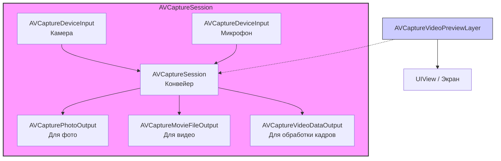

#avfoundation #camera #video #capture #media #avcapturesession #ios #multimedia

---
### Определение
**AVCaptureSession** — это центральный управляющий объект в фреймворке [[AVFoundation]], который координирует поток данных от входных устройств захвата (камера, микрофон) к выходным (файл, экран, буфер памяти). Он является "оркестром" для всего процесса захвата фото, видео и аудио в [[iOS]]-приложениях .

Простыми словами, `AVCaptureSession` — это виртуальный конвейер, который вы настраиваете, чтобы сказать системе: *"Возьми видео с этой камеры, обработай его в таком качестве и отправь вот в это место для предпросмотра или сохранения"*.

### Зачем это знать iOS-разработчику?
1.  **Создание кастомной камеры:** Когда стандартный [[UIImagePickerController]] недостаточно гибок (нужен свой интерфейс, обработка в реальном времени, съемка без UI).
2.  **Захват видео:** Запись видео с микрофоном, стоп-кадра во время записи.
3.  **Обработка в реальном времени:** Применение фильтров к видео, анализ потока (QR-коды, лица), создание приложений с дополненной реальностью (в комбинации с [[Metal]]/ARKit).
4.  **Сканирование:** Считывание QR-кодов или штрих-кодов без фотосъемки (через [[AVCaptureMetadataOutput]]).

---

### Архитектура AVCaptureSession

`AVCaptureSession` работает по принципу "подключай и работай". Он сам управляет сложными процессами синхронизации и буферизации. Основные строительные блоки:

1.  **AVCaptureSession:** Сам конвейер. Управляет запуском и остановкой потока данных.
2.  **AVCaptureDevice:** Представляет физическое устройство ввода (задняя камера, фронтальная камера, микрофон).
3.  **AVCaptureDeviceInput:** Коннектор, который подключает AVCaptureDevice к сессии. Нужно создать инпут из девайса и добавить его в сессию.
4.  **AVCaptureOutput:** Получатель данных. Может быть нескольких типов:
    - AVCapturePhotoOutput — для фото высокого разрешения (замена устаревшего AVCaptureStillImageOutput).
    - AVCaptureMovieFileOutput — для записи видео в файл.
    - AVCaptureVideoDataOutput — для доступа к каждому кадру видео в реальном времени (для обработки).
    - AVCaptureMetadataOutput — для чтения QR-кодов и метаданных.
    - AVCaptureAudioDataOutput — для доступа к аудиопотоку.
5.  **AVCaptureVideoPreviewLayer:** Специальный слой (CALayer`), который отображает видео с камеры прямо на экране (не является выходом, а скорее монитором).



---

### Основные концепции

#### 1. **preset (Качество сессии)**
Свойство `sessionPreset` определяет общее качество и размер захватываемого потока (например, `.hd1920x1080`, `.hd4K3840x2160`, `.photo`). Важно: не все пресеты поддерживаются всеми устройствами. Всегда проверяйте поддержку перед установкой.

#### 2. **commitConfiguration()**
Изменения в сессии (добавление/удаление инпутов или аутпутов) требуют специальной обработки для производительности. Лучше оборачивать несколько изменений в `beginConfiguration()` и `commitConfiguration()`.

#### 3. **Запуск на фоновом потоке**
Запуск сессии (`startRunning()`) — тяжелая операция, которая может заблокировать главный поток. Всегда запускайте её на глобальной (фоновой) очереди.

---

### Примеры от простого к сложному

#### Уровень 0: Настройка Info.plist (разрешения)
Прежде чем использовать камеру и микрофон, нужно добавить описания в `Info.plist`.

- **NSCameraUsageDescription** — "Для съемки фото и видео"
- **NSMicrophoneUsageDescription** — "Для записи звука в видео"

#### Уровень 1: Простейшая камера с предпросмотром
Самый базовый пример — показать картинку с камеры на экране.

```swift
import UIKit
import AVFoundation

class SimpleCameraViewController: UIViewController {

    var captureSession: AVCaptureSession!
    var previewLayer: AVCaptureVideoPreviewLayer!

    override func viewDidLoad() {
        super.viewDidLoad()
        checkCameraPermissions()
    }

    private func checkCameraPermissions() {
        switch AVCaptureDevice.authorizationStatus(for: .video) {
        case .authorized:
            setupCamera()
        case .notDetermined:
            AVCaptureDevice.requestAccess(for: .video) { granted in
                if granted {
                    DispatchQueue.main.async {
                        self.setupCamera()
                    }
                }
            }
        case .denied, .restricted:
            // Показать алерт, что нужно включить камеру в настройках
            print("Нет доступа к камере")
        @unknown default:
            fatalError()
        }
    }

    private func setupCamera() {
        // 1. Создаем сессию
        captureSession = AVCaptureSession()
        captureSession.sessionPreset = .hd1920x1080

        // 2. Получаем заднюю камеру
        guard let backCamera = AVCaptureDevice.default(.builtInWideAngleCamera, for: .video, position: .back) else {
            print("Не удалось получить доступ к камере")
            return
        }

        do {
            // 3. Создаем инпут из камеры
            let input = try AVCaptureDeviceInput(device: backCamera)
            
            // 4. Добавляем инпут в сессию
            if captureSession.canAddInput(input) {
                captureSession.addInput(input)
            } else {
                print("Не удалось добавить инпут")
                return
            }
            
            // 5. Настраиваем Preview Layer
            previewLayer = AVCaptureVideoPreviewLayer(session: captureSession)
            previewLayer.frame = view.bounds
            previewLayer.videoGravity = .resizeAspectFill
            view.layer.addSublayer(previewLayer)
            
            // 6. Запускаем сессию в фоне
            DispatchQueue.global(qos: .userInitiated).async { [weak self] in
                self?.captureSession.startRunning()
            }
            
        } catch {
            print("Ошибка создания инпута: \(error.localizedDescription)")
        }
    }
}
```

#### Уровень 2: Съемка фото (AVCapturePhotoOutput)
Добавим кнопку и возможность сделать фото.

```swift
import UIKit
import AVFoundation

class PhotoCaptureViewController: UIViewController, AVCapturePhotoCaptureDelegate {

    var captureSession: AVCaptureSession!
    var photoOutput: AVCapturePhotoOutput!
    var previewLayer: AVCaptureVideoPreviewLayer!
    
    let captureButton = UIButton()

    override func viewDidLoad() {
        super.viewDidLoad()
        setupUI()
        checkPermissionsAndSetupCamera()
    }
    
    private func setupUI() {
        captureButton.setTitle("📸", for: .normal)
        captureButton.backgroundColor = .white
        captureButton.layer.cornerRadius = 35
        captureButton.frame = CGRect(x: view.bounds.midX - 35, y: view.bounds.height - 150, width: 70, height: 70)
        captureButton.addTarget(self, action: #selector(capturePhoto), for: .touchUpInside)
        view.addSubview(captureButton)
    }
    
    private func checkPermissionsAndSetupCamera() {
        // Аналогично Level 1, но с добавлением фото-выхода
        switch AVCaptureDevice.authorizationStatus(for: .video) {
        case .authorized:
            setupCamera()
        case .notDetermined:
            AVCaptureDevice.requestAccess(for: .video) { granted in
                if granted { DispatchQueue.main.async { self.setupCamera() } }
            }
        default:
            print("Нет доступа")
        }
    }
    
    private func setupCamera() {
        captureSession = AVCaptureSession()
        
        guard let backCamera = AVCaptureDevice.default(.builtInWideAngleCamera, for: .video, position: .back) else { return }
        
        do {
            let input = try AVCaptureDeviceInput(device: backCamera)
            if captureSession.canAddInput(input) { captureSession.addInput(input) }
        } catch { print(error) }
        
        // 1. Создаем и настраиваем PhotoOutput
        photoOutput = AVCapturePhotoOutput()
        // Важно: проверяем, поддерживается ли формат HEIC (для экономии места)
        if #available(iOS 11.0, *) {
            photoOutput?.setPreparedPhotoSettingsArray([AVCapturePhotoSettings(format: [AVVideoCodecKey: AVVideoCodecType.hevc])], completionHandler: nil)
        }
        
        if captureSession.canAddOutput(photoOutput) {
            captureSession.addOutput(photoOutput)
        }
        
        previewLayer = AVCaptureVideoPreviewLayer(session: captureSession)
        previewLayer.frame = view.bounds
        previewLayer.videoGravity = .resizeAspectFill
        view.layer.insertSublayer(previewLayer, at: 0)
        
        DispatchQueue.global(qos: .userInitiated).async { [weak self] in
            self?.captureSession.startRunning()
        }
    }
    
    @objc func capturePhoto() {
        // Настройки фото (можно менять качество, вспышку и т.д.)
        let settings = AVCapturePhotoSettings()
        settings.flashMode = .auto
        
        // Делаем снимок
        photoOutput.capturePhoto(with: settings, delegate: self)
    }
    
    // MARK: - AVCapturePhotoCaptureDelegate
    func photoOutput(_ output: AVCapturePhotoOutput, didFinishProcessingPhoto photo: AVCapturePhoto, error: Error?) {
        guard let imageData = photo.fileDataRepresentation(),
              let image = UIImage(data: imageData) else { return }
        
        // Здесь можно сохранить image в фотоальбом или показать пользователю
        UIImageWriteToSavedPhotosAlbum(image, nil, nil, nil)
        print("Фото сохранено!")
    }
}
```

#### Уровень 3: Запись видео (AVCaptureMovieFileOutput)

```swift
import UIKit
import AVFoundation

class VideoRecordingViewController: UIViewController, AVCaptureFileOutputRecordingDelegate {

    var captureSession: AVCaptureSession!
    var movieOutput: AVCaptureMovieFileOutput!
    var previewLayer: AVCaptureVideoPreviewLayer!
    
    let recordButton = UIButton()
    var isRecording = false

    override func viewDidLoad() {
        super.viewDidLoad()
        setupUI()
        setupCamera()
    }
    
    private func setupUI() {
        recordButton.setTitle("🎥 Запись", for: .normal)
        recordButton.backgroundColor = .red
        recordButton.layer.cornerRadius = 10
        recordButton.frame = CGRect(x: view.bounds.midX - 75, y: view.bounds.height - 150, width: 150, height: 50)
        recordButton.addTarget(self, action: #selector(toggleRecording), for: .touchUpInside)
        view.addSubview(recordButton)
    }
    
    private func setupCamera() {
        captureSession = AVCaptureSession()
        captureSession.sessionPreset = .hd1920x1080 // Для видео лучше .high или .hd
        
        // Видео вход
        guard let videoDevice = AVCaptureDevice.default(.builtInWideAngleCamera, for: .video, position: .back),
              let videoInput = try? AVCaptureDeviceInput(device: videoDevice),
              captureSession.canAddInput(videoInput) else { return }
        captureSession.addInput(videoInput)
        
        // Аудио вход (для звука в видео)
        if let audioDevice = AVCaptureDevice.default(for: .audio),
           let audioInput = try? AVCaptureDeviceInput(device: audioDevice),
           captureSession.canAddInput(audioInput) {
            captureSession.addInput(audioInput)
        }
        
        // Movie Output
        movieOutput = AVCaptureMovieFileOutput()
        if captureSession.canAddOutput(movieOutput) {
            captureSession.addOutput(movieOutput)
        }
        
        previewLayer = AVCaptureVideoPreviewLayer(session: captureSession)
        previewLayer.frame = view.bounds
        previewLayer.videoGravity = .resizeAspectFill
        view.layer.insertSublayer(previewLayer, at: 0)
        
        DispatchQueue.global(qos: .userInitiated).async { [weak self] in
            self?.captureSession.startRunning()
        }
    }
    
    @objc func toggleRecording() {
        guard let movieOutput = movieOutput else { return }
        
        if isRecording {
            // Остановить запись
            movieOutput.stopRecording()
            recordButton.setTitle("🎥 Запись", for: .normal)
            recordButton.backgroundColor = .red
        } else {
            // Начать запись
            let paths = FileManager.default.urls(for: .documentDirectory, in: .userDomainMask)
            let fileURL = paths[0].appendingPathComponent("video_\(Date().timeIntervalSince1970).mov")
            movieOutput.startRecording(to: fileURL, recordingDelegate: self)
            recordButton.setTitle("⏹ Стоп", for: .normal)
            recordButton.backgroundColor = .gray
        }
        
        isRecording.toggle()
    }
    
    // MARK: - AVCaptureFileOutputRecordingDelegate
    func fileOutput(_ output: AVCaptureFileOutput, didFinishRecordingTo outputFileURL: URL, from connections: [AVCaptureConnection], error: Error?) {
        if let error = error {
            print("Ошибка записи: \(error)")
        } else {
            print("Видео сохранено: \(outputFileURL)")
            // Сохраняем видео в фотоальбом
            UISaveVideoAtPathToSavedPhotosAlbum(outputFileURL.path, nil, nil, nil)
        }
    }
}
```

#### Уровень 4: Обработка кадров в реальном времени (AVCaptureVideoDataOutput)
Этот пример показывает, как получать каждый кадр видео для анализа (например, для детекции лиц или QR-кодов).

```swift
import UIKit
import AVFoundation

class FrameProcessorViewController: UIViewController, AVCaptureVideoDataOutputSampleBufferDelegate {

    var captureSession: AVCaptureSession!
    var previewLayer: AVCaptureVideoPreviewLayer!
    let frameProcessingQueue = DispatchQueue(label: "frameProcessingQueue")

    override func viewDidLoad() {
        super.viewDidLoad()
        setupCamera()
    }

    private func setupCamera() {
        captureSession = AVCaptureSession()
        captureSession.sessionPreset = .hd1280x720

        guard let camera = AVCaptureDevice.default(.builtInWideAngleCamera, for: .video, position: .back),
              let input = try? AVCaptureDeviceInput(device: camera),
              captureSession.canAddInput(input) else { return }
        captureSession.addInput(input)

        // 1. Создаем VideoDataOutput
        let videoOutput = AVCaptureVideoDataOutput()
        // Важно: настраиваем цвет пикселей (чаще всего 32-bit BGRA)
        videoOutput.videoSettings = [kCVPixelBufferPixelFormatTypeKey as String: kCVPixelFormatType_32BGRA]
        // Отключаем задержку, чтобы получать кадры как можно быстрее
        videoOutput.alwaysDiscardsLateVideoFrames = true
        
        // 2. Устанавливаем делегат на нашу очередь
        videoOutput.setSampleBufferDelegate(self, queue: frameProcessingQueue)
        
        if captureSession.canAddOutput(videoOutput) {
            captureSession.addOutput(videoOutput)
        }

        previewLayer = AVCaptureVideoPreviewLayer(session: captureSession)
        previewLayer.frame = view.bounds
        previewLayer.videoGravity = .resizeAspectFill
        view.layer.addSublayer(previewLayer)

        DispatchQueue.global(qos: .userInitiated).async { [weak self] in
            self?.captureSession.startRunning()
        }
    }

    // MARK: - AVCaptureVideoDataOutputSampleBufferDelegate
    func captureOutput(_ output: AVCaptureOutput, didOutput sampleBuffer: CMSampleBuffer, from connection: AVCaptureConnection) {
        // Здесь мы получаем каждый кадр видео
        // sampleBuffer содержит пиксельный буфер (CVPixelBuffer)
        
        // 1. Получаем изображение для обработки
        guard let pixelBuffer = CMSampleBufferGetImageBuffer(sampleBuffer) else { return }
        
        // 2. Здесь можно применить Core Image фильтры, детекцию лиц и т.д.
        // Например, инвертируем цвета (просто для демонстрации)
        let ciImage = CIImage(cvPixelBuffer: pixelBuffer)
        let filter = CIFilter(name: "CIColorInvert")
        filter?.setValue(ciImage, forKey: kCIInputImageKey)
        
        // Важно: Для отображения обработанного изображения нужно вернуться на главный поток
        // и использовать другой слой/вью. В данном примере мы просто логируем.
        print("Получен кадр: \(pixelBuffer.width) x \(pixelBuffer.height)")
    }
}
```

#### Уровень 5: Чтение QR-кодов (AVCaptureMetadataOutput)

```swift
import UIKit
import AVFoundation

class QRScannerViewController: UIViewController, AVCaptureMetadataOutputObjectsDelegate {

    var captureSession: AVCaptureSession!
    var previewLayer: AVCaptureVideoPreviewLayer!
    var qrCodeFrameView: UIView?

    override func viewDidLoad() {
        super.viewDidLoad()
        setupScanner()
    }

    private func setupScanner() {
        captureSession = AVCaptureSession()

        guard let videoCaptureDevice = AVCaptureDevice.default(for: .video),
              let videoInput = try? AVCaptureDeviceInput(device: videoCaptureDevice),
              captureSession.canAddInput(videoInput) else {
            print("Не удалось добавить видео вход")
            return
        }
        captureSession.addInput(videoInput)

        // 1. Создаем MetadataOutput
        let metadataOutput = AVCaptureMetadataOutput()
        
        if captureSession.canAddOutput(metadataOutput) {
            captureSession.addOutput(metadataOutput)
            
            // 2. Устанавливаем делегат и очередь
            metadataOutput.setMetadataObjectsDelegate(self, queue: DispatchQueue.main)
            // 3. Указываем типы метаданных, которые мы хотим получать (QR-коды)
            metadataOutput.metadataObjectTypes = [.qr]
        } else {
            print("Не удалось добавить metadata output")
            return
        }

        previewLayer = AVCaptureVideoPreviewLayer(session: captureSession)
        previewLayer.frame = view.bounds
        previewLayer.videoGravity = .resizeAspectFill
        view.layer.addSublayer(previewLayer)

        // Визуальное выделение QR-кода (просто рамка)
        qrCodeFrameView = UIView()
        qrCodeFrameView?.layer.borderColor = UIColor.green.cgColor
        qrCodeFrameView?.layer.borderWidth = 2
        qrCodeFrameView?.frame = CGRect.zero
        view.addSubview(qrCodeFrameView!)
        view.bringSubviewToFront(qrCodeFrameView!)

        DispatchQueue.global(qos: .background).async { [weak self] in
            self?.captureSession.startRunning()
        }
    }

    // MARK: - AVCaptureMetadataOutputObjectsDelegate
    func metadataOutput(_ output: AVCaptureMetadataOutput, didOutput metadataObjects: [AVMetadataObject], from connection: AVCaptureConnection) {
        
        // Убираем рамку, если ничего не найдено
        qrCodeFrameView?.frame = CGRect.zero

        if let metadataObject = metadataObjects.first {
            // Преобразуем координаты метаданных в координаты previewLayer
            guard let readableObject = previewLayer.transformedMetadataObject(for: metadataObject) as? AVMetadataMachineReadableCodeObject else { return }
            
            // Показываем рамку вокруг QR-кода
            qrCodeFrameView?.frame = readableObject.bounds

            if let stringValue = readableObject.stringValue {
                // Нашли QR-код!
                print("QR Code: \(stringValue)")
                
                // Можно остановить сессию и показать результат
                captureSession.stopRunning()
                
                // Показываем алерт с результатом
                let alert = UIAlertController(title: "QR-код", message: stringValue, preferredStyle: .alert)
                alert.addAction(UIAlertAction(title: "OK", style: .default))
                present(alert, animated: true)
            }
        }
    }
}
```

---

### Важные нюансы и Best Practices

#### 1. **Управление сессией**
- Всегда запускайте `startRunning()` и останавливайте `stopRunning()` на фоновой очереди.
- При уходе с экрана обязательно останавливайте сессию, чтобы сберечь батарею.

```swift
override func viewWillDisappear(_ animated: Bool) {
    super.viewWillDisappear(animated)
    DispatchQueue.global(qos: .background).async { [weak self] in
        self?.captureSession.stopRunning()
    }
}
```

#### 2. **Проверка совместимости**
Не все устройства поддерживают все пресеты и типы выходов. Всегда используйте `canAddInput`, `canAddOutput` и проверяйте `AVCaptureDevice` на поддержку нужных параметров.

#### 3. **Ориентация видео**
По умолчанию видео может быть перевернуто. Настройте `connection.videoOrientation` в зависимости от ориентации устройства.

```swift
if let connection = previewLayer.connection, connection.isVideoOrientationSupported {
    connection.videoOrientation = .portrait // Или текущая ориентация
}
```

#### 4. **Фокус и экспозиция**
Можно программно управлять фокусом:

```swift
func focus(at point: CGPoint) {
    guard let device = videoDeviceInput?.device else { return }
    do {
        try device.lockForConfiguration()
        if device.isFocusPointOfInterestSupported {
            device.focusPointOfInterest = point
            device.focusMode = .autoFocus
        }
        device.unlockForConfiguration()
    } catch {
        print("Не удалось установить фокус")
    }
}
```

#### 5. **Энергопотребление**
- Используйте минимально необходимый `sessionPreset`. 4K жрет много энергии и памяти.
- Если не нужна высокая частота кадров, установите `minFrameDuration`.

#### 6. **AVCaptureSessionPreset**
Помните, что `.photo` — это специальный пресет, оптимизированный для фото (максимальное разрешение, но низкая частота кадров). Для видео используйте `.high` или `.hd1920x1080`.

### Итог
**AVCaptureSession** — мощный и гибкий инструмент для работы с камерой и микрофоном в iOS. Понимание его архитектуры (сессия -> входы -> выходы) позволяет создавать приложения любой сложности: от простой камеры до профессиональных приложений с обработкой видео в реальном времени. Ключевые навыки: управление сессией на фоновых очередях, правильный выбор пресетов и обработка данных из различных типов выходов.