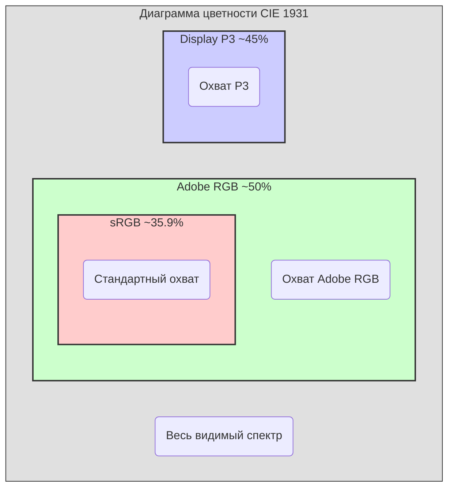

#color #color-space #adobe-rgb #graphics #photography #printing #displayp3 #srgb

---
### Определение
**Adobe RGB** — это цветовое пространство [[RGB]] с расширенным охватом (wide gamut), разработанное и представленное компанией Adobe Systems в 1998 году . Его основной целью было охватить большинство цветов, достижимых в модели CMYK при офсетной печати, что делает его стандартом де-факто для профессиональной допечатной подготовки (prepress) и полиграфии .

Для iOS-разработчика знание Adobe RGB важно прежде всего при работе с профессиональным фотоконтентом, материалами для печати и изображениями, созданными в Adobe Photoshop с использованием этого профиля.

### Зачем это знать [[iOS]]-разработчику?
В отличие от [[sRGB]] (стандарт для веба) и Display P3 (стандарт для современных устройств Apple), Adobe RGB редко встречается напрямую в iOS. Однако знание необходимо в следующих ситуациях:

1.  **Профессиональные рабочие процессы:** Приложения для фотографов, дизайнеров и полиграфистов могут импортировать изображения с профилем Adobe RGB.
2.  **Корректное отображение:** Важно понимать, что неправильная обработка Adobe RGB-изображений приводит к "блеклым" или перенасыщенным цветам на экране iPhone .
3.  **Конвертация в P3:** Лучший способ отобразить Adobe RGB-контент на современных устройствах — конвертировать его в цветовое пространство Display P3.
4.  **Отличие от sRGB и P3:** Помогает выбрать правильную стратегию управления цветом в зависимости от источника контента.

---

### Технические характеристики Adobe RGB

Adobe RGB было разработано для охвата большей части цветового пространства CMYK, используемого в печати . Его ключевые параметры:

| Параметр | Значение | Описание |
|---|---|---|
| **Цветовой охват** | ~50% видимого спектра CIE 1931  | Значительно шире, чем у sRGB (35.9%), но уже, чем у Wide Gamut RGB (77.6%) . |
| **Основные цвета (Primary colors)** | Красный: (0.7347, 0.2653) <br> Зеленый: (0.1152, 0.8264) <br> Синий: (0.1566, 0.0177)  | Зеленый компонент значительно вынесен к краю диаграммы, что дает насыщенные зеленые и голубые тона. |
| **Гамма (Gamma)** | ~2.2 (точно 563/256 ≈ 2.199)  | Близка к гамме sRGB, но без линейного участка в области темных тонов, который есть в sRGB. |
| **Точка белого (White point)** | D50 (0.3457, 0.3585)  | Соответствует теплому дневному свету, стандартному в полиграфии. |



---

### Сравнение: Adobe RGB vs sRGB vs [[Display P3]]

Для iOS-разработчика ключевое значение имеет сравнение этих трех пространств, так как именно с ними чаще всего приходится работать.

| Характеристика | sRGB | Adobe RGB | Display P3 |
|---|---|---|---|
| **Область применения** | Интернет, стандартные дисплеи, универсальный контент  | Полиграфия, допечатная подготовка, профессиональная фотография  | Современные устройства Apple (iPhone 7+, iPad Pro 9.7+), HDR-видео  |
| **Цветовой охват** | Наименьший (базовый) | Широкий, особенно в **зеленых и голубых** тонах  | Широкий, особенно в **красных и фиолетовых** тонах  |
| **Точка белого** | D65 (6500K, холоднее) | D50 (5000K, теплее)  | D65 (ближе к sRGB) |
| **Связь с CMYK** | Плохая, не охватывает многие цвета печати | Хорошая, специально создан для охвата CMYK  | Средняя, не ориентирован на печать |
| **Поддержка в iOS** | Полная, нативная | Ограниченная (требует управления цветом) | Полная, нативная для новых устройств |
| **Гамма** | ~2.2 (с линейным участком) | ~2.2 (без линейного участка)  | ~2.2 |

---

### Adobe RGB в контексте iOS: Проблемы и стратегии

#### 1.  **Отображение на iPhone/iPad**
Если просто открыть изображение с профилем Adobe RGB в `UIImageView`, результат может быть непредсказуемым:
- **На старых устройствах (sRGB-экраны):** Система может проигнорировать профиль и отобразить цвета с низкой насыщенностью ("блеклыми") .
- **На новых устройствах (P3-экраны):** iOS имеет мощную систему управления цветом (ColorSync). Она способна корректно преобразовать Adobe RGB в цветовое пространство дисплея (P3), но только если изображение правильно загружено с сохранением цветового профиля.

#### 2.  **Когда реально нужен Adobe RGB в iOS?**
- **Приложение для профессиональных фотографов:** Пользователь открывает RAW-файл и хочет редактировать его в цветовом пространстве Adobe RGB, так как готовит снимок к печати.
- **Просмотр макетов для печати:** Дизайнер может прислать [[JPEG]] или TIFF с профилем Adobe RGB для предварительного просмотра.
- **Интеграция с Adobe Creative Cloud:** Обмен изображениями между iOS-приложением и Photoshop.

#### 3.  **Основная стратегия: Конвертация в Display P3**
В подавляющем большинстве случаев лучший способ работы с Adobe RGB-контентом в iOS — **конвертировать его в цветовое пространство Display P3** при загрузке. Это позволяет:
- Использовать преимущества широкого экрана P3.
- Получить наилучшее визуальное качество.
- Доверить системе управление цветом.

---

### Примеры работы с Adobe RGB в Swift

#### Уровень 1: Проверка цветового пространства изображения
Учимся определять, в каком пространстве находится загруженное изображение.

```swift
import UIKit
import ImageIO
import MobileCoreServices

extension UIImage {
    /// Возвращает название цветового пространства изображения или его CGImage
    var colorSpaceName: String? {
        guard let cgColorSpace = self.cgImage?.colorSpace else {
            return nil
        }
        
        if #available(iOS 10.0, *) {
            switch cgColorSpace.name {
            case CGColorSpace.sRGB?:
                return "sRGB"
            case CGColorSpace.extendedSRGB?:
                return "Extended sRGB"
            case CGColorSpace.displayP3?:
                return "Display P3"
            case CGColorSpace.extendedLinearDisplayP3?:
                return "Extended Linear Display P3"
            case CGColorSpace.adobeRGB1998?:
                return "Adobe RGB (1998)"
            default:
                return cgColorSpace.name?.description ?? "Unknown"
            }
        } else {
            return "Legacy (pre-iOS 10)"
        }
    }
    
    /// Проверяет, есть ли у изображения встроенный цветовой профиль
    func hasEmbeddedColorProfile() -> Bool {
        guard let imageData = self.pngData() ?? self.jpegData(compressionQuality: 1.0) else {
            return false
        }
        
        guard let source = CGImageSourceCreateWithData(imageData as CFData, nil) else {
            return false
        }
        
        guard let properties = CGImageSourceCopyPropertiesAtIndex(source, 0, nil) as? [String: Any] else {
            return false
        }
        
        // Проверяем наличие ICC-профиля
        return properties[kCGImagePropertyProfileName as String] != nil
    }
}

// Использование:
class ColorSpaceCheckViewController: UIViewController {
    
    @IBOutlet weak var imageView: UIImageView!
    @IBOutlet weak var infoLabel: UILabel!
    
    func loadAndCheckImage(_ image: UIImage) {
        imageView.image = image
        
        var info = "Цветовое пространство: \(image.colorSpaceName ?? "Unknown")"
        info += "\nПрофиль: \(image.hasEmbeddedColorProfile() ? "Есть" : "Нет")"
        
        infoLabel.text = info
    }
}
```

#### Уровень 2: Загрузка изображения с сохранением цветового профиля
При загрузке из фотоальбома или файла важно не потерять профиль.

```swift
import UIKit
import PhotosUI

class AdobeRGBImageLoaderViewController: UIViewController, PHPickerViewControllerDelegate {
    
    @IBOutlet weak var imageView: UIImageView!
    @IBOutlet weak var profileLabel: UILabel!
    
    @IBAction func selectImageTapped() {
        var config = PHPickerConfiguration()
        config.filter = .images
        config.selectionLimit = 1
        
        let picker = PHPickerViewController(configuration: config)
        picker.delegate = self
        present(picker, animated: true)
    }
    
    // MARK: - PHPickerViewControllerDelegate
    func picker(_ picker: PHPickerViewController, didFinishPicking results: [PHPickerResult]) {
        picker.dismiss(animated: true)
        
        guard let result = results.first else { return }
        
        // Запрашиваем данные, а не UIImage, чтобы сохранить профиль
        result.itemProvider.loadDataRepresentation(forTypeIdentifier: UTType.image.identifier) { [weak self] data, error in
            guard let self = self, let data = data, error == nil else { return }
            
            // Создаем UIImage с сохранением масштаба и ориентации
            // Важно: UIImage(data:) автоматически применяет управление цветом
            if let image = UIImage(data: data, scale: UIScreen.main.scale) {
                DispatchQueue.main.async {
                    self.imageView.image = image
                    self.profileLabel.text = "Цвет. пространство: \(image.colorSpaceName ?? "Unknown")"
                }
            }
        }
    }
}
```

#### Уровень 3: Ручная конвертация Adobe RGB в Display P3 (используя Core Image)
Самый надежный способ для профессионального использования — явная конвертация через CIContext.

```swift
import UIKit
import CoreImage

class AdobeRGBToP3Converter {
    
    let ciContext = CIContext(options: [.workingColorSpace : NSNull(),
                                        .outputColorSpace : NSNull()])
    
    /// Конвертирует UIImage из Adobe RGB в Display P3
    func convertAdobeRGBToP3(adobeRGBImage: UIImage) -> UIImage? {
        guard let cgImage = adobeRGBImage.cgImage else { return nil }
        
        // 1. Создаем CIImage из CGImage
        let ciImage = CIImage(cgImage: cgImage)
        
        // 2. Создаем цветовые пространства
        let adobeRGBSpace = CGColorSpace(name: CGColorSpace.adobeRGB1998)!
        let p3Space = CGColorSpace(name: CGColorSpace.displayP3)!
        
        // 3. Создаем фильтр для преобразования цветового пространства
        let colorTransform = CIFilter(name: "CIColorMatrix")! // Здесь нужен другой фильтр
        // На самом деле для преобразования используется:
        guard let colorSpaceFilter = CIFilter(name: "CIColorSpace") else { return nil }
        colorSpaceFilter.setValue(ciImage, forKey: kCIInputImageKey)
        colorSpaceFilter.setValue(p3Space, forKey: "outputColorSpace")
        
        guard let outputImage = colorSpaceFilter.outputImage else { return nil }
        
        // 4. Рендерим в UIImage с P3-пространством
        if let renderedCgImage = ciContext.createCGImage(outputImage, from: outputImage.extent) {
            return UIImage(cgImage: renderedCgImage)
        }
        
        return nil
    }
    
    /// Альтернативный метод через CIContext
    func convertUsingContext(adobeRGBImage: UIImage) -> UIImage? {
        guard let cgImage = adobeRGBImage.cgImage else { return nil }
        
        let ciImage = CIImage(cgImage: cgImage)
        let p3Space = CGColorSpace(name: CGColorSpace.displayP3)!
        let adobeRGBSpace = CGColorSpace(name: CGColorSpace.adobeRGB1998)!
        
        // Создаем изображение в P3
        guard let p3Image = ciContext.createCGImage(ciImage,
                                                    from: ciImage.extent,
                                                    format: .RGBA8,
                                                    colorSpace: p3Space) else {
            return nil
        }
        
        return UIImage(cgImage: p3Image)
    }
}

// Использование:
class ConversionViewController: UIViewController {
    
    let converter = AdobeRGBToP3Converter()
    
    @IBOutlet weak var originalImageView: UIImageView!
    @IBOutlet weak var convertedImageView: UIImageView!
    
    func processImage(_ image: UIImage) {
        originalImageView.image = image
        
        if let p3Image = converter.convertAdobeRGBToP3(adobeRGBImage: image) {
            convertedImageView.image = p3Image
        }
    }
}
```

#### Уровень 4: Создание [[UIImage]] в Adobe RGB (для тестирования)

```swift
import UIKit
import CoreImage

extension UIImage {
    /// Создает тестовое изображение в цветовом пространстве Adobe RGB
    static func createAdobeRGBTestImage(size: CGSize) -> UIImage? {
        let adobeRGBSpace = CGColorSpace(name: CGColorSpace.adobeRGB1998)!
        let format = UIGraphicsImageRendererFormat()
        
        if #available(iOS 12.0, *) {
            // Устанавливаем цветовое пространство для рендерера
            format.colorSpace = adobeRGBSpace
        } else {
            // Fallback на старые версии (не идеально)
            return nil
        }
        
        let renderer = UIGraphicsImageRenderer(size: size, format: format)
        
        let image = renderer.image { context in
            // Рисуем градиент, чтобы увидеть расширенный зеленый
            let rect = CGRect(origin: .zero, size: size)
            
            // Создаем яркий зеленый цвет в Adobe RGB
            let brightGreen = UIColor(red: 0.0, green: 1.0, blue: 0.0, alpha: 1.0)
            
            // Рисуем прямоугольник с градиентом
            let colors = [UIColor.red.cgColor, brightGreen.cgColor, UIColor.blue.cgColor]
            if let gradient = CGGradient(colorsSpace: adobeRGBSpace,
                                        colors: colors as CFArray,
                                        locations: [0.0, 0.5, 1.0]) {
                
                context.cgContext.drawLinearGradient(gradient,
                                                     start: CGPoint(x: 0, y: 0),
                                                     end: CGPoint(x: size.width, y: size.height),
                                                     options: [])
            }
        }
        
        return image
    }
}
```

#### Уровень 5: Проверка совместимости Adobe RGB на устройстве

```swift
import UIKit

class AdobeRGBCompatibilityChecker {
    
    /// Проверяет, может ли устройство корректно отображать Adobe RGB
    static func canDisplayAdobeRGB() -> Bool {
        // 1. Проверяем поддержку широкого цвета (P3) — это минимальное требование
        if #available(iOS 9.3, *) {
            let hasP3 = UIScreen.main.traitCollection.displayGamut == .P3
            if !hasP3 {
                return false
            }
        } else {
            return false
        }
        
        // 2. Проверяем, есть ли поддержка Adobe RGB в Core Graphics
        if #available(iOS 10.0, *) {
            return CGColorSpace(name: CGColorSpace.adobeRGB1998) != nil
        } else {
            return false
        }
    }
    
    /// Получает рекомендацию по обработке Adobe RGB-изображения
    static func getProcessingRecommendation() -> String {
        if canDisplayAdobeRGB() {
            return """
            Устройство поддерживает широкий цвет.
            Рекомендуется конвертировать Adobe RGB в Display P3 
            для максимального качества.
            """
        } else {
            return """
            Устройство не поддерживает широкий цвет (sRGB экран).
            Рекомендуется конвертировать Adobe RGB в sRGB 
            для корректного отображения.
            """
        }
    }
}

// Использование:
if AdobeRGBCompatibilityChecker.canDisplayAdobeRGB() {
    print(AdobeRGBCompatibilityChecker.getProcessingRecommendation())
} else {
    print(AdobeRGBCompatibilityChecker.getProcessingRecommendation())
}
```

---

### Практические рекомендации

| Сценарий | Стратегия | Почему |
|---|---|---|
| **Пользователь загружает фото из галереи** | Использовать `PHPicker` и `UIImage(data:)` — система сама применит управление цветом | iOS автоматически преобразует Adobe RGB в цветовое пространство экрана  |
| **Профессиональное фото-приложение** | Конвертировать Adobe RGB в Display P3 через Core Image | Максимальное качество на P3-экранах, контроль над процессом |
| **Подготовка изображения к печати** | Сохранить Adobe RGB профиль, не конвертировать | Для печати важен исходный профиль |
| **Изображения из интернета** | Предполагать sRGB | Большинство веб-изображений — sRGB |
| **Старые устройства (iPhone 6 и ниже)** | Конвертировать в sRGB | Устройство не поддерживает широкий цвет, P3 не даст преимуществ |

---

### Важные нюансы и Best Practices

#### 1. **Точка белого D50**
Важное отличие Adobe RGB от sRGB и P3 — точка белого D50 (5000K), в то время как sRGB и P3 используют D65 (6500K) . Это значит, что "белый" в Adobe RGB теплее. При автоматической конвертации iOS должна это учитывать.

#### 2. **Глубина цвета**
Из-за более широкого охвата Adobe RGB при работе с ним рекомендуется использовать **16 бит на канал**, чтобы избежать постеризации (полос на градиентах) . В 8-битном режиме шаги между цветами становятся заметнее.

#### 3. **Имя файла _DSC**
Фотоаппараты Sony, снимающие в Adobe RGB, добавляют префикс "_DSC" к имени файла, чтобы обозначить использование этого цветового пространства . Это может быть полезно для автоматического определения.

#### 4. **Когда не нужен Adobe RGB**
- **Социальные сети, мессенджеры:** Конвертируйте в sRGB. Большинство платформ ожидают sRGB.
- **Иконки и UI-элементы:** Используйте вектор (PDF) или sRGB.
- **Обычные фото пользователя:** Современные iPhone снимают в HEIC с профилем Display P3, а не Adobe RGB.

#### 5. **Проверка на реальном устройстве**
Всегда тестируйте отображение Adobe RGB-контента на разных устройствах:
- Старый iPhone SE (sRGB-экран)
- iPhone 12 Pro (P3-экран)
- iPad Pro (P3-экран)

То, что отлично выглядит на P3, может стать блеклым на sRGB, если управление цветом настроено неправильно.

### Итог
**Adobe RGB** — это профессиональное цветовое пространство с расширенным охватом, ориентированное на полиграфию. В iOS оно встречается реже, чем sRGB или Display P3, но знание его особенностей необходимо для корректной обработки профессионального контента. Основные выводы:

1.  Adobe RGB шире sRGB, особенно в зеленых тонах, но уже Display P3 в некоторых областях.
2.  Не все устройства iOS могут корректно отображать Adobe RGB без управления цветом.
3.  Лучшая стратегия — доверить автоматическое управление цветом iOS или явно конвертировать Adobe RGB в Display P3 для современных устройств.
4.  Для печати сохраняйте исходный профиль Adobe RGB.