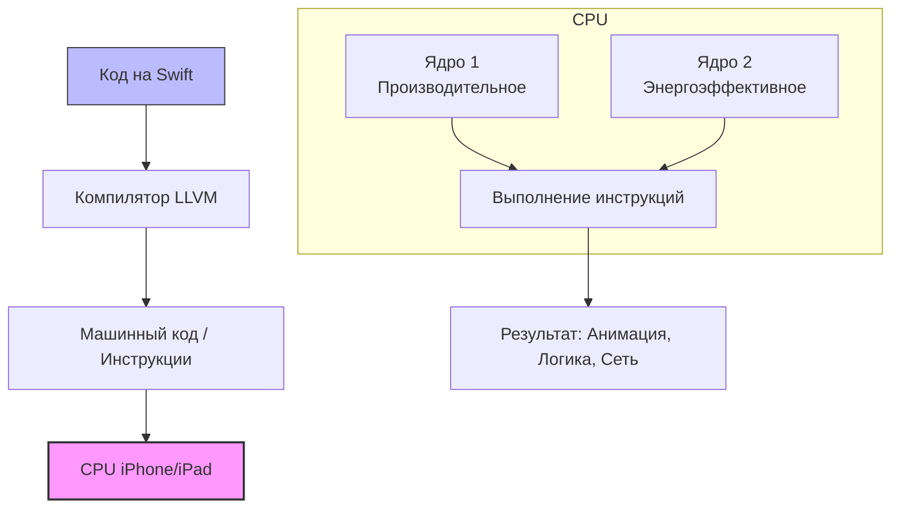

Вот подробная статья для Obsidian по термину **CPU** в контексте iOS-разработки на Swift/UIKit. Текст оптимизирован для заметок (Markdown), содержит схемы, примеры и теги.

---
### Теги
`#computer-science` `#architecture` `#hardware` `#performance` `#low-level` `#concurrency`

---

## CPU (Central Processing Unit)

### Определение
**Центральный процессор (CPU)** — это "мозг" компьютера или мобильного устройства (iPhone, iPad). Это аппаратное обеспечение, отвечающее за выполнение инструкций программ. В контексте iOS-разработки CPU выполняет код, который ты пишешь на Swift: вычисления, логику приложения, управление памятью и координацию задач.

### Зачем это знать iOS-разработчику?
Понимание работы CPU помогает писать эффективный код, который не будет тормозить интерфейс и сажать батарею. Если ты нагружаешь CPU бесконечными циклами или тяжелыми вычислениями на главном потоке, приложение "вылетит" (crash) или будет фризить (заикаться анимация).

---

### Основные концепции (в контексте iOS)

#### 1. Ядра (Cores)
Современные CPU (в iPhone используются чипы семейства A-series и M-series) являются **многоядерными**.
*   **Производительные ядра (High-performance):** Быстрые, но энергозатратные. Используются для запуска игр, рендеринга видео, сложных вычислений.
*   **Энергоэффективные ядра (High-efficiency):** Медленные, но потребляют мало энергии. Используются для фоновых задач, проверки почты, обработки уведомлений.

**Технология:** *Apple Fusion Architecture* (например, 2高性能 + 4低能耗).

#### 2. Потоки выполнения (Threads)
CPU физически выполняет инструкции. Одно ядро может выполнять **один поток** инструкций за раз. Чтобы создать иллюзию одновременной работы всего сразу, ОС быстро переключается между потоками (контекстное переключение).

#### 3. Тактовая частота
Количество операций в секунду (ГГц). Но в мобильных устройствах частота динамически меняется (троттлинг), чтобы устройство не перегрелось.

---

### Схема взаимодействия (CPU + App)



---

### Примеры от простого к сложному

#### Уровень 1: Базовая нагрузка (Скучная математика)
Любая строчка кода, которая что-то считает, нагружает CPU.
```swift
// Простейшая операция. CPU складывает два числа за 1 такт (примерно).
let a = 5 + 3
print(a)
```

#### Уровень 2: Циклы (Видимая нагрузка)
Представь, что тебе нужно обработать 10 тысяч фотографий.
```swift
// Пример синхронной загрузки на главном потоке
func processImages() {
    for i in 1...10000 {
        // Тяжелая операция по обработке изображения
        let result = i * i // Симуляция тяжелой работы
        print("Обработано: \(result)")
    }
}

// Если вызвать processImages() на главном потоке (main thread),
// CPU будет занят циклами, и не сможет отрисовывать анимацию интерфейса.
// Интерфейс "замерзнет".
```

#### Уровень 3: Правильный подход (Concurrency)
Чтобы не блокировать главный поток (который отвечает за UIKit), мы просим CPU выполнить тяжелую работу на фоновом ядре.

```swift
import UIKit

class ViewController: UIViewController {

    override func viewDidLoad() {
        super.viewDidLoad()
        view.backgroundColor = .white
        
        // 1. Это работает на главном потоке (Main Thread) - отвечает за интерфейс
        print("👨‍💻 Главный поток: \(Thread.current)")
        
        // 2. Отправляем тяжелую задачу в фоновую очередь (background queue)
        DispatchQueue.global(qos: .background).async { [weak self] in
            
            // Этот код выполняется на одном из ЭНЕРГОЭФФЕКТИВНЫХ ядер CPU
            print("⚙️ Фоновый поток: \(Thread.current)")
            self?.performHardWork()
            
            // 3. Когда работа закончена, нужно вернуться на главный поток,
            // чтобы показать результат (обновить UIKit).
            DispatchQueue.main.async {
                print("✅ Обновляем UI на главном потоке: \(Thread.current)")
                self?.view.backgroundColor = .green
            }
        }
    }
    
    func performHardWork() {
        var sum: Int64 = 0
        for i in 1...500_000_000 {
            sum += Int64(i) // Кипятим CPU
        }
        print("Результат вычислений: \(sum)")
    }
}
```
**Объяснение примера:**
1.  `viewDidLoad()` бежит на главном потоке.
2.  Мы говорим CPU: "Возьми одно из ядер (желательно производительное) и посчитай эту огромную сумму".
3.  Пока CPU считает на фоне, главный поток свободен, он может крутить анимации, реагировать на нажатия.
4.  Как только подсчет закончен, мы снова переключаемся на главный поток (`DispatchQueue.main`), чтобы показать результат (поменять цвет фона). *Безопасность UIKit требует работы только на главном потоке.*

---

### Влияние CPU на UX (Пользовательский опыт)

1.  **Троттлинг (Throttling):** Если ты перегреешь CPU сложной задачей в жару на улице, iOS снизит частоту процессора. Твои вычисления будут идти медленнее.
2.  **Энергопотребление:** Постоянная загрузка CPU разряжает батарею. Использование энергоэффективных ядер (`qos: .background`) продлевает время работы устройства.
3.  **Race Condition:** Когда два разных ядра CPU пытаются одновременно изменить одну и ту же переменную. Это приводит к багам. В Swift для этого есть семафоры и акторы (actors).

### Итог
**CPU** в iOS — это исполнитель твоего кода. Твоя задача как разработчика — грамотно распределять задачи между его ядрами, чтобы главный поток всегда был свободен для отрисовки плавного интерфейса.