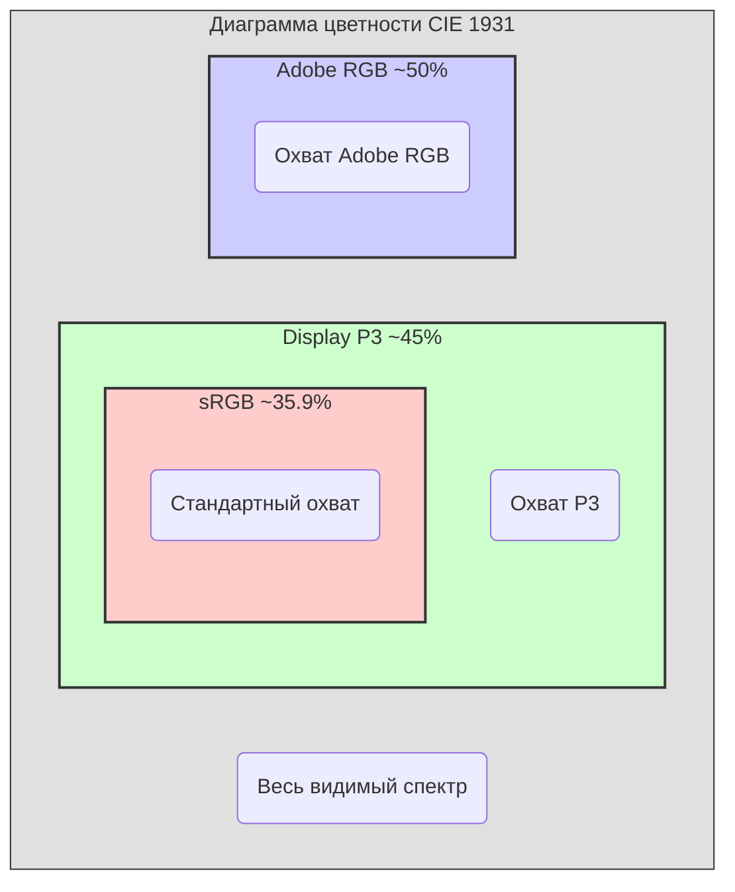

#color #color-space #displayp3 #p3 #wide-gamut #graphics #uikit #swiftui #hdr

---
### Определение
**Display P3** — это цветовое пространство с расширенным охватом (wide gamut), разработанное Apple и являющееся стандартным цветовым пространством для всех современных устройств с широкоцветными дисплеями, начиная с iPhone 7, iPad Pro (9.7 дюйма) и более новых моделей . Display P3 базируется на цветовом пространстве DCI-P3, используемом в цифровом кино, но адаптировано под особенности экранов Apple и стандартную для веба точку белого .

В контексте [[iOS]]-разработки Display P3 — это **основное цветовое пространство для отображения контента на новых устройствах**. Оно обеспечивает на 25-30% больший цветовой охват по сравнению с [[sRGB]], что позволяет показывать более насыщенные и реалистичные цвета .

### Почему это важно для iOS-разработчика?
1.  **Стандарт для новых устройств:** Все современные iPhone, iPad и Mac используют дисплеи с поддержкой P3. Игнорирование этого пространства означает недоиспользование возможностей устройства.
2.  **Качество изображения:** Использование P3 позволяет отображать более яркие, насыщенные и реалистичные цвета, особенно в красных и зеленых оттенках .
3.  **HDR-контент:** Display P3 является базой для отображения HDR-видео и фотографий ([[HEIC]] с HDR).
4.  **Будущее:** Даже если ваше приложение не требует "супер-цветов", понимание P3 необходимо для корректной обработки пользовательского контента (фото, видео), который уже снимается в этом пространстве.

---

### Технические характеристики Display P3

| Параметр                            | Значение                                                                        | Описание                                                                                                      |
| ----------------------------------- | ------------------------------------------------------------------------------- | ------------------------------------------------------------------------------------------------------------- |
| **Базовое пространство**            | DCI-P3 (Digital Cinema Initiatives)                                             | Разработано для цифровых кинотеатров, охватывает примерно 45% видимого спектра CIE 1931 .                     |
| **Цветовой охват**                  | ~45% видимого спектра CIE 1931                                                  | На 25-30% больше, чем у sRGB (35.9%). Особенно расширен в области красных и фиолетовых оттенков .             |
| **Точка белого**                    | D65 (6500K)                                                                     | Та же, что у sRGB, что обеспечивает консистентность с веб-стандартами .                                       |
| **Гамма (Gamma)**                   | ~2.2 (близка к sRGB)                                                            | Использует гамма-кривую, близкую к sRGB, но не идентичную. В [[SwiftUI]] доступен режим `.linear` и `.sRGB` . |
| **Основные цвета (Primary colors)** | Красный: (0.680, 0.320) <br> Зеленый: (0.265, 0.690) <br> Синий: (0.150, 0.060) | Зеленый компонент смещен для лучшего охвата типичных для дисплеев оттенков .                                  |



---

### Сравнение: Display P3 vs sRGB vs Adobe RGB

| Характеристика          | Display P3                                    | [[sRGB]]                                        | [[Adobe RGB]]                                                  |
| ----------------------- | --------------------------------------------- | ----------------------------------------------- | -------------------------------------------------------------- |
| **Область применения**  | Современные устройства Apple, HDR-видео, фото | Интернет, старые дисплеи, универсальный контент | Полиграфия, допечатная подготовка, профессиональная фотография |
| **Цветовой охват**      | Широкий, особенно в **красных** тонах         | Базовый                                         | Широкий, особенно в **зеленых** тонах                          |
| **Точка белого**        | D65 (6500K, стандартная)                      | D65 (6500K)                                     | D50 (5000K, теплее)                                            |
| **Связь с HDR**         | Прямая (основа для HDR)                       | Нет                                             | Нет                                                            |
| **Поддержка в [[iOS]]** | Полная, нативная (с iOS 9.3)                  | Полная, нативная                                | Ограниченная (требует управления цветом)                       |
| **Устройства**          | iPhone 7+, iPad Pro 9.7+, все новые модели    | Все устройства                                  | Только при управлении цветом                                   |

**Ключевой вывод для разработчика:** Display P3 — это "родное" широкое цветовое пространство для iOS. Оно лучше всего подходит для отображения контента на современных устройствах и автоматически поддерживается системой.

---

### Определение поддержки Display P3 на устройстве

Прежде чем использовать P3-цвета, полезно знать, поддерживает ли их устройство пользователя.

```swift
import UIKit

extension UIScreen {
    /// Проверяет, поддерживает ли экран цветовое пространство Display P3
    var supportsDisplayP3: Bool {
        if #available(iOS 9.3, *) {
            return self.traitCollection.displayGamut == .P3
        } else {
            return false
        }
    }
}

// Использование:
class ViewController: UIViewController {
    
    override func viewDidLoad() {
        super.viewDidLoad()
        
        if UIScreen.main.supportsDisplayP3 {
            print("Устройство поддерживает P3. Можно использовать насыщенные цвета!")
        } else {
            print("Устройство поддерживает только sRGB. Цвета будут сжаты.")
        }
    }
}
```

---

### Примеры работы с Display P3 в Swift

#### Уровень 1: Создание цвета в Display P3 ([[UIKit]])

```swift
import UIKit

class P3ColorViewController: UIViewController {
    
    override func viewDidLoad() {
        super.viewDidLoad()
        
        // Создаем яркий красный цвет в пространстве Display P3
        let p3Red = UIColor(displayP3Red: 1.0, green: 0.0, blue: 0.0, alpha: 1.0)
        
        // Создаем насыщенный зеленый, который невозможен в sRGB
        let p3Green = UIColor(displayP3Red: 0.0, green: 0.9, blue: 0.0, alpha: 1.0)
        
        // Создаем фиолетовый, используя расширенный красный и синий
        let p3Purple = UIColor(displayP3Red: 0.9, green: 0.2, blue: 0.9, alpha: 1.0)
        
        // Применяем к вью
        let redView = UIView(frame: CGRect(x: 50, y: 100, width: 100, height: 100))
        redView.backgroundColor = p3Red
        view.addSubview(redView)
        
        let greenView = UIView(frame: CGRect(x: 160, y: 100, width: 100, height: 100))
        greenView.backgroundColor = p3Green
        view.addSubview(greenView)
        
        let purpleView = UIView(frame: CGRect(x: 270, y: 100, width: 100, height: 100))
        purpleView.backgroundColor = p3Purple
        view.addSubview(purpleView)
        
        // На P3-экране эти цвета будут яркими и насыщенными.
        // На sRGB-экране они будут автоматически сжаты системой до ближайших возможных цветов.
    }
}
```

#### Уровень 2: Сравнение [[sRGB]] и P3 визуально

```swift
import UIKit

class ColorComparisonViewController: UIViewController {
    
    override func viewDidLoad() {
        super.viewDidLoad()
        
        // Создаем два одинаковых на вид цвета, но в разных пространствах
        let sRGBGreen = UIColor(red: 0.0, green: 1.0, blue: 0.0, alpha: 1.0) // sRGB
        let p3Green = UIColor(displayP3Red: 0.0, green: 1.0, blue: 0.0, alpha: 1.0) // P3
        
        let sRGBView = UIView(frame: CGRect(x: 50, y: 100, width: 150, height: 150))
        sRGBView.backgroundColor = sRGBGreen
        view.addSubview(sRGBView)
        
        let p3View = UIView(frame: CGRect(x: 220, y: 100, width: 150, height: 150))
        p3View.backgroundColor = p3Green
        view.addSubview(p3View)
        
        let label1 = UILabel(frame: CGRect(x: 50, y: 260, width: 150, height: 30))
        label1.text = "sRGB Green"
        label1.textAlignment = .center
        view.addSubview(label1)
        
        let label2 = UILabel(frame: CGRect(x: 220, y: 260, width: 150, height: 30))
        label2.text = "P3 Green"
        label2.textAlignment = .center
        view.addSubview(label2)
        
        // На P3-экране правый квадрат будет значительно ярче.
        // На sRGB-экране они будут выглядеть почти одинаково.
    }
}
```

#### Уровень 3: Работа с Extended Range в Display P3
Начиная с iOS 10, [[UIColor]] поддерживает extended range, что позволяет задавать значения за пределами [0, 1] для HDR-эффектов.

```swift
import UIKit

class ExtendedRangeP3ViewController: UIViewController {
    
    override func viewDidLoad() {
        super.viewDidLoad()
        
        // Создаем "сверх-яркий" красный (значения >1.0)
        // Это полезно для HDR-контента, где яркость может превышать стандартную.
        let hdrRed = UIColor(displayP3Red: 1.5, green: 0.0, blue: 0.0, alpha: 1.0)
        
        let hdrView = UIView(frame: CGRect(x: 100, y: 200, width: 200, height: 200))
        hdrView.backgroundColor = hdrRed
        view.addSubview(hdrView)
        
        // ВНИМАНИЕ: На обычном SDR-дисплее (даже P3) значение >1.0 будет сжато до 1.0.
        // Для реального HDR нужен специальный режим отображения и контент.
    }
}
```

#### Уровень 4: Создание P3-изображения через [[UIGraphicsImageRenderer]]

```swift
import UIKit

class P3ImageRendererViewController: UIViewController {
    
    @IBOutlet weak var imageView: UIImageView!
    
    override func viewDidLoad() {
        super.viewDidLoad()
        
        // Создаем изображение с P3-цветами
        let p3Image = createP3Image(size: CGSize(width: 300, height: 300))
        imageView.image = p3Image
    }
    
    func createP3Image(size: CGSize) -> UIImage? {
        // Создаем формат с поддержкой P3
        let format = UIGraphicsImageRendererFormat()
        
        if #available(iOS 12.0, *) {
            // Устанавливаем preferredRange для поддержки широкого цвета
            format.preferredRange = .extended
            
            // Явно задаем цветовое пространство Display P3
            format.colorSpace = CGColorSpace(name: CGColorSpace.displayP3)
        } else {
            // На iOS 10-11 используем extended range
            if #available(iOS 10.0, *) {
                format.prefersExtendedRange = true
            }
        }
        
        let renderer = UIGraphicsImageRenderer(size: size, format: format)
        
        let image = renderer.image { context in
            let rect = CGRect(origin: .zero, size: size)
            
            // Рисуем градиент с P3-цветами
            let colorSpace = context.cgContext.colorSpace ?? CGColorSpace(name: CGColorSpace.displayP3)!
            
            let colors = [
                UIColor(displayP3Red: 1.0, green: 0.2, blue: 0.2, alpha: 1.0).cgColor,
                UIColor(displayP3Red: 0.2, green: 1.0, blue: 0.2, alpha: 1.0).cgColor,
                UIColor(displayP3Red: 0.2, green: 0.2, blue: 1.0, alpha: 1.0).cgColor
            ]
            
            if let gradient = CGGradient(colorsSpace: colorSpace,
                                        colors: colors as CFArray,
                                        locations: [0.0, 0.5, 1.0]) {
                
                context.cgContext.drawLinearGradient(gradient,
                                                     start: CGPoint(x: 0, y: 0),
                                                     end: CGPoint(x: size.width, y: size.height),
                                                     options: [])
            }
            
            // Рисуем круг с P3-цветом
            let circleRect = CGRect(x: 100, y: 100, width: 100, height: 100)
            context.cgContext.setFillColor(UIColor(displayP3Red: 1.0, green: 0.8, blue: 0.0, alpha: 1.0).cgColor)
            context.cgContext.fillEllipse(in: circleRect)
        }
        
        return image
    }
}
```

#### Уровень 5: Display P3 в [[SwiftUI]]

```swift
import SwiftUI

struct P3ColorView: View {
    var body: some View {
        VStack(spacing: 20) {
            // Стандартный цвет (зависит от контекста)
            Rectangle()
                .fill(Color.red)
                .frame(width: 150, height: 150)
                .overlay(Text("Default Red"))
            
            // Явное использование sRGB
            Rectangle()
                .fill(Color(.sRGB, red: 1.0, green: 0.0, blue: 0.0, opacity: 1.0))
                .frame(width: 150, height: 150)
                .overlay(Text("sRGB Red"))
            
            // Использование Display P3 в SwiftUI
            if #available(iOS 14.0, *) {
                Rectangle()
                    .fill(Color(.displayP3, red: 1.0, green: 0.2, blue: 0.2, opacity: 1.0))
                    .frame(width: 150, height: 150)
                    .overlay(Text("P3 Red"))
            }
            
            // Extended range в SwiftUI
            Rectangle()
                .fill(Color(red: 1.2, green: 0.0, blue: 0.0)) // Extended red
                .frame(width: 150, height: 150)
                .overlay(Text("Extended Red"))
                .colorRenderingMode(.extendedLinear)
        }
    }
}
```

#### Уровень 6: Конвертация sRGB в Display P3

```swift
import UIKit
import CoreImage

class ColorSpaceConverter {
    
    let ciContext = CIContext()
    
    /// Конвертирует UIImage из sRGB в Display P3
    func convertSRGBToP3(srgbImage: UIImage) -> UIImage? {
        guard let cgImage = srgbImage.cgImage else { return nil }
        
        let ciImage = CIImage(cgImage: cgImage)
        let p3Space = CGColorSpace(name: CGColorSpace.displayP3)!
        
        // Создаем изображение в P3
        guard let p3Image = ciContext.createCGImage(ciImage,
                                                    from: ciImage.extent,
                                                    format: .RGBA8,
                                                    colorSpace: p3Space) else {
            return nil
        }
        
        return UIImage(cgImage: p3Image)
    }
    
    /// Конвертирует Display P3 в sRGB (для совместимости)
    func convertP3ToSRGB(p3Image: UIImage) -> UIImage? {
        guard let cgImage = p3Image.cgImage else { return nil }
        
        let ciImage = CIImage(cgImage: cgImage)
        let sRGBSpace = CGColorSpace(name: CGColorSpace.sRGB)!
        
        guard let sRGBImage = ciContext.createCGImage(ciImage,
                                                      from: ciImage.extent,
                                                      format: .RGBA8,
                                                      colorSpace: sRGBSpace) else {
            return nil
        }
        
        return UIImage(cgImage: sRGBImage)
    }
}

// Использование:
class ConversionDemoViewController: UIViewController {
    
    let converter = ColorSpaceConverter()
    
    @IBOutlet weak var originalImageView: UIImageView!
    @IBOutlet weak var convertedImageView: UIImageView!
    
    func convertAndDisplay(image: UIImage) {
        originalImageView.image = image
        
        if let p3Image = converter.convertSRGBToP3(srgbImage: image) {
            convertedImageView.image = p3Image
        }
    }
}
```

#### Уровень 7: Проверка, является ли UIColor P3-цветом

```swift
import UIKit

extension UIColor {
    /// Проверяет, создан ли цвет в пространстве Display P3
    var isDisplayP3Color: Bool {
        if #available(iOS 10.0, *) {
            return self.cgColor.colorSpace?.name == CGColorSpace.displayP3
        } else {
            return false
        }
    }
    
    /// Возвращает цвет, гарантированно преобразованный в Display P3
    func inDisplayP3() -> UIColor {
        if self.isDisplayP3Color {
            return self
        }
        
        // Конвертируем в P3 через компоненты
        var red: CGFloat = 0
        var green: CGFloat = 0
        var blue: CGFloat = 0
        var alpha: CGFloat = 0
        
        self.getRed(&red, green: &green, blue: &blue, alpha: &alpha)
        
        return UIColor(displayP3Red: red, green: green, blue: blue, alpha: alpha)
    }
}

// Использование:
let color = UIColor(red: 0.5, green: 0.2, blue: 0.8, alpha: 1.0)
print(color.isDisplayP3Color) // false

let p3Color = color.inDisplayP3()
print(p3Color.isDisplayP3Color) // true (на iOS 10+)
```

---

### Практические рекомендации

| Сценарий | Рекомендация | Почему |
|---|---|---|
| **UI-элементы (кнопки, фон)** | Использовать `UIColor(displayP3Red:...)` | Цвета будут максимально насыщенными на новых устройствах, система сама сожмет их для старых |
| **Иконки в Assets** | Использовать PDF (вектор) | Вектор масштабируется и может быть покрашен в любой цвет через `tintColor` |
| **Фотографии пользователя** | Довериться автоматическому управлению цвета iOS | Современные фото уже в P3 (HEIC), iOS отобразит их правильно |
| **Изображения из интернета** | Предполагать sRGB, если нет явного профиля | Большинство веб-изображений — sRGB |
| **Сохранение изображения для соцсетей** | Конвертировать в sRGB | Соцсети ожидают sRGB, P3 может выглядеть искаженно |
| **Профессиональные фото-приложения** | Сохранять P3 профиль или конвертировать с умом | Для архива важно сохранить исходное качество |

---

### Важные нюансы и Best Practices

#### 1. **Автоматическое управление цветом**
iOS имеет мощную систему управления цветом (ColorSync). Если вы просто используете `UIImage(named:)` или загружаете фото через `PHPicker`, система **автоматически** преобразует цвета в цветовое пространство экрана . Это значит, что P3-фото на sRGB-экране будет корректно сжато, а sRGB-фото на P3-экране будет выглядеть так, как задумано.

#### 2. **Extended Range ≠ HDR**
Значения компонентов больше 1.0 в `UIColor(displayP3Red:...)` — это **Extended Range**, а не HDR. Для настоящего HDR нужен специальный контент (HDR-видео, HDR-изображения) и правильный контекст отображения (например, `AVPlayer` с HDR-видео).

#### 3. **Проверка на реальных устройствах**
Цвета, которые выглядят великолепно на iPhone 15 Pro, могут быть блеклыми на iPhone SE. Всегда тестируйте дизайн на разных устройствах или используйте симулятор с разными цветовыми профилями.

#### 4. **Display P3 в Simulator**
Xcode Simulator поддерживает P3. Вы можете проверить, как выглядят P3-цвета, выбрав в меню `Features > Color Space > Display P3`.

#### 5. **[[HEX]] и P3**
HEX-формат не поддерживает P3. HEX всегда интерпретируется как sRGB. Если дизайнер дал HEX, используйте его как sRGB.

#### 6. **Производительность**
Использование P3 не влияет на производительность на современных устройствах. На старых устройствах (до A9) преобразование цветов может быть чуть затратнее, но это незаметно.

#### 7. **SwiftUI Color**
В SwiftUI `Color` автоматически адаптируется к текущему контексту. Для явного указания P3 используйте `Color(.displayP3, red:green:blue:opacity:)` (доступно с iOS 14).

### Итог
**Display P3** — это современное цветовое пространство Apple, обеспечивающее более насыщенные и реалистичные цвета на всех новых устройствах. Для iOS-разработчика это:

1.  **Стандарт де-факто** для новых проектов.
2.  **Простой API:** `UIColor(displayP3Red:...)` для создания цветов.
3.  **Автоматическое управление цветом:** iOS сама позаботится о совместимости.
4.  **Основа для HDR** и будущих стандартов отображения.

Используйте P3 везде, где нужны яркие, насыщенные цвета, но помните о пользователях со старыми устройствами — система автоматически преобразует цвета для них.