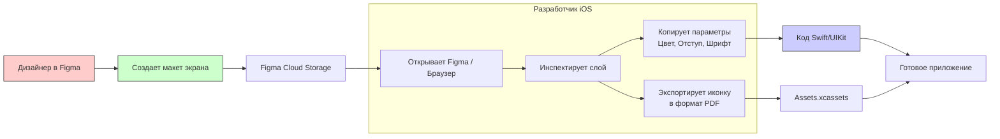

#design #ui/ux #tools #collaboration #workflow #assets

---
### Определение
**Figma** — это облачный инструмент для интерфейсного дизайна (UI/UX), работающий прямо в браузере или через десктоп-приложение. Для [[iOS]]-разработчика Figma является основным мостом между визуальной концепцией приложения и его программной реализацией. Это не просто "рисовалка", а среда, содержащая полную спецификацию интерфейса: размеры, цвета, отступы, шрифты, логику переходов (прототипирование) и экспортируемые ресурсы.

### Зачем это знать iOS-разработчику?
В современной разработке ты почти никогда не получаешь [[PNG]]-картинки. Ты получаешь ссылку на Figma-файл. Оттуда ты должен "вычитать" требования к коду:
1.  **Пиксель-перфект (Pixel Perfect):** Точное соответствие верстки макету.
2.  **Автоматизация:** Прямой экспорт цвета ([[HEX]]) в [[UIColor]] и изображений ([[PDF]]/[[PNG]]) в `Assets.xcassets`.
3.  **Понимание компонентов:** То, что дизайнер назвал "карточкой товара" в Figma, ты превращаешь в переиспользуемый [[UIView]] или [[UITableViewCell]].
4.  **Проверка реалистичности:** Иногда дизайнер рисует нечто, что технически невозможно или слишком сложно реализовать на [[UIKit]]. Разработчик должен это увидеть на этапе макета.

---

### Основные концепции для разработчика

#### 1. Frame (Фрейм)
Корневой элемент макета. В iOS аналогичен `UIView` или [[UIViewController]]`.view`.
*   В Figma внутри фреймов задаются **Constraints (Ограничения)** — как объект ведет себя при изменении размера родителя. Это прямая аналогия с Auto Layout в коде (Leading, Trailing, Top, Bottom, Center).
*   **Auto Layout (в Figma):** Функция, позволяющая дизайнеру создавать адаптивные макеты, которые едут при изменении размера контейнера. Это то же самое, что мы делаем в коде с `NSLayoutConstraint`.

#### 2. Компоненты (Components)
Главный элемент переиспользования. Если дизайнер создал кнопку как компонент, он меняет её в одном месте, и она меняется на всех экранах. Разработчик должен создать в коде единый класс `CustomButton.swift`.

#### 3. Стили (Styles)
Глобальные переменные дизайна.
*   **Color Styles:** Палитра проекта.
*   **Text Styles:** Шрифты, размеры, интерлиньяжи.
Разработчик должен перенести эти стили в код как константы (например, `enum Fonts { ... }` или `UIColor` экстеншены).

#### 4. Inspect Panel (Панель инспектора)
Веб-интерфейс, который видит разработчик, кликнув на слой. Он показывает:
*   Имя слоя.
*   Размеры (W, H).
*   Отступы.
*   Цвет заливки ([[HEX]], [[RGB]]).
*   Свойства текста.
*   Возможность экспорта изображения в SVG, PNG, PDF.

---

### Схема рабочего процесса (Design -> Code)



---

### Примеры от простого к сложному

#### Уровень 1: Получение "цвета" из Figma
Допустим, дизайнер сделал кнопку с цветом `#2C3E50`.

1.  В Figma ты выделяешь слой.
2.  Справа в панели инспектора копируешь CSS-значение цвета (или HEX).
3.  В коде создаешь `UIColor`.

```swift
import UIKit

// То, что ты скопировал: #2C3E50
extension UIColor {
    static let primaryButtonBackground = UIColor(hex: "#2C3E50")
}

// Хелпер для конвертации HEX в UIColor (часто используется в проектах)
extension UIColor {
    convenience init(hex: String) {
        let hexString = hex.trimmingCharacters(in: .whitespacesAndNewlines).replacingOccurrences(of: "#", with: "")
        var int: UInt64 = 0
        Scanner(string: hexString).scanHexInt64(&int)
        let r, g, b: CGFloat
        switch hexString.count {
        case 6:
            r = CGFloat((int >> 16) & 0xFF) / 255.0
            g = CGFloat((int >> 8) & 0xFF) / 255.0
            b = CGFloat(int & 0xFF) / 255.0
        default:
            r = 1.0; g = 1.0; b = 1.0
        }
        self.init(red: r, green: g, blue: b, alpha: 1.0)
    }
}

// Использование:
let button = UIButton()
button.backgroundColor = .primaryButtonBackground
```

#### Уровень 2: Получение размера и отступов
Дизайнер нарисовал аватарку 48x48 с отступом сверху 16pt.

```swift
import UIKit

class ProfileViewController: UIViewController {
    
    let avatarImageView = UIImageView()
    
    override func viewDidLoad() {
        super.viewDidLoad()
        setupAvatar()
    }
    
    private func setupAvatar() {
        avatarImageView.translatesAutoresizingMaskIntoConstraints = false
        avatarImageView.backgroundColor = .gray // Placeholder
        avatarImageView.layer.cornerRadius = 24 // Половина высоты для круга (48/2)
        avatarImageView.clipsToBounds = true
        
        view.addSubview(avatarImageView)
        
        NSLayoutConstraint.activate([
            // Значение 16 берем из Figma (Top margin)
            avatarImageView.topAnchor.constraint(equalTo: view.safeAreaLayoutGuide.topAnchor, constant: 16),
            
            // Значение 48 берем из Figma (Width)
            avatarImageView.widthAnchor.constraint(equalToConstant: 48),
            avatarImageView.heightAnchor.constraint(equalToConstant: 48),
            
            // Дизайнер сказал "слева тоже 16"
            avatarImageView.leadingAnchor.constraint(equalTo: view.leadingAnchor, constant: 16)
        ])
    }
}
```

#### Уровень 3: Экспорт векторной иконки (PDF) и использование
В Figma иконки лучше экспортировать в **PDF** (векторный формат). iOS отлично работает с PDF в `Assets.xcassets`, автоматически подбирая четкость для Retina-экранов.

1.  В Figma выдели иконку.
2.  В панели "Export" выбери формат **PDF** и нажми "Export".
3.  Перенеси файл в папку `Assets.xcassets` в Xcode.
4.  Используй в коде:

```swift
// Допустим, мы назвали набор изображений "settings_icon"
let imageView = UIImageView(image: UIImage(named: "settings_icon"))
imageView.tintColor = .primaryButtonBackground // Можно менять цвет векторной иконки
```

#### Уровень 4: Сложная логика — [[Auto Layout]] против Figma Auto Layout
В Figma дизайнер настроил "карточку", где текст слева, а кнопка справа, и при изменении ширины экрана кнопка "прилипает" к правому краю.

**Как это выглядит в Figma Constraints:** Кнопка прикреплена к правому краю (Right constraint), а текст тянется (Left and Right constraints).

**Как это выглядит в коде (UIKit):**
```swift
// Допустим, есть ячейка карточки товара
let titleLabel = UILabel()
let actionButton = UIButton()

// В методе setupConstraints:
NSLayoutConstraint.activate([
    // Лейбл слева, с отступом 16
    titleLabel.leadingAnchor.constraint(equalTo: contentView.leadingAnchor, constant: 16),
    titleLabel.centerYAnchor.constraint(equalTo: contentView.centerYAnchor),
    
    // Кнопка справа, с отступом 16
    actionButton.trailingAnchor.constraint(equalTo: contentView.trailingAnchor, constant: -16),
    actionButton.centerYAnchor.constraint(equalTo: contentView.centerYAnchor),
    
    // Связь между лейблом и кнопкой: лейбл не должен заходить на кнопку
    titleLabel.trailingAnchor.constraint(lessThanOrEqualTo: actionButton.leadingAnchor, constant: -8)
])
```
Здесь разработчик перевел визуальное расположение из Figma в математические ограничения Auto Layout.

---

### Советы и лучшие практики

1.  **Режим разработчика (Dev Mode):** Если у тебя есть доступ к платной Figma, используй Dev Mode. Он подсвечивает CSS-свойства, генерирует код для [[SwiftUI]] (хотя для [[UIKit]] тоже полезно) и показывает изменения между версиями.
2.  **Спроси дизайнера:** Если имя слоя называется "Frame 8327", попроси дизайнера дать осмысленное имя. Это ускорит поиск.
3.  **SVG в Assets:** Figma отлично экспортирует в SVG. Xcode автоматически конвертирует [[SVG]] в векторный формат при добавлении в `Assets.xcassets` (начиная с iOS 13+). Это лучше, чем экспорт растра (PNG).
4.  **Плагины:** Существуют плагины для Figma, которые генерируют код SwiftUI (например, *Figma to Code*). Это может быть стартовой точкой, но требует доработки.

### Итог
**Figma** для iOS-разработчика — это "техническое задание" в графическом виде. Умение читать Figma и перекладывать её параметры на язык Auto Layout и UIKit — обязательный навык современного разработчика интерфейсов.