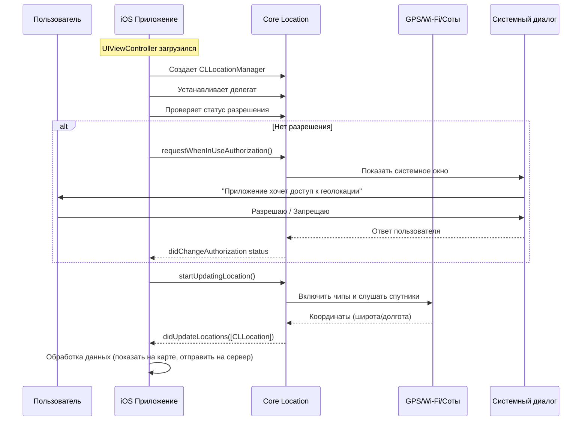

#hardware #core-location #sensors #privacy #maps #location-services

---
## GPS (Global Positioning System)

### Определение
**GPS (Глобальная система позиционирования)** — это аппаратный модуль в iPhone/iPad, который позволяет определять географическое местоположение устройства путем получения сигналов со спутников. В контексте [[iOS]]-разработки доступ к GPS осуществляется через фреймворк **[[Core Location]]**, который абстрагирует работу с железом и предоставляет удобный [[API]] для получения координат, высоты, скорости и направления движения.

### Важное уточнение для iOS
В документации Apple и в коде ты редко встретишь прямое упоминание "GPS". Обычно используется термин **Location Services**. Это связано с тем, что современные устройства определяют местоположение не только через GPS, но и через:
- **Wi-Fi** (триангуляция по точкам доступа)
- **Bluetooth** (маячки, beacons)
- **Сотовые вышки** (Cell Towers)
- **iBeacon** (точное позиционирование внутри помещений)

Но исторически и концептуально все называют это GPS.

### Зачем это знать iOS-разработчику?
Множество приложений используют геолокацию:
1.  **Навигация:** Карты, такси, курьеры.
2.  **Контекстная информация:** Погода (автоматическое определение города), новости рядом.
3.  **Социальные фичи:** Отметки на фото, поиск друзей рядом.
4.  **Безопасность:** Поиск устройства (Find My).
5.  **Бизнес-логика:** Геозоны (Geofencing) — уведомление при входе в магазин.

Твоя задача как разработчика — правильно запросить разрешение, эффективно обрабатывать данные (чтобы не сажать батарею) и обрабатывать случаи, когда GPS недоступен или пользователь запретил доступ.

---

### Основные концепции Core Location

#### 1. [[CLLocationManager]]
Главный класс для управления всем, что связано с геолокацией. Ты создаешь его экземпляр, настраиваешь и начинаешь получать обновления.

#### 2. Разрешения (Privacy)
В iOS доступ к GPS жестко контролируется пользователем. Есть два уровня запроса:
- **When In Use:** Разрешение только когда приложение открыто (на экране).
- **Always:** Разрешение в фоне (требуется особое обоснование при публикации в App Store).

#### 3. [[CLLocation]]
Основная структура данных, которую ты получаешь от менеджера. Содержит:
- `coordinate` (широта, долгота) — самое важное.
- `altitude` (высота над уровнем моря).
- `horizontalAccuracy` (точность в метрах — чем меньше число, тем точнее).
- `speed` (скорость передвижения).
- `course` (направление движения в градусах).

#### 4. accuracy (Точность)
Ты можешь запросить разную точность:
- `kCLLocationAccuracyBestForNavigation` — Максимальная (жрет батарею).
- `kCLLocationAccuracyNearestTenMeters` — Для большинства задач (10 метров).
- `kCLLocationAccuracyKilometer` — Для погоды или новостей.

---

### Схема работы GPS в iOS приложении



---

### Примеры от простого к сложному

#### Уровень 0: Настройка Info.plist
Прежде чем писать код, нужно добавить описание в `Info.plist`. Иначе приложение упадет с крашем.

Ключи ([[String]]s):
- `NSLocationWhenInUseUsageDescription` — "Мы используем геолокацию, чтобы показать погоду в вашем городе."
- `NSLocationAlwaysAndWhenInUseUsageDescription` — "Мы используем геолокацию в фоне для отслеживания ваших пробежек."

#### Уровень 1: Получение текущего местоположения (простой запрос)

```swift
import UIKit
import CoreLocation

class WeatherViewController: UIViewController, CLLocationManagerDelegate {

    let locationManager = CLLocationManager()
    let weatherLabel = UILabel()

    override func viewDidLoad() {
        super.viewDidLoad()
        view.backgroundColor = .white
        setupUI()
        setupLocation()
    }

    func setupUI() {
        weatherLabel.frame = view.bounds
        weatherLabel.textAlignment = .center
        weatherLabel.numberOfLines = 0
        view.addSubview(weatherLabel)
    }

    func setupLocation() {
        // 1. Настраиваем менеджер
        locationManager.delegate = self
        
        // 2. Запрашиваем разрешение (When In Use)
        locationManager.requestWhenInUseAuthorization()
        
        // 3. Запускаем обновление (на самом деле лучше запрашивать после разрешения)
        // startReceivingLocation()
    }
    
    func startReceivingLocation() {
        // Проверяем, включена ли геолокация вообще
        if CLLocationManager.locationServicesEnabled() {
            locationManager.desiredAccuracy = kCLLocationAccuracyHundredMeters // Для погоды норм
            locationManager.startUpdatingLocation()
            weatherLabel.text = "Определяем местоположение..."
        } else {
            weatherLabel.text = "Включите геолокацию в настройках"
        }
    }

    // MARK: - CLLocationManagerDelegate
    
    // Этот метод вызывается, когда пользователь ответил на разрешение
    func locationManagerDidChangeAuthorization(_ manager: CLLocationManager) {
        switch manager.authorizationStatus {
        case .authorizedWhenInUse, .authorizedAlways:
            // Ура, разрешили! Можно стартовать.
            startReceivingLocation()
        case .denied, .restricted:
            weatherLabel.text = "Доступ к геолокации запрещен"
        case .notDetermined:
            // Еще не спрашивали, ничего не делаем
            break
        @unknown default:
            break
        }
    }
    
    // Пришли новые координаты
    func locationManager(_ manager: CLLocationManager, didUpdateLocations locations: [CLLocation]) {
        guard let location = locations.last else { return }
        
        // Останавливаем обновления, чтобы сберечь батарею (нам нужно было один раз)
        locationManager.stopUpdatingLocation()
        
        // Извлекаем координаты
        let lat = location.coordinate.latitude
        let lon = location.coordinate.longitude
        
        weatherLabel.text = "Ваши координаты: \n \(lat), \(lon)"
        
        // Здесь можно отправить запрос на сервер погоды с этими координатами
        print("Точность: \(location.horizontalAccuracy) метров")
    }
    
    func locationManager(_ manager: CLLocationManager, didFailWithError error: Error) {
        weatherLabel.text = "Не удалось определить местоположение"
        print("GPS Error: \(error.localizedDescription)")
    }
}
```

#### Уровень 2: Одноразовое получение местоположения (requestLocation)
Метод `startUpdatingLocation()` непрерывно шлет обновления. Если тебе нужно узнать координаты только один раз (например, чтобы поставить город в погоде), лучше использовать метод `requestLocation()`. Он сам включит GPS, получит один сигнал и выключит.

```swift
// Заменяем startUpdatingLocation на requestLocation
func startReceivingLocation() {
    locationManager.requestLocation() // Автоматически stop после получения
}

// Обработка та же, но метод didUpdateLocations вызовется 1 раз.
```

#### Уровень 3: Отслеживание в фоне (Для спортивных приложений)
Чтобы приложение получало координаты, когда оно свернуто (пользователь убежал на пробежку и заблокировал телефон), нужны дополнительные плюшки.

1.  Включить капабилити **Background Modes -> Location updates** в [[Xcode]].
2.  Установить `locationManager.allowsBackgroundLocationUpdates = true`
3.  И обязательно включить `locationManager.pausesLocationUpdatesAutomatically = false` или настроить логику пауз.

```swift
locationManager.allowsBackgroundLocationUpdates = true
locationManager.showsBackgroundLocationIndicator = true // Показывает синий индикатор в статус-баре, что гео активно в фоне
locationManager.startUpdatingLocation()
```

#### Уровень 4: Геозоны (Geofencing)
Можно установить "невидимый забор" вокруг точки. При входе или выходе из зоны iOS пробудит приложение даже в фоне.

```swift
// Допустим, наш офис
let officeCoordinate = CLLocationCoordinate2D(latitude: 55.751244, longitude: 37.618423)
let region = CLCircularRegion(center: officeCoordinate, 
                              radius: 100, // 100 метров
                              identifier: "Office")
region.notifyOnEntry = true
region.notifyOnExit = true

locationManager.startMonitoring(for: region)

// Реализуем делегат
func locationManager(_ manager: CLLocationManager, didEnterRegion region: CLRegion) {
    print("Привет! Ты пришел в офис!")
    // Можно отправить локальное уведомление
}
```

---

### Важные нюансы и оптимизация

1.  **Батарея — святое.** GPS — один из главных потребителей энергии.
    - Всегда вызывай `stopUpdatingLocation()`, когда данные получены.
    - Используй минимально необходимую точность. Для трекинга бега нужна высокая (`Best`), для определения города — низкая (`Kilometer`).
    - Используй `significant-change location service`. Это специальный режим, который будит приложение только при значительном перемещении (смена вышки сотовой связи). Экономит батарею, но не подходит для навигации.

2.  **Тестирование на симуляторе.** В Xcode симуляторе нет GPS-чипа. Но можно симулировать местоположение:
    - В меню `Features -> Location -> Apple` (или задать Custom Location).
    - Можно добавить GPX-файл в проект и эмулировать маршрут.

3.  **Privacy Info.** Начиная с iOS 14, если ты запрашиваешь доступ "Always", система покажет диалог дважды. Сначала "Allow Once", "Allow While Using", "Don't Allow". И только потом, если пользователь выберет что-то, можно будет попросить "Always" отдельно.

### Итог
**GPS** в iOS предоставляется через мощную абстракцию **Core Location**. Разработчик должен не только уметь получить координаты, но и делать это экологично: уважать приватность пользователя, беречь батарею и корректно обрабатывать все кейсы отказа в доступе.