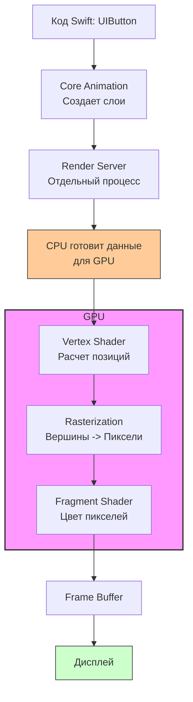

#hardware #graphics #rendering #metal #performance #animation #core-animation

---
## GPU (Graphics Processing Unit)

### Определение
**GPU (Графический процессор)** — это специализированный электронный компонент (чип), предназначенный для быстрой обработки и рендеринга изображений, анимаций и видео. В контексте [[iOS]]-разработки GPU отвечает за то, что пользователь видит на экране: отрисовку [[UIKit]]-элементов (кнопок, лейблов), плавные анимации, эффекты размытия, 3D-игры и обработку видео.

### Архитектура в iPhone (Apple Silicon)
В устройствах Apple (A-серии и M-серии) GPU является частью **SoC (System on Chip)** и имеет общую память с CPU (**Unified Memory Architecture — UMA**). Это ключевое преимущество: CPU и GPU могут быстро обмениваться данными без копирования через шину, что экономит энергию и повышает производительность.

**Пример:**
- **A17 Pro:** 6-ядерный GPU с аппаратным ускорением трассировки лучей (Ray Tracing) и MetalFX Upscaling.
- **M-серия (в iPad Pro):** Графика уровня десктопа (до 10 ядер).

### Зачем это знать iOS-разработчику?
Даже если ты не пишешь игры, GPU участвует в работе твоего приложения постоянно:
1.  **[[UIKit]] и [[SwiftUI]]:** Каждый [[UIView]] рендерится с участием GPU (через Core Animation).
2.  **Анимации:** Плавность `UIView.animate` зависит от того, успевает ли GPU отрисовать кадры за 16.6 мс (60 FPS).
3.  **Сложные интерфейсы:** Коллекции, параллакс-эффекты, [[UIVisualEffectView]] (размытие) — всё это просчитывается на GPU.
4.  **Работа с изображениями и видео:** Фильтры, цветокоррекция, рендеринг.
5.  **Машинное обучение:** Metal Performance Shaders (MPS) позволяют использовать GPU для вычислений ML быстрее, чем CPU.

---

### Основные концепции

#### 1. Рендеринг
Процесс превращения набора данных (вершин, текстур, инструкций) в картинку на экране.

#### 2. Графический конвейер (Graphics Pipeline)
Последовательность шагов, которые GPU выполняет для отрисовки одного кадра. Упрощенно:
1.  **Vertex Processing (Обработка вершин):** Расчет положения точек (вершин) 3D-объекта.
2.  **Rasterization (Растеризация):** Превращение линий и треугольников в пиксели.
3.  **Fragment Processing (Обработка фрагментов/пикселей):** Расчет цвета каждого пикселя с учетом текстур, света, теней.
4.  **Output (Вывод):** Запись пикселей в буфер кадра (framebuffer), который отправляется на дисплей.

#### 3. Frame Rate (Частота кадров)
Скорость смены кадров на экране.
- **60 FPS (16.6 мс на кадр):** Стандарт для плавного интерфейса (iPad, iPhone до ProMotion).
- **120 FPS (8.3 мс на кадр):** ProMotion дисплеи (iPad Pro, iPhone 13 Pro и новее).

#### 4. [[Metal]]
Низкоуровневый [[API]] от Apple для прямого общения с GPU (аналог DirectX/Vulkan). Позволяет разработчику максимально эффективно использовать вычислительные мощности.

---

### Схема работы UIKit → GPU

Как простая кнопка попадает на экран через GPU?



**Объяснение:**
1.  Ты пишешь `button.frame =` [[CGRect]]`(x: 0, y: 0, width: 100, height: 50)`.
2.  Core Animation (CA) создает дерево слоев ([[CALayer]]), представляющих кнопку.
3.  Отдельный системный процесс (Render Server) коммитит эти слои.
4.  CPU подготавливает геометрию (прямоугольник кнопки) и текстуру (шрифт, цвет) и отправляет в GPU.
5.  GPU запускает конвейер, чтобы закрасить нужные пиксели.
6.  Готовый кадр отправляется на дисплей.

---

### Примеры от простого к сложному

#### Уровень 1: Косвенная работа (UIKit)
Ты не пишешь код для GPU напрямую, но любая анимация нагружает его.

```swift
import UIKit

class ViewController: UIViewController {
    
    let animatedView = UIView()
    
    override func viewDidLoad() {
        super.viewDidLoad()
        
        animatedView.frame = CGRect(x: 50, y: 100, width: 100, height: 100)
        animatedView.backgroundColor = .systemRed
        animatedView.layer.cornerRadius = 12 // Скругление тоже требует вычислений на GPU
        view.addSubview(animatedView)
    }
    
    override func viewDidAppear(_ animated: Bool) {
        super.viewDidAppear(animated)
        
        // Простая анимация: каждые 16.6 мс GPU должен перерисовывать положение квадрата
        UIView.animate(withDuration: 1.0, delay: 0, options: [.repeat, .autoreverse]) {
            self.animatedView.frame.origin.x = self.view.bounds.width - 150
        }
    }
}
```
**Роль GPU:** Здесь GPU отвечает за перерисовку кадров анимации. Если бы этот код выполнялся только на CPU, анимация была бы дерганой.

#### Уровень 2: Тяжелая графика (Рисование)
Использование `draw(_:)` или [[UIGraphicsImageRenderer]] заставляет CPU отрисовывать изображение, которое затем отправляется в GPU как текстура. Но лучше использовать готовые слои.

**Пример создания круга с тенью (рендеринг на GPU):**
```swift
class CircleView: UIView {
    
    override init(frame: CGRect) {
        super.init(frame: frame)
        setupLayer()
    }
    
    required init?(coder: NSCoder) {
        super.init(coder: coder)
        setupLayer()
    }
    
    private func setupLayer() {
        // Все эти операции будут выполняться на GPU
        layer.backgroundColor = UIColor.systemBlue.cgColor
        layer.cornerRadius = bounds.width / 2
        layer.shadowColor = UIColor.black.cgColor
        layer.shadowOpacity = 0.5
        layer.shadowOffset = CGSize(width: 0, height: 3)
        layer.shadowRadius = 5
        // ВАЖНО: Для теней GPU нужно знать форму. Если указать shadowPath, это ускорит рендеринг.
        layer.shadowPath = UIBezierPath(ovalIn: bounds).cgPath
    }
}
```

#### Уровень 3: Прямое программирование GPU (Metal)
Это пример для понимания. В реальном проекте для сложной графики используют Metal.

**Задача:** Отрисовать простой треугольник, напрямую обращаясь к GPU.

```swift
// Это УПРОЩЕННАЯ схема, чтобы показать концепцию.
// Полный код Metal включает компиляцию шейдеров, создание буферов и команд.

import MetalKit

class MetalViewController: UIViewController, MTKViewDelegate {
    
    var device: MTLDevice!
    var commandQueue: MTLCommandQueue!
    var pipelineState: MTLRenderPipelineState!
    
    override func viewDidLoad() {
        super.viewDidLoad()
        
        // 1. Получаем ссылку на GPU
        device = MTLCreateSystemDefaultDevice()
        
        // 2. Создаем Metal View
        let mtkView = MTKView(frame: view.bounds, device: device)
        mtkView.delegate = self
        view.addSubview(mtkView)
        
        // 3. Создаем очередь команд (отправка задач в GPU)
        commandQueue = device.makeCommandQueue()
        
        // 4. Загружаем шейдеры (программы для GPU, написанные на Metal Shading Language)
        // ... (компиляция библиотеки)
        
        // 5. Создаем Pipeline State (конфигурация: как рисовать, с какими настройками)
        // pipelineState = ...
    }
    
    // MARK: - MTKViewDelegate
    func draw(in view: MTKView) {
        // Этот метод вызывается 60 раз в секунду
        
        guard let drawable = view.currentDrawable,
              let descriptor = view.currentRenderPassDescriptor else { return }
        
        // Создаем буфер команд для этого кадра
        let commandBuffer = commandQueue.makeCommandBuffer()
        
        // Создаем кодировщик рендера
        let renderEncoder = commandBuffer?.makeRenderCommandEncoder(descriptor: descriptor)
        
        // Говорим GPU: "Используй этот пайплайн"
        renderEncoder?.setRenderPipelineState(pipelineState)
        
        // Говорим GPU: "Нарисуй треугольник" (вершины заданы где-то ранее)
        // renderEncoder?.drawPrimitives(type: .triangle, vertexStart: 0, vertexCount: 3)
        
        renderEncoder?.endEncoding()
        
        // Говорим GPU: "Покажи результат на экране"
        commandBuffer?.present(drawable)
        commandBuffer?.commit()
    }
    
    func mtkView(_ view: MTKView, drawableSizeWillChange size: CGSize) {
        // Обработка изменения размера
    }
}
```
**Суть:** Здесь разработчик берет управление GPU в свои руки, минуя UIKit. Это дает максимальную производительность для игр и сложной визуализации.

#### Уровень 4: GPU и Машинное обучение (Metal Performance Shaders)
GPU отлично подходит для параллельных вычислений. Core ML автоматически использует GPU для инференса нейросетей через Metal.

```swift
import CoreML
import Vision

// Пример: Анализ изображения через нейросеть
func analyzeImageWithGPU(image: UIImage) {
    guard let ciImage = CIImage(image: image) else { return }
    
    // Core ML автоматически направит вычисления в GPU (если модель поддерживает)
    let config = MLModelConfiguration()
    config.computeUnits = .all // Использовать CPU + GPU + Neural Engine
    
    // ... загрузка модели и запрос
}
```

---

### Проблемы производительности GPU (Что может пойти не так)

1.  **Offscreen Rendering (Внеэкранный рендеринг):** Самая частая причина тормозов в UIKit. Возникает, когда GPU вынужден рисовать что-то в промежуточный буфер, а не сразу на экран.
    *   **Триггеры:** `clipsToBounds = true` + `cornerRadius`, наложение масок, `layer.shadowPath` не задан, `groupOpacity`.
    *   **Как чинить:** По возможности использовать `layer.cornerCurve = .continuous` и включать `layer.masksToBounds` только при необходимости. Задавать `shadowPath` вручную.

2.  **Пиксели (Pixel Overdraw):** Когда один пиксель рисуется несколько раз за кадр (например, несколько полупрозрачных вью друг над другом). GPU тратит время на просчет наложений.

3.  **Текстуры слишком большого размера:** Загрузка изображения 4000x4000 в [[UIImageView]] размером 50x50 заставляет GPU масштабировать его каждый кадр. Всегда ресайз изображения под размер вью.

### Итог
**GPU** — это специализированный вычислитель, отвечающий за визуальный вывод твоего приложения. Хороший iOS-разработчик понимает, какие операции "дешевы" для GPU (рисование простых форм, трансформации), а какие "дороги" (тени, размытия, маски), и старается оптимизировать интерфейс, чтобы GPU успевал рисовать 60 (или 120) кадров в секунду.