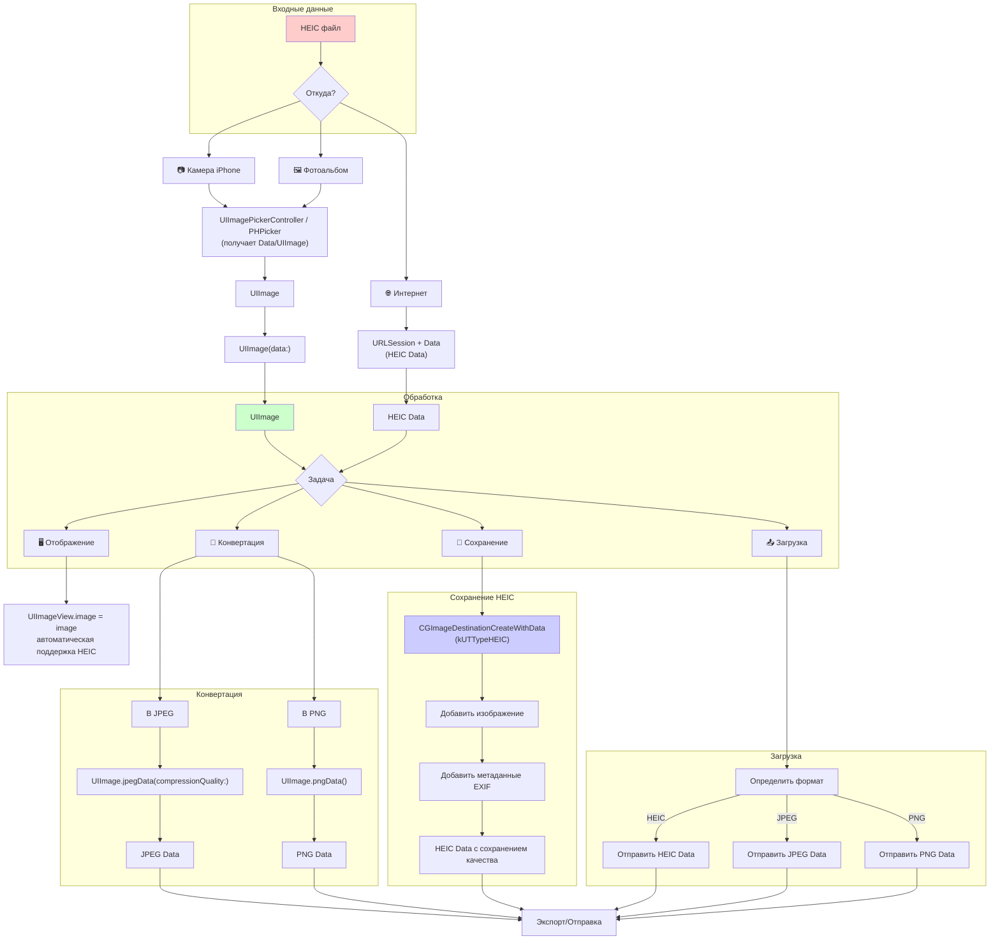

#file-format #images #heic #heif #compression #optimization #imageio #wwdc

---
## HEIC (High Efficiency Image Container)

### Определение
**HEIC (High Efficiency Image Container)** — это современный формат файлов изображений, используемый Apple начиная с iOS 11 и macOS High Sierra. HEIC является контейнером для изображений, сжатых по стандарту **HEIF (High Efficiency Image File Format)**. Это не просто формат, а целая спецификация хранения изображений, которая может содержать несколько картинок (серии фото), Live Photos, глубину резкости (портретный режим) и метаданные .

### Ключевые особенности HEIC для [[iOS]]
1.  **Превосходное сжатие:** HEIC обеспечивает примерно **в 2 раза меньший размер файла** по сравнению с [[JPEG]] при сохранении того же визуального качества .
2.  **Поддержка прозрачности:** В отличие от JPEG, HEIC поддерживает альфа-канал (прозрачность).
3.  **16-битный цвет:** Поддерживает глубину цвета до 16 бит на канал (против 8 бит у JPEG), что важно для HDR-изображений и профессиональной фотографии .
4.  **Множество изображений:** Один HEIC-файл может хранить несколько изображений (например, серию кадров или Live Photo) и карту глубины (портретный режим).
5.  **Нативная поддержка в iOS:** Начиная с iOS 11, Apple предоставляет встроенную поддержку HEIC через фреймворк **ImageIO** и **Core Image** .

### Зачем это знать iOS-разработчику?
1.  **Фотографии пользователей:** Камера iPhone по умолчанию сохраняет снимки в HEIC (если не отключено в настройках).
2.  **Экономия места и трафика:** Использование HEIC для загрузки на сервер или хранения на устройстве позволяет значительно экономить ресурсы.
3.  **Совместимость:** При передаче HEIC-файлов на устройства не от Apple или старые версии iOS требуется конвертация в [[JPEG]]/[[PNG]] .
4.  **Работа с HDR и ProRAW:** HEIC необходим для сохранения HDR-изображений и ProRAW с расширенным динамическим диапазоном .
5.  **Live Photos:** HEIC — единственный формат, который может хранить видео-составляющую Live Photos вместе с фото.

---

### Основные концепции

#### 1. HEIC vs HEIF
- **HEIF (High Efficiency Image File Format):** Стандарт сжатия (кодек), разработанный MPEG. Определяет, как сжимается изображение.
- **HEIC (High Efficiency Image Container):** Файловый контейнер от Apple, использующий HEIF-сжатие. Фактически, это "обертка" вокруг HEIF-данных.

#### 2. HEIC vs JPEG
| Характеристика | HEIC | JPEG |
|---|---|---|
| **Сжатие** | Современное, эффективное | Устаревшее |
| **Размер файла** | В 2 раза меньше | Больше |
| **Прозрачность** | Да | Нет |
| **Глубина цвета** | 8/10/16 бит | 8 бит |
| **Поддержка на iOS** | iOS 11+ | Все версии |
| **Поддержка на других платформах** | Ограничена (требует конвертации) | Повсеместно |
| **Live Photos** | Да | Нет |
| **Глубина (Portrait mode)** | Да | Нет |

#### 3. ImageIO Framework
Основной фреймворк для работы с HEIC в iOS. Позволяет читать и писать HEIC-файлы через [[CGImageDestination]] и [[CGImageSource]] .

#### 4. Аппаратная поддержка
Декодирование HEIC поддерживается на всех устройствах с iOS 11, но аппаратное ускорение кодирования доступно только на чипах **A10 Fusion и новее** (iPhone 7 и выше) .

---

### Схема работы с HEIC в iOS



---

### Примеры от простого к сложному

#### Уровень 0: Проверка поддержки HEIC на устройстве
Прежде чем работать с HEIC, нужно проверить, поддерживает ли устройство кодирование в этот формат .

```swift
import UIKit
import MobileCoreServices
import UniformTypeIdentifiers

extension UIImage {
    /// Проверяет, поддерживает ли устройство кодирование в HEIC
    static var isHeicSupported: Bool {
        // Получаем список поддерживаемых типов
        guard let types = CGImageDestinationCopyTypeIdentifiers() as? [String] else {
            return false
        }
        
        // Проверяем наличие HEIC
        if #available(iOS 14.0, *) {
            return types.contains(UTType.heic.identifier)
        } else {
            return types.contains("public.heic")
        }
    }
}

// Использование:
print("HEIC supported: \(UIImage.isHeicSupported)")
```

#### Уровень 1: Загрузка и отображение HEIC из фотоальбома

```swift
import UIKit
import PhotosUI

class HEICDisplayViewController: UIViewController, PHPickerViewControllerDelegate {
    
    @IBOutlet weak var imageView: UIImageView!
    
    @IBAction func selectPhotoTapped() {
        var config = PHPickerConfiguration()
        config.filter = .images // Выбираем только изображения
        config.selectionLimit = 1
        
        let picker = PHPickerViewController(configuration: config)
        picker.delegate = self
        present(picker, animated: true)
    }
    
    // MARK: - PHPickerViewControllerDelegate
    func picker(_ picker: PHPickerViewController, didFinishPicking results: [PHPickerResult]) {
        picker.dismiss(animated: true)
        
        guard let result = results.first else { return }
        
        // Загружаем изображение (HEIC будет автоматически конвертирован в UIImage)
        result.itemProvider.loadObject(ofClass: UIImage.self) { [weak self] object, error in
            guard let self = self,
                  let image = object as? UIImage,
                  error == nil else {
                return
            }
            
            DispatchQueue.main.async {
                self.imageView.image = image
            }
        }
    }
}
```

#### Уровень 2: Конвертация HEIC в JPEG (самый частый сценарий)

```swift
import UIKit

extension UIImage {
    /// Конвертирует HEIC-данные в JPEG
    /// - Parameters:
    ///   - heicData: Входные данные HEIC
    ///   - compressionQuality: Качество JPEG (0.0 - 1.0)
    /// - Returns: Данные JPEG или nil
    static func convertHeicToJpeg(heicData: Data, compressionQuality: CGFloat = 0.8) -> Data? {
        // 1. Создаем UIImage из HEIC-данных
        guard let image = UIImage(data: heicData) else {
            print("Не удалось создать UIImage из HEIC данных")
            return nil
        }
        
        // 2. Конвертируем в JPEG
        guard let jpegData = image.jpegData(compressionQuality: compressionQuality) else {
            print("Не удалось конвертировать в JPEG")
            return nil
        }
        
        return jpegData
    }
    
    /// Конвертирует HEIC-файл в JPEG-файл
    /// - Parameters:
    ///   - heicURL: URL HEIC-файла
    ///   - jpegURL: URL для сохранения JPEG
    ///   - compressionQuality: Качество JPEG
    /// - Returns: Успешность операции
    static func convertHeicFileToJpeg(heicURL: URL, jpegURL: URL, compressionQuality: CGFloat = 0.8) -> Bool {
        do {
            let heicData = try Data(contentsOf: heicURL)
            
            guard let jpegData = convertHeicToJpeg(heicData: heicData, compressionQuality: compressionQuality) else {
                return false
            }
            
            try jpegData.write(to: jpegURL)
            return true
        } catch {
            print("Ошибка конвертации: \(error)")
            return false
        }
    }
}

// Использование:
class ConversionViewController: UIViewController {
    
    func handleSelectedHEIC(heicData: Data) {
        if let jpegData = UIImage.convertHeicToJpeg(heicData: heicData, compressionQuality: 0.7) {
            // Отправляем JPEG на сервер или сохраняем
            print("JPEG размер: \(jpegData.count / 1024) KB")
        }
    }
}
```

#### Уровень 3: Сохранение [[UIImage]] в HEIC (кодирование)

```swift
import UIKit
import ImageIO
import MobileCoreServices

extension UIImage {
    /// Создает HEIC-данные из UIImage
    /// - Parameter compressionQuality: Качество сжатия (0.0 - 1.0)
    /// - Returns: HEIC-данные или nil
    func heicData(compressionQuality: CGFloat = 1.0) -> Data? {
        // 1. Проверяем, есть ли CGImage
        guard let cgImage = self.cgImage else {
            print("UIImage не имеет CGImage")
            return nil
        }
        
        // 2. Создаем изменяемый буфер данных
        let mutableData = NSMutableData()
        
        // 3. Определяем UTI для HEIC
        let heicUTI: CFString
        if #available(iOS 14.0, *) {
            heicUTI = UTType.heic.identifier as CFString
        } else {
            heicUTI = "public.heic" as CFString
        }
        
        // 4. Создаем CGImageDestination
        guard let destination = CGImageDestinationCreateWithData(mutableData, heicUTI, 1, nil) else {
            print("Не удалось создать CGImageDestination")
            return nil
        }
        
        // 5. Настраиваем параметры сжатия
        let options: [CFString: Any] = [
            kCGImageDestinationLossyCompressionQuality: compressionQuality,
            kCGImagePropertyOrientation: self.cgImageOrientation.rawValue
        ]
        
        // 6. Добавляем изображение и финализируем
        CGImageDestinationAddImage(destination, cgImage, options as CFDictionary)
        
        guard CGImageDestinationFinalize(destination) else {
            print("Не удалось финализировать HEIC")
            return nil
        }
        
        return mutableData as Data
    }
    
    /// Ориентация CGImagePropertyOrientation из UIImage.Orientation
    var cgImageOrientation: CGImagePropertyOrientation {
        switch self.imageOrientation {
        case .up: return .up
        case .down: return .down
        case .left: return .left
        case .right: return .right
        case .upMirrored: return .upMirrored
        case .downMirrored: return .downMirrored
        case .leftMirrored: return .leftMirrored
        case .rightMirrored: return .rightMirrored
        @unknown default: return .up
        }
    }
}

// Использование:
class HEICSaveViewController: UIViewController {
    
    @IBOutlet weak var imageView: UIImageView!
    
    @IBAction func saveAsHEICTapped() {
        guard let image = imageView.image else { return }
        
        // Проверяем поддержку HEIC
        guard UIImage.isHeicSupported else {
            print("Устройство не поддерживает HEIC")
            return
        }
        
        // Создаем HEIC-данные
        if let heicData = image.heicData(compressionQuality: 0.8) {
            let sizeKB = heicData.count / 1024
            print("HEIC размер: \(sizeKB) KB")
            
            // Сохраняем в файл
            let filename = FileManager.default.temporaryDirectory
                .appendingPathComponent("image_\(Date().timeIntervalSince1970).heic")
            
            do {
                try heicData.write(to: filename)
                print("HEIC сохранен: \(filename)")
                
                // Показываем Share Sheet
                let activityVC = UIActivityViewController(activityItems: [filename], applicationActivities: nil)
                present(activityVC, animated: true)
            } catch {
                print("Ошибка сохранения: \(error)")
            }
        }
    }
}
```

#### Уровень 4: Сравнение размера HEIC vs [[JPEG]]

```swift
import UIKit

class HEICvsJPEGViewController: UIViewController {
    
    @IBOutlet weak var imageView: UIImageView!
    @IBOutlet weak var infoLabel: UILabel!
    
    @IBAction func compareTapped() {
        guard let image = imageView.image else { return }
        
        // Получаем JPEG
        let jpegData = image.jpegData(compressionQuality: 0.8)!
        let jpegSizeKB = jpegData.count / 1024
        
        // Получаем HEIC (если поддерживается)
        var heicInfo = "HEIC не поддерживается"
        var heicSizeKB = 0
        
        if UIImage.isHeicSupported {
            if let heicData = image.heicData(compressionQuality: 0.8) {
                heicSizeKB = heicData.count / 1024
                let savings = 100 - (Double(heicSizeKB) / Double(jpegSizeKB) * 100)
                heicInfo = String(format: "HEIC: %d KB (экономия %.0f%%)", heicSizeKB, savings)
            }
        }
        
        infoLabel.text = """
        JPEG: \(jpegSizeKB) KB
        \(heicInfo)
        """
    }
}
```

#### Уровень 5: Работа с HEIC и HDR (ProRAW to HEIC)

```swift
import UIKit
import CoreImage
import Photos

class HDRHEICViewController: UIViewController {
    
    let context = CIContext()
    let hdrColorSpace = CGColorSpace(name: CGColorSpace.itur_2100_PQ)!
    
    /// Сохраняет HDR-изображение как HEIC в фотоальбом
    func saveHDRImageAsHEIC(ciImage: CIImage) {
        do {
            // Создаем HEIC-представление с HDR-цветовым пространством
            let heicData = try context.heif10Representation(of: ciImage,
                                                            colorSpace: hdrColorSpace,
                                                            options: [:])
            
            // Сохраняем в фотоальбом
            PHPhotoLibrary.shared().performChanges({
                let creationRequest = PHAssetCreationRequest.forAsset()
                let options = PHAssetResourceCreationOptions()
                creationRequest.addResource(with: .photo, data: heicData, options: options)
            }) { success, error in
                if let error = error {
                    print("Ошибка сохранения HDR HEIC: \(error)")
                } else {
                    print("HDR HEIC успешно сохранен")
                }
            }
        } catch {
            print("Ошибка создания HEIC: \(error)")
        }
    }
}
```

#### Уровень 6: Извлечение метаданных и глубины из HEIC

```swift
import UIKit
import ImageIO
import CoreImage

extension UIImage {
    /// Извлекает карту глубины из HEIC (портретный режим)
    func extractDepthMap() -> CIImage? {
        guard let cgImage = self.cgImage else { return nil }
        
        // Создаем источник из CGImage
        let ciImage = CIImage(cgImage: cgImage)
        
        // Получаем вспомогательные изображения (auxiliary images)
        let auxiliaryType = kCGImageAuxiliaryDataTypeDisparity
            ?? "com.apple.auxdata.disparity" as CFString
        
        if let depthData = ciImage.auxiliaryImageData?[auxiliaryType] {
            return CIImage(auxiliaryImageData: depthData)
        }
        
        return nil
    }
    
    /// Извлекает метаданные EXIF из HEIC
    func extractMetadata() -> [String: Any]? {
        guard let imageData = self.heicData() ?? self.jpegData(compressionQuality: 1.0) else {
            return nil
        }
        
        guard let source = CGImageSourceCreateWithData(imageData as CFData, nil) else {
            return nil
        }
        
        guard let metadata = CGImageSourceCopyPropertiesAtIndex(source, 0, nil) as? [String: Any] else {
            return nil
        }
        
        return metadata
    }
}

// Использование:
class DepthMapViewController: UIViewController {
    
    @IBOutlet weak var imageView: UIImageView!
    
    func loadPortraitHEIC(image: UIImage) {
        imageView.image = image
        
        if let depthMap = image.extractDepthMap() {
            print("Найдена карта глубины!")
            // Можно применить эффекты размытия на основе глубины
        }
        
        if let metadata = image.extractMetadata() {
            print("Метаданные: \(metadata)")
        }
    }
}
```

#### Уровень 7: Пакетная конвертация HEIC в JPEG с прогрессом

```swift
import UIKit

class BatchHEICConverter {
    
    typealias ProgressHandler = (Float) -> Void
    typealias CompletionHandler = ([URL]) -> Void
    
    /// Конвертирует все HEIC-файлы в папке в JPEG
    static func convertAllHEICInFolder(folderURL: URL,
                                        compressionQuality: CGFloat = 0.8,
                                        progress: ProgressHandler? = nil,
                                        completion: CompletionHandler? = nil) {
        DispatchQueue.global(qos: .userInitiated).async {
            var convertedURLs: [URL] = []
            
            do {
                let files = try FileManager.default.contentsOfDirectory(at: folderURL,
                                                                         includingPropertiesForKeys: nil)
                
                let heicFiles = files.filter { $0.pathExtension.lowercased() == "heic" }
                let total = heicFiles.count
                
                for (index, heicURL) in heicFiles.enumerated() {
                    let jpegURL = heicURL.deletingPathExtension().appendingPathExtension("jpg")
                    
                    let success = UIImage.convertHeicFileToJpeg(heicURL: heicURL,
                                                                jpegURL: jpegURL,
                                                                compressionQuality: compressionQuality)
                    if success {
                        convertedURLs.append(jpegURL)
                    }
                    
                    // Сообщаем прогресс
                    let progressValue = Float(index + 1) / Float(total)
                    DispatchQueue.main.async {
                        progress?(progressValue)
                    }
                }
                
                DispatchQueue.main.async {
                    completion?(convertedURLs)
                }
                
            } catch {
                print("Ошибка чтения папки: \(error)")
                DispatchQueue.main.async {
                    completion?([])
                }
            }
        }
    }
}

// Использование в контроллере:
class BatchConversionViewController: UIViewController {
    
    @IBOutlet weak var progressView: UIProgressView!
    @IBOutlet weak var statusLabel: UILabel!
    
    @IBAction func startConversionTapped() {
        let documentsURL = FileManager.default.urls(for: .documentDirectory, in: .userDomainMask).first!
        
        statusLabel.text = "Конвертация..."
        progressView.progress = 0
        
        BatchHEICConverter.convertAllHEICInFolder(folderURL: documentsURL,
                                                   compressionQuality: 0.7,
                                                   progress: { [weak self] progress in
            self?.progressView.progress = progress
        }, completion: { [weak self] urls in
            self?.statusLabel.text = "Готово! \(urls.count) файлов конвертировано"
        })
    }
}
```

---

### Практические рекомендации

| Сценарий                         | Рекомендация                                              |
| -------------------------------- | --------------------------------------------------------- |
| **Загрузка на сервер**           | Конвертировать HEIC в JPEG для совместимости              |
| **Хранение на устройстве**       | Оставлять HEIC (экономия места в 2 раза)                  |
| **Передача на другие платформы** | Конвертировать в [[JPEG]]/[[PNG]]                         |
| **Отображение в UI**             | UIImage автоматически работает с HEIC                     |
| **Сохранение в фотоальбом**      | Использовать HEIC для сохранения метаданных и Live Photos |
| **HDR-контент**                  | Обязательно HEIC (JPEG не поддерживает HDR)               |

---

### Важные нюансы и Best Practices

#### 1. **Совместимость с HEIC**
- **iOS 11+:** Полная поддержка .
- **macOS 10.13+:** Полная поддержка.
- **Windows / Android:** Требуется конвертация или установка кодеков .

#### 2. **Производительность и память**
- Кодирование в HEIC требует больше вычислительных ресурсов, чем [[JPEG]].
- Используй фоновые очереди для конвертации, чтобы не блокировать UI.
- Аппаратное ускорение доступно на A10+ .

#### 3. **Ориентация изображения**
HEIC сохраняет ориентацию через метаданные, а не поворотом пикселей. При конвертации важно передавать `kCGImagePropertyOrientation` .

#### 4. **Анимированные HEIC**
Начиная с iOS 13, поддерживаются анимированные HEIC (серии изображений). UTI для них — `public.heics` .

#### 5. **HEIC в Assets.xcassets**
Xcode **не поддерживает** прямую вставку HEIC в ассеты. Для статических ресурсов используй [[PDF]] (вектор) или [[PNG]]/[[JPEG]].

#### 6. **ProRAW и HDR**
Для работы с ProRAW (DNG) и сохранения в HDR HEIC используй `CIRAWFilter` и `CIContext.heif10Representation()` .

#### 7. **Альтернативные библиотеки**
Если нужна расширенная функциональность, можно использовать сторонние библиотеки, но встроенный `ImageIO` покрывает 99% потребностей .

### Итог
**HEIC** — современный, эффективный и мощный формат изображений, который является стандартом для экосистемы Apple. Понимание его возможностей (сжатие, прозрачность, HDR, глубина) и умение конвертировать его в другие форматы для обеспечения совместимости — важный навык iOS-разработчика. Используй встроенный фреймворк **ImageIO** для кодирования/декодирования HEIC, проверяй поддержку через `CGImageDestinationCopyTypeIdentifiers()` и не забывай про ориентацию изображения .