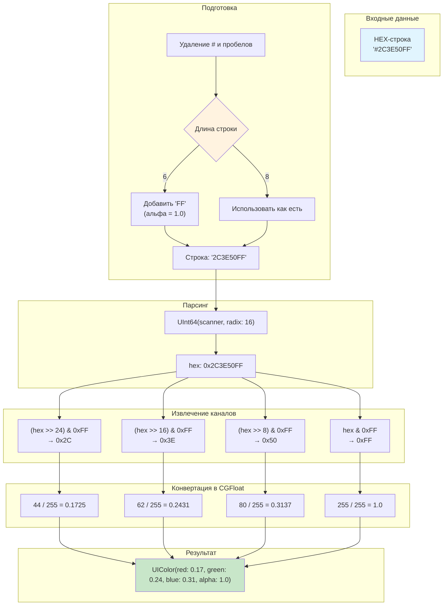

#ui #colors #design #uikit #extensions #hex #rgba

---

## HEX (Шестнадцатеричное представление цвета)

### Определение
**HEX (Hex triplet)** — это способ представления цвета в шестнадцатеричной системе счисления, широко используемый в веб-дизайне и графических редакторах ([[Figma]], [[Sketch]], Adobe XD). В контексте iOS-разработки HEX — это формат, в котором дизайнеры обычно передают цвета разработчикам. Строка вида `#RRGGBB` или `#RRGGBBAA`, где:
- **RR** — красный канал (Red) от 00 до FF (0-255 в десятичной).
- **GG** — зеленый канал (Green).
- **BB** — синий канал (Blue).
- **AA** (опционально) — альфа-канал (прозрачность).

### Зачем это знать iOS-разработчику?
[[UIKit]] по умолчанию работает с цветами через [[UIColor]], который использует компоненты [[CGFloat]] в диапазоне 0.0-1.0. Дизайнеры же почти всегда дают цвета в HEX (например, `#2C3E50` для темно-синего). Поэтому умение конвертировать HEX в `UIColor` — базовый навык.

**Сценарии использования:**
1.  Перенос цветовой палитры из Figma в код.
2.  Работа с цветами, приходящими с сервера (иногда бэкенд отдает цвета в HEX).
3.  Динамическая смена цвета элементов по строке.

---

### Основные концепции

#### 1. Структура HEX
- **#RGB** (сокращенный, например `#F00` = красный) — редко используется в нативной разработке.
- **#RRGGBB** (стандартный, без прозрачности, например `#FF5733`).
- **#RRGGBBAA** (с прозрачностью, например `#FF573380` — полупрозрачный).

#### 2. Связь с Float (0.0-1.0)
Цветовые компоненты в `UIColor` задаются как `CGFloat` от 0.0 до 1.0.
**Формула перевода:** `Float значение = HEX значение (0-255) / 255.0`
- HEX `FF` (255) → `1.0`
- HEX `80` (128) → `128/255 ≈ 0.5`
- HEX `00` (0) → `0.0`

#### 3. Color Space (Цветовое пространство)
HEX обычно подразумевает цветовое пространство **sRGB**. При создании `UIColor` из HEX важно указать правильное пространство, чтобы цвета выглядели так же, как в Figma (обычно это sRGB или Display P3 для современных устройств).

---

### Схема конвертации HEX -> UIColor



---

### Примеры от простого к сложному

#### Уровень 1: Ручное создание UIColor из HEX (без расширения)
Самый простой и понятный способ — посчитать значения вручную или через калькулятор.

```swift
import UIKit

// HEX #3498db (ярко-синий)
// 0x34 = 52, 0x98 = 152, 0xdb = 219

let red = CGFloat(0x34) / 255.0      // 52/255 ≈ 0.204
let green = CGFloat(0x98) / 255.0     // 152/255 ≈ 0.596
let blue = CGFloat(0xdb) / 255.0      // 219/255 ≈ 0.859

let myColor = UIColor(red: red, green: green, blue: blue, alpha: 1.0)

// Применение
let view = UIView()
view.backgroundColor = myColor
```
**Минусы:** Очень неудобно, нужно каждый раз считать.

#### Уровень 2: Базовое расширение UIColor (HEX 6 символов)
Создаем extension для UIColor, который принимает HEX-строку.

```swift
import UIKit

extension UIColor {
    /// Создает UIColor из HEX-строки (формат: "RRGGBB")
    convenience init(hex: String) {
        var hexString = hex.trimmingCharacters(in: .whitespacesAndNewlines)
        hexString = hexString.replacingOccurrences(of: "#", with: "")
        
        // Сканируем строку в 64-битное число
        var int: UInt64 = 0
        Scanner(string: hexString).scanHexInt64(&int)
        
        // Извлекаем компоненты
        let red = CGFloat((int >> 16) & 0xFF) / 255.0
        let green = CGFloat((int >> 8) & 0xFF) / 255.0
        let blue = CGFloat(int & 0xFF) / 255.0
        
        self.init(red: red, green: green, blue: blue, alpha: 1.0)
    }
}

// Использование:
let buttonColor = UIColor(hex: "#3498db")
label.textColor = UIColor(hex: "2C3E50") // Можно и без решетки
```

#### Уровень 3: Продвинутое расширение (с альфа-каналом и обработкой ошибок)
Добавляем поддержку 8-значного HEX (с прозрачностью) и безопасность.

```swift
import UIKit

extension UIColor {
    /// Создает UIColor из HEX-строки с поддержкой альфа-канала
    /// - Parameter hex: HEX строка вида "#RGB", "#RRGGBB", "#RRGGBBAA" или без #
    convenience init?(hex: String) {
        var hexString = hex.trimmingCharacters(in: .whitespacesAndNewlines)
        hexString = hexString.replacingOccurrences(of: "#", with: "")
        
        let length = hexString.count
        
        // Проверяем корректность длины
        guard length == 3 || length == 6 || length == 8 else {
            return nil
        }
        
        // Дополняем до 8 символов (RGBA)
        if length == 3 {
            // #RGB -> #RRGGBBFF
            let r = hexString[hexString.startIndex]
            let g = hexString[hexString.index(hexString.startIndex, offsetBy: 1)]
            let b = hexString[hexString.index(hexString.startIndex, offsetBy: 2)]
            hexString = "\(r)\(r)\(g)\(g)\(b)\(b)FF"
        } else if length == 6 {
            // #RRGGBB -> #RRGGBBFF
            hexString += "FF"
        }
        // Если length == 8, оставляем как есть
        
        var int: UInt64 = 0
        guard Scanner(string: hexString).scanHexInt64(&int) else {
            return nil
        }
        
        let red = CGFloat((int >> 24) & 0xFF) / 255.0
        let green = CGFloat((int >> 16) & 0xFF) / 255.0
        let blue = CGFloat((int >> 8) & 0xFF) / 255.0
        let alpha = CGFloat(int & 0xFF) / 255.0
        
        self.init(red: red, green: green, blue: blue, alpha: alpha)
    }
}

// Использование:
if let semiTransparent = UIColor(hex: "#FF573380") { // 50% прозрачности
    view.backgroundColor = semiTransparent
}

if let red = UIColor(hex: "F00") { // Красный через сокращенную форму
    label.textColor = red
}
```

#### Уровень 4: Интеграция с Asset Catalog и статические переменные
Лучшая практика — создать enum с цветами проекта, чтобы не разбрасывать HEX по коду.

```swift
import UIKit

// 1. Определяем палитру проекта (берем из Figma)
extension UIColor {
    // MARK: - Brand Colors
    static let brandPrimary = UIColor(hex: "#2C3E50")!
    static let brandSecondary = UIColor(hex: "#E74C3C")!
    static let brandAccent = UIColor(hex: "#3498DB")!
    
    // MARK: - Semantic Colors
    static let successGreen = UIColor(hex: "#27AE60")!
    static let warningYellow = UIColor(hex: "#F39C12")!
    static let errorRed = UIColor(hex: "#C0392B")!
    
    // MARK: - Grayscale
    static let gray100 = UIColor(hex: "#F8F9FA")!
    static let gray200 = UIColor(hex: "#E9ECEF")!
    static let gray900 = UIColor(hex: "#212529")!
}

// 2. Использование в коде
class WelcomeViewController: UIViewController {
    
    let titleLabel = UILabel()
    let actionButton = UIButton()
    
    override func viewDidLoad() {
        super.viewDidLoad()
        
        view.backgroundColor = .gray100
        
        titleLabel.textColor = .gray900
        titleLabel.font = UIFont.boldSystemFont(ofSize: 24)
        
        actionButton.backgroundColor = .brandPrimary
        actionButton.setTitleColor(.white, for: .normal)
        actionButton.layer.cornerRadius = 8
    }
}
```

#### Уровень 5: Работа с HEX, приходящим с сервера
Представим, что сервер присылает цвет темы в HEX.

```swift
struct ThemeSettings: Decodable {
    let primaryColorHex: String
    let backgroundColorHex: String
    let opacity: Double // 0.0-1.0
}

class ThemeManager {
    
    static func applyTheme(_ settings: ThemeSettings) {
        // Сервер может прислать как "#FF5733", так и "FF5733"
        if let primaryColor = UIColor(hex: settings.primaryColorHex)?.withAlphaComponent(settings.opacity) {
            applyPrimaryColor(primaryColor)
        }
        
        if let backgroundColor = UIColor(hex: settings.backgroundColorHex) {
            applyBackgroundColor(backgroundColor)
        }
    }
    
    private static func applyPrimaryColor(_ color: UIColor) {
        // Меняем цвет всех кнопок, переключателей и т.д.
        UIButton.appearance().backgroundColor = color
        UISwitch.appearance().onTintColor = color
    }
    
    private static func applyBackgroundColor(_ color: UIColor) {
        UIWindow.appearance().backgroundColor = color
    }
}

// Где-то в сетевом слое:
// let settings = try JSONDecoder().decode(ThemeSettings.self, from: data)
// ThemeManager.applyTheme(settings)
```

---

### Важные нюансы и best practices

1.  **Цветовое пространство (Color Space):**
    По умолчанию `UIColor(red:green:blue:alpha:)` создает цвет в **sRGB**. Это то, что нужно в 99% случаев. Если дизайнер использует широкий цветовой охват (Display P3), HEX не подойдет — нужно использовать `UIColor(displayP3Red:green:blue:alpha:)`.

2.  **Производительность:**
    Не вызывайте `UIColor(hex: "...")` в методах, которые вызываются часто (например, `cellForRowAt`). Лучше создать статические константы один раз (как в Уровне 4).

3.  **Темная тема (Dark Mode):**
    HEX не поддерживает адаптацию к темной теме. Для этого используйте `UIColor` с `traitCollection` или задавайте цвета в `Assets.xcassets` с вариантами для Light и Dark Appearance.

4.  **[[UIColor]] vs [[CGColor]]:**
    Помни, что `UIColor` — это высокоуровневый объект UIKit. Для работы с Core Graphics/CALayer нужно использовать `color.cgColor`.

5.  **Previews ([[SwiftUI]]):**
    В SwiftUI Preview можно использовать HEX через extension, аналогичный UIKit.

```swift
// Пример для SwiftUI (если нужно)
import SwiftUI

extension Color {
    init(hex: String) {
        let uiColor = UIColor(hex: hex) ?? .clear
        self.init(uiColor: uiColor)
    }
}

// Использование в SwiftUI:
// Text("Hello").foregroundColor(Color(hex: "#2C3E50"))
```

### Итог
**HEX** — это мост между дизайном (Figma) и кодом (Swift). Умение правильно парсить HEX и организовывать цветовую палитру проекта — признак хорошего тона в iOS-разработке. Используйте статические расширения и храните все цвета в одном месте для легкой поддержки и изменений дизайна.