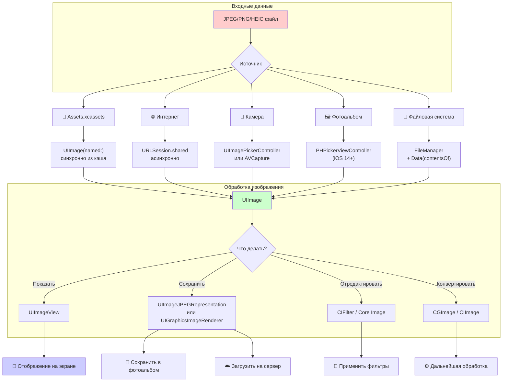

#file-format #images #graphics #jpeg #jpg #compression #optimization #ui

---

## JPEG / JPG (Joint Photographic Experts Group)

### Определение
**JPEG (Joint Photographic Experts Group)** — это самый популярный формат сжатия изображений с потерями качества (lossy compression). Файлы обычно имеют расширения `.jpg` или `.jpeg`. В контексте [[iOS]]-разработки JPEG используется для хранения и отображения фотографий, изображений с плавными переходами цветов и любого контента, где допустима некоторая потеря качества в обмен на малый размер файла.

### Ключевые особенности JPEG для iOS
1.  **Сжатие с потерями:** Позволяет регулировать степень сжатия (качество) от 0% (максимальное сжатие, низкое качество) до 100% (минимальное сжатие, высокое качество).
2.  **24-битный цвет:** Поддерживает до 16.7 миллионов цветов — идеально для фотографий.
3.  **Отсутствие прозрачности:** JPEG не поддерживает альфа-канал (прозрачность).
4.  **Экспоненциальный размер:** Размер файла растет нелинейно с увеличением качества.

### Зачем это знать iOS-разработчику?
1.  **Фотографии пользователей:** Камера iPhone сохраняет снимки в формате [[HEIC]] или JPEG.
2.  **Загрузка с сервера:** Большинство изображений в интернете — JPEG.
3.  **Оптимизация трафика:** JPEG позволяет уменьшить размер передаваемых данных.
4.  **Сохранение изображений:** При экспорте или шаринге изображений из приложения.
5.  **Профилирование памяти:** JPEG-изображения распаковываются в памяти в сырой битмап (raw bitmap), что важно учитывать.

---

### Основные концепции

#### 1. Сжатие с потерями (Lossy Compression)
Алгоритм JPEG анализирует изображение и отбрасывает информацию, которую человеческий глаз хуже различает (высокочастотные детали). Это позволяет сильно уменьшить размер файла.

#### 2. Качество (Quality Factor)
Параметр от 0.0 до 1.0 (или от 0 до 100), который регулирует степень сжатия:
- **0.0 (0%)** — максимальное сжатие, минимальное качество (сильные артефакты).
- **0.5 (50%)** — среднее качество, приемлемое для многих задач.
- **0.8 (80%)** — хорошее качество, баланс размера и качества.
- **1.0 (100%)** — минимальное сжатие, максимальное качество (фактически без потерь).

#### 3. Артефакты сжатия
При сильном сжатии появляются характерные дефекты: блоки, "муар", размытие резких границ.

#### 4. Прогрессивный JPEG
Вариант формата, при котором изображение загружается постепенно: сначала низкое качество, затем уточняется. Полезно для медленных соединений.

#### 5. EXIF-данные
JPEG-файлы содержат метаданные: дата съемки, модель камеры, ориентация, GPS-координаты. В iOS их можно читать и изменять через `ImageIO`.

---

### Сравнение форматов для iOS

| Характеристика      | JPEG                   | [[PNG]]                 | [[HEIC]] (HEIF)      |
| ------------------- | ---------------------- | ----------------------- | -------------------- |
| **Сжатие**          | С потерями             | Без потерь              | С/без потерь         |
| **Прозрачность**    | Нет                    | Да                      | Да                   |
| **Фотографии**      | Отлично (малый размер) | Плохо (огромный размер) | Отлично (лучше JPEG) |
| **Графика/Текст**   | Плохо (артефакты)      | Отлично                 | Средне               |
| **Размер файла**    | Маленький              | Большой                 | Очень маленький      |
| **Поддержка в iOS** | Полная                 | Полная                  | iOS 11+              |

---

### Схема работы с JPEG в iOS



---

### Примеры от простого к сложному

#### Уровень 0: JPEG в Assets.xcassets
Xcode отлично работает с JPEG-изображениями в `Assets.xcassets`.

```swift
import UIKit

class SimpleJPEGViewController: UIViewController {
    
    let imageView = UIImageView()
    
    override func viewDidLoad() {
        super.viewDidLoad()
        
        // JPEG из Assets (например, "background_photo.jpg")
        imageView.image = UIImage(named: "background_photo")
        imageView.contentMode = .scaleAspectFill
        imageView.frame = view.bounds
        imageView.clipsToBounds = true
        
        view.addSubview(imageView)
    }
}
```

#### Уровень 1: Загрузка JPEG из интернета

```swift
import UIKit

class NetworkJPEGViewController: UIViewController {
    
    let imageView = UIImageView()
    let activityIndicator = UIActivityIndicatorView(style: .large)
    
    override func viewDidLoad() {
        super.viewDidLoad()
        
        setupUI()
        loadJPEGFromURL()
    }
    
    private func setupUI() {
        imageView.frame = view.bounds
        imageView.contentMode = .scaleAspectFit
        view.addSubview(imageView)
        
        activityIndicator.center = view.center
        activityIndicator.hidesWhenStopped = true
        view.addSubview(activityIndicator)
    }
    
    private func loadJPEGFromURL() {
        activityIndicator.startAnimating()
        
        let urlString = "https://images.unsplash.com/photo-1506905925346-21bda4d32df4?w=1200"
        guard let url = URL(string: urlString) else { return }
        
        let task = URLSession.shared.dataTask(with: url) { [weak self] data, response, error in
            guard let self = self,
                  let data = data,
                  let image = UIImage(data: data), // JPEG автоматически распознается
                  error == nil else {
                return
            }
            
            DispatchQueue.main.async {
                self.activityIndicator.stopAnimating()
                self.imageView.image = image
            }
        }
        
        task.resume()
    }
}
```

#### Уровень 2: Конвертация [[UIImage]] в JPEG [[Data]] (сжатие и сохранение)

```swift
import UIKit

class JPEGExportViewController: UIViewController {
    
    @IBOutlet weak var imageView: UIImageView!
    @IBOutlet weak var qualitySlider: UISlider!
    @IBOutlet weak var sizeLabel: UILabel!
    
    override func viewDidLoad() {
        super.viewDidLoad()
        qualitySlider.value = 0.8 // 80% качества
    }
    
    @IBAction func saveJPEGTapped() {
        guard let image = imageView.image else { return }
        
        let quality = CGFloat(qualitySlider.value)
        
        // 1. Конвертируем UIImage в JPEG Data с заданным качеством
        if let jpegData = image.jpegData(compressionQuality: quality) {
            
            // 2. Выводим размер файла
            let sizeKB = Double(jpegData.count) / 1024.0
            sizeLabel.text = String(format: "Размер: %.1f KB (качество: %.0f%%)", sizeKB, quality * 100)
            
            // 3. Сохраняем во временный файл
            let filename = FileManager.default.temporaryDirectory
                .appendingPathComponent("exported_image_\(Date().timeIntervalSince1970).jpg")
            
            do {
                try jpegData.write(to: filename)
                print("JPEG сохранен: \(filename)")
                
                // 4. Показываем Share Sheet
                let activityVC = UIActivityViewController(activityItems: [filename], 
                                                         applicationActivities: nil)
                present(activityVC, animated: true)
                
            } catch {
                print("Ошибка сохранения: \(error)")
            }
        }
    }
    
    @IBAction func qualityChanged(_ sender: UISlider) {
        // Можно добавить превью с текущим качеством
        updatePreview()
    }
    
    private func updatePreview() {
        guard let image = imageView.image else { return }
        let quality = CGFloat(qualitySlider.value)
        
        if let jpegData = image.jpegData(compressionQuality: quality),
           let compressedImage = UIImage(data: jpegData) {
            // Показываем сжатое изображение
            imageView.image = compressedImage
            
            // Возвращаем оригинал через секунду для демонстрации
            DispatchQueue.main.asyncAfter(deadline: .now() + 1.5) {
                self.imageView.image = image
            }
        }
    }
}
```

#### Уровень 3: Сравнение качества JPEG (визуализация артефактов)

```swift
import UIKit

class JPEGComparisonViewController: UIViewController {
    
    @IBOutlet weak var originalImageView: UIImageView!
    @IBOutlet weak var compressedImageView: UIImageView!
    @IBOutlet weak var qualityLabel: UILabel!
    @IBOutlet weak var sizeLabel: UILabel!
    
    override func viewDidLoad() {
        super.viewDidLoad()
        
        guard let originalImage = UIImage(named: "test_photo") else { return }
        originalImageView.image = originalImage
        
        // Пробуем разные степени сжатия
        demonstrateCompression(image: originalImage, quality: 0.3) // 30% качества
    }
    
    func demonstrateCompression(image: UIImage, quality: CGFloat) {
        // Сжимаем
        if let jpegData = image.jpegData(compressionQuality: quality),
           let compressedImage = UIImage(data: jpegData) {
            
            compressedImageView.image = compressedImage
            
            // Информация о размере
            let originalSize = image.jpegData(compressionQuality: 1.0)?.count ?? 0
            let compressedSize = jpegData.count
            
            qualityLabel.text = "Качество: \(Int(quality * 100))%"
            sizeLabel.text = String(format: "Размер: %.1f KB (было: %.1f KB, экономия: %.0f%%)",
                                   Double(compressedSize) / 1024.0,
                                   Double(originalSize) / 1024.0,
                                   (1.0 - Double(compressedSize) / Double(originalSize)) * 100)
        }
    }
    
    @IBAction func qualitySliderChanged(_ sender: UISlider) {
        guard let image = originalImageView.image else { return }
        demonstrateCompression(image: image, quality: CGFloat(sender.value))
    }
}
```

#### Уровень 4: Пакетная обработка и оптимизация JPEG

```swift
import UIKit
import ImageIO
import MobileCoreServices

class JPEGOptimizer {
    
    /// Оптимизирует JPEG: изменяет размер и качество для достижения целевого размера
    static func optimizeJPEG(image: UIImage, maxSizeKB: Int = 500) -> Data? {
        guard let originalData = image.jpegData(compressionQuality: 1.0) else { return nil }
        
        let originalSizeKB = originalData.count / 1024
        print("Оригинальный размер: \(originalSizeKB) KB")
        
        if originalSizeKB <= maxSizeKB {
            return originalData // Уже достаточно маленький
        }
        
        // Стратегия: сначала уменьшаем качество, затем размер
        var compression: CGFloat = 0.9
        var currentImage = image
        
        // Пробуем разные степени сжатия
        while compression > 0.1 {
            if let data = currentImage.jpegData(compressionQuality: compression) {
                if data.count / 1024 <= maxSizeKB {
                    print("Достигнуто качеством: \(compression), размер: \(data.count / 1024) KB")
                    return data
                }
            }
            compression -= 0.1
        }
        
        // Если качество не помогло, уменьшаем размер изображения
        var scale: CGFloat = 0.9
        while scale > 0.3 {
            let newSize = CGSize(width: image.size.width * scale, height: image.size.height * scale)
            
            let renderer = UIGraphicsImageRenderer(size: newSize)
            let resizedImage = renderer.image { context in
                image.draw(in: CGRect(origin: .zero, size: newSize))
            }
            
            if let data = resizedImage.jpegData(compressionQuality: 0.8) {
                if data.count / 1024 <= maxSizeKB {
                    print("Достигнуто масштабом: \(scale), размер: \(data.count / 1024) KB")
                    return data
                }
            }
            
            scale -= 0.1
        }
        
        return nil
    }
    
    /// Читает EXIF-данные из JPEG
    static func readEXIF(from imageData: Data) -> [String: Any]? {
        guard let source = CGImageSourceCreateWithData(imageData as CFData, nil) else { return nil }
        
        if let properties = CGImageSourceCopyPropertiesAtIndex(source, 0, nil) as? [String: Any] {
            return properties
        }
        
        return nil
    }
    
    /// Удаляет EXIF-данные для экономии места
    static func stripEXIF(from imageData: Data) -> Data? {
        guard let source = CGImageSourceCreateWithData(imageData as CFData, nil),
              let uti = CGImageSourceGetType(source) else { return nil }
        
        let destinationData = NSMutableData()
        guard let destination = CGImageDestinationCreateWithData(destinationData, uti, 1, nil) else { return nil }
        
        // Копируем без метаданных
        CGImageDestinationAddImageFromSource(destination, source, 0, nil)
        CGImageDestinationFinalize(destination)
        
        return destinationData as Data
    }
}

// Использование:
class OptimizationDemoViewController: UIViewController {
    
    @IBOutlet weak var imageView: UIImageView!
    @IBOutlet weak var infoLabel: UILabel!
    
    override func viewDidLoad() {
        super.viewDidLoad()
        
        if let image = UIImage(named: "large_photo") {
            imageView.image = image
            
            DispatchQueue.global().async {
                if let optimizedData = JPEGOptimizer.optimizeJPEG(image: image, maxSizeKB: 200) {
                    DispatchQueue.main.async {
                        let optimizedImage = UIImage(data: optimizedData)
                        self.imageView.image = optimizedImage
                        
                        let sizeKB = optimizedData.count / 1024
                        self.infoLabel.text = "Оптимизировано: \(sizeKB) KB"
                    }
                }
            }
        }
    }
    
    @IBAction func showEXIFTapped() {
        guard let image = imageView.image,
              let data = image.jpegData(compressionQuality: 1.0) else { return }
        
        if let exif = JPEGOptimizer.readEXIF(from: data) {
            print("EXIF данные: \(exif)")
            
            // Можно показать в UI
            let exifText = exif.map { "\($0.key): \($0.value)" }.joined(separator: "\n")
            infoLabel.text = exifText
            infoLabel.numberOfLines = 0
        }
    }
    
    @IBAction func stripEXIFTapped() {
        guard let image = imageView.image,
              let data = image.jpegData(compressionQuality: 1.0) else { return }
        
        if let strippedData = JPEGOptimizer.stripEXIF(from: data) {
            let originalSize = data.count / 1024
            let newSize = strippedData.count / 1024
            
            infoLabel.text = "Размер до: \(originalSize) KB, после: \(newSize) KB, экономия: \(originalSize - newSize) KB"
            
            let strippedImage = UIImage(data: strippedData)
            imageView.image = strippedImage
        }
    }
}
```

#### Уровень 5: Прогрессивная загрузка JPEG (Progressive JPEG)

```swift
import UIKit
import ImageIO

class ProgressiveJPEGViewController: UIViewController {
    
    @IBOutlet weak var imageView: UIImageView!
    @IBOutlet weak var progressView: UIProgressView!
    
    override func viewDidLoad() {
        super.viewDidLoad()
        
        // URL с прогрессивным JPEG
        let urlString = "https://example.com/progressive_image.jpg"
        loadProgressiveJPEG(urlString: urlString)
    }
    
    func loadProgressiveJPEG(urlString: String) {
        guard let url = URL(string: urlString) else { return }
        
        let session = URLSession(configuration: .default)
        let task = session.dataTask(with: url) { [weak self] data, response, error in
            guard let self = self, let data = data else { return }
            
            // Создаем источник изображения
            if let imageSource = CGImageSourceCreateIncremental(nil) {
                var isFinished = false
                var dataLength = data.count
                var offset = 0
                
                // Имитируем постепенную загрузку (в реальности данные приходят частями)
                let chunkSize = 1024 * 10 // 10 KB
                
                while offset < dataLength {
                    let chunkEnd = min(offset + chunkSize, dataLength)
                    let chunkData = data.subdata(in: offset..<chunkEnd)
                    
                    // Обновляем источник новыми данными
                    let isFinishedFlag = chunkEnd == dataLength
                    CGImageSourceUpdateData(imageSource, chunkData as CFData, isFinishedFlag)
                    
                    // Пробуем создать изображение из текущих данных
                    if let cgImage = CGImageSourceCreateImageAtIndex(imageSource, 0, nil) {
                        DispatchQueue.main.async {
                            self.imageView.image = UIImage(cgImage: cgImage)
                            self.progressView.progress = Float(chunkEnd) / Float(dataLength)
                        }
                    }
                    
                    offset = chunkEnd
                    
                    // Небольшая задержка для имитации сети
                    Thread.sleep(forTimeInterval: 0.05)
                }
            }
        }
        
        task.resume()
    }
}
```

#### Уровень 6: Оптимизация памяти при работе с большими JPEG

```swift
import UIKit
import ImageIO

class MemoryEfficientJPEGViewController: UIViewController {
    
    @IBOutlet weak var imageView: UIImageView!
    
    override func viewDidLoad() {
        super.viewDidLoad()
        
        // Загружаем большое JPEG изображение эффективно по памяти
        loadLargeJPEGEfficiently()
    }
    
    func loadLargeJPEGEfficiently() {
        guard let url = Bundle.main.url(forResource: "large_landscape", withExtension: "jpg") else { return }
        
        // 1. Получаем размер изображения для отображения
        let targetSize = imageView.bounds.size
        let scale = UIScreen.main.scale
        
        // 2. Создаем downsample изображения (только нужный размер)
        if let downsampledImage = downsample(imageAt: url, to: targetSize, scale: scale) {
            imageView.image = downsampledImage
        }
    }
    
    /// Создает уменьшенную копию JPEG без загрузки всего изображения в память
    func downsample(imageAt imageURL: URL, to pointSize: CGSize, scale: CGFloat) -> UIImage? {
        // Опции для источника изображения - не кэшируем полностью
        let imageSourceOptions = [kCGImageSourceShouldCache: false] as CFDictionary
        
        guard let imageSource = CGImageSourceCreateWithURL(imageURL as CFURL, imageSourceOptions) else {
            return nil
        }
        
        // Максимальный размер в пикселях
        let maxDimensionInPixels = max(pointSize.width, pointSize.height) * scale
        
        // Опции для создания уменьшенного изображения
        let downsampleOptions = [
            kCGImageSourceCreateThumbnailFromImageAlways: true,
            kCGImageSourceShouldCacheImmediately: true, // Кэшируем только после создания
            kCGImageSourceCreateThumbnailWithTransform: true, // Учитываем ориентацию
            kCGImageSourceThumbnailMaxPixelSize: maxDimensionInPixels
        ] as CFDictionary
        
        // Создаем уменьшенное изображение
        guard let downsampledImage = CGImageSourceCreateThumbnailAtIndex(imageSource, 0, downsampleOptions) else {
            return nil
        }
        
        return UIImage(cgImage: downsampledImage)
    }
    
    /// Загружает JPEG с прогрессивным декодированием
    func loadWithProgressiveDecoding(url: URL) {
        let options = [
            kCGImageSourceShouldCache: false,
            kCGImageSourceShouldAllowFloat: true
        ] as CFDictionary
        
        guard let imageSource = CGImageSourceCreateWithURL(url as CFURL, options) else { return }
        
        // Можем получить информацию без полной загрузки
        if let properties = CGImageSourceCopyPropertiesAtIndex(imageSource, 0, nil) as? [String: Any] {
            let width = properties[kCGImagePropertyPixelWidth as String] ?? 0
            let height = properties[kCGImagePropertyPixelHeight as String] ?? 0
            print("Размер изображения: \(width) x \(height)")
            
            // Принимаем решение о дальнейшей загрузке
        }
        
        // Загружаем только если нужно
        let loadOptions = [
            kCGImageSourceShouldCacheImmediately: true,
            kCGImageSourceCreateThumbnailFromImageAlways: true,
            kCGImageSourceThumbnailMaxPixelSize: 1024 // Ограничиваем размер
        ] as CFDictionary
        
        if let cgImage = CGImageSourceCreateThumbnailAtIndex(imageSource, 0, loadOptions) {
            let image = UIImage(cgImage: cgImage)
            DispatchQueue.main.async {
                self.imageView.image = image
            }
        }
    }
}
```

---

### Практические рекомендации по выбору качества JPEG

| Сценарий | Рекомендуемое качество | Примечание |
|---|---|---|
| Превью / Thumbnails | 0.3 - 0.5 (30-50%) | Маленький размер, артефакты незаметны |
| Контент в ленте (Instagram-like) | 0.6 - 0.7 (60-70%) | Хороший баланс качества и размера |
| Фото пользователя для профиля | 0.7 - 0.8 (70-80%) | Важно сохранить узнаваемость |
| Изображения для печати | 1.0 (100%) | Максимальное качество |
| Фон / Бэкграунд | 0.5 - 0.6 (50-60%) | Часто размыт, артефакты незаметны |
| Загрузка на сервер | 0.6 - 0.8 (60-80%) | Баланс трафика и качества |

---

### Важные нюансы и Best Practices

#### 1. **Память (Memory)**
JPEG хранится на диске в сжатом виде, но при отображении распаковывается в сырой битмап:
- **Формула:** ширина × высота × 4 байта (RGBA)
- **Пример:** JPEG 4000×3000 (12 МП) занимает в памяти: 4000×3000×4 = **48 МБ**!

#### 2. **Downsampling (Уменьшение)**
Всегда уменьшай большие JPEG до размера, в котором они будут отображаться. Используй `ImageIO` для эффективного downsample без загрузки полного изображения (пример Level 6).

#### 3. **HEIC vs JPEG**
Начиная с iOS 11, Apple продвигает [[HEIC]] (HEIF) как более эффективный формат:
- HEIC в 2 раза меньше JPEG при том же качестве.
- Но поддержка HEIC на других платформах ограничена.
- При загрузке на сервер часто конвертируют HEIC в JPEG для совместимости.

```swift
// Конвертация HEIC в JPEG
func convertHEICToJPEG(heicData: Data) -> Data? {
    guard let image = UIImage(data: heicData) else { return nil }
    return image.jpegData(compressionQuality: 0.8)
}
```

#### 4. **EXIF и ориентация**
JPEG содержит информацию об ориентации. [[iOS]] автоматически учитывает ее при создании UIImage, но если ты работаешь с сырыми данными, проверяй `imageOrientation`.

```swift
// Корректное сохранение с учетом ориентации
func saveJPEGWithOrientation(image: UIImage) -> Data? {
    // UIImage уже учитывает ориентацию
    return image.jpegData(compressionQuality: 0.8)
}
```

#### 5. **Цветовые пространства**
JPEG обычно использует sRGB или CMYK. iOS ожидает [[sRGB]]. При конвертации из CMYK могут быть искажения.

#### 6. **Прогрессивная загрузка**
Для больших JPEG, загружаемых из интернета, используй прогрессивные JPEG, чтобы пользователь видел изображение как можно раньше.

#### 7. **Кэширование**
`UIImage(named:)` кэширует изображения — хорошо для часто используемых JPEG.
`UIImage(contentsOfFile:)` не кэширует — для одноразовых больших изображений.

#### 8. **Сжатие на лету**
При загрузке на сервер сжимай JPEG на устройстве перед отправкой, чтобы экономить трафик пользователя и ускорять загрузку.

```swift
func prepareImageForUpload(image: UIImage, maxSizeKB: Int = 1024) -> Data? {
    var quality: CGFloat = 0.9
    var imageData = image.jpegData(compressionQuality: quality)
    
    while let data = imageData, data.count / 1024 > maxSizeKB && quality > 0.2 {
        quality -= 0.1
        imageData = image.jpegData(compressionQuality: quality)
    }
    
    return imageData
}
```

### Итог
**JPEG** — основной формат для фотографий и реалистичных изображений в iOS. Понимание его особенностей (сжатие с потерями, управление качеством, память, EXIF) позволяет эффективно работать с изображениями, экономить трафик и память устройства. Ключевые навыки: правильный выбор качества для разных сценариев, downsample больших изображений, работа с EXIF и оптимизация перед загрузкой на сервер.