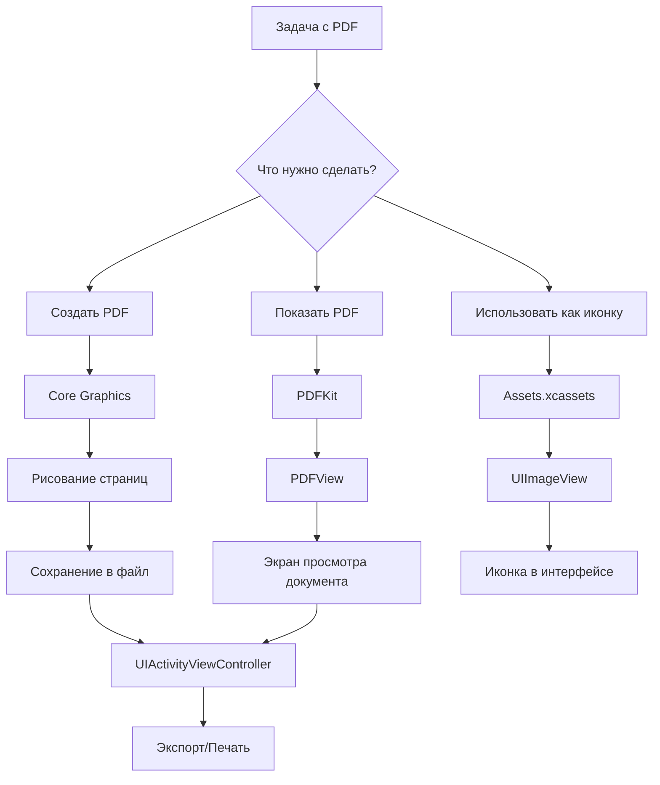

#file-format #documents #pdf #core-graphics #printing #uikit #pdfkit

---

## PDF (Portable Document Format)

### Определение
**PDF (Portable Document Format)** — это кроссплатформенный формат электронных документов, разработанный компанией Adobe Systems. В контексте [[iOS]]-разработки PDF используется для:
- **Отображения документов** (инструкции, книги, счета, квитанции).
- **Генерации отчетов и чеков** прямо в приложении.
- **Экспорта данных** для печати или отправки по почте.
- **Векторных ресурсов** (иконки, изображения) — PDF в Assets.xcassets позволяет сохранять четкость на любых экранах.

### Зачем это знать iOS-разработчику?
Множество приложений так или иначе работают с PDF:
1.  **Банковские приложения:** Выписки, квитанции, платежные поручения.
2.  **Образовательные приложения:** Книги, методички, расписания.
3.  **Маркетплейсы:** Товарные накладные, чеки, гарантийные талоны.
4.  **Офисные приложения:** Просмотр и редактирование документов.
5.  **Дизайн и верстка:** Векторные активы (PDF в Assets).

---

### Основные концепции и фреймворки

#### 1. Vector Assets (Векторные ресурсы)
PDF в `Assets.xcassets` — это стандарт для поставки иконок и изображений. В отличие от PNG (растр), PDF (вектор) масштабируется без потери качества. [[iOS]] автоматически растеризует PDF в нужном разрешении под конкретный экран.

#### 2. PDFKit
Фреймворк от Apple для отображения, навигации и аннотирования PDF-документов. Предоставляет готовый компонент `PDFView` (аналог веб-вью, но для PDF).

#### 3. [[Core Graphics]] (Quartz 2D)
Низкоуровневый фреймворк для рисования. Позволяет **создавать** PDF-документы программно: рисовать текст, линии, изображения и сохранять в файл.

#### 4. UIPrintPageRenderer
Класс для подготовки контента к печати. Может использоваться для генерации PDF из [[UIView]] или HTML.

#### 5. [[UIDocumentInteractionController]] / [[UIActivityViewController]]
Классы для шаринга и предпросмотра PDF вне приложения.

---

### Схема работы с PDF в iOS



---

### Примеры от простого к сложному

#### Уровень 0: PDF как иконка (векторный ассет)
Самый частый сценарий — дизайнер дает иконку в формате PDF.

1.  Перетащи PDF-файл в папку `Assets.xcassets` в [[Xcode]].
2.  Убедись, что в инспекторе атрибутов выбран `Scale: Single Scale` (или `Individual Scales`). Xcode сам сгенерирует нужные растровые копии при сборке.
3.  Используй как обычное изображение:

```swift
import UIKit

class IconViewController: UIViewController {
    
    let iconImageView = UIImageView()
    
    override func viewDidLoad() {
        super.viewDidLoad()
        
        // PDF из Assets (например, иконка "settings")
        iconImageView.image = UIImage(named: "settings_icon")
        iconImageView.tintColor = .systemBlue // PDF можно красить через tintColor, если это шаблон
        iconImageView.contentMode = .scaleAspectFit
        
        view.addSubview(iconImageView)
        iconImageView.frame = CGRect(x: 100, y: 100, width: 50, height: 50)
    }
}
```

#### Уровень 1: Отображение PDF из файла (PDFKit)
Допустим, у тебя есть PDF-файл в бандле приложения (инструкция).

```swift
import UIKit
import PDFKit

class PDFViewerViewController: UIViewController {
    
    var pdfView: PDFView!
    
    override func viewDidLoad() {
        super.viewDidLoad()
        
        setupPDFView()
        loadPDF()
    }
    
    private func setupPDFView() {
        pdfView = PDFView(frame: view.bounds)
        pdfView.autoresizingMask = [.flexibleWidth, .flexibleHeight]
        pdfView.autoScales = true // Масштабировать под размер экрана
        pdfView.displayMode = .singlePageContinuous // Непрерывный скролл
        pdfView.displayDirection = .vertical
        view.addSubview(pdfView)
    }
    
    private func loadPDF() {
        // 1. Находим файл в бандле
        guard let path = Bundle.main.path(forResource: "user_manual", ofType: "pdf") else {
            print("PDF не найден")
            return
        }
        
        // 2. Создаем URL и документ
        let url = URL(fileURLWithPath: path)
        if let document = PDFDocument(url: url) {
            pdfView.document = document
            pdfView.goToFirstPage(nil) // Открыть первую страницу
        }
    }
}
```

#### Уровень 2: Отображение PDF из данных (например, с сервера)

```swift
import UIKit
import PDFKit

class RemotePDFViewController: UIViewController {
    
    var pdfView: PDFView!
    let activityIndicator = UIActivityIndicatorView(style: .large)
    
    override func viewDidLoad() {
        super.viewDidLoad()
        setupUI()
        downloadAndShowPDF()
    }
    
    private func setupUI() {
        pdfView = PDFView(frame: view.bounds)
        pdfView.autoresizingMask = [.flexibleWidth, .flexibleHeight]
        pdfView.autoScales = true
        view.addSubview(pdfView)
        
        activityIndicator.center = view.center
        activityIndicator.hidesWhenStopped = true
        view.addSubview(activityIndicator)
    }
    
    private func downloadAndShowPDF() {
        activityIndicator.startAnimating()
        
        let urlString = "https://example.com/document.pdf"
        guard let url = URL(string: urlString) else { return }
        
        let task = URLSession.shared.dataTask(with: url) { [weak self] data, response, error in
            guard let self = self,
                  let data = data,
                  error == nil else {
                print("Ошибка загрузки: \(error?.localizedDescription ?? "")")
                return
            }
            
            // Создаем PDF-документ из Data
            let document = PDFDocument(data: data)
            
            DispatchQueue.main.async {
                self.activityIndicator.stopAnimating()
                self.pdfView.document = document
            }
        }
        
        task.resume()
    }
}
```

#### Уровень 3: Генерация простого PDF (Счет/Квитанция)
Создадим PDF с текстом и линиями с помощью Core Graphics.

```swift
import UIKit
import PDFKit

class PDFGenerator {
    
    /// Генерирует PDF-документ с простым счетом
    /// - Returns: URL временного файла
    static func generateInvoicePDF() -> URL? {
        let pageWidth: CGFloat = 612   // Стандартный размер Letter (8.5" x 11" в точках)
        let pageHeight: CGFloat = 792
        let pageRect = CGRect(x: 0, y: 0, width: pageWidth, height: pageHeight)
        
        // Создаем буфер для PDF
        let renderer = UIGraphicsPDFRenderer(bounds: pageRect)
        
        let data = renderer.pdfData { context in
            // Начинаем страницу
            context.beginPage()
            
            let textAttributes: [NSAttributedString.Key: Any] = [
                .font: UIFont.systemFont(ofSize: 24, weight: .bold),
                .foregroundColor: UIColor.black
            ]
            
            let text = "Счет №123 от 20.02.2026"
            text.draw(at: CGPoint(x: 50, y: 50), withAttributes: textAttributes)
            
            // Рисуем линию
            let path = UIBezierPath()
            path.move(to: CGPoint(x: 50, y: 100))
            path.addLine(to: CGPoint(x: pageWidth - 50, y: 100))
            path.lineWidth = 2
            UIColor.gray.setStroke()
            path.stroke()
            
            // Таблица товаров
            let items = [
                ("Товар 1", "2 шт.", "1000 ₽"),
                ("Товар 2", "1 шт.", "500 ₽"),
                ("Итого:", "", "1500 ₽")
            ]
            
            var yPosition: CGFloat = 120
            
            for item in items {
                // Название
                item.0.draw(at: CGPoint(x: 50, y: yPosition), 
                           withAttributes: [.font: UIFont.systemFont(ofSize: 16)])
                
                // Количество
                item.1.draw(at: CGPoint(x: 300, y: yPosition), 
                           withAttributes: [.font: UIFont.systemFont(ofSize: 16)])
                
                // Сумма
                item.2.draw(at: CGPoint(x: 450, y: yPosition), 
                           withAttributes: [.font: UIFont.systemFont(ofSize: 16, weight: .medium)])
                
                yPosition += 30
            }
            
            // Добавляем текст внизу
            let footerText = "Спасибо за покупку!"
            footerText.draw(at: CGPoint(x: 50, y: pageHeight - 100), 
                          withAttributes: [
                            .font: UIFont.italicSystemFont(ofSize: 14),
                            .foregroundColor: UIColor.darkGray
                          ])
        }
        
        // Сохраняем во временный файл
        let tempURL = FileManager.default.temporaryDirectory.appendingPathComponent("invoice_\(Date().timeIntervalSince1970).pdf")
        
        do {
            try data.write(to: tempURL)
            return tempURL
        } catch {
            print("Ошибка сохранения PDF: \(error)")
            return nil
        }
    }
}

// Использование:
class InvoiceViewController: UIViewController {
    
    func createAndSharePDF() {
        if let pdfURL = PDFGenerator.generateInvoicePDF() {
            let activityVC = UIActivityViewController(activityItems: [pdfURL], applicationActivities: nil)
            present(activityVC, animated: true)
        }
    }
}
```

#### Уровень 4: Генерация PDF из [[UIView]] (Конвертация вью в PDF)
Самый практичный способ: сверстать экран с помощью UIKit, а затем "сфотографировать" его в PDF.

```swift
import UIKit

extension UIView {
    /// Создает PDF из текущего UIView
    func exportAsPDF() -> URL? {
        let pdfRenderer = UIGraphicsPDFRenderer(bounds: self.bounds)
        
        let data = pdfRenderer.pdfData { context in
            context.beginPage()
            self.layer.render(in: context.cgContext)
        }
        
        let tempURL = FileManager.default.temporaryDirectory
            .appendingPathComponent("view_export_\(Date().timeIntervalSince1970).pdf")
        
        do {
            try data.write(to: tempURL)
            return tempURL
        } catch {
            print("Ошибка экспорта: \(error)")
            return nil
        }
    }
}

// Пример использования: сохранение чека в PDF
class ReceiptViewController: UIViewController {
    
    let receiptView = UIView() // Допустим, это сложная вью с чеком
    
    @IBAction func saveReceiptTapped() {
        if let pdfURL = receiptView.exportAsPDF() {
            let shareSheet = UIActivityViewController(activityItems: [pdfURL], 
                                                     applicationActivities: nil)
            present(shareSheet, animated: true)
        }
    }
}
```

#### Уровень 5: Продвинутая работа с PDFKit (Аннотации, поиск, навигация)

```swift
import UIKit
import PDFKit

class AdvancedPDFViewController: UIViewController {
    
    @IBOutlet weak var pdfView: PDFView!
    @IBOutlet weak var thumbnailView: PDFThumbnailView! // Миниатюры страниц
    
    override func viewDidLoad() {
        super.viewDidLoad()
        
        setupPDF()
        setupThumbnailView()
        setupSearch()
    }
    
    private func setupPDF() {
        if let url = Bundle.main.url(forResource: "document", withExtension: "pdf") {
            pdfView.document = PDFDocument(url: url)
            pdfView.autoScales = true
            pdfView.displayMode = .singlePage
            pdfView.displayDirection = .horizontal // Горизонтальный листаж
        }
    }
    
    private func setupThumbnailView() {
        thumbnailView.pdfView = pdfView
        thumbnailView.layoutMode = .horizontal
        thumbnailView.thumbnailSize = CGSize(width: 100, height: 140)
    }
    
    private func setupSearch() {
        let searchField = UISearchBar()
        searchField.delegate = self
        navigationItem.titleView = searchField
    }
    
    // Добавление аннотации (выделение текста)
    @IBAction func highlightSelection() {
        guard let selection = pdfView.currentSelection,
              let document = pdfView.document else { return }
        
        let pages = selection.pages
        for page in pages {
            let selectionsForPage = selection.selectionsByLine(for: page)
            for lineSelection in selectionsForPage {
                let bounds = lineSelection.bounds(for: page)
                let highlight = PDFAnnotation(bounds: bounds, forType: .highlight, withProperties: nil)
                highlight.color = .yellow.withAlphaComponent(0.3)
                page.addAnnotation(highlight)
            }
        }
    }
}

extension AdvancedPDFViewController: UISearchBarDelegate {
    func searchBarSearchButtonClicked(_ searchBar: UISearchBar) {
        guard let query = searchBar.text, !query.isEmpty else { return }
        
        if let document = pdfView.document {
            // Асинхронный поиск по документу
            let searchManager = document.beginFindString(query, withOptions: .caseInsensitive)
            // Результаты приходят через делегат PDFDocumentDelegate
        }
    }
}
```

---

### Важные нюансы и Best Practices

1.  **Размер и производительность:**
    - Большие PDF-документы (сотни страниц) загружаются долго. Используйте пагинацию или предзагрузку.
    - PDFKit кэширует отрендеренные страницы, но это потребляет память.

2.  **Парольная защита:**
    PDFKit поддерживает зашифрованные документы. При создании `PDFDocument` можно передать пароль.

```swift
let document = PDFDocument(url: url)
if document?.isLocked == true {
    document?.unlock(withPassword: "user_password")
}
```

3.  **Работа с формами (AcroForms):**
    PDFKit позволяет заполнять поля форм в PDF (например, интерактивные анкеты).

4.  **ThumbnailView:**
    Всегда добавляйте `PDFThumbnailView` для навигации в больших документах — это улучшает UX.

5.  **Альтернативы PDFKit:**
    - **WebView** (старый способ, не рекомендуется).
    - **QLPreviewController** (Quick Look) — для быстрого предпросмотра без интеграции.
    - **UIPrintPageRenderer** — для генерации PDF из HTML.

6.  **Метрики:**
    - Размер страницы по умолчанию в точках (points): 1 точка = 1/72 дюйма.
    - A4: 595 x 842 точек.
    - Letter: 612 x 792 точек.

7.  **PDF vs PNG в Assets:**
    - **PDF**: для иконок и простых форм (малый вес, вектор).
    - **PNG**: для фотографий и сложных градиентов (растр).

### Итог
**PDF** в iOS — это многогранный формат, с которым можно работать на разных уровнях: от простого отображения до программной генерации сложных документов. Основные инструменты — **PDFKit** для просмотра и **Core Graphics** для создания. Понимание этих инструментов позволяет реализовывать функции печати, экспорта отчетов и работы с документами в любом приложении.