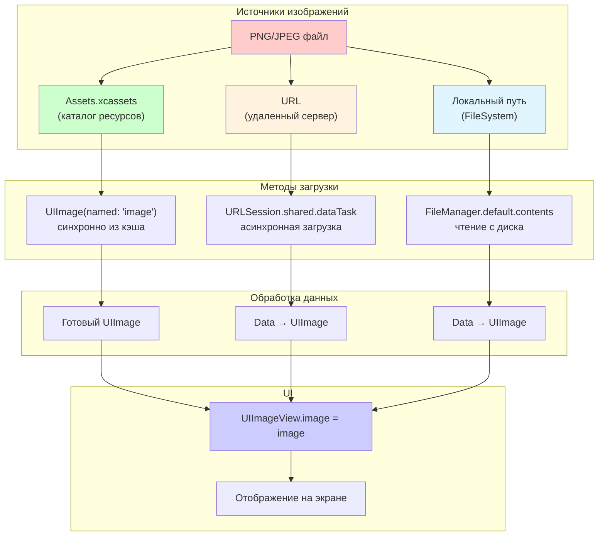

#file-format #images #graphics #assets #ui #optimization #png

---
## PNG (Portable Network Graphics)

### Определение
**PNG (Portable Network Graphics)** — это растровый формат хранения графической информации, использующий сжатие без потерь (lossless compression). В контексте iOS-разработки PNG является одним из основных форматов для хранения изображений, иконок, скриншотов и других графических элементов интерфейса.

### Ключевые особенности PNG для [[iOS]]
1.  **Сжатие без потерь:** Изображение сохраняет 100% качества исходника.
2.  **Поддержка прозрачности (альфа-канал):** 8-битная прозрачность (256 уровней) — идеально для иконок и наложений.
3.  **Палитра (Indexed color):** Можно сохранять изображения с ограниченным количеством цветов (например, 256) для уменьшения размера файла.
4.  **Чересстрочная развертка (Interlacing):** Позволяет показывать превью изображения во время загрузки (редко используется в мобильной разработке).

### Зачем это знать iOS-разработчику?
PNG повсеместно используется в iOS-приложениях:
1.  **Иконки приложения:** Требуются в формате PNG (с прозрачностью).
2.  **Ассеты интерфейса:** Кнопки, логотипы, фоновые изображения.
3.  **Изображения с прозрачностью:** Аватары, стикеры, наложения.
4.  **Скриншоты и контент:** Изображения, загружаемые пользователями или отображаемые в приложении.

---

### Основные концепции и сравнение форматов

#### 1. PNG vs JPEG
| Характеристика | PNG | JPEG |
|---|---|---|
| Сжатие | Без потерь | С потерями |
| Прозрачность | Да (альфа-канал) | Нет |
| Фотографии | Большой размер | Маленький размер |
| Графика/Текст | Отлично | Артефакты |
| Цвета | До 48-bit | 24-bit |

#### 2. PNG vs PDF (вектор)
| Характеристика | PNG | PDF (в Assets) |
|---|---|---|
| Тип | Растр | Вектор |
| Масштабирование | Потеря качества | Без потери |
| Размер файла | Зависит от разрешения | Маленький |
| Сложные градиенты | Отлично | Может быть проблемой |
| Иконки | Требуются разные размеры | Один файл на все размеры |

#### 3. PNG-8 vs PNG-24 vs PNG-32
- **PNG-8:** 256 цветов, поддержка 1-битной прозрачности (включено/выключено). Для простой графики.
- **PNG-24:** 16.7 миллионов цветов, без прозрачности. Для фотографий и сложных изображений.
- **PNG-32:** 16.7 миллионов цветов + 8-битная прозрачность. Стандарт для iOS (RGBA).

---

### Схема работы с PNG в iOS



---

### Примеры от простого к сложному

#### Уровень 1: Базовое отображение PNG из Assets

```swift
import UIKit

class SimpleImageViewController: UIViewController {
    
    let imageView = UIImageView()
    
    override func viewDidLoad() {
        super.viewDidLoad()
        
        // 1. PNG в Assets.xcassets с именем "logo"
        imageView.image = UIImage(named: "logo")
        imageView.contentMode = .scaleAspectFit
        imageView.frame = CGRect(x: 50, y: 100, width: 200, height: 100)
        
        view.addSubview(imageView)
    }
}
```

#### Уровень 2: Загрузка PNG из интернета

```swift
import UIKit

class NetworkImageViewController: UIViewController {
    
    let imageView = UIImageView()
    let activityIndicator = UIActivityIndicatorView(style: .large)
    
    override func viewDidLoad() {
        super.viewDidLoad()
        
        setupUI()
        loadImageFromURL()
    }
    
    private func setupUI() {
        imageView.frame = view.bounds
        imageView.contentMode = .scaleAspectFit
        view.addSubview(imageView)
        
        activityIndicator.center = view.center
        activityIndicator.hidesWhenStopped = true
        view.addSubview(activityIndicator)
    }
    
    private func loadImageFromURL() {
        activityIndicator.startAnimating()
        
        let urlString = "https://example.com/image.png"
        guard let url = URL(string: urlString) else { return }
        
        let task = URLSession.shared.dataTask(with: url) { [weak self] data, response, error in
            guard let self = self,
                  let data = data,
                  let image = UIImage(data: data), // PNG автоматически распознается
                  error == nil else {
                return
            }
            
            DispatchQueue.main.async {
                self.activityIndicator.stopAnimating()
                self.imageView.image = image
            }
        }
        
        task.resume()
    }
}
```

#### Уровень 3: Работа с прозрачностью PNG

PNG идеально подходит для изображений с прозрачностью. Рассмотрим наложение одной PNG на другую.

```swift
import UIKit

class TransparencyViewController: UIViewController {
    
    override func viewDidLoad() {
        super.viewDidLoad()
        
        // Фоновое изображение (непрозрачное)
        let backgroundView = UIImageView(image: UIImage(named: "background"))
        backgroundView.frame = view.bounds
        backgroundView.contentMode = .scaleAspectFill
        view.addSubview(backgroundView)
        
        // Наложение с прозрачностью (PNG с альфа-каналом)
        let overlayView = UIImageView(image: UIImage(named: "overlay_sticker"))
        overlayView.frame = CGRect(x: 100, y: 200, width: 200, height: 200)
        overlayView.contentMode = .scaleAspectFit
        view.addSubview(overlayView)
        
        // Изменение прозрачности программно
        overlayView.alpha = 0.8 // 80% непрозрачности
    }
}
```

#### Уровень 4: Конвертация [[UIImage]] в PNG [[Data]] (сохранение)

```swift
import UIKit

class ImageExportViewController: UIViewController {
    
    @IBOutlet weak var imageView: UIImageView!
    
    @IBAction func saveImageTapped() {
        guard let image = imageView.image else { return }
        
        // 1. Конвертируем UIImage в PNG Data
        if let pngData = image.pngData() {
            // 2. Сохраняем в файловую систему
            let filename = FileManager.default.temporaryDirectory
                .appendingPathComponent("exported_image_\(Date().timeIntervalSince1970).png")
            
            do {
                try pngData.write(to: filename)
                print("PNG сохранен: \(filename)")
                
                // 3. Показываем Share Sheet
                let activityVC = UIActivityViewController(activityItems: [filename], 
                                                         applicationActivities: nil)
                present(activityVC, animated: true)
                
            } catch {
                print("Ошибка сохранения: \(error)")
            }
        }
    }
    
    // Сохранение в фотоальбом
    @IBAction func saveToPhotoLibrary() {
        guard let image = imageView.image else { return }
        UIImageWriteToSavedPhotosAlbum(image, self, #selector(imageSaved), nil)
    }
    
    @objc func imageSaved(_ image: UIImage, didFinishSavingWithError error: Error?, contextInfo: UnsafeRawPointer) {
        if let error = error {
            print("Ошибка сохранения в альбом: \(error)")
        } else {
            print("Изображение сохранено в фотоальбом")
        }
    }
}
```

#### Уровень 5: Оптимизация PNG для iOS

```swift
import UIKit
import ImageIO
import MobileCoreServices

class ImageOptimizer {
    
    /// Сжимает PNG без потери прозрачности, но с уменьшением размера файла
    static func optimizePNG(image: UIImage, maxSizeKB: Int = 500) -> Data? {
        guard let originalData = image.pngData() else { return nil }
        
        let originalSizeKB = originalData.count / 1024
        print("Оригинальный размер: \(originalSizeKB) KB")
        
        if originalSizeKB <= maxSizeKB {
            return originalData // Уже достаточно маленький
        }
        
        // Пробуем уменьшить размер изображения
        var compression: CGFloat = 1.0
        var currentImage = image
        
        while true {
            // Уменьшаем размер изображения (scale)
            let newSize = CGSize(width: currentImage.size.width * 0.9, 
                                 height: currentImage.size.height * 0.9)
            
            let renderer = UIGraphicsImageRenderer(size: newSize)
            let resizedImage = renderer.image { context in
                currentImage.draw(in: CGRect(origin: .zero, size: newSize))
            }
            
            if let data = resizedImage.pngData() {
                if data.count / 1024 <= maxSizeKB {
                    print("Итоговый размер: \(data.count / 1024) KB")
                    return data
                }
                currentImage = resizedImage
            } else {
                break
            }
            
            // Защита от бесконечного цикла
            if newSize.width < 50 || newSize.height < 50 {
                break
            }
        }
        
        return nil
    }
    
    /// Конвертирует PNG в JPEG (если не нужна прозрачность) для экономии места
    static func convertToJPEGIfPossible(image: UIImage, quality: CGFloat = 0.8) -> Data? {
        // Проверяем, есть ли прозрачность
        let hasAlpha = imageHasAlpha(image: image)
        
        if hasAlpha {
            print("Изображение имеет прозрачность, оставляем PNG")
            return image.pngData()
        } else {
            print("Нет прозрачности, конвертируем в JPEG")
            return image.jpegData(compressionQuality: quality)
        }
    }
    
    private static func imageHasAlpha(image: UIImage) -> Bool {
        guard let cgImage = image.cgImage else { return false }
        let alphaInfo = cgImage.alphaInfo
        return alphaInfo == .first ||
               alphaInfo == .last ||
               alphaInfo == .premultipliedFirst ||
               alphaInfo == .premultipliedLast
    }
}

// Использование:
class OptimizationViewController: UIViewController {
    
    @IBOutlet weak var imageView: UIImageView!
    
    override func viewDidLoad() {
        super.viewDidLoad()
        
        if let image = UIImage(named: "large_image") {
            if let optimizedData = ImageOptimizer.optimizePNG(image: image, maxSizeKB: 200) {
                let optimizedImage = UIImage(data: optimizedData)
                imageView.image = optimizedImage
                print("Оптимизировано!")
            }
        }
    }
}
```

#### Уровень 6: Работа с PNG в [[Core Graphics]]

```swift
import UIKit

class CoreGraphicsPNGViewController: UIViewController {
    
    override func viewDidLoad() {
        super.viewDidLoad()
        
        // Создаем новое PNG-изображение программно
        let renderedImage = renderCircleWithText()
        
        let imageView = UIImageView(image: renderedImage)
        imageView.frame = CGRect(x: 50, y: 100, width: 200, height: 200)
        view.addSubview(imageView)
    }
    
    private func renderCircleWithText() -> UIImage {
        let size = CGSize(width: 200, height: 200)
        
        let renderer = UIGraphicsImageRenderer(size: size)
        
        let image = renderer.image { context in
            // Рисуем круг
            let circlePath = UIBezierPath(ovalIn: CGRect(x: 0, y: 0, width: 200, height: 200))
            UIColor.systemBlue.setFill()
            circlePath.fill()
            
            // Рисуем текст
            let text = "PNG"
            let attributes: [NSAttributedString.Key: Any] = [
                .font: UIFont.boldSystemFont(ofSize: 40),
                .foregroundColor: UIColor.white
            ]
            
            let textSize = text.size(withAttributes: attributes)
            let textPoint = CGPoint(x: (size.width - textSize.width) / 2,
                                   y: (size.height - textSize.height) / 2)
            
            text.draw(at: textPoint, withAttributes: attributes)
        }
        
        return image
    }
}
```

---

### Важные нюансы и Best Practices

#### 1.  **Оптимизация PNG для iOS**
-   **TinyPNG:** Используй сервисы типа TinyPNG для сжатия PNG без видимой потери качества.
-   **Удаляй метаданные:** EXIF, цветовые профили (если не нужны).
-   **Используй правильную глубину цвета:** PNG-8 для простой графики, PNG-24/32 для фотографий.

#### 2.  **Рендеринг PNG в UIKit**
-   `UIImage(named:)` кэширует изображения — хорошо для часто используемых иконок.
-   `UIImage(contentsOfFile:)` не кэширует — для одноразовых больших изображений.
-   Для анимаций используй `UIImage.animatedImage(with:duration:)` с массивом PNG-кадров.

#### 3.  **Память и производительность**
-   PNG распаковывается в сырой битмап (Raw bitmap) в памяти: `ширина × высота × 4 байта (RGBA)`.
-   Например, PNG 1000×1000 занимает в памяти ~4 МБ (1000×1000×4), независимо от размера файла на диске.
-   Для очень больших изображений используй **[[CATiledLayer]]** или **Downsampling**.

```swift
// Пример downsample для больших PNG
func downsample(imageAt imageURL: URL, to pointSize: CGSize, scale: CGFloat) -> UIImage? {
    let imageSourceOptions = [kCGImageSourceShouldCache: false] as CFDictionary
    guard let imageSource = CGImageSourceCreateWithURL(imageURL as CFURL, imageSourceOptions) else {
        return nil
    }
    
    let maxDimensionInPixels = max(pointSize.width, pointSize.height) * scale
    let downsampleOptions = [
        kCGImageSourceCreateThumbnailFromImageAlways: true,
        kCGImageSourceShouldCacheImmediately: true,
        kCGImageSourceCreateThumbnailWithTransform: true,
        kCGImageSourceThumbnailMaxPixelSize: maxDimensionInPixels
    ] as CFDictionary
    
    guard let downsampledImage = CGImageSourceCreateThumbnailAtIndex(imageSource, 0, downsampleOptions) else {
        return nil
    }
    
    return UIImage(cgImage: downsampledImage)
}
```

#### 4.  **PNG vs PDF в Assets**
| Сценарий                     | Формат       | Почему                           |
| ---------------------------- | ------------ | -------------------------------- |
| Иконка простой формы         | [[PDF]]      | Вектор, один файл                |
| Иконка со сложным градиентом | PNG          | PDF может отрисовать неправильно |
| Фото пользователя            | PNG/[[JPEG]] | PNG если нужна ред. прозрачность |
| Стикеры с прозрачностью      | PNG          | Прозрачность необходима          |
| Логотип с текстом            | PDF          | Масштабируется под любой размер  |

#### 5.  **Темная тема (Dark Mode)**
PNG не адаптируется автоматически под темную тему. Для этого:
-   Используй `UIImageAsset` с разными изображениями для Light/Dark.
-   Либо задавай разные имена файлов: `logo_light.png`, `logo_dark.png`.

```swift
if traitCollection.userInterfaceStyle == .dark {
    imageView.image = UIImage(named: "logo_dark")
} else {
    imageView.image = UIImage(named: "logo_light")
}
```

#### 6.  **Анимация PNG**
Для покадровой анимации можно использовать последовательность PNG:

```swift
func createAnimation() {
    var images: [UIImage] = []
    for i in 1...30 {
        if let image = UIImage(named: "frame_\(i)") {
            images.append(image)
        }
    }
    
    imageView.animationImages = images
    imageView.animationDuration = 1.0
    imageView.startAnimating()
}
```

### Итог
**PNG** — основной формат для растровой графики с прозрачностью в iOS. Понимание особенностей формата, методов оптимизации и правильного выбора между PNG, JPEG и PDF позволяет создавать приложения с быстрым интерфейсом и экономным расходованием памяти и дискового пространства.