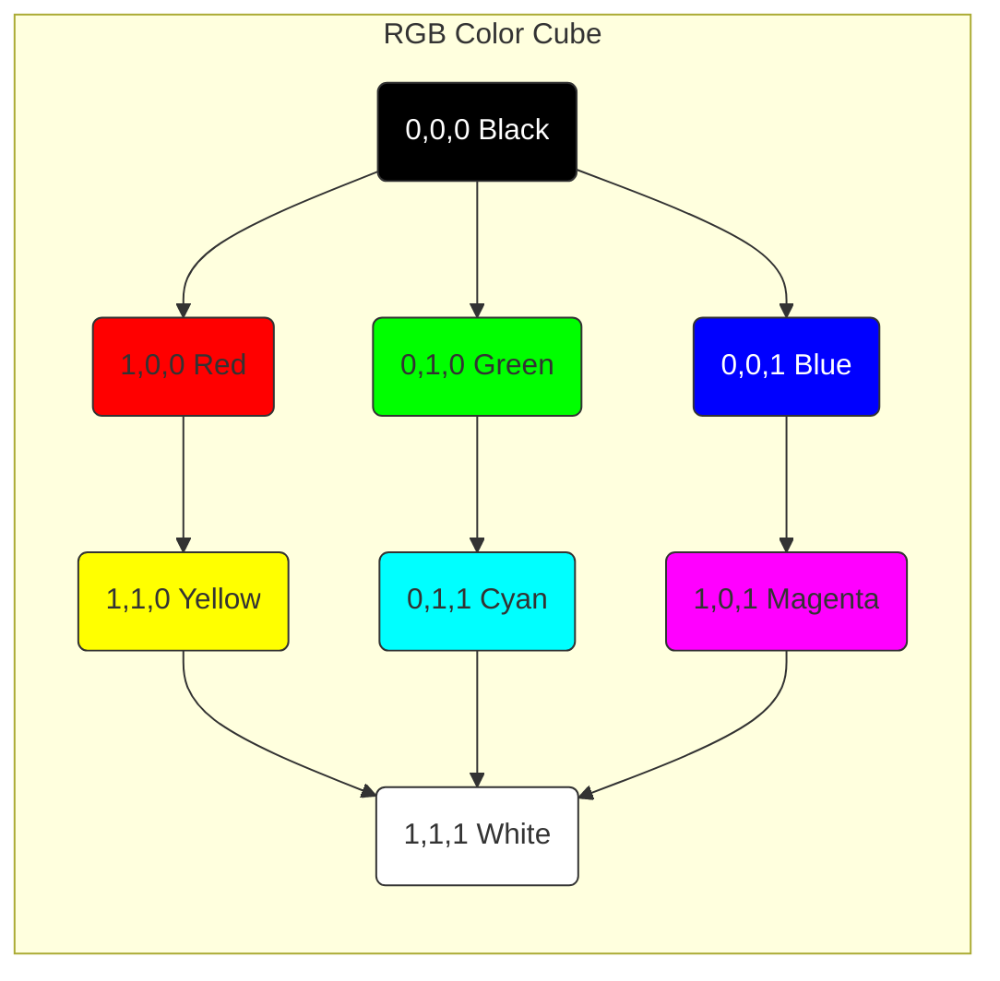

#ui #colors #graphics #uikit #rgba #color-model #design

---

## RGB (Red, Green, Blue)

### Определение
**RGB (Red, Green, Blue)** — это аддитивная цветовая модель, в которой цвета получаются путем смешивания трех базовых компонентов: красного (Red), зеленого (Green) и синего (Blue). В контексте iOS-разработки RGB является основным способом представления цвета в [[UIKit]] через класс [[UIColor]], где каждый компонент задается значением от 0.0 до 1.0.

### Математическая основа
Цвет в RGB описывается точкой в трехмерном пространстве:
- **R (Red)** — красный компонент (0.0 - 1.0)
- **G (Green)** — зеленый компонент (0.0 - 1.0)
- **B (Blue)** — синий компонент (0.0 - 1.0)
- **A (Alpha)** — прозрачность (0.0 - 1.0), опционально

**Принцип работы:** 
- (0,0,0) — черный (отсутствие света)
- (1,1,1) — белый (максимум всех цветов)
- (1,0,0) — красный
- (0,1,0) — зеленый
- (0,0,1) — синий

### Зачем это знать iOS-разработчику?
1.  **Прямая работа с цветами:** Иногда дизайнер дает цвета в RGB (например, в [[Sketch]] или Photoshop).
2.  **Анимация цвета:** Изменение цвета программно требует манипуляции с RGB компонентами.
3.  **Генерация цветов:** Создание градиентов, случайных цветов, цветовых схем.
4.  **Анализ изображений:** Извлечение цветовой информации из пикселей.
5.  **Понимание цветовых пространств:** Разные устройства могут по-разному интерпретировать RGB.

---

### Схема цветовой модели RGB



---

### Основные концепции

#### 1. Цветовые пространства (Color Spaces)
RGB — это не абсолютная величина. Один и тот же набор чисел (R, G, B) может выглядеть по-разному на разных устройствах из-за цветового охвата:
- **sRGB:** Стандартный цветовой охват (по умолчанию в [[iOS]]).
- **Display P3:** Расширенный цветовой охват (Wide Color) на современных устройствах (iPhone 7+).

#### 2. Глубина цвета (Color Depth)
- **8-bit на канал:** Стандарт для большинства экранов (256 оттенков на канал → 16.7 млн цветов).
- **10-bit на канал:** Для Pro Display XDR и некоторых iPad Pro (1.07 млрд цветов).

#### 3. RGB vs HEX
| Характеристика | RGB (Float) | HEX |
|---|---|---|
| Формат | (0.5, 0.2, 0.8) | #7F33CC |
| Читаемость | Понятна математика | Компактно |
| Использование | Код, анимации | Дизайн-макеты |
| Диапазон | 0.0-1.0 | 00-FF |

---

### Примеры от простого к сложному

#### Уровень 1: Создание [[UIColor]] из RGB компонентов

```swift
import UIKit

class BasicRGBViewController: UIViewController {
    
    override func viewDidLoad() {
        super.viewDidLoad()
        
        // 1. Базовое создание цвета с RGB (0.0 - 1.0)
        let redColor = UIColor(red: 1.0, green: 0.0, blue: 0.0, alpha: 1.0)
        
        // 2. Конвертация из 0-255 в 0.0-1.0
        let customBlue = UIColor(
            red: 52.0 / 255.0,     // #34
            green: 152.0 / 255.0,   // #98
            blue: 219.0 / 255.0,    // #db
            alpha: 1.0
        )
        
        // 3. Применяем цвета
        view.backgroundColor = customBlue
        
        let redView = UIView(frame: CGRect(x: 50, y: 100, width: 100, height: 100))
        redView.backgroundColor = redColor
        view.addSubview(redView)
    }
}
```

#### Уровень 2: Извлечение RGB компонентов из UIColor

```swift
import UIKit

extension UIColor {
    /// Извлекает RGB компоненты из UIColor
    func getRGBComponents() -> (red: CGFloat, green: CGFloat, blue: CGFloat, alpha: CGFloat)? {
        var red: CGFloat = 0
        var green: CGFloat = 0
        var blue: CGFloat = 0
        var alpha: CGFloat = 0
        
        guard self.getRed(&red, green: &green, blue: &blue, alpha: &alpha) else {
            // Цвет может быть в другом цветовом пространстве (например, grayscale)
            return nil
        }
        
        return (red, green, blue, alpha)
    }
    
    /// Возвращает HEX-строку из UIColor
    func toHex() -> String? {
        guard let components = getRGBComponents() else { return nil }
        
        let r = Int(components.red * 255.0)
        let g = Int(components.green * 255.0)
        let b = Int(components.blue * 255.0)
        
        return String(format: "#%02X%02X%02X", r, g, b)
    }
}

// Использование:
class ColorAnalysisViewController: UIViewController {
    
    @IBOutlet weak var colorView: UIView!
    @IBOutlet weak var infoLabel: UILabel!
    
    override func viewDidLoad() {
        super.viewDidLoad()
        
        let backgroundColor = UIColor(red: 0.2, green: 0.4, blue: 0.6, alpha: 1.0)
        colorView.backgroundColor = backgroundColor
        
        if let components = backgroundColor.getRGBComponents() {
            infoLabel.text = String(format: "R: %.2f, G: %.2f, B: %.2f, A: %.2f",
                                   components.red,
                                   components.green,
                                   components.blue,
                                   components.alpha)
        }
        
        if let hex = backgroundColor.toHex() {
            print("HEX: \(hex)")
        }
    }
}
```

#### Уровень 3: Анимация цвета через RGB

```swift
import UIKit

class ColorAnimationViewController: UIViewController {
    
    let animatedView = UIView()
    
    override func viewDidLoad() {
        super.viewDidLoad()
        
        animatedView.frame = CGRect(x: 100, y: 200, width: 200, height: 200)
        animatedView.backgroundColor = .red
        view.addSubview(animatedView)
        
        startColorAnimation()
    }
    
    func startColorAnimation() {
        // Анимация через UIView.animate (простая)
        UIView.animate(withDuration: 2.0, delay: 0, options: [.repeat, .autoreverse]) {
            self.animatedView.backgroundColor = .blue
        }
        
        // Но если нужен плавный переход через RGB компоненты:
        performRGBAnimation()
    }
    
    func performRGBAnimation() {
        let colorAnimation = CABasicAnimation(keyPath: "backgroundColor")
        colorAnimation.fromValue = UIColor.red.cgColor
        colorAnimation.toValue = UIColor.blue.cgColor
        colorAnimation.duration = 2.0
        colorAnimation.autoreverses = true
        colorAnimation.repeatCount = .infinity
        
        animatedView.layer.add(colorAnimation, forKey: "colorAnimation")
        
        // Важно: нужно установить финальный цвет, иначе после анимации цвет вернется
        animatedView.layer.backgroundColor = UIColor.blue.cgColor
    }
}
```

#### Уровень 4: Программное создание градиента через RGB

```swift
import UIKit

class RGBGradientViewController: UIViewController {
    
    override func viewDidLoad() {
        super.viewDidLoad()
        
        // Создаем градиент с плавным переходом через RGB
        let gradientLayer = CAGradientLayer()
        gradientLayer.frame = view.bounds
        
        // Генерируем массив цветов для плавного перехода
        gradientLayer.colors = generateSmoothGradient(
            from: UIColor(red: 1.0, green: 0.0, blue: 0.0, alpha: 1.0),  // Красный
            to: UIColor(red: 0.0, green: 0.0, blue: 1.0, alpha: 1.0),    // Синий
            steps: 10
        )
        
        gradientLayer.startPoint = CGPoint(x: 0, y: 0)
        gradientLayer.endPoint = CGPoint(x: 1, y: 1)
        
        view.layer.addSublayer(gradientLayer)
    }
    
    func generateSmoothGradient(from startColor: UIColor, to endColor: UIColor, steps: Int) -> [CGColor] {
        guard let startComponents = startColor.getRGBComponents(),
              let endComponents = endColor.getRGBComponents() else {
            return [startColor.cgColor, endColor.cgColor]
        }
        
        var colors: [CGColor] = []
        
        for i in 0...steps {
            let factor = CGFloat(i) / CGFloat(steps)
            
            let red = startComponents.red + (endComponents.red - startComponents.red) * factor
            let green = startComponents.green + (endComponents.green - startComponents.green) * factor
            let blue = startComponents.blue + (endComponents.blue - startComponents.blue) * factor
            let alpha = startComponents.alpha + (endComponents.alpha - startComponents.alpha) * factor
            
            let color = UIColor(red: red, green: green, blue: blue, alpha: alpha)
            colors.append(color.cgColor)
        }
        
        return colors
    }
}
```

#### Уровень 5: Работа с RGB на уровне пикселей ([[CGImage]])

```swift
import UIKit

class PixelManipulationViewController: UIViewController {
    
    @IBOutlet weak var imageView: UIImageView!
    
    override func viewDidLoad() {
        super.viewDidLoad()
        
        if let image = UIImage(named: "sample") {
            // Применяем красный фильтр к изображению
            let filteredImage = applyRedFilter(to: image)
            imageView.image = filteredImage
        }
    }
    
    func applyRedFilter(to image: UIImage) -> UIImage? {
        guard let cgImage = image.cgImage else { return nil }
        
        let width = cgImage.width
        let height = cgImage.height
        let colorSpace = CGColorSpaceCreateDeviceRGB()
        let bytesPerPixel = 4
        let bytesPerRow = bytesPerPixel * width
        let bitsPerComponent = 8
        
        var pixelData = [UInt8](repeating: 0, count: width * height * bytesPerPixel)
        
        // Создаем контекст для чтения пикселей
        let context = CGContext(
            data: &pixelData,
            width: width,
            height: height,
            bitsPerComponent: bitsPerComponent,
            bytesPerRow: bytesPerRow,
            space: colorSpace,
            bitmapInfo: CGImageAlphaInfo.premultipliedLast.rawValue
        )
        
        context?.draw(cgImage, in: CGRect(x: 0, y: 0, width: width, height: height))
        
        // Манипулируем RGB компонентами каждого пикселя
        for y in 0..<height {
            for x in 0..<width {
                let offset = (y * bytesPerRow) + (x * bytesPerPixel)
                
                let red = pixelData[offset]
                let green = pixelData[offset + 1]
                let blue = pixelData[offset + 2]
                let alpha = pixelData[offset + 3]
                
                // Усиливаем красный канал
                pixelData[offset] = min(255, Int(Double(red) * 1.5))
                pixelData[offset + 1] = UInt8(Double(green) * 0.5)  // Уменьшаем зеленый
                pixelData[offset + 2] = UInt8(Double(blue) * 0.5)   // Уменьшаем синий
            }
        }
        
        // Создаем новое изображение из измененных пикселей
        let newContext = CGContext(
            data: &pixelData,
            width: width,
            height: height,
            bitsPerComponent: bitsPerComponent,
            bytesPerRow: bytesPerRow,
            space: colorSpace,
            bitmapInfo: CGImageAlphaInfo.premultipliedLast.rawValue
        )
        
        if let newCgImage = newContext?.makeImage() {
            return UIImage(cgImage: newCgImage)
        }
        
        return nil
    }
}
```

#### Уровень 6: Генерация случайных цветов и цветовых схем

```swift
import UIKit

extension UIColor {
    /// Создает случайный цвет с насыщенностью и яркостью выше минимума
    static func randomVibrantColor() -> UIColor {
        let hue = CGFloat.random(in: 0...1)
        let saturation = CGFloat.random(in: 0.5...1.0) // Минимум 0.5 для яркости
        let brightness = CGFloat.random(in: 0.5...1.0) // Минимум 0.5 для яркости
        return UIColor(hue: hue, saturation: saturation, brightness: brightness, alpha: 1.0)
    }
    
    /// Создает комплементарный цвет (противоположный на цветовом круге)
    func complementaryColor() -> UIColor {
        var hue: CGFloat = 0
        var saturation: CGFloat = 0
        var brightness: CGFloat = 0
        var alpha: CGFloat = 0
        
        if self.getHue(&hue, saturation: &saturation, brightness: &brightness, alpha: &alpha) {
            // Поворачиваем на 180 градусов (0.5 в долях)
            let complementaryHue = fmod(hue + 0.5, 1.0)
            return UIColor(hue: complementaryHue, saturation: saturation, brightness: brightness, alpha: alpha)
        }
        
        return self
    }
    
    /// Создает аналогичную цветовую схему (2 цвета по бокам)
    func analogousColors(angle: CGFloat = 0.1667) -> (left: UIColor, right: UIColor) {
        var hue: CGFloat = 0
        var saturation: CGFloat = 0
        var brightness: CGFloat = 0
        var alpha: CGFloat = 0
        
        if self.getHue(&hue, saturation: &saturation, brightness: &brightness, alpha: &alpha) {
            let leftHue = fmod(hue + angle, 1.0)
            let rightHue = fmod(hue - angle + 1.0, 1.0)
            
            let leftColor = UIColor(hue: leftHue, saturation: saturation, brightness: brightness, alpha: alpha)
            let rightColor = UIColor(hue: rightHue, saturation: saturation, brightness: brightness, alpha: alpha)
            
            return (leftColor, rightColor)
        }
        
        return (self, self)
    }
}

// Использование:
class ColorSchemeViewController: UIViewController {
    
    override func viewDidLoad() {
        super.viewDidLoad()
        
        let mainColor = UIColor(red: 0.2, green: 0.4, blue: 0.8, alpha: 1.0)
        
        // Создаем цветовую схему
        let complementary = mainColor.complementaryColor()
        let analogous = mainColor.analogousColors()
        
        // Применяем к интерфейсу
        view.backgroundColor = mainColor
        
        let complementaryView = createColorView(color: complementary, y: 100)
        let analogousLeftView = createColorView(color: analogous.left, y: 220)
        let analogousRightView = createColorView(color: analogous.right, y: 340)
        
        view.addSubview(complementaryView)
        view.addSubview(analogousLeftView)
        view.addSubview(analogousRightView)
    }
    
    func createColorView(color: UIColor, y: CGFloat) -> UIView {
        let view = UIView(frame: CGRect(x: 50, y: y, width: 300, height: 80))
        view.backgroundColor = color
        view.layer.cornerRadius = 8
        return view
    }
}
```

---

### Важные нюансы и Best Practices

#### 1. **Цветовые пространства (Color Spaces)**
При работе с RGB важно понимать, в каком цветовом пространстве ты работаешь:

```swift
// sRGB (стандартное)
let sRGBColor = UIColor(red: 0.5, green: 0.2, blue: 0.8, alpha: 1.0)

// Display P3 (широкий цветовой охват)
let p3Color = UIColor(displayP3Red: 0.5, green: 0.2, blue: 0.8, alpha: 1.0)

// Проверка, поддерживает ли устройство P3
if #available(iOS 9.3, *) {
    if UIScreen.main.traitCollection.displayGamut == .P3 {
        print("Устройство поддерживает P3")
    }
}
```

#### 2. **Производительность**
- Избегай частого создания UIColor в циклах (например, в `cellForRowAt`).
- Кэшируй часто используемые цвета как статические константы.
- При работе с большими изображениями используй vImage или Metal для параллельной обработки пикселей.

#### 3. **Темная тема (Dark Mode)**
UIColor автоматически адаптируется к темной теме, если создан через динамические методы:

```swift
let dynamicColor = UIColor { traitCollection in
    if traitCollection.userInterfaceStyle == .dark {
        return UIColor(red: 1.0, green: 1.0, blue: 1.0, alpha: 1.0) // Белый
    } else {
        return UIColor(red: 0.0, green: 0.0, blue: 0.0, alpha: 1.0) // Черный
    }
}
```

#### 4. **Точность цветов**
При конвертации между цветовыми пространствами могут быть небольшие расхождения. Для критичных к цвету приложений (дизайн, фото) используй ColorSync.

#### 5. **Альтернативные цветовые модели**
- **HSB (HSV):** Удобнее для интуитивной работы (оттенок, насыщенность, яркость).
- **CMYK:** Для печати (в iOS редко).
- **Lab:** Для цветокоррекции.

```swift
// Работа с HSB часто удобнее для анимаций
let color = UIColor(hue: 0.6, saturation: 0.8, brightness: 0.9, alpha: 1.0)
```

#### 6. **Доступность (Accessibility)**
Проверяй контрастность цветов для пользователей с нарушением зрения:

```swift
extension UIColor {
    func contrastRatio(with otherColor: UIColor) -> CGFloat {
        // Формула контрастности WCAG
        // Возвращает отношение контрастности (чем выше, тем лучше)
        let l1 = self.luminance()
        let l2 = otherColor.luminance()
        
        let lighter = max(l1, l2)
        let darker = min(l1, l2)
        
        return (lighter + 0.05) / (darker + 0.05)
    }
    
    private func luminance() -> CGFloat {
        var red: CGFloat = 0
        var green: CGFloat = 0
        var blue: CGFloat = 0
        var alpha: CGFloat = 0
        
        self.getRed(&red, green: &green, blue: &blue, alpha: &alpha)
        
        // Формула относительной яркости
        let r = red <= 0.03928 ? red / 12.92 : pow((red + 0.055) / 1.055, 2.4)
        let g = green <= 0.03928 ? green / 12.92 : pow((green + 0.055) / 1.055, 2.4)
        let b = blue <= 0.03928 ? blue / 12.92 : pow((blue + 0.055) / 1.055, 2.4)
        
        return 0.2126 * r + 0.7152 * g + 0.0722 * b
    }
}

// Проверка контрастности текста на фоне
let textColor = UIColor(red: 0.1, green: 0.1, blue: 0.1, alpha: 1.0)
let backgroundColor = UIColor(red: 0.9, green: 0.9, blue: 0.9, alpha: 1.0)

let ratio = textColor.contrastRatio(with: backgroundColor)
// WCAG требует минимум 4.5:1 для обычного текста
if ratio >= 4.5 {
    print("Достаточная контрастность")
} else {
    print("Низкая контрастность, нужно улучшить")
}
```

### Итог
**RGB** — фундаментальная цветовая модель для цифровых экранов и основа работы с цветом в iOS. Понимание того, как манипулировать RGB компонентами, позволяет создавать динамические интерфейсы, цветовые схемы, эффекты и фильтры. В сочетании с правильным использованием цветовых пространств и учетом доступности это дает полный контроль над визуальной составляющей приложения.