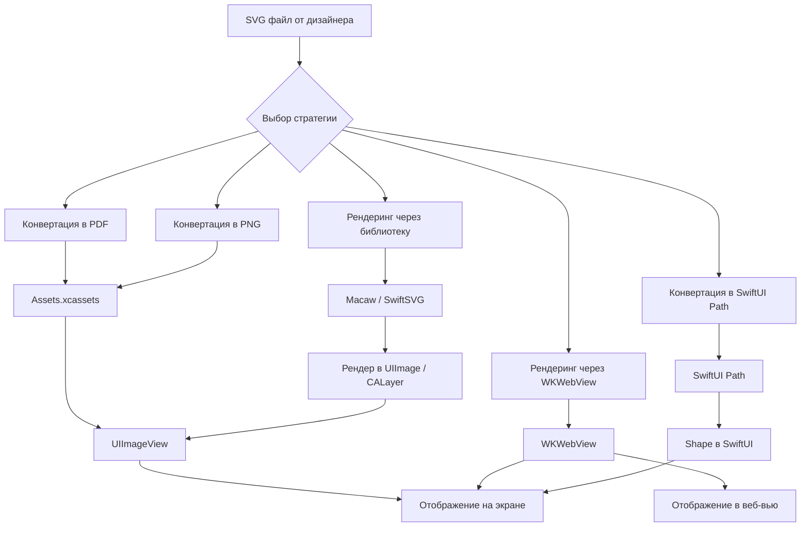

#file-format #vector #graphics #svg #assets #scalable #ui #performance

---
## SVG (Scalable Vector Graphics)

### Определение
**SVG (Scalable Vector Graphics)** — это открытый стандарт векторной графики, основанный на XML. В отличие от растровых форматов ([[PNG]], [[JPEG]]), SVG описывает изображение математическими формулами, линиями, кривыми и фигурами, что позволяет масштабировать его до любого размера без потери качества.

В контексте [[iOS]]-разработки SVG является "золотым стандартом" для иконок и иллюстраций в вебе, но в нативной iOS-разработке ситуация сложнее: в отличие от macOS, **iOS не имеет нативной встроенной поддержки отображения SVG-файлов** ([[UIKit]]/[[AppKit]] не умеют рендерить SVG "из коробки").

### Зачем это знать iOS-разработчику?
1.  **Универсальность дизайна:** Дизайнеры часто отдают макеты с SVG-элементами.
2.  **Векторные преимущества:** Малый вес файлов, идеальное масштабирование, возможность программной манипуляции.
3.  **Интеграция с вебом:** Если приложение загружает контент из интернета, он может быть в формате SVG.
4.  **Анимация:** SVG-элементы можно анимировать (изменять пути, цвета, прозрачность).

---

### Основные концепции

#### 1. Векторная природа
SVG хранит не пиксели, а инструкции: "нарисовать линию от точки А до точки Б", "нарисовать круг радиусом 5 с центром в точке С". Это позволяет масштабировать изображение бесконечно.

#### 2. XML-структура
SVG-файл — это обычный текст в формате [[XML]]. Это значит, что его можно открыть в текстовом редакторе, читать и даже генерировать программно.

```xml
<?xml version="1.0" encoding="UTF-8"?>
<svg width="100" height="100" viewBox="0 0 100 100" xmlns="http://www.w3.org/2000/svg">
  <circle cx="50" cy="50" r="40" fill="red" stroke="black" stroke-width="3"/>
  <rect x="20" y="70" width="60" height="10" fill="blue"/>
</svg>
```

#### 3. viewBox и аспект
`viewBox` определяет внутреннюю систему координат SVG. Это позволяет изображению масштабироваться пропорционально при изменении размера контейнера.

#### 4. Рендеринг в iOS
Поскольку iOS не рендерит SVG напрямую, необходимы дополнительные шаги:
- **Конвертация в [[PDF]]** (векторный формат, который iOS понимает в Assets).
- **Конвертация в [[PNG]]** (растр) нужного размера.
- **Использование сторонних библиотек** для рендеринга.
- **Встраивание через [[WKWebView]]** (тяжелый способ).
- **Конвертация в [[SwiftUI]] Path** (для простых SVG).

---

### Сравнение форматов для iOS

| Характеристика                 | SVG                   | PDF (в Assets) | PNG                   |
| ------------------------------ | --------------------- | -------------- | --------------------- |
| **Нативная поддержка [[iOS]]** | ❌ Нет                 | ✅ Да           | ✅ Да                  |
| **Векторный**                  | ✅ Да                  | ✅ Да           | ❌ Нет                 |
| **Масштабирование**            | Бесконечное           | Бесконечное    | Теряет качество       |
| **Размер файла**               | Маленький             | Маленький      | Зависит от разрешения |
| **Редактируемость**            | Высокая ([[XML]])     | Низкая         | Низкая                |
| **Анимация**                   | Да (через библиотеки) | Ограниченно    | Нет                   |
| **Сложность интеграции**       | Высокая               | Низкая         | Низкая                |

---

### Схема работы с SVG в iOS



---

### Примеры от простого к сложному

#### Уровень 1: Ручная конвертация SVG в PDF (рекомендуемый подход)
Самый простой и надежный способ использовать SVG в iOS — попросить дизайнера или сконвертировать SVG в PDF. Xcode отлично работает с PDF в `Assets.xcassets`, автоматически создавая нужные растровые копии.

1.  Открыть SVG в любом векторном редакторе (Sketch, Figma, Inkscape, Adobe Illustrator).
2.  Экспортировать как PDF.
3.  Добавить PDF в `Assets.xcassets`.
4.  Использовать как обычное изображение.

```swift
import UIKit

class SimpleImageViewController: UIViewController {
    
    let imageView = UIImageView()
    
    override func viewDidLoad() {
        super.viewDidLoad()
        
        // PDF из Assets (сконвертированный из SVG)
        imageView.image = UIImage(named: "icon_settings")
        imageView.tintColor = .systemBlue // PDF можно красить, если это шаблон
        imageView.contentMode = .scaleAspectFit
        imageView.frame = CGRect(x: 100, y: 200, width: 50, height: 50)
        
        view.addSubview(imageView)
    }
}
```

#### Уровень 2: Использование сторонней библиотеки (SwiftSVG)
Если нужно рендерить SVG динамически (например, загружать с сервера), используй библиотеки.

**Установка через [[SPM]]:** `https://github.com/mchoe/SwiftSVG.git`

```swift
import UIKit
import SwiftSVG

class SVGRenderingViewController: UIViewController {
    
    override func viewDidLoad() {
        super.viewDidLoad()
        
        // 1. Загрузка SVG из строки
        let svgString = """
        <svg width="100" height="100" viewBox="0 0 100 100">
            <circle cx="50" cy="50" r="40" fill="blue"/>
        </svg>
        """
        
        if let svgData = svgString.data(using: .utf8) {
            let svgView = UIView(SVGData: svgData) { svgLayer in
                svgLayer.fillColor = UIColor.red.cgColor // Меняем цвет программно
                svgLayer.strokeColor = UIColor.black.cgColor
                svgLayer.lineWidth = 2
            }
            svgView.frame = CGRect(x: 50, y: 100, width: 100, height: 100)
            view.addSubview(svgView)
        }
        
        // 2. Загрузка SVG из файла
        if let svgURL = Bundle.main.url(forResource: "icon_star", withExtension: "svg") {
            let svgView = UIView(SVGURL: svgURL) { svgLayer in
                // Дополнительная настройка
            }
            svgView.frame = CGRect(x: 50, y: 220, width: 100, height: 100)
            view.addSubview(svgView)
        }
    }
}
```

#### Уровень 3: Использование библиотеки Macaw (продвинутый рендеринг и анимация)
Macaw — мощная библиотека для работы с векторной графикой и анимациями.

**Установка через SPM:** `https://github.com/exyte/Macaw.git`

```swift
import UIKit
import Macaw

class MacawViewController: UIViewController {
    
    @IBOutlet weak var macawView: MacawView!
    
    override func viewDidLoad() {
        super.viewDidLoad()
        
        // 1. Загрузка SVG из файла
        if let node = try? MacawView.load(svgName: "icon_complex") {
            macawView.node = node
        }
        
        // 2. Программное создание SVG
        let shape = Shape(
            form: Circle(cx: 50, cy: 50, r: 40),
            fill: Color.rgb(r: 52, g: 152, b: 219), // #3498db
            stroke: Stroke(fill: Color.black, width: 2)
        )
        
        let group = Group(contents: [shape])
        macawView.node = group
        
        // 3. Анимация
        let animation = shape.placeAnimation(to: Transform.move(dx: 100, dy: 0), during: 1.0)
        animation.autoreversed().cycle().play()
    }
    
    // 4. Загрузка SVG из URL
    func loadSVGFromURL() {
        guard let url = URL(string: "https://example.com/image.svg") else { return }
        
        URLSession.shared.dataTask(with: url) { data, response, error in
            guard let data = data, error == nil else { return }
            
            if let svgString = String(data: data, encoding: .utf8) {
                DispatchQueue.main.async {
                    if let node = try? MacawView.load(svgString: svgString) {
                        self.macawView.node = node
                    }
                }
            }
        }.resume()
    }
}
```

#### Уровень 4: Конвертация SVG в SwiftUI Path (для простых иконок)
Для очень простых SVG можно вручную или автоматически конвертировать их в SwiftUI `Path`.

```swift
import SwiftUI

struct StarShape: Shape {
    func path(in rect: CGRect) -> Path {
        var path = Path()
        
        // Координаты из SVG (пример пятиконечной звезды)
        let center = CGPoint(x: rect.midX, y: rect.midY)
        let outerRadius = min(rect.width, rect.height) / 2
        let innerRadius = outerRadius * 0.4
        let points = 5
        
        for i in 0..<points * 2 {
            let angle = (Double(i) * .pi / Double(points)) - .pi / 2
            let radius = i % 2 == 0 ? outerRadius : innerRadius
            let x = center.x + CGFloat(cos(angle)) * radius
            let y = center.y + CGFloat(sin(angle)) * radius
            
            if i == 0 {
                path.move(to: CGPoint(x: x, y: y))
            } else {
                path.addLine(to: CGPoint(x: x, y: y))
            }
        }
        
        path.closeSubpath()
        return path
    }
}

struct ContentView: View {
    var body: some View {
        StarShape()
            .fill(Color.yellow)
            .frame(width: 100, height: 100)
            .shadow(radius: 5)
    }
}
```

#### Уровень 5: Рендеринг SVG через WKWebView (универсальный способ)
Если нужно отобразить сложный SVG с поддержкой всех возможностей формата, можно использовать `WKWebView`.

```swift
import UIKit
import WebKit

class WebViewSVGViewController: UIViewController, WKNavigationDelegate {
    
    var webView: WKWebView!
    
    override func viewDidLoad() {
        super.viewDidLoad()
        
        webView = WKWebView(frame: view.bounds)
        webView.navigationDelegate = self
        webView.backgroundColor = .clear
        webView.isOpaque = false
        view.addSubview(webView)
        
        loadSVG()
    }
    
    func loadSVG() {
        let svgString = """
        <svg width="200" height="200" viewBox="0 0 200 200" xmlns="http://www.w3.org/2000/svg">
            <defs>
                <linearGradient id="grad1" x1="0%" y1="0%" x2="100%" y2="0%">
                    <stop offset="0%" style="stop-color:rgb(255,255,0);stop-opacity:1" />
                    <stop offset="100%" style="stop-color:rgb(255,0,0);stop-opacity:1" />
                </linearGradient>
            </defs>
            <circle cx="100" cy="100" r="90" fill="url(#grad1)" stroke="black" stroke-width="3"/>
            <text x="100" y="120" font-size="20" text-anchor="middle" fill="white">SVG в WebView</text>
        </svg>
        """
        
        let htmlString = """
        <!DOCTYPE html>
        <html>
        <head>
            <meta name="viewport" content="width=device-width, initial-scale=1.0">
            <style>
                body { margin: 0; padding: 0; background-color: transparent; }
                svg { width: 100%%; height: 100%%; }
            </style>
        </head>
        <body>
            \(svgString)
        </body>
        </html>
        """
        
        webView.loadHTMLString(htmlString, baseURL: nil)
    }
}
```

#### Уровень 6: Создание генератора [[UIImage]] из SVG (расширение)

```swift
import UIKit
import SwiftSVG

extension UIImage {
    /// Создает UIImage из SVG-строки с заданным размером
    static func from(svgString: String, size: CGSize) -> UIImage? {
        // Создаем UIView с SVG
        let svgView = UIView(SVGData: svgString.data(using: .utf8)!) { layer in
            // Настройка слоя
        }
        
        svgView.frame = CGRect(origin: .zero, size: size)
        
        // Рендерим UIView в UIImage
        let renderer = UIGraphicsImageRenderer(size: size)
        return renderer.image { context in
            svgView.layer.render(in: context.cgContext)
        }
    }
    
    /// Создает UIImage из SVG-файла в бандле
    static func from(svgNamed name: String, size: CGSize) -> UIImage? {
        guard let url = Bundle.main.url(forResource: name, withExtension: "svg") else {
            return nil
        }
        
        let svgView = UIView(SVGURL: url) { layer in
            // Настройка
        }
        
        svgView.frame = CGRect(origin: .zero, size: size)
        
        let renderer = UIGraphicsImageRenderer(size: size)
        return renderer.image { context in
            svgView.layer.render(in: context.cgContext)
        }
    }
}

// Использование:
class SVGRenderViewController: UIViewController {
    
    @IBOutlet weak var imageView: UIImageView!
    
    override func viewDidLoad() {
        super.viewDidLoad()
        
        // Загружаем SVG и конвертируем в UIImage
        if let image = UIImage.from(svgNamed: "icon_heart", size: CGSize(width: 100, height: 100)) {
            imageView.image = image
            imageView.tintColor = .red // tintColor не применится к растру
        }
    }
}
```

---

### Стратегии работы с SVG в iOS

#### 1. **Для статических иконок и ассетов (рекомендуется)**
**Конвертировать SVG в PDF** и добавлять в `Assets.xcassets`. Это дает:
- Нативную поддержку iOS
- Векторное масштабирование
- Возможность изменения цвета через `tintColor`
- Минимальный вес
- Автоматическую генерацию растровых копий под разные разрешения

#### 2. **Для динамически загружаемых SVG**
**Использовать библиотеки** (SwiftSVG, Macaw). Это позволяет:
- Загружать SVG из интернета
- Рендерить их на лету
- Анимировать элементы

#### 3. **Для сложных интерактивных SVG**
**Использовать WKWebView + JavaScript**. Это дает полную поддержку SVG-спецификации, включая скрипты и сложные фильтры.

#### 4. **Для очень простых SVG**
**Конвертировать в SwiftUI Path / [[UIBezierPath]]**. Это дает максимальную производительность и полный контроль над анимацией.

#### 5. **Для максимальной производительности**
**Конвертировать в PNG** нужного размера. Это самый быстрый способ, но теряется масштабируемость.

---

### Сравнение библиотек для работы с SVG

| Библиотека | Поддержка | Рендеринг          | Анимация    | Вес       | Сложность |
| ---------- | --------- | ------------------ | ----------- | --------- | --------- |
| SwiftSVG   | Средняя   | [[CALayer]]        | Нет         | Маленькая | Низкая    |
| Macaw      | Высокая   | [[Core Animation]] | Да          | Средняя   | Средняя   |
| SVGKit     | Высокая   | [[Core Graphics]]  | Нет         | Средняя   | Средняя   |
| PocketSVG  | Средняя   | [[UIBezierPath]]   | Ограниченно | Маленькая | Низкая    |
| WKWebView  | Полная    | [[WebKit]]         | Через JS    | Нет       | Высокая   |

---

### Важные нюансы и Best Practices

#### 1. **SVG vs PDF в Assets**
| Критерий | SVG (через библиотеку) | PDF (в Assets) |
|---|---|---|
| Нативная поддержка | Нет | Да |
| Производительность | Ниже | Выше |
| Гибкость | Высокая | Низкая |
| Вес | Маленький | Маленький |
| Изменение цвета | Через код | Через tintColor |

#### 2. **Оптимизация SVG**
- Удаляй метаданные и комментарии из SVG-файлов.
- Используй инструменты оптимизации (SVGO, SVGOMG).
- Минимизируй количество узлов.

```bash
# Установка SVGO
npm install -g svgo

# Оптимизация файла
svgo icon.svg
```

#### 3. **Производительность**
- Не рендерь много больших SVG одновременно — это может вызвать задержки.
- Кэшируй результаты рендеринга, если SVG используются многократно.
- Для таблиц и коллекций используй предварительно отрендеренные UIImage.

#### 4. **Поддержка темной темы**
SVG не адаптируется автоматически под темную тему. Нужно либо:
- Загружать разные версии SVG для светлой и темной темы.
- Изменять цвета SVG программно при смене темы.

```swift
// Пример адаптации под темную тему
traitCollectionDidChange(previousTraitCollection: UITraitCollection?) {
    if traitCollection.hasDifferentColorAppearance(comparedTo: previousTraitCollection) {
        // Перезагрузить SVG с новыми цветами
        updateSVGColors()
    }
}
```

#### 5. **Доступность (Accessibility)**
SVG в WKWebView или через библиотеки не всегда корректно обрабатываются VoiceOver. Добавляй `accessibilityLabel` и `accessibilityTraits` к контейнерам.

#### 6. **Безопасность**
Будь осторожен с SVG из ненадежных источников — они могут содержать JavaScript или ссылки на внешние ресурсы, особенно если рендерятся через WKWebView.

### Итог
**SVG** — мощный векторный формат, который не имеет нативной поддержки в iOS, но может быть успешно интегрирован различными способами. Для большинства случаев (статические иконки) лучший подход — конвертация в PDF и добавление в `Assets.xcassets`. Для динамических и анимированных SVG используй специализированные библиотеки (Macaw, SwiftSVG). Выбор стратегии зависит от конкретных требований проекта: производительность, гибкость, сложность графики и необходимость анимации.