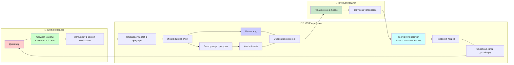

#design #ui/ux #tools #workflow #sketch #prototyping #handoff

---
## Sketch

### Определение
**Sketch** — это профессиональный векторный инструмент для дизайна интерфейсов (UI/UX), эксклюзивно доступный на macOS. Разработанный компанией Sketch B.V., он стал одним из пионеров в области цифрового дизайна и на протяжении многих лет остается популярным выбором среди дизайнеров и студий по всему миру . Для [[iOS]]-разработчика Sketch является источником правды о визуальной составляющей приложения: макеты экранов, цветовая палитра, типографика, иконки и логика переходов.

Sketch предлагает комплексный подход к дизайну: нативное приложение для создания и прототипирования на Mac, а также веб-инструменты для обмена, получения обратной связи и передачи спецификаций разработчикам .

### Зачем это знать iOS-разработчику?
Хотя в последние годы Figma набрала большую популярность, Sketch по-прежнему широко используется во многих компаниях и студиях. Понимание этого инструмента необходимо для эффективной работы:

1.  **Инспекция макетов:** Получение точных размеров, отступов, цветов и свойств текста из дизайн-макетов.
2.  **Экспорт ресурсов:** Выгрузка иконок и изображений в нужных форматах ([[PNG]], [[SVG]], [[PDF]]) для интеграции в [[Xcode]]-проект.
3.  **Понимание структуры:** Анализ того, как дизайнер построил интерфейс (использование символов, стилей, стеков), что помогает создавать более чистый и переиспользуемый код.
4.  **Тестирование прототипов:** Просмотр и тестирование интерактивных прототипов на реальном устройстве через сопутствующее приложение **Sketch — View and Mirror** .

---

### Sketch vs Figma: Ключевые отличия для разработчика

Хотя оба инструмента решают схожие задачи, у них есть архитектурные и философские различия, которые важно учитывать.

| Характеристика | Sketch | Figma |
|---|---|---|
| **Платформа** | Нативное приложение для macOS  | Веб-ориентированная, работает в браузере |
| **Файлы** | Локальные файлы (с возможностью синхронизации через Workspace)  | Облачные по умолчанию |
| **Доступ для разработчика** | Через веб-приложение для просмотра и передачи спецификаций (handoff)  | Через браузер с расширенным Dev Mode |
| **Совместная работа** | Реалтайм-коллаборация доступна  | Реалтайм-коллаборация изначальная |
| **iOS приложение** | **Sketch — View and Mirror** — для просмотра дизайнов, тестирования прототипов и зеркалирования с Mac  | **Figma Mirror** — для просмотра прототипов |

---

### Основные концепции (в контексте передачи разработчику)

#### 1. Артборды (Artboards)
Аналог экранов приложения. Дизайнер создает отдельный артборд для каждого состояния интерфейса (главный экран, профиль, настройки). Разработчик видит точные размеры экрана (например, iPhone 15 Pro) и компоновку элементов внутри .

#### 2. Символы (Symbols)
Мощнейший инструмент переиспользования, аналог компонентов в коде. Дизайнер создает символ для кнопки, и все экземпляры этой кнопки во всем проекте связаны. Изменение мастер-символа обновляет все копии. Разработчик должен создать в коде соответствующий переиспользуемый класс (например, `PrimaryButton.swift`) .

#### 3. Стили (Shared Styles)
Глобальные определения цветов и текста. Дизайнер задает стиль "Заголовок H1" с определенным шрифтом, размером и цветом. Разработчик переносит эти стили в код как константы (например, `enum Typography { ... }` или `UIFont` экстеншены) .

#### 4. Библиотеки (Libraries)
Позволяют шарить символы и стили между разными документами. В больших проектах это основа дизайн-системы .

#### 5. Прототипирование (Prototyping)
Встроенный инструмент для создания интерактивных связей между артбордами. Дизайнер может задать, что по клику на кнопку происходит переход на другой экран или появляется оверлей (меню, попап) .

#### 6. Инструменты для разработчика (Handoff)
Веб-интерфейс Sketch, где разработчик может открыть документ, кликнуть на любой слой и увидеть все его параметры: размеры, позицию, цвет в HEX, CSS-свойства, типографику, а также экспортировать ассеты .

---

### Схема рабочего процесса (Дизайнер в Sketch -> Разработчик)



---

### Примеры от простого к сложному

#### Уровень 1: Инспекция простого элемента (Карточка товара)
Предположим, дизайнер создал карточку товара в Sketch и загрузил её в Workspace.

1.  **Доступ:** Ты получаешь ссылку на документ и открываешь его в веб-приложении.
2.  **Выбор слоя:** Ты кликаешь на карточку.
3.  **Инспекция:** В правой панели ты видишь:
    - **Размеры:** Ширина: 360px, Высота: 120px.
    - **Цвет фона:** `#FFFFFF` (белый).
    - **Радиус скругления:** 12px.
    - **Тень:** С определенными параметрами (размытие, смещение, цвет).
    - **Отступы:** Внутренние отступы текста от краев карточки: 16px.

**Твои действия в коде:**
Ты создаешь [[UIView]] для карточки, устанавливаешь ей белый фон, `layer.cornerRadius = 12`, настраиваешь тень через `layer.shadow...`, и закрепляешь [[UILabel]] внутри с констрейнтами leading/trailing = 16.

#### Уровень 2: Работа с цветами и стилями текста
Дизайнер использовал в Sketch глобальные стили.

1.  **Цвета:** В инспекторе ты видишь, что цвет кнопки — это не просто [[HEX]], а стиль с именем `Brand / Primary` (#2C3E50). Это подсказка для тебя.
2.  **Текст:** Заголовок карточки использует стиль `Heading / Small` (SF Pro Text, Bold, 16pt, цвет #1A1A1A).

**Твои действия в коде:**
Ты создаешь `extension` [[UIColor]] с константой `.brandPrimary` и `extension` [[UIFont]] или `enum` для стилей текста, чтобы использовать их во всем проекте, а не разбрасываться магическими числами.

#### Уровень 3: Экспорт векторной иконки (PDF)
Дизайнер нарисовал иконку "Настройки" как векторный слой.

1.  **Экспорт:** В веб-приложении ты выделяешь иконку, в панели экспорта выбираешь формат **[[PDF]]** (для сохранения векторных свойств) и нажимаешь "Export".
2.  **Интеграция:** Ты добавляешь скачанный PDF-файл в `Assets.xcassets` в Xcode.
3.  **Использование:** Используешь его в [[UIImageView]]. [[Xcode]] автоматически создаст нужные растровые копии для всех разрешений экрана.

```swift
let settingsIcon = UIImage(named: "icon_settings")
let imageView = UIImageView(image: settingsIcon)
imageView.tintColor = .brandPrimary // Красим векторную иконку в цвет бренда
```

#### Уровень 4: Понимание структуры (Символы и переиспользование)
В макете ты видишь, что одна и та же кастомная кнопка используется на 10 разных экранах. В Sketch она является **Символом**.

**Вывод для разработчика:** Не нужно верстать эту кнопку 10 раз. Нужно создать один класс `CustomButton.swift` и использовать его везде. Если дизайнер изменит символ (например, радиус скругления), обновятся все кнопки в макете. Ты должен стремиться к такому же уровню переиспользования в коде.

#### Уровень 5: Тестирование прототипа на устройстве (Sketch — View and Mirror)
Дизайнер добавил в прототип сложную анимацию перехода или новый паттерн навигации.

1.  **Подключение:** Ты устанавливаешь на свой iPhone приложение **Sketch — View and Mirror**, входишь в тот же аккаунт, что и в Sketch на Mac .
2.  **Зеркалирование:** Дизайнер открывает макет на Mac и начинает редактирование. На твоем iPhone автоматически отображается текущий выбранный артборд .
3.  **Тестирование:** Ты можешь нажимать на интерактивные элементы на телефоне и проверять, как работает прототип, ощущать переходы и жесты в реальном контексте. Это позволяет выявить неудобные или нелогичные моменты еще до этапа написания кода.

---

### Важные нюансы и Best Practices

1.  **Не путай с другими приложениями:** В App Store есть другое приложение "Sketch Pro: скетчбук, рисовать", предназначенное для рисования и иллюстраций, а не для UI/UX дизайна . Наш инструмент — это **Sketch** от компании Sketch B.V. .
2.  **Подписка:** Sketch перешел на подписочную модель. Для доступа к Workspace и веб-инструментам для разработчиков требуется активная подписка .
3.  **Плагины:** У Sketch огромное сообщество и более 1000 плагинов, которые могут автоматизировать экспорт, генерировать данные или подготавливать ассеты .
4.  **CSS экспорт:** Инспектор Sketch умеет показывать CSS-свойства для выбранного слоя, что может быть полезно для понимания, как сверстать сложный элемент .
5.  **Темная тема (Dark Mode):** В Sketch есть поддержка цветовых профилей, включая P3 . Однако, как и в Figma, адаптация под темную тему обычно реализуется созданием отдельных артбордов или использованием специальных плагинов/системных возможностей, а не автоматически.

### Итог
**Sketch** — это мощный, проверенный временем инструмент для дизайна интерфейсов, глубоко интегрированный в экосистему Mac. Для iOS-разработчика умение читать Sketch-документы, извлекать из них параметры верстки и экспортировать ресурсы — важный навык, особенно при работе в проектах, где дизайн-команда отдает предпочтение этому инструменту. Наличие выделенного iOS-приложения для просмотра и зеркалирования делает процесс сверки с дизайном и тестирования прототипов максимально удобным .