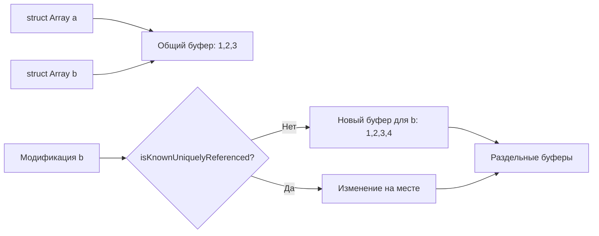

**Copy-On-Write** — техника, при которой коллекции **делят один буфер памяти** до момента изменения. Копия создаётся **только при первой мутации**.

### Встроенный COW в [[Swift]]

Применяется автоматически к:

- [[Array]]
- [[Dictionary]]
- [[Set]]
- [[String]]

```swift
var a = [1, 2, 3]       // один буфер
var b = a               // b → тот же буфер (без копии!)
b.append(4)             // здесь копируется → теперь разные буферы
print(a)                // [1, 2, 3]
print(b)                // [1, 2, 3, 4]
```

### Как это работает под капотом



### Ключевые свойства COW

| Свойство                          | Что происходит                              |
|-----------------------------------|---------------------------------------------|
| Присваивание / передача в функцию | **Без копирования** (shared buffer)         |
| Чтение (get, subscript)           | **Без копирования**                         |
| Первая мутация (append, remove…)  | **Копирование** → новый буфер               |
| Проверка уникальности             | `isKnownUniquelyReferenced(&storage)`       |
| Дополнительная память             | Только при реальной мутации                 |

### Реальная польза в [[iOS]]

```swift
func process(items: [Product]) {
    var copy = items            // O(1) — shared
    // много чтения
    copy.sort { $0.price < $1.price }  // копирование только здесь
    // дальнейшая работа с copy
}
```

### Своя реализация COW (Box + isKnownUniquelyReferenced)

```swift
final class Box<T> {
    var value: T
    init(_ value: T) { self.value = value }
}

struct MyArray<T> {
    private var box: Box<[T]>
    
    init(_ elements: [T]) {
        box = Box(elements)
    }
    
    mutating func append(_ element: T) {
        if !isKnownUniquelyReferenced(&box) {
            box = Box(box.value)
        }
        box.value.append(element)
    }
    
    var count: Int { box.value.count }
}
```

### Итог — коротко

- **COW** — стандарт для коллекций [[Swift]]
- **Присваивание** → бесплатно (shared)
- **Мутация** → копирование только при необходимости
- **Экономия**: огромная для больших массивов/словарей
- **Свой COW** → через `Box<T>` + `isKnownUniquelyReferenced`
- **Проверяй** в Instruments → если много копирований без мутации → COW работает

**Главное правило 2026**:  
«Передавай коллекции по значению — Swift сам позаботится об эффективности благодаря COW.»
