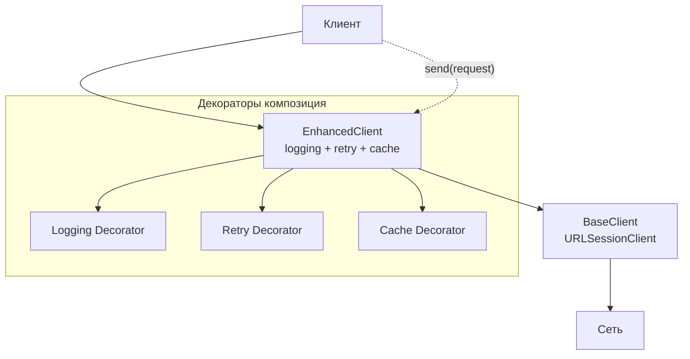

Decorator решает две главные проблемы:

- **Добавление поведения объекту динамически**, без изменения его класса  
- **Расширение функциональности без нарушения принципа открытости/закрытости ([[Open-Closed Principle|OCP]])**  

Самые частые сценарии в [[iOS]]-приложениях 2026 года, где Decorator активно используется:

- обёртывание сетевых запросов (добавление логирования, авторизации, кэширования, метрик, retry, timeout)  
- декорирование UI-компонентов (добавление индикатора загрузки, ошибки, пустого состояния)  
- добавление логирования / аналитики / трассировки в существующие сервисы  
- реализация middleware-подобных цепочек (как в [[TCA]], [[Alamofire]], [[URLSession]])  
- тестирование (добавление моков поведения без изменения оригинального класса)

### 2. Классическая структура паттерна Decorator (4 элемента)

| Компонент             | Роль в классическом паттерне                            | Актуальность в Swift 2026                   |
| --------------------- | ------------------------------------------------------- | ------------------------------------------- |
| **Component**         | Протокол / базовый интерфейс                            | Обязателен ([[Protocol]])                   |
| **ConcreteComponent** | Основной объект, который будем декорировать             | Обычно [[struct]] / [[class]] / [[actor]]   |
| **Decorator**         | Базовый класс/структура, содержащая ссылку на Component | Чаще всего **не нужен** как отдельный класс |
| **ConcreteDecorator** | Конкретные обёртки, добавляющие поведение               | Основная часть реализации                   |

**Важно**: в современном Swift **Decorator** почти никогда не реализуется в классическом виде с отдельным базовым классом `Decorator`.  
Вместо этого используют:

- **композицию** (вложение)  
- **протоколы с [[default]]-реализацией**  
- **Result Builder** (для цепочек)  
- **функциональные обёртки** (closures / higher-order functions)

### 3. Самые популярные и рекомендуемые реализации Decorator в Swift 2026

#### Вариант 1 — Классический Decorator (всё ещё встречается, но редко)

```swift
protocol HTTPClient {
    func send(_ request: URLRequest) async throws -> (Data, URLResponse)
}

class URLSessionClient: HTTPClient {
    func send(_ request: URLRequest) async throws -> (Data, URLResponse) {
        try await URLSession.shared.data(for: request)
    }
}

// Базовый декоратор (часто опускают)
class HTTPClientDecorator: HTTPClient {
    let client: HTTPClient
    
    init(client: HTTPClient) {
        self.client = client
    }
    
    func send(_ request: URLRequest) async throws -> (Data, URLResponse) {
        try await client.send(request)
    }
}

// Конкретный декоратор — логирование
class LoggingClient: HTTPClientDecorator {
    override func send(_ request: URLRequest) async throws -> (Data, URLResponse) {
        print("→ \(request.httpMethod ?? "GET") \(request.url?.absoluteString ?? "")")
        let result = try await client.send(request)
        print("← \(result.1)")
        return result
    }
}

// Использование
let client = LoggingClient(client: URLSessionClient())
_ = try await client.send(URLRequest(url: URL(string: "https://api.com")!))
```

**Минусы в 2026**: много boilerplate, не idiomatic.

#### Вариант 2 — Самый популярный и рекомендуемый — **функциональная обёртка** (closure-based Decorator)

```swift
typealias HTTPClient = (URLRequest) async throws -> (Data, URLResponse)

func logging(_ client: @escaping HTTPClient) -> HTTPClient {
    return { request in
        print("→ \(request.httpMethod ?? "GET") \(request.url?.absoluteString ?? "")")
        let result = try await client(request)
        print("← \(result.1)")
        return result
    }
}

func retry(maxAttempts: Int = 3, _ client: @escaping HTTPClient) -> HTTPClient {
    return { request in
        for attempt in 1...maxAttempts {
            do {
                return try await client(request)
            } catch {
                if attempt == maxAttempts { throw error }
                try await Task.sleep(for: .seconds(1))
            }
        }
        fatalError("Unreachable")
    }
}

// Композиция декораторов (очень популярно в 2026)
let baseClient: HTTPClient = { request in
    try await URLSession.shared.data(for: request)
}

let enhancedClient = logging(
    retry(
        baseClient
    )
)

_ = try await enhancedClient(URLRequest(url: URL(string: "https://api.com")!))
```

**Преимущества**:
- минимум boilerplate  
- полная композиция (можно складывать декораторы как функции)  
- легко тестировать (передаём closure-моки)  
- идеально сочетается с async/await

#### Вариант 3 — Самый современный и idiomatic в 2026 — **протокол + default-реализация + композиция**

```swift
protocol HTTPClient {
    func send(_ request: URLRequest) async throws -> (Data, URLResponse)
}

extension HTTPClient {
    func sendWithLogging(_ request: URLRequest) async throws -> (Data, URLResponse) {
        print("→ \(request.httpMethod ?? "GET") \(request.url?.absoluteString ?? "")")
        let result = try await send(request)
        print("← \(result.1)")
        return result
    }
    
    func sendWithRetry(maxAttempts: Int = 3, _ request: URLRequest) async throws -> (Data, URLResponse) {
        for attempt in 1...maxAttempts {
            do {
                return try await send(request)
            } catch {
                if attempt == maxAttempts { throw error }
                try await Task.sleep(for: .seconds(1))
            }
        }
        fatalError("Unreachable")
    }
}

// Реальные клиенты
struct URLSessionClient: HTTPClient {
    func send(_ request: URLRequest) async throws -> (Data, URLResponse) {
        try await URLSession.shared.data(for: request)
    }
}

// Использование — цепочка методов
let client = URLSessionClient()
let result = try await client
    .sendWithRetry()
    .sendWithLogging(URLRequest(url: URL(string: "https://api.com")!))
```

**Преимущества**:
- **extension** на протокол — добавляем поведение без изменения классов  
- цепочка методов — читаемо и красиво  
- легко комбинировать в любом порядке  
- полностью соответствует **OCP** (Open-Closed Principle)

### 4. Визуальная схема Decorator (2026 стиль)



### 5. Лучшие практики Decorator в Swift 2026

- **Предпочитай функциональные обёртки** ([[closure]]-based) или **extension на протокол**  
- **Result Builder** — если нужен DSL-подобный синтаксис (как в [[Alamofire]], [[Kingfisher]], [[TCA]])  
- **Композиция** — складывай декораторы как функции  
- **Не делай глубокое наследование** — максимум 1–2 уровня  
- **Тестирование** — моки через протоколы или замыкания — очень просто  
- **Swift 6 strict concurrency** — декораторы должны быть Sendable или использовать actor  
- **Документируйте** — пишите в документации «декоратор добавляет логирование / retry / cache»

**Короткий девиз 2026**:
> «Decorator в 2026 году — это когда ты говоришь: «я хочу добавить поведение объекту, но не трогать его код».  
> Самый популярный стиль — функциональные обёртки (closures) + extension на протокол.  
> Классический наследственный Decorator почти не используется.»
