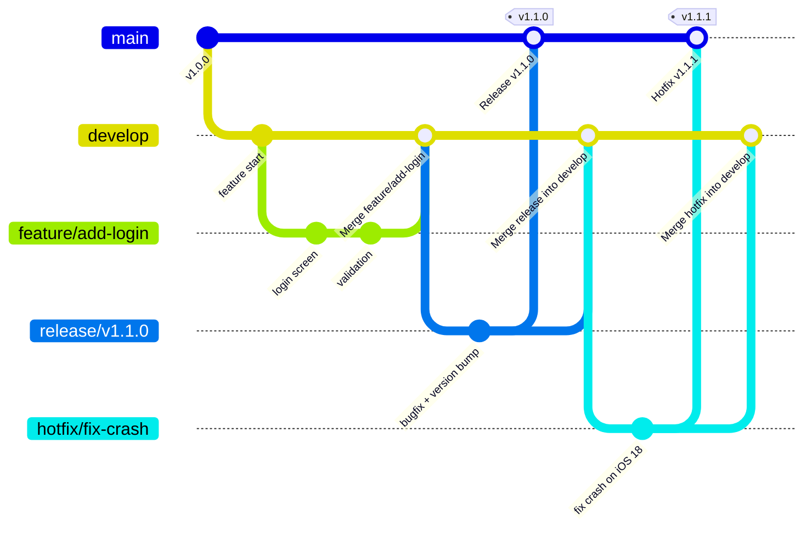

**Git Flow** — это модель ветвления и рабочий процесс, предложенный **Винсентом Дриессеном** (nvie) в 2010 году в статье [«A successful Git branching model»](https://nvie.com/posts/a-successful-git-branching-model/).

С тех пор она стала **де-факто стандартом** для многих команд в 2010–2018 годах, а после появления GitHub Flow и trunk-based development её популярность немного снизилась, но она всё ещё активно используется в проектах с чёткими циклами релизов (мобильные приложения, десктоп, enterprise).

### 2. Основные ветки Git Flow (схема)



### 3. Основные ветки и их назначение

| Ветка            | Стабильность | Назначение                                                                 | Откуда берётся | Куда мержится                     | Теггируется? |
|------------------|--------------|----------------------------------------------------------------------------|----------------|------------------------------------|--------------|
| **main** / **master** | Стабильная   | Только production-релизы, каждый коммит = новая версия приложения          | —              | ← release и hotfix                 | Да (vX.Y.Z)  |
| **develop**      | Разработка   | Интеграционная ветка: все фичи и исправления попадают сюда перед релизом   | ← main         | → release, ← feature/hotfix/release | Нет          |
| **feature/***    | Временная    | Разработка новой фичи или задачи (одна ветка = одна задача)                | ← develop      | → develop                          | Нет          |
| **release/***    | Предрелизная | Финальное тестирование, фиксы багов, подготовка к релизу                   | ← develop      | → main + develop                   | Да (vX.Y.Z-rc1) |
| **hotfix/***     | Критическая  | Срочное исправление бага в production                                      | ← main         | → main + develop                   | Да (vX.Y.Z+1) |

### 4. Полный жизненный цикл Git Flow (пример релиза v1.1.0)

1. Разработка идёт в **develop**
2. Создаём фичу:

```bash
git checkout develop
git switch -c feature/add-biometrics
# ... работа ...
git commit -m "feat: добавить биометрию"
```

3. Завершаем фичу и мержим:

```bash
git checkout develop
git merge --no-ff feature/add-biometrics
git branch -d feature/add-biometrics
```

4. Готовим релиз:

```bash
git checkout develop
git switch -c release/v1.1.0
# финальные фиксы, обновление версии, changelog
git commit -m "chore: prepare release v1.1.0"
```

5. Выпускаем релиз:

```bash
git checkout main
git merge --no-ff release/v1.1.0
git tag v1.1.0
git push origin main --tags

git checkout develop
git merge --no-ff release/v1.1.0
git branch -d release/v1.1.0
```

6. Срочный hotfix в production:

```bash
git checkout main
git switch -c hotfix/fix-crash-on-launch
# фиксим баг
git commit -m "fix: crash on launch when no network"
git checkout main
git merge --no-ff hotfix/fix-crash-on-launch
git tag v1.1.1
git push origin main --tags

git checkout develop
git merge --no-ff hotfix/fix-crash-on-launch
git branch -d hotfix/fix-crash-on-launch
```

### 5. Сравнение Git Flow с современными альтернативами (2026)

| Модель          | Кол-во постоянных веток | Подходит для                                  | Преимущества                      | Недостатки                                        | Популярность 2026                     |
| --------------- | ----------------------- | --------------------------------------------- | --------------------------------- | ------------------------------------------------- | ------------------------------------- |
| **Git Flow**    | 2 (main + develop)      | Чёткие релизы (мобильные приложения, десктоп) | Понятная структура, release-ветки | Много мержей, сложнее для одиночных разработчиков | Средняя (enterprise, большие команды) |
| **GitHub Flow** | 1 (main)                | Continuous Deployment, веб-проекты            | Простота, быстрые PR              | Нет явной стабильной develop-ветки                | Высокая (веб, open-source)            |
| **Trunk-based** | 1 (main/trunk)          | Очень частые релизы                           | Максимальная скорость             | Требует сильного [[CI]]/[[CD]] и feature flags    | Очень высокая (Google, Meta, Netflix) |
| **GitLab Flow** | 1–2 (main + production) | GitLab-ориентированные команды                | Гибрид Git Flow + [[GitHub]] Flow | Зависимость от [[GitLab]]                         | Средняя                               |

### 6. Лучшие практики Git Flow в 2026 году

- Используйте **--no-ff** при мержах (сохраняет историю веток)
- Обязательно делайте **release-ветки** для финального тестирования и hotfix’ов
- Используйте **Conventional Commits** для сообщений:
  - `feat: добавить биометрию`
  - `fix: краш при пустом списке`
  - `chore: обновить зависимости`
- Автоматизируйте тегирование и changelog (git cliff, semantic-release)
- Защищайте **main** и **develop** — требуйте Pull Request + ревью + CI
- Для одиночных проектов или микросервисов переходите на **GitHub Flow** или **Trunk-based**

**Короткий девиз 2026**:
> «Git Flow — это когда у тебя есть чёткие релизы каждые 2–4 недели.  
> Если ты деплоишь 10 раз в день — тебе нужен Trunk-based или GitHub Flow.  
> Но если ты выпускаешь приложение в App Store раз в месяц — Git Flow до сих пор отличный выбор.»
