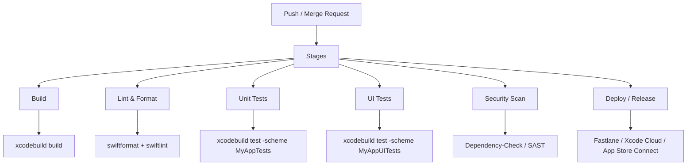

GitLab — это **единая платформа DevOps** (от идеи до продакшена), которая включает:

- Git-хостинг  
- Merge Requests (аналог PR)  
- Встроенный [[CI]]/[[CD]] (GitLab CI)  
- Issue Boards / Epics / Roadmaps  
- Container Registry + Package Registry  
- Security & Compliance (SAST, DAST, Secret Detection)  
- Pages (статические сайты)  
- Wiki  
- Self-hosted / SaaS варианты

GitLab — **единственная платформа**, которая предлагает **всё в одном месте** без необходимости подключать 10+ внешних сервисов.

### 2. Сравнение [[GitHub]] vs GitLab (2026, для [[iOS]]/[[Swift]])

| Критерий                              | GitHub (Microsoft)                              | GitLab (GitLab Inc.)                            | Победитель для iOS/Swift 2026 |
|---------------------------------------|--------------------------------------------------|--------------------------------------------------|--------------------------------|
| Бесплатный приватный репозиторий      | Неограниченно, до 3 участников бесплатно        | Неограниченно, без ограничения участников       | GitLab                         |
| CI/CD скорость (macOS runners)        | Самые быстрые macOS-раннеры в мире              | Хорошие, но медленнее GitHub                     | GitHub                         |
| Xcode Cloud интеграция                | Отличная (GitHub как источник)                  | Поддерживается, но хуже                          | GitHub                         |
| Swift Package Manager Registry        | GitHub Packages — быстро и удобно               | GitLab Package Registry — тоже хорошо            | Ничья                          |
| Copilot / AI-помощник                 | GitHub Copilot Workspace + Copilot X — лидер    | GitLab Duo — хороший, но слабее                  | GitHub                         |
| Self-hosted вариант                   | GitHub Enterprise Server — очень дорого         | GitLab Community Edition — бесплатно             | GitLab                         |
| Цена для команды 10+ человек          | Team $4/user/mo, Enterprise — дорого            | Premium $29/user/mo, Ultimate $99/user/mo        | GitHub (дешевле базовый)       |
| Security (SAST/DAST/Secret Detection) | CodeQL + Dependabot + Secret Scanning           | Ultimate — полный набор                          | GitLab Ultimate                |
| Встроенный Container Registry         | GitHub Container Registry                       | GitLab Container Registry — мощнее               | GitLab                         |
| Встроенный Package Registry           | GitHub Packages                                 | GitLab Package Registry — поддержка SwiftPM      | GitLab                         |
| Встроенный CI/CD                      | GitHub Actions                                  | GitLab CI — мощнее и гибче                       | GitLab                         |
| Auto DevOps / Auto Deploy             | Нет                                             | Да (очень мощно)                                 | GitLab                         |

### 3. GitLab CI/CD — схема типичного пайплайна для iOS/Swift



Пример `.gitlab-ci.yml` для iOS-проекта (2026)

```yaml
stages:
  - lint
  - build
  - test
  - deploy

variables:
  XCODE_VERSION: "16.0"

lint:
  stage: lint
  image: macos-13-xcode:16.0
  script:
    - swiftformat --config .swiftformat .
    - swiftlint --strict --config .swiftlint.yml

unit-tests:
  stage: test
  image: macos-13-xcode:16.0
  script:
    - xcodebuild test \
        -scheme MyApp \
        -destination 'platform=iOS Simulator,name=iPhone 16' \
        -skipPackagePluginValidation

ui-tests:
  stage: test
  image: macos-13-xcode:16.0
  script:
    - xcodebuild test \
        -scheme MyAppUITests \
        -destination 'platform=iOS Simulator,name=iPhone 16'

deploy-staging:
  stage: deploy
  image: macos-13-xcode:16.0
  rules:
    - if: $CI_COMMIT_BRANCH == "develop"
  script:
    - fastlane beta  # или deploy to TestFlight
```

### 4. Когда GitLab выигрывает у GitHub (iOS/Swift 2026)

- Команда > 10 человек и нужен **self-hosted** (GitLab CE бесплатно)  
- Требуется **очень мощный CI/CD** с Auto DevOps, параллельными пайплайнами  
- Нужен **встроенный Container Registry + Package Registry** для приватных SPM-пакетов  
- Требуется **глубокий security scanning** (SAST, DAST, Dependency Scanning)  
- Компания уже использует GitLab (enterprise-политика)  
- Хотите **всё в одном месте** без интеграций с 10+ сервисами

### 5. Когда GitHub всё ещё побеждает (iOS/Swift 2026)

- Максимальная **скорость macOS CI** (GitHub-hosted runners быстрее)  
- Полная интеграция с **[[Xcode]] Cloud**  
- Лучший **AI-помощник** (GitHub Copilot Workspace + Copilot X)  
- Дешевле для средних команд ($4 vs $29/user/mo)  
- Самая большая экосистема (Actions Marketplace, 10 000+ actions)  
- Самый простой старт для инди-разработчиков и open-source

### 6. Лучшие практики GitLab для iOS/Swift 2026

- Используйте **GitLab Runners** с macOS (self-hosted или GitLab-hosted)  
- Настройте **Auto DevOps** для простых проектов  
- Включите **Dependabot-подобный** (Renovate или GitLab Renovate)  
- Используйте **Merge Trains** для параллельного мержа нескольких MR  
- Защищайте **main** и **develop** — требуйте MR + ревью + pipeline success  
- Для приватных SPM-пакетов — используйте **GitLab Package Registry**  
- Для CI/CD — кэшируйте **DerivedData**, **SPM**, **Pods**  
- Используйте **Environments** + **Releases** для TestFlight/App Store

**Короткий девиз 2026**:
> «GitHub — для скорости, удобства и iOS-экосистемы.  
> GitLab — для полного контроля, self-hosted и мощного встроенного DevOps.  
> Для большинства [[Swift]]-команд в 2026 — GitHub всё ещё проще и быстрее.  
> Но если нужен self-hosted или всё-в-одном — GitLab выигрывает.»
