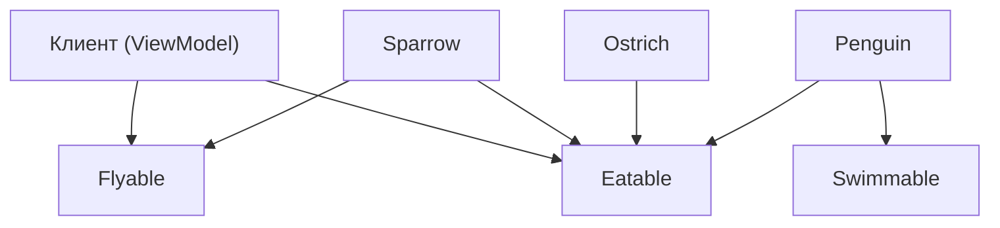

**LSP** (принцип подстановки Барбары Лисков) — третий принцип [[SOLID]].

Формулировка (самая точная и современная):

> **Объекты подтипов должны быть взаимозаменяемы с объектами базового типа без изменения корректности программы.**

Перевод на язык [[Swift]] 2026:

- Если [[class]]/[[struct]]/[[actor]] **реализует протокол** или **наследуется** от другого типа,  
- то объект этого подтипа должен работать **везде**, где ожидается объект базового типа,  
- **без изменения поведения программы**,  
- **без дополнительных проверок типа** (`is`, `as?`, `as!`),  
- **без неожиданных исключений** и **без нарушения пред/постусловий**.

**Самый короткий и честный девиз 2026**:
> «Если ты написал, что твой тип реализует протокол/наследует класс — будь добр, веди себя точно так же, как базовый тип, иначе это нарушение LSP.»

### 2. Почему LSP в 2026 году стал ещё важнее

| Проблема без LSP (классический «жирный» подкласс)                                                                                                                          | Последствия в Swift 6+ (2026)                | Как LSP + протоколы решают проблему                                    |
| -------------------------------------------------------------------------------------------------------------------------------------------------------------------------- | -------------------------------------------- | ---------------------------------------------------------------------- |
| Подкласс выбрасывает `fatalError()` / `preconditionFailure()`                                                                                                              | Краш в [[Runtime]], нарушение предусловий    | Используем маленькие протоколы — ненужные методы просто не реализуются |
| Подкласс меняет смысл метода (например, возвращает [[nil]] там, где базовый — нет)                                                                                         | Скрытые баги, нарушение контракта            | Протоколы фиксируют контракт → компилятор помогает                     |
| Подкласс добавляет новые требования (precondition)                                                                                                                         | Нарушение LSP → код ломается при подстановке | LSP запрещает сужение предусловий                                      |
| Swift 6 strict concurrency → конфликт изоляции                                                                                                                             | Ошибки компиляции при передаче подтипов      | Узкие протоколы + [[Sendable]] / `actor` = чисто                       |
| [[TCA]] / [[VIPER Architecture\|VIPER]] / [[Clean Swift (VIP) Architecture\|Clean Swift]] / [[MVVM (Model-View-ViewModel) Architecture\|MVVM]]-[[Coordinator]] требуют LSP | Без LSP архитектура разваливается            | LSP — основа чистой архитектуры                                        |

**Вывод 2026**:  
LSP — это уже **не рекомендация**, а **обязательное условие** для любого качественного кода в Swift 6+, особенно если вы используете TCA, Clean Architecture, VIPER или пишете библиотеку.

### 3. Классический антипаттерн — нарушение LSP

```swift
protocol Bird {
    func fly()
    func eat()
}

class Sparrow: Bird {
    func fly() { print("Воробей летит") }
    func eat() { print("Воробей ест") }
}

class Ostrich: Bird {
    func fly() {
        fatalError("Страус не летает!") // ← нарушение LSP
    }
    
    func eat() { print("Страус ест") }
}

func makeBirdFly(_ bird: Bird) {
    bird.fly() // ожидается, что полетит
}

let ostrich = Ostrich()
makeBirdFly(ostrich) // → краш, хотя тип Bird
```

**Нарушения**:
- `Ostrich` **не может** заменить `Bird` без изменения поведения программы  
- `makeBirdFly` ломается при подстановке подтипа → нарушение LSP

### 4. Правильная реализация LSP — маленькие протоколы + композиция

```swift
protocol Flyable {
    func fly()
}

protocol Eatable {
    func eat()
}

class Sparrow: Flyable, Eatable {
    func fly() { print("Воробей летит") }
    func eat() { print("Воробей ест") }
}

class Ostrich: Eatable {
    func eat() { print("Страус ест") }
    // НЕ реализует Flyable — LSP соблюдается
}

func makeFly(_ bird: Flyable) {
    bird.fly() // гарантированно полетит
}

makeFly(Sparrow()) // ок
makeFly(Ostrich()) // ошибка компиляции — правильно!
```

**Преимущества**:
- `Ostrich` **не реализует** ненужный метод → нет `fatalError`  
- `makeFly` работает **только** с теми, кто действительно летает  
- Расширение → добавили `Penguin: Eatable, Swimmable` — ничего не ломается  
- Тесты → мок только нужный протокол

### 5. Реальный iOS-пример 2026 года (VIPER / Clean Swift / TCA)

```swift
// Узкие протоколы

protocol UserFetching {
    func fetchCurrentUser() async throws -> User
}

protocol UserSaving {
    func saveUser(_ user: User) async throws
}

protocol ImageLoading {
    func loadImage(from url: URL) async throws -> UIImage
}

// ViewModel зависит только от нужных протоколов
@MainActor
class ProfileViewModel: ObservableObject {
    @Published var user: User?
    @Published var avatar: UIImage?
    
    private let userFetcher: any UserFetching
    private let userSaver: any UserSaving
    private let imageLoader: any ImageLoading
    
    init(
        userFetcher: any UserFetching,
        userSaver: any UserSaving,
        imageLoader: any ImageLoading
    ) {
        self.userFetcher = userFetcher
        self.userSaver = userSaver
        self.imageLoader = imageLoader
    }
    
    func loadProfile() async {
        do {
            let user = try await userFetcher.fetchCurrentUser()
            self.user = user
            
            if let url = user.avatarURL {
                avatar = try await imageLoader.loadImage(from: url)
            }
        } catch {
            // обработка
        }
    }
}
```

**LSP соблюдается**:
- Можно подставить **любую** реализацию `UserFetching` без изменения поведения  
- Тесты → мок только нужный протокол  
- Расширение → новая фича «share profile» → добавляем протокол `ProfileSharing`, не трогаем старый код

### 6. Визуальная схема LSP (2026 стиль)



- Клиент зависит **только** от тех протоколов, которые ему нужны  
- Подтипы реализуют **только нужные** протоколы  
- Нет «мёртвых» методов → LSP соблюдается

### 7. Лучшие практики LSP в Swift 2026

- **Протоколы** — **маленькие** (2–5 методов максимум)  
- **Названия** — конкретные: `UserFetching`, `ImageLoading`, `AnalyticsTracking`  
- **Один протокол — одна ответственность**  
- **Композиция вместо наследования** — класс реализует несколько протоколов  
- **Тестирование** — моки через протоколы — маленькие и точные  
- **Swift 6 strict concurrency** — протоколы должны быть `Sendable` при передаче между задачами  
- **Не бойтесь** создавать 10–20 протоколов вместо одного «God Protocol»  
- **Документируйте** — пишите в документации протокола «узкоспециализированный интерфейс для X»

**Короткий девиз 2026**:
> «LSP в 2026 году — это когда ты говоришь: «мой подтип можно подставить вместо базового — и ничего не сломается».  
> Без маленьких протоколов в Swift 6+ писать качественный, тестируемый и расширяемый код уже считается плохим тоном.»
