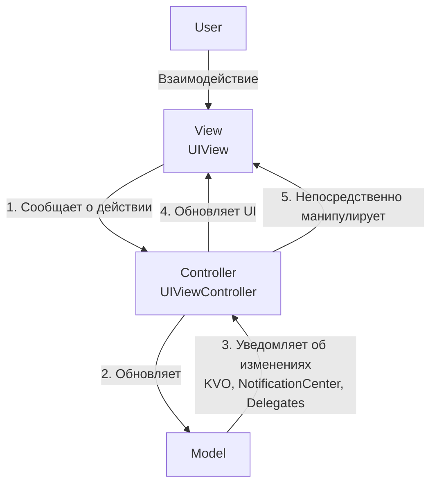
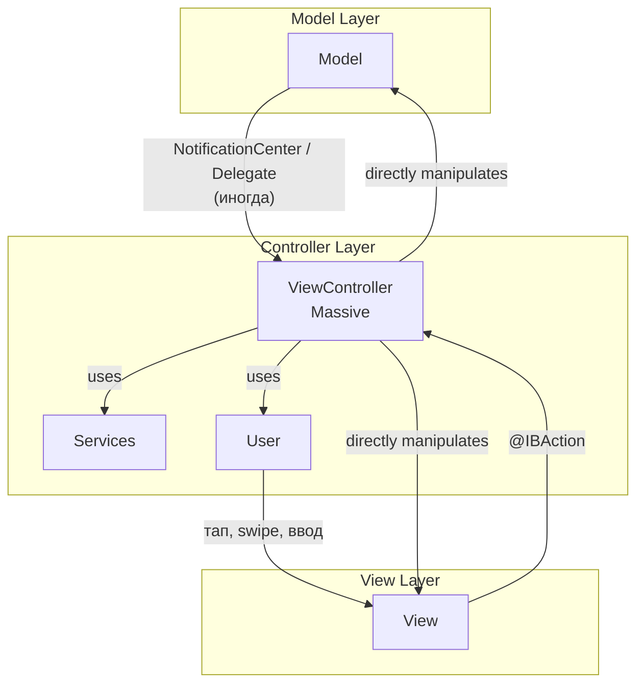

**Стандартный архитектурный шаблон, который Apple рекомендует и на котором построены [[UIKit]] и AppKit.** Он разделяет логику приложения на три основных компонента: **Model** (данные), **View** (отображение) и **Controller** (посредник). В [[iOS]]-разработке его часто называют "Massive View Controller" из-за распространенной проблемы, когда Controller берет на себя слишком много ответственности.

---

### **1. Взаимодействие компонентов**

В идеальном MVC поток данных должен быть строгим и однонаправленным. Однако в реализации Apple (иногда называемой "Cocoa MVC") View и Model сильно отделены друг от друга, а Controller выступает центральным хабоm.



**Последовательность шагов (Идеальный MVC):**

1.  **Пользовательское действие (User Action):** Пользователь взаимодействует с **View** (тап по кнопке, ввод текста). View сообщает об этом **Controller**'у, но не знает, что он сделает в ответ. (На практике в iOS это часто делается через [[@IBAction]], который сразу ведет в метод Controller'а).

2.  **Обработка в Controller (Business Logic):** **Controller** получает событие, обрабатывает его и решает, как изменить **Model** (бизнес-данные) или **View** (интерфейс).
    *   *Пример:* `userDidTapLoginButton(...) -> controller.validateInputs() -> controller.update(model:)`

3.  **Обновление Model (Data Change):** **Controller** изменяет состояние **Model**.
    *   *Пример:* `model.isLoggedIn = true`

4.  **Реакция Model (Notification):** **Model** уведомляет об своих изменениях заинтересованные стороны. В классическом MVC — это Controller, который подписан на изменения Model. (На практике в [[iOS]] это часто опускается, и Controller сам обновляет View после изменения Model).
    *   *Способы уведомления:* [[KVO]], [[NotificationCenter]], [[Swift/Теория/Swift/Standart Library/Delegate]], [[callback]].

5.  **Обновление View (UI Update):** На основе изменений в **Model**, **Controller** обновляет **View**.
    *   *Пример:* `controller.tableView.reloadData()` или `controller.nameLabel.text = model.userName`

**Реальный поток в Apple MVC:**
На практике шаги 3 и 4 часто пропускаются. Controller напрямую манипулирует и Model, и View, становясь центром всей логики, что и leads to "Massive View Controller".

---

### **2. Схема архитектуры (Как это часто бывает на практике)**



---

### **3. Термины и ключевые моменты**

#### **Ключевые компоненты:**
*   **Model:** Представляет данные и бизнес-логику приложения. Это структуры или классы (User, Product), а также сервисы, которые работают с этими данными (NetworkManager, PersistenceManager). **Не должна знать о существовании View или Controller.**
*   **View:** Отвечает за визуальное отображение данных и взаимодействие с пользователем. Это [[UIView]] и его сабклассы ([[UILabel]], [[UIButton]]). View должна быть максимально "глупой" — она отображает то, что ей говорят, и сообщает о действиях пользователя. **Не должна содержать логику или напрямую обращаться к Model.**
*   **Controller (ViewController):** Посредник между View и Model. Его задачи:
    *   Обрабатывать пользовательские действия от View.
    *   Управлять жизненным циклом View.
    *   Обновлять Model на основе действий пользователя.
    *   Обновлять View на основе изменений в Model.
    *   В iOS-реализации на него ложится огромное количество ответственности.

#### **Проблема "Massive View Controller":**
В классической реализации Apple Controller неизбежно становится большим и перегруженным, потому что он:
*   Работает с жизненным циклом View (`viewDidLoad`, `viewDidAppear`).
*   Является делегатом и источником данных для таблиц и коллекций ([[UITableViewDelegate]], [[UITableViewDataSource]]).
*   Обрабатывает пользовательский ввод.
*   Управляет навигацией.
*   Работает с сетью и базой данных.
*   Форматирует данные для отображения.

#### **Сильные стороны:**
*   **Простота понимания:** Концептуально простой паттерн, с которого начинают все iOS-разработчики.
*   **Низкий порог входа:** Не требует глубоких знаний дополнительных концепций.
*   **Поддержка Apple:** Является стандартом де-факто для UIKit, все туториалы и документация от Apple используют его.
*   **Скорость разработки:** Для небольших экранов или простых приложений это самый быстрый способ что-то сделать.

#### **Слабые стороны:**
*   **Massive View Controller:** Главная проблема. Controllers становятся слишком большими, сложными и трудными для тестирования.
*   **Низкая тестируемость:** Поскольку бизнес-логика часто находится в Controller, который тесно связан с UIKit, его очень сложно покрыть unit-тестами.
*   **Нарушение принципа единственной ответственности:** Controller делает всё, что приводит к spaghetti-коду.
*   **Плохая переиспользуемость:** Код, завязанный на конкретный Controller, сложно использовать в другом месте.

---

### **4. Пример структуры файлов в [[Xcode]] (на практике)**

```
SimpleApp/
├── Models/
│   ├── User.swift
│   └── Product.swift
├── Views/
│   ├── CustomTableViewCell.swift
│   └── CustomButton.swift
├── Controllers/
│   ├── LoginViewController.swift // Massive файл с IBAction, UITableViewDelegate,
│   └── ProfileViewController.swift // Network calls, Business logic и т.д.
└── Services/
    └── NetworkManager.swift
```

---

### **5. Важное от себя (Практические советы)**

*   **MVC — это не плохо, это по-другому.** Для маленьких проектов, прототипов или простых экранов это абсолютно валидный и эффективный выбор.
*   **Боритесь с "Massiveness":** Даже оставаясь в рамках MVC, можно писать чистый код:
    *   **Выносите DataSource и [[Swift/Теория/Swift/Standart Library/Delegate]]:** Создавайте отдельные классы для [[UITableViewDataSource]]/[[UITableViewDelegate]].
    *   **Используйте Child ViewControllers:** Дробите сложные экраны на несколько дочерних ViewController'ов.
    *   **Выносите логику в отдельные классы:** Создавайте `Manager`'ы, `Service`'ы, `Helper`'ы для сетевых запросов, работы с данными, валидации. Controller должен только orchestrate их работу.
    *   **Категории (Extensions):** Делите большой Controller на логические части с помощью `// MARK: -` и extensions.
*   **Model-View-Controller+Model:** Старайтесь хотя бы не забывать про Model. Выносите данные и простую логику в отдельные структуры, а не храните всё в свойствах Controller'а.
*   **Это отправная точка.** Понимание проблем MVC мотивирует изучать и применять более сложные паттерны ([[MVVM (Model-View-ViewModel) Architecture]], [[MVP (Model-View-Presenter) Architecture]], [[VIPER Architecture]]) для больших и сложных проектов.
*   **SwiftUI — это новый взгляд.** [[SwiftUI]] представляет собой более современный и декларативный подход, который во многом решает проблемы классического MVC, смешивая черты MVVM и [[MVI (Model-View-Intent) Architecture]].

---
