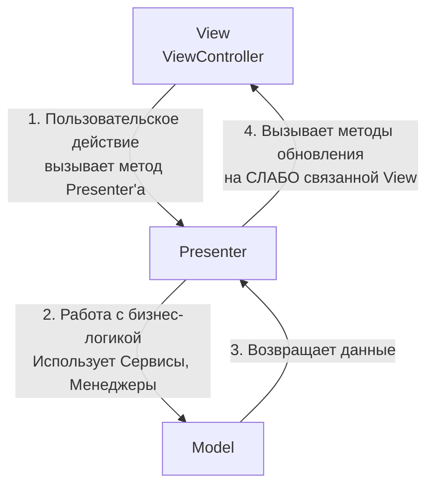
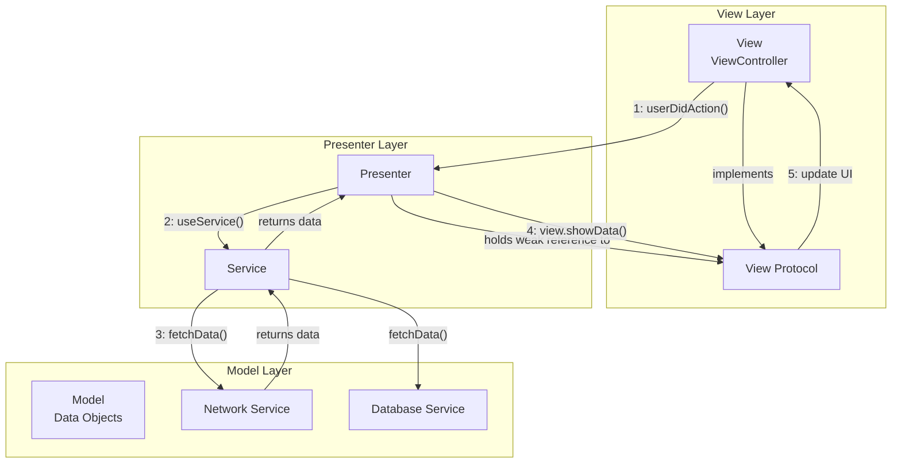

**Архитектурный паттерн, являющийся эволюцией классического [[MVC (Model-View-Controller) Architecture]]. Его ключевая цель — разгрузить Massive View Controller путем вынесения всей логики обновления интерфейса в отдельный класс — Presenter.** View становится пассивным и делегирует все действия Presenter'у.

---

### **1. Взаимодействие компонентов**

Взаимодействие в MVP строится на строгом соглашении между View и Presenter через протоколы. Поток данных двусторонний, но инициируется всегда View.



**Последовательность шагов:**

1.  **Пользовательское действие (User Action):** Пользователь взаимодействует с элементами UI на View ( которая является ViewController'ом). View **не обрабатывает логику**, а сразу передает событие в Presenter, вызывая его метод.
    *   *Пример:* `@objc func didTapLoginButton() { presenter.didTapLogin(username: nameTextField.text, password: passTextField.text) }`

2.  **Обработка в Presenter (Business Logic):** Presenter получает событие и содержит всю логику приложения. Он решает, что делать дальше. Он может обратиться к различным **сервисам** (сетевым, базы данных) для выполнения работы.
    *   *Пример:* `func didTapLogin(username: String?, password: String?) { authService.login(...) { ... } }`

3.  **Подготовка данных (Data Formatting):** Получив сырые данные от сервисов (Model layer), Presenter форматирует их для отображения (конвертирует даты, вычисляет итоги, определяет, что показывать пользователю).

4.  **Инструкция View (Update Command):** Presenter **не обновляет UI напрямую**. Вместо этого он обращается к **протоколу View** (который реализует ViewController) и вызывает заранее определенные методы для обновления состояния.
    *   *Пример:* `view?.showError(message: "Неверный пароль")` или `view?.showUserProfile(user: formattedUser)`

5.  **Обновление UI (UI Update):** ViewController, реализуя протокол, получает команду от Presenter'а и **тупо** выполняет ее, обновляя элементы интерфейса.
    *   *Пример (в теле ViewController):* `func showError(message: String) { errorLabel.isHidden = false; errorLabel.text = message }`

---

### **2. Схема архитектуры**



---

### **3. Термины и ключевые моменты**

#### **Ключевые компоненты:**
*   **Model:** Представляет данные приложения и бизнес-логику низкого уровня (как и в других паттернах). Это структуры данных (User, Product) и сервисы, которые с ними работают (NetworkManager, DatabaseManager).
*   **View:** Отвечает только за отображение UI и передачу пользовательских событий. **Пассивна и не содержит логики.** В [[iOS]] это практически всегда ViewController, который **реализует специальный протокол** (например, `LoginViewProtocol`). Это слабая ссылка в Presenter.
*   **Presenter:** "Мозг" экрана. Содержит всю логику представления и обработки событий. Он получает события от View, работает с Model, подготавливает данные и передает команды назад View через протокол. **Никогда не импортирует [[UIKit]]** и поэтому легко тестируется.
*   **View Protocol:** Ключевой элемент MVP, обеспечивающий слабую связность. Это контракт, в котором объявлены все методы для обновления UI (показать лоадер, отобразить ошибку, показать данные). Presenter работает только с этим протоколом, а не с конкретным ViewController.

#### **Важные принципы:**
*   **Слабая связность через протоколы:** Presenter знает только о существовании протокола View, но не о конкретной реализации. Это позволяет легко подменять View для тестов (например, создавать Mock-View) и делает код гибким.
*   **Пассивная View:** View "глупая". Ее единственная задача — отрисовывать то, что ей велят, и сообщать о событиях.
*   **100% покрытие логики юнит-тестами:** Поскольку Presenter является чистым Swift-объектом, его можно полностью протестировать без мокков UIKit. View тестируется через тесты UI (Snapshot tests).

#### **Отличие от MVVM:**
*   **MVP:** Обновление View происходит через **ручной вызов методов** протокола (`view.showData()`). Это императивный подход.
*   **[[MVVM (Model-View-ViewModel) Architecture]]:** Обновление View происходит через **реактивную привязку (data binding)** к свойствам ViewModel (`viewModel.data`.sink {...}`). Это декларативный подход.

#### **Сильные стороны:**
*   **Полное избавление от Massive View Controller:** ViewController становится легким и содержит только UI-код.
*   **Высокая тестируемость:** Логика в Presenter'е тестируется легко и полноценно.
*   **Четкое разделение ответственности:** Все знают свою зону ответственности.
*   **Отлично подходит для UIKit:** Более естественно ложится на [[UIKit]], чем MVVM, так как не требует реактивного подхода (хотя его можно добавить).

#### **Слабые стороны:**
*   **Ручная работа:** Необходимо вручную описывать протоколы View и все методы для обновления UI. Это создает больше бойлерплейта по сравнению с реактивной привязкой в MVVM.
*   **Риск создания "Massive Presenter":** Если не следить, вся логика переедет из ViewController'а в Presenter, просто сменив прописку. Нужно дробить логику по сервисам и Use Cases.

---

### **4. Пример структуры файлов в [[Xcode]]**

```
LoginModule/
├── LoginViewController.swift       // View (импортирует UIKit)
├── LoginPresenter.swift            // Presenter (не импортирует UIKit)
├── LoginViewProtocol.swift         // View Protocol
├── LoginModels.swift               // Model (структуры Data)
└── Services/
    └── AuthService.swift           // Сервис, используемый Presenter'ом
```

**Содержание файла `LoginViewProtocol.swift`:**
```swift
protocol LoginViewProtocol: AnyObject {
    func showLoading()
    func hideLoading()
    func showError(_ message: String)
    func navigateToHome()
}
```

---

### **5. Важное от себя (Практические советы)**

*   **Всегда держите ссылку на View как `weak`:** Чтобы избежать цикла сильных ссылок ([[retain cycle]]), Presenter должен хранить ссылку на View только как слабую ([[weak]]) ссылку на протокол.
    *   `class LoginPresenter { weak var view: LoginViewProtocol? }`
*   **Используйте инъекцию зависимостей:** Передавайте сервисы в Presenter через инициализатор. Это упрощает тестирование.
    *   `init(authService: AuthServiceProtocol, view: LoginViewProtocol)`
*   **Не забывайте про главный поток (Main Thread):** Presenter работает с асинхронными сервисами. При возврате результата и вызове методов View обязательно диспатчьтесь на главную очередь, так как обновление UI можно делать только из нее.
    *   `DispatchQueue.main.async { self.view?.hideLoading() }`
*   **Композиция с Router/Coordinator:** Для навигации добавьте к MVP Router. Presenter может иметь ссылку на Router и говорить ему: "открой следующий экран", передавая необходимые данные. Сам Presenter при этом не должен знать о том, как именно этот экран создается и показывается.
*   **MVP — отличный выбор для legacy-проектов:** Если у вас большой старый проект на MVC и вы хотите начать его рефакторить, MVP — идеальный первый шаг. Вы можете экран за экраном выносить логику в Presenter, не ломая всю архитектуру приложения и не добавляя сложные reactive-фреймворки.

---
