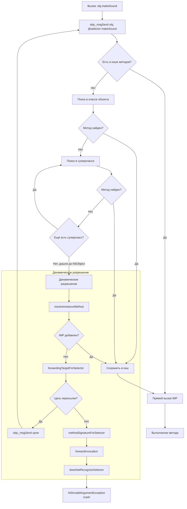

**Message Dispatch** (или **objc_msgSend**-диспетчеризация) — это **самый динамический** механизм вызова методов в экосистеме [[Objective-C]] и [[Swift]].

Вместо прямого вызова функции или таблицы виртуальных методов (vtable), сообщение отправляется объекту в виде:

> «Эй, объект, выполни метод с именем makeSound»

Объект сам решает, какой именно код выполнить.

Это позволяет:
- переопределять методы в runtime  
- добавлять методы в runtime (method [[Swizzling]], категории)  
- поддерживать [[KVO]], [[Delegate]], notifications и т.д.

### 2. Как работает Message Dispatch (objc_msgSend)

1. **Селектор (SEL)** — это уникальный идентификатор метода (по сути, C-строка с именем метода + типами параметров).
2. Объект получает сообщение через `objc_msgSend(obj, selector, args...)`.
3. [[Runtime]] ищет реализацию метода в **кэше методов** объекта.
4. Если не нашёл — идёт по **классу → суперклассу → [[NSObject]]** (ищет в метод-листе).
5. Если нашёл — вызывает.
6. Если не нашёл — вызывает `resolveInstanceMethod` / `forwardingTargetForSelector` / `forwardInvocation` (runtime magic).

Схема (Mermaid):



### 3. Когда в [[Swift]] включается Message Dispatch

Message Dispatch работает **только** в следующих случаях:

| Условие                                      | Диспетчеризация       | Пример |
|----------------------------------------------|------------------------|--------|
| Класс наследуется от `NSObject`              | Message (objc_msgSend) | `class MyView: UIView` |
| Метод помечен `@objc` или `dynamic`          | Message                | `@objc func didTap()` |
| Протокол помечен `@objc`                     | Message                | `@objc protocol Delegate` |
| Метод `override` в подклассе NSObject-класса | Message                | `override func viewDidLoad()` |
| Нет `@objc` и не наследуется от NSObject     | Table Dispatch (witness/vtable) | `protocol SoundMaker` |

### 4. Полные примеры кода

#### Пример 1 — Базовый Message Dispatch

```swift
import Foundation

class Animal: NSObject {
    @objc func makeSound() {
        print("Generic animal sound")
    }
}

class Dog: Animal {
    @objc override func makeSound() {
        print("Woof!")
    }
}

let animal: Animal = Dog()
animal.makeSound()                  // Woof! (Message Dispatch)

// Альтернативный способ (явный селектор)
animal.perform(#selector(Animal.makeSound))  // Woof!
```

#### Пример 2 — Method Swizzling (классика [[Objective-C]] [[Runtime]])

```swift
import Foundation

extension UIViewController {
    static func swizzleViewDidLoad() {
        guard let original = class_getInstanceMethod(UIViewController.self, #selector(viewDidLoad)),
              let swizzled = class_getInstanceMethod(UIViewController.self, #selector(swizzled_viewDidLoad)) else {
            return
        }
        
        method_exchangeImplementations(original, swizzled)
    }
    
    @objc func swizzled_viewDidLoad() {
        print("viewDidLoad вызван для \(self)")
        swizzled_viewDidLoad()  // вызов оригинального метода
    }
}

// В AppDelegate или где-то при запуске
UIViewController.swizzleViewDidLoad()
```

#### Пример 3 — Forwarding (перенаправление сообщения)

```swift
class Proxy: NSObject {
    var realObject: AnyObject?
    
    override func forwardingTarget(for aSelector: Selector!) -> Any? {
        return realObject
    }
}

let proxy = Proxy()
proxy.realObject = Dog()
proxy.makeSound?()  // Woof! (сообщение перенаправлено Dog)
```

### 5. Сравнение всех видов диспетчеризации в Swift 2026

| Тип диспетчеризации         | Скорость | Размер кода | Полиморфизм | Можно override? | Примеры                      |
| --------------------------- | -------- | ----------- | ----------- | --------------- | ---------------------------- |
| [[Direct Dispatch]]         | ★★★★★    | Минимальный | Нет         | Нет             | `final`, `static`, `private` |
| [[Table Dispatch]] (vtable) | ★★★★☆    | Средний     | Да          | Да              | Обычные методы классов       |
| [[Witness Table Dispatch]]  | ★★★★☆    | Средний     | Да          | Да              | Протоколы без @objc          |
| Message Dispatch            | ★★☆☆☆    | Большой     | Да          | Да              | `@objc`, `dynamic`, NSObject |

### 6. Лучшие практики 2026 года (Swift 6+)

- Используйте **Message Dispatch** **только** там, где нужен Objective-C runtime:
  - [[KVO]]
  - [[Delegate]] (старый [[UIKit]])
  - Method swizzling
  - Доступ из Objective-C
- В новом коде предпочитайте **Table Dispatch** (`override func` без `@objc`)
- Для максимальной производительности — **final**, **static**, **private**, **some**
- Избегайте `@objc dynamic` в горячих путях (UI-обновления, рендеринг, циклы)
- В [[SwiftUI]] — `some View`, `some ViewModel` — статическая диспетчеризация
- В Swift 6 strict concurrency — минимизируйте `any` и `@objc` — они усложняют проверку потокобезопасности

**Короткий девиз 2026**:
> «Message Dispatch — это магия [[Objective-C]] [[Runtime]]: гибкость за счёт скорости.  
> В [[Swift]] 2026 используй его только когда нужен [[Swizzling]], [[KVO]] или совместимость с Obj-C.  
> Всё остальное — final, static, some, witness table.»
