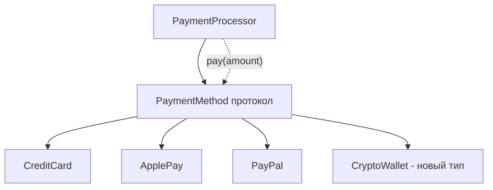

**OCP** — второй принцип [[SOLID]], сформулированный Бертраном Мейером в 1988 году, а Роберт Мартин популяризировал его в 2000-х.

Классическая формулировка:

> **Программные сущности (классы, модули, функции и т.д.) должны быть открыты для расширения, но закрыты для модификации.**

Перевод на язык [[Swift]] 2026:

- Код должен позволять **добавлять новую функциональность** без изменения уже написанного и протестированного кода  
- Расширение происходит через **новые типы**, **новые протоколы**, **композицию** или **делегирование**, а не через правку старых классов  
- Любое изменение существующего кода (особенно в продакшене) — это **риск регрессии**, поэтому OCP минимизирует такие изменения

**Самый короткий и честный девиз 2026**:
> «Хочешь новую фичу — пиши **новый** класс/протокол/реализацию, а **не трогай** старый код.»

### 2. Почему OCP в 2026 году стал ещё критичнее

| Проблема без OCP (классический «монолитный» класс)                                                                  | Последствия в Swift 6+ (2026)                           | Как OCP решает проблему                       |
| ------------------------------------------------------------------------------------------------------------------- | ------------------------------------------------------- | --------------------------------------------- |
| Добавление новой фигуры → правка `AreaCalculator`                                                                   | Регрессия в старых тестах, [[data race]] при concurrent | Расширение через новый тип + протокол         |
| Изменение [[URLSession]]-обёртки ломает 50 ViewModel                                                                | Массовые краши / race detector красный                  | Подстановка новой реализации без правки VM    |
| Swift 6 strict concurrency → конфликт изоляции при правке класса                                                    | Ошибки компиляции везде                                 | OCP + [[actor]] + маленькие протоколы = чисто |
| [[TCA]] / Composable Architecture / [[Clean Swift (VIP) Architecture\|Clean Swift]] / [[VIPER Architecture\|VIPER]] | Требуют OCP как основу                                  | Без OCP архитектура не работает               |
| Поддержка нескольких фич (A/B-тесты, feature flags)                                                                 | Невозможно без правки кода                              | OCP → новые реализации под feature flag       |

**Вывод 2026**:  
OCP — это уже **не рекомендация**, а **обязательное условие** для любого приложения, которое:
- живёт дольше 1 года  
- имеет команду > 3 человек  
- использует [[Swift]] 6+ strict concurrency  
- следует TCA / Clean Swift / VIPER

### 3. Классический антипаттерн — «модификация вместо расширения»

```swift
class PaymentProcessor {
    func process(_ amount: Double, method: String) {
        if method == "credit_card" {
            print("Оплата картой: \(amount)")
        } else if method == "apple_pay" {
            print("Оплата Apple Pay: \(amount)")
        } else if method == "paypal" {
            print("Оплата PayPal: \(amount)")
        } else if method == "crypto" {  // ← новая фича
            print("Оплата криптой: \(amount)")  // ← изменение старого кода!
        }
    }
}
```

**Нарушения OCP**:
- Добавление «crypto» → правим существующий класс  
- Риск сломать «credit_card» и «apple_pay»  
- Тесты на старые методы могут упасть  
- Новый разработчик боится трогать `PaymentProcessor`

### 4. Правильная реализация OCP — расширение через протоколы

```swift
protocol PaymentMethod {
    func process(amount: Double)
}

struct CreditCard: PaymentMethod {
    func process(amount: Double) {
        print("Оплата картой: \(amount)")
    }
}

struct ApplePay: PaymentMethod {
    func process(amount: Double) {
        print("Оплата Apple Pay: \(amount)")
    }
}

struct PayPal: PaymentMethod {
    func process(amount: Double) {
        print("Оплата PayPal: \(amount)")
    }
}

// Новый метод оплаты — новый тип, старый код не трогаем
struct CryptoWallet: PaymentMethod {
    func process(amount: Double) {
        print("Оплата криптой: \(amount)")
    }
}

class PaymentProcessor {
    private let method: any PaymentMethod
    
    init(method: any PaymentMethod) {
        self.method = method
    }
    
    func pay(amount: Double) {
        method.process(amount: amount)
    }
}

// Использование
let processor = PaymentProcessor(method: CreditCard())
processor.pay(amount: 99.99)

// Добавили крипту — просто новый объект
let cryptoProcessor = PaymentProcessor(method: CryptoWallet())
cryptoProcessor.pay(amount: 0.001)
```

**Преимущества**:
- Новый способ оплаты → **новый тип**, старый код **не меняется**  
- Тесты на `CreditCard` остаются зелёными  
- Легко добавлять feature flags / A/B-тесты  
- Полное соответствие OCP

### 5. Реальный iOS-пример 2026 года (VIPER / Clean Swift / TCA)

```swift
// Протокол — точка расширения
protocol ImageLoadingService {
    func loadImage(from url: URL) async throws -> UIImage
}

// Базовая реализация
actor URLSessionImageLoader: ImageLoadingService {
    func loadImage(from url: URL) async throws -> UIImage {
        let (data, _) = try await URLSession.shared.data(from: url)
        guard let image = UIImage(data: data) else {
            throw URLError(.badServerResponse)
        }
        return image
    }
}

// Новая реализация (например, с кэшированием)
actor CachedImageLoader: ImageLoadingService {
    private let cache = NSCache<NSURL, UIImage>()
    
    func loadImage(from url: URL) async throws -> UIImage {
        if let cached = cache.object(forKey: url as NSURL) {
            return cached
        }
        
        let image = try await URLSessionImageLoader().loadImage(from: url)
        cache.setObject(image, forKey: url as NSURL)
        return image
    }
}

// ViewModel не меняется при добавлении новых loader’ов
@MainActor
class ImageViewModel: ObservableObject {
    @Published var image: UIImage?
    
    private let loader: any ImageLoadingService
    
    init(loader: any ImageLoadingService = URLSessionImageLoader()) {
        self.loader = loader
    }
    
    func load(from url: URL) async {
        do {
            image = try await loader.loadImage(from: url)
        } catch {
            // обработка
        }
    }
}

// Внедрение разных реализаций
let vm1 = ImageViewModel()                    // обычный
let vm2 = ImageViewModel(loader: CachedImageLoader())  // с кэшем — расширение без изменения VM
```

### 6. Визуальная схема OCP (2026 стиль)



- `PaymentProcessor` зависит **только** от абстракции (`PaymentMethod`)  
- Новые способы оплаты → **новые типы**, старый код **не трогаем**

### 7. Лучшие практики OCP в Swift 2026

- **Протоколы** — точка расширения (делай их маленькими, 2–5 методов)  
- **Зависимости** — впрыскивай через [[init]] (constructor injection)  
- **Наследование** — минимизируй, предпочитай **композицию** и **протоколы**  
- **Feature flags / A/B-тесты** → новые реализации протоколов  
- **Тестирование** — легко мокать узкие протоколы  
- **Swift 6 strict concurrency** — OCP + actor + маленькие протоколы = почти 100% отсутствие data race  
- **Не бойтесь** создавать 10–20 протоколов вместо одного «God [[Protocol]]»  
- **Документируйте** — пишите в документации протокола «точка расширения для новых реализаций»

**Короткий девиз 2026**:
> «OCP в 2026 году — это когда ты добавляешь новую фичу, **не трогая** старый, уже протестированный код.  
> Без OCP в Swift 6+ писать долгоживущее, поддерживаемое и масштабируемое приложение уже считается плохим тоном.»
