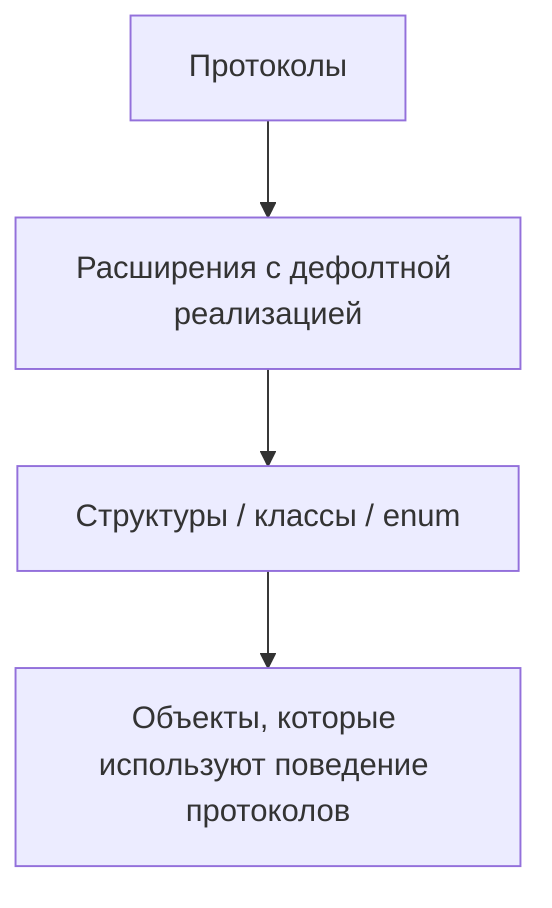

**POP (Protocol-Oriented Programming)** — это парадигма программирования, где **основной строительный блок — протоколы**, а не классы.

Особенности:

- В [[Swift]] протоколы могут определять **требования к свойствам и методам**, а также предоставлять **дефолтные реализации через extensions**.
    
- Позволяет **композицию поведения**, а не наследование.
    
- Часто используется вместе с **[[Value Type]]** (структуры и перечисления), но работает и с классами.
    
- Цель: **повторное использование кода без жесткой иерархии наследования**, что делает код более безопасным и модульным.
    

---

## 🔹 Примеры кода

### 1. Простейший протокол и его реализация

```swift
protocol Greetable {
    func greet()
}

struct Person: Greetable {
    var name: String
    func greet() {
        print("Hello, my name is \(name)")
    }
}

let alice = Person(name: "Alice")
alice.greet() // Hello, my name is Alice
```

---

### 2. Протокол с дефолтной реализацией через extension

```swift
protocol Drawable {
    func draw()
}

extension Drawable {
    func draw() {
        print("Default drawing")
    }
}

struct Circle: Drawable {}
struct Rectangle: Drawable {
    func draw() {
        print("Custom rectangle drawing")
    }
}

Circle().draw()      // Default drawing
Rectangle().draw()   // Custom rectangle drawing
```

---

### 3. Композиция нескольких протоколов

```swift
protocol Flyable {
    func fly()
}
protocol Swimmable {
    func swim()
}

struct Duck: Flyable, Swimmable {
    func fly() { print("Duck is flying") }
    func swim() { print("Duck is swimming") }
}

let duck = Duck()
duck.fly()   // Duck is flying
duck.swim()  // Duck is swimming
```

---

### 4. POP vs [[OOP]] (структура + протоколы вместо наследования)

```swift
protocol Vehicle {
    var speed: Int { get }
    func drive()
}

extension Vehicle {
    func drive() {
        print("Driving at \(speed) km/h")
    }
}

struct Car: Vehicle {
    var speed: Int
}

struct Bike: Vehicle {
    var speed: Int
}

let car = Car(speed: 120)
let bike = Bike(speed: 30)

car.drive()  // Driving at 120 km/h
bike.drive() // Driving at 30 km/h
```

---

### 5. Использование POP с [[generic]] / [[AssociatedType]]

```swift
protocol Container {
    associatedtype Item
    var items: [Item] { get set }
    mutating func add(_ item: Item)
}

extension Container {
    mutating func add(_ item: Item) {
        items.append(item)
    }
}

struct IntBox: Container {
    var items: [Int] = []
}

var box = IntBox()
box.add(5)
box.add(10)
print(box.items) // [5, 10]
```

---

## 🖼 Схема работы POP



---

## 💡 Замечания

- POP позволяет избегать **жёстких иерархий наследования**, уменьшая проблемы с масштабированием.
    
- Особенно удобно с **структурами и enum**, так как Swift использует value semantics.
    
- Комбинируя протоколы, можно создавать **модульные и переиспользуемые компоненты**.
    
- POP и OOP часто используются **совместно**: классы могут реализовывать протоколы.
    

---

## 📖 Дополнительно

- [Apple Docs — Protocol-Oriented Programming in Swift](https://developer.apple.com/videos/play/wwdc2015/408/)
    
- [Ray Wenderlich — Protocol-Oriented Programming](https://www.raywenderlich.com/19905752-protocol-oriented-programming-in-swift)
    

---
