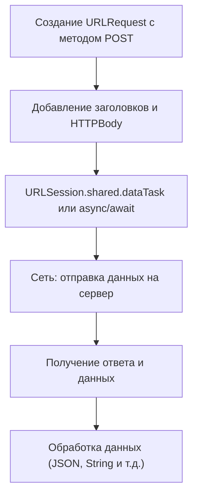

**HTTP POST** — это метод протокола [[HTTP]] для **отправки данных на сервер**.

Особенности:

- Используется для **создания или обновления ресурсов** на сервере.
    
- Данные передаются в **теле запроса ([[HTTPBody]])**.
    
- В [[iOS]] POST-запросы выполняются через [[URLSession]] или сторонние библиотеки ([[Alamofire]]).
    

---

## 🔹 Примеры кода

### 1. Простейший POST-запрос с `URLSession`

```swift
import Foundation

let url = URL(string: "https://jsonplaceholder.typicode.com/posts")!
var request = URLRequest(url: url)
request.httpMethod = "POST"
request.addValue("application/json", forHTTPHeaderField: "Content-Type")

let json: [String: Any] = ["title": "foo", "body": "bar", "userId": 1]
request.httpBody = try? JSONSerialization.data(withJSONObject: json)

let task = URLSession.shared.dataTask(with: request) { data, response, error in
    if let data = data, 
       let jsonString = String(data: data, encoding: .utf8) {
        print(jsonString)
    }
}
task.resume()
```

---

### 2. POST-запрос с проверкой HTTP Response

```swift
let task = URLSession.shared.dataTask(with: request) { data, response, error in
    if let httpResponse = response as? HTTPURLResponse {
        print("Status code: \(httpResponse.statusCode)")
    }
    if let data = data, let json = try? JSONSerialization.jsonObject(with: data) {
        print(json)
    }
}
task.resume()
```

---

### 3. POST-запрос с использованием [[Encodable]] моделей

```swift
struct Post: Codable {
    let title: String
    let body: String
    let userId: Int
}

let newPost = Post(title: "foo", body: "bar", userId: 1)
request.httpBody = try? JSONEncoder().encode(newPost)

URLSession.shared.dataTask(with: request) { data, _, _ in
    if let data = data, 
       let responsePost = try? JSONDecoder().decode(Post.self, from: data) {
        print(responsePost.title) // foo
    }
}.resume()
```

---

### 4. POST-запрос с кастомными заголовками

```swift
request.addValue("Bearer TOKEN_HERE", forHTTPHeaderField: "Authorization")
request.addValue("application/json", forHTTPHeaderField: "Accept")
```

---

### 5. Асинхронный POST-запрос с [[async]]/[[await]] ([[Swift]] 5.5+)

```swift
import Foundation

struct Post: Codable {
    let title: String
    let body: String
    let userId: Int
}

let newPost = Post(title: "async", body: "await", userId: 1)
var request = URLRequest(url: URL(string: "https://jsonplaceholder.typicode.com/posts")!)
request.httpMethod = "POST"
request.addValue("application/json", forHTTPHeaderField: "Content-Type")
request.httpBody = try? JSONEncoder().encode(newPost)

Task {
    do {
        let (data, _) = try await URLSession.shared.data(for: request)
        let responsePost = try JSONDecoder().decode(Post.self, from: data)
        print(responsePost)
    } catch {
        print(error)
    }
}
```

---

## 🖼 Схема работы POST-запроса



---

## 💡 Замечания

- POST-запросы **могут изменять данные на сервере**, в отличие от [[GET-HTTP]].
    
- Всегда указывайте `Content-Type`, если отправляете [[JSON]].
    
- Для асинхронного кода в [[Swift]] 5.5+ удобнее использовать `async/await`.
    
- В продуктивных проектах часто используют **Alamofire** для упрощения POST-запросов.
    

---

## 📖 Дополнительно

- [Apple Docs — URLSession](https://developer.apple.com/documentation/foundation/urlsession)
    
- [Apple Docs — HTTP Requests](https://developer.apple.com/documentation/foundation/url_loading_system)
    

---
