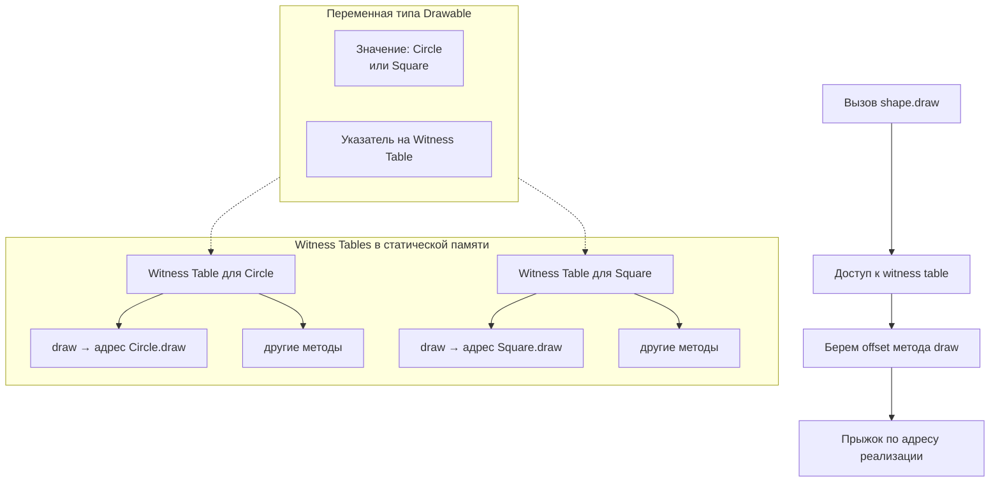

**Protocol Dispatch** — это механизм, который определяет, **какая именно реализация** метода протокола будет вызвана, когда переменная имеет тип протокола ([[any Protocol]] или [[some Protocol]]).

В [[Swift]] для протоколов существует **два основных вида диспетчеризации**:

| Вид диспетчеризации          | Время определения | Скорость | Полиморфизм | Когда используется | Таблица методов |
|------------------------------|-------------------|----------|-------------|--------------------|-----------------|
| **Static Protocol Dispatch** (ранняя / compile-time) | Компиляция        | ★★★★★    | Нет         | `some Protocol`, generics `<T: Protocol>` | Нет или witness table (оптимизировано) |
| **Dynamic Protocol Dispatch** (поздняя / runtime)   | Выполнение        | ★★★★☆    | Да          | `any Protocol` (экзистенциалы) | Witness Table   |

**Главное правило 2026 года**:
> `some Protocol` → почти всегда **статическая** диспетчеризация (или witness table, но очень быстро)  
> `any Protocol` → **динамическая** диспетчеризация через witness table

### 2. Как работает Protocol Dispatch под капотом

#### Witness Table (таблица свидетелей)

Для каждого **конкретного типа**, который реализует протокол, [[Swift]] создаёт **witness table** — таблицу соответствия:

- Требование протокола → реальная реализация метода в типе  
- Адреса функций, метаданные, размер типа и т.д.

Схема (Mermaid):



**Witness table** создаётся **однажды** для каждой пары (конкретный тип + протокол).

### 3. Примеры кода — от простого к продвинутому

#### Пример 1 — Статическая диспетчеризация ([[some]] + [[generic]])

```swift
protocol Drawable {
    func draw()
}

struct Circle: Drawable {
    func draw() { print("○") }
}

func render<T: Drawable>(_ shape: T) {  // <T: Drawable> → статическая
    shape.draw()                        // compile-time dispatch
}

let c = Circle()
render(c)  // ○ — прямой вызов Circle.draw()
```

#### Пример 2 — Динамическая диспетчеризация ([[any]])

```swift
let shapes: [any Drawable] = [Circle(), Square()]
shapes.forEach { $0.draw() }
// ○
// ■

// Здесь используется witness table → динамическая диспетчеризация
```

#### Пример 3 — [[some]] vs [[any]] (разница в диспетчеризации)

```swift
func renderSome(_ shape: some Drawable) {   // some → статическая / witness
    shape.draw()
}

func renderAny(_ shape: any Drawable) {     // any → динамическая
    shape.draw()
}

let circle = Circle()

renderSome(circle)  // быстро, компилятор знает тип
renderAny(circle)   // медленнее, используется witness table
```

#### Пример 4 — Протокол с default implementation

```swift
protocol Describable {
    func description() -> String
}

extension Describable {
    func description() -> String {      // default — статическая диспетчеризация
        return "Default description"
    }
}

struct User: Describable {
    // не переопределяем → используется default (статическая)
}

let u = User()
print(u.description())  // Default description — статическая
```

#### Пример 5 — [[@objc]] протокол ([[Message Dispatch]], а не witness)

```swift
@objc protocol Speaker {
    func speak()
}

class Dog: Speaker {
    func speak() { print("Woof") }
}

let pet: Speaker = Dog()
pet.speak()  // objc_msgSend → Message Dispatch
```

### 4. Сравнение производительности (примерные цифры 2026)

| Тип диспетчеризации             | Вызов метода (нс) | Разница с Direct | Где критично                      |
| ------------------------------- | ----------------- | ---------------- | --------------------------------- |
| Direct / Static                 | ~1–2 нс           | 1×               | Горячие циклы, рендеринг          |
| Witness Table (some / generics) | ~3–5 нс           | 2–3× медленнее   | Протоколы в обычном коде          |
| Witness Table (any)             | ~4–7 нс           | 3–4× медленнее   | Коллекции any Protocol            |
| [[Message Dispatch]] (@objc)    | ~10–20 нс         | 5–10× медленнее  | Редко, только Obj-C совместимость |

### 5. Лучшие практики и рекомендации 2026 (Swift 6+)

- **Возвращаемый тип** — **всегда** `some Protocol` (функции, computed properties)
- **Коллекции** — только `any Protocol` (и минимизируйте их в горячих путях)
- **Генерики** — `<T: Protocol>` — максимальная скорость и статическая диспетчеризация
- **@objc протоколы** — используйте только для совместимости с Obj-C
- **[[SwiftUI]]** — `some View`, `some ViewModel` — стандарт
- **Горячие пути** (UI, рендеринг, 60 fps) — избегайте `any`
- **Swift 6 strict concurrency** — `any` усложняет проверку потокобезопасности → минимизируйте

**Короткий девиз 2026**:
> «some Protocol — это когда компилятор знает тип и делает вызов быстро.  
> any Protocol — это когда тип неизвестен и приходится платить за динамику.  
> В 2026 году — some везде, где можно, any — только когда нужно хранить разные типы.»
