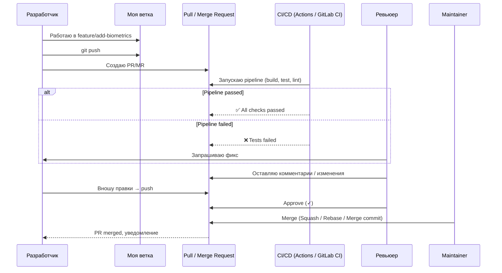

Вот **полное, подробное и максимально наглядное** руководство по **Pull Request (PR) / Merge Request (MR)** и **Code Review** в контексте Git-репозиториев ([[GitHub]], [[GitLab]], Bitbucket) — актуально на 2026 год.

### 1. Что такое Pull Request / Merge Request

**Pull Request (GitHub, Bitbucket)**  
**Merge Request (GitLab)**  
— это **формальный запрос** на включение изменений из одной ветки в другую (обычно из feature-ветки в main/develop).

Это не просто техническая операция `git merge`, а **социальный и технический процесс**:
- Обсуждение кода  
- Code Review  
- Автоматические проверки ([[CI]]/[[CD]])  
- Утверждение (approval)  
- Документирование изменений

### 2. Зачем нужны PR/MR (основные цели 2026)

| Цель                              | Почему это критично в 2026 году                                                                 |
|-----------------------------------|--------------------------------------------------------------------------------------------------|
| Code Review                       | 90% багов ловится на этапе ревью, а не в продакшене                                              |
| Знание кода в команде             | Каждый разработчик видит чужой код → меньше "мой код — чёрный ящик"                             |
| Обучение и обмен опытом           | Junior → Senior, Senior → Junior, обмен лучшими практиками                                      |
| Качество и единообразие           | SwiftLint, swiftformat, архитектура, naming — всё проверяется                                   |
| Автоматизация проверок            | CI/CD (тесты, build, lint, security scan) блокирует мерж, если что-то сломано                   |
| История принятия решений          | Весь контекст (почему так сделано, какие были сомнения) сохраняется в PR навсегда               |
| Безопасность                      | Dependabot, CodeQL, Secret Scanning запускаются именно на PR                                    |

### 3. Жизненный цикл типичного Pull Request (схема)



### 4. Лучшие практики оформления PR/MR в 2026 ([[Swift]]/[[iOS]])

**Заголовок** (Conventional Commits + кратко):

- `feat: добавить поддержку тёмной темы`
- `fix: исправить краш при пустом списке постов`
- `refactor: переписать NetworkService на async/await`
- `chore: обновить SwiftLint до 0.58`

**Описание PR** (шаблон .github/pull_request_template.md):

```markdown
## Что сделано
- Добавлена поддержка system/dark/light appearance
- Использован @Environment(\.colorScheme)
- Добавлены unit-тесты для ThemeManager

## Как тестировать
1. Переключить системную тему → приложение должно адаптироваться
2. Проверить контрастность текста на тёмном фоне
3. Запустить ThemeManagerTests

## Скриншоты / видео
(прикрепить до/после)

## Связанные задачи
Closes #123
```

**Чек-лист в PR**:

- [x] Код отформатирован (swiftformat)
- [x] SwiftLint прошёл без предупреждений
- [x] Unit-тесты проходят
- [x] UI-тесты (если есть) проходят
- [x] Нет утечек памяти (Instruments)
- [x] Добавлены/обновлены документацию/комментарии

### 5. Сравнение Merge-стратегий (GitHub/GitLab 2026)

| Стратегия          | Как выглядит история                     | Когда использовать                          | Преимущества                              | Недостатки                              |
|--------------------|------------------------------------------|---------------------------------------------|--------------------------------------------|------------------------------------------|
| **Merge commit**   | Нелинейная + merge-коммит                | Сохранение полной истории ветки             | Видно, что фича жила отдельно              | Много merge-коммитов в main              |
| **Squash & Merge** | Линейная, один коммит вместо всей ветки  | Чистая история в main                       | Main выглядит красиво                      | Теряется детальная история ветки         |
| **Rebase & Merge** | Полностью линейная история               | Максимально чистая история                  | Нет merge-коммитов                         | Опасно (переписывает хэши)               |

**Рекомендация 2026 для iOS-команд**:
- **Squash & Merge** — самый популярный выбор (чистая история main)
- **Merge commit** — если важна полная история feature-ветки
- **Rebase & Merge** — только для личных веток или очень дисциплинированных команд

### 6. Лучшие практики PR/MR в iOS/Swift 2026

- **Размер PR** — 200–400 строк кода максимум  
- **Один PR = одна задача** (feature, bugfix, refactor)  
- **Обязательные проверки** (Actions / GitLab CI):
  - swiftformat
  - swiftlint --strict
  - xcodebuild build/test
  - Dependabot / Renovate
- **Авто-мердж** для Dependabot patch/minor  
- **Требовать минимум 1 approve** + passing [[CI]]  
- **Draft PR** — для долгой работы (не забудьте снять Draft перед ревью)  
- **PR Template** — в .github/pull_request_template.md  
- **CODEOWNERS** — автоматическое назначение ревьюеров  
- **Conventional Commits** + **semantic-release** → автоматический changelog и теги

**Короткий девиз 2026**:
> «Хороший PR — это не просто код, это история, почему так сделано, как тестировали и почему именно так.  
> Маленькие PR + хороший шаблон + автоматические проверки = команда, которая не боится мержить.»
