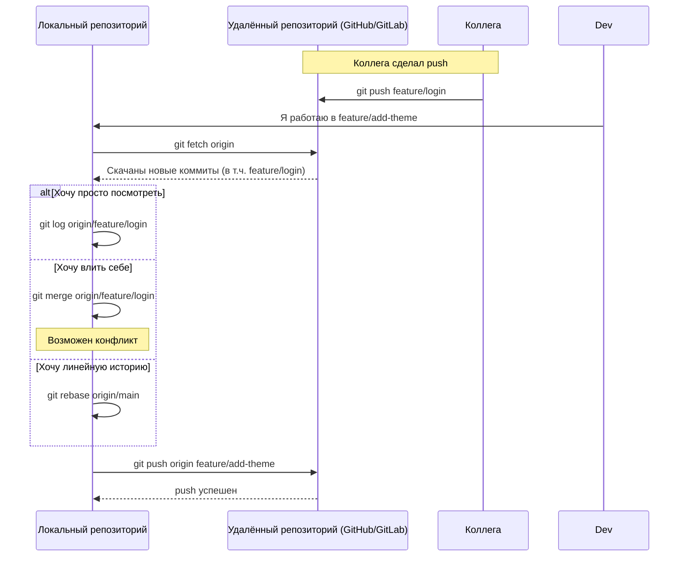

| Операция   | Что делает физически                              | Меняет ли локальные файлы? | Меняет ли историю коммитов? | Безопасно ли на общей ветке? | Самый частый сценарий в команде |
|------------|---------------------------------------------------|-----------------------------|------------------------------|-------------------------------|----------------------------------|
| **fetch**  | Скачивает объекты и историю с remote, но **не применяет** | Нет                         | Нет                          | Да (самая безопасная)         | Узнать, что изменилось у коллег |
| **pull**   | fetch + merge (или rebase)                        | Да                          | Да (если merge/rebase)       | Да (но может создать конфликты) | Обновить свою ветку перед работой |
| **push**   | Отправляет локальные коммиты на remote            | Нет                         | Нет (но может переписать историю при --force) | Нет (если --force)            | Поделиться своей работой        |
| **merge**  | Объединяет изменения из другой ветки в текущую   | Да                          | Да (merge commit)            | Да                            | Влить фичу в develop/main       |

### 2. Схема работы всех операций вместе (Mermaid)



### 3. Подробное описание каждой операции с командами и примерами

#### 3.1 git fetch — самый безопасный способ узнать, что изменилось

```bash
# Скачать все изменения со всех удалённых веток
git fetch origin

# Скачать только с конкретной ветки
git fetch origin main
git fetch origin feature/login

# Посмотреть, что появилось нового
git log --oneline --graph --decorate origin/main..main    # что есть на remote, чего нет у меня
git log --oneline main..origin/main                        # наоборот
```

**Когда использовать fetch (самые частые случаи 2026)**:
- Узнать, что сделали коллеги, перед началом работы
- Подготовиться к pull / rebase без риска конфликтов
- Проверить, можно ли уже мержить чужую фичу

#### 3.2 git pull — fetch + [[merge and rebase#Вариант 1 — git merge (рекомендуется для общей ветки)|merge]] (или [[merge and rebase#Вариант 2 — git rebase (рекомендуется только для личных веток)|rebase]])

```bash
# Классический pull = fetch + merge
git pull origin main

# Самый безопасный и рекомендуемый вариант в команде
git pull --rebase origin main   # fetch + rebase (линейная история)

# Автоматически делать rebase вместо merge при каждом pull
git config --global pull.rebase true
```

**Когда использовать pull**:
- Обновить свою ветку перед началом новой задачи
- Подтянуть изменения из main/develop в feature-ветку
- После долгого перерыва в работе

#### 3.3 git push — отправить свою работу коллегам

```bash
# Обычный push (самый частый)
git push origin feature/add-biometrics

# Первый push новой ветки (устанавливает upstream)
git push -u origin feature/add-biometrics

# Force push (опасно! только для личных веток)
git push --force-with-lease origin feature/add-biometrics
```

**--force-with-lease** — безопасная альтернатива --force:  
не перезапишет чужие коммиты, которые появились после твоего последнего fetch.

#### 3.4 git merge — влить изменения

```bash
# Переходим в целевую ветку
git checkout main

# Вливаем фичу
git merge feature/add-biometrics

# Если хотим сохранить историю ветки
git merge --no-ff feature/add-biometrics
```

### 4. Таблица: что делать в реальных ситуациях (2026)

| Ситуация                                              | Рекомендуемая последовательность команд                              | Почему именно так |
|-------------------------------------------------------|-----------------------------------------------------------------------|-------------------|
| Коллега запушил в develop, мне нужно обновиться       | git fetch → git checkout develop → git pull --rebase                 | Линейная история, минимум конфликтов |
| Я закончил фичу и хочу показать команде               | git push origin feature/my-work                                       | Простой push, открываю PR/MR |
| Перед созданием PR нужно обновить ветку с main        | git fetch → git rebase origin/main → git push --force-with-lease     | Чистая история в PR |
| В main появился hotfix, нужно влить его в свою фичу   | git fetch → git rebase origin/main                                    | Линейная история без merge-коммита |
| Хочу сохранить полную историю ветки в main            | git checkout main → git merge --no-ff feature/my-work                 | Видно, что фича жила отдельно |
| Команда использует squash-merge в main                | git push → создаю PR → maintainer squash & merge                      | Чистейшая история main |

### 5. Лучшие практики 2026 года (особенно для [[iOS]]/[[Swift]]-команд)

- **fetch → rebase** вместо pull (если ветка личная) — линейная история
- **--force-with-lease** вместо --force — защита от потери чужих коммитов
- **Squash & Merge** в main — самая популярная стратегия в iOS-командах
- **Merge --no-ff** в develop — если важна история фич
- **Protected branches** (main, develop) — require PR + rebase + passing [[CI]]
- **Conventional Commits** + **semantic-release** → автоматические версии и changelog
- **[[GitHub]] / [[GitLab]] Actions** — проверка swiftformat, [[SwiftLint]], тесты перед мержем
- **pre-commit / lefthook** — форматирование и линтинг перед коммитом

**Короткий девиз 2026**:
> «fetch — узнать, что изменилось.  
> rebase — подтянуть изменения красиво (личная ветка).  
> pull --rebase — подтянуть безопасно (общая ветка).  
> push — поделиться.  
> merge — сохранить историю.  
> squash & merge — чистая main.»
