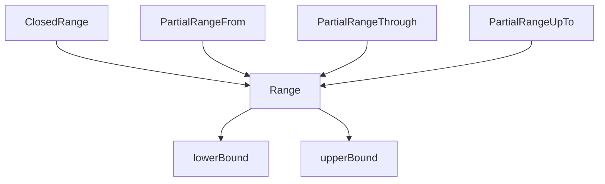

**`Range`** — это структура в [[Swift]], которая представляет **последовательность значений между двумя границами**. Она часто используется для работы с массивами, строками и циклами [[for-in]].

> Проще говоря: `Range` = «от и до», позволяет безопасно итерировать последовательности и проверять принадлежность значений.

---

## 🔹 1. Основные термины

|Термин|Описание|
|---|---|
|**Bound**|Граница диапазона (`lowerBound` и `upperBound`)|
|**Inclusive / Exclusive**|Диапазон может включать верхнюю границу (`...`) или нет (`..<`)|
|**Element**|Тип значения, который лежит в диапазоне (например, `Int`)|
|**ClosedRange**|Диапазон, включающий верхнюю границу (`a...b`)|
|**Range**|Полуоткрытый диапазон (`a..<b`) — верхняя граница не включается|
|**PartialRange**|Частичные диапазоны (`a...`, `...b`, `..<b`)|
|**Stride**|Позволяет проходить диапазон с шагом, используя `stride(from:to:by:)`|
|**contains(_:)**|Проверка принадлежности значения диапазону|

---

## 🔹 2. Основной синтаксис

### Полуоткрытый диапазон (`..<`)

```swift
let range = 0..<5
print(range.lowerBound) // 0
print(range.upperBound) // 5
```

- Включает 0, 1, 2, 3, 4
    
- Не включает 5
    

### Закрытый диапазон (`...`)

```swift
let closedRange = 0...5
print(closedRange.lowerBound) // 0
print(closedRange.upperBound) // 5
```

- Включает 0, 1, 2, 3, 4, 5
    

---

## 🔹 3. Примеры использования

### Пример 1. Итерирование через `for-in`

```swift
for i in 0..<5 {
    print(i)
}
// 0 1 2 3 4

for i in 0...5 {
    print(i)
}
// 0 1 2 3 4 5
```

- `..<` — верхняя граница исключается
    
- `...` — верхняя граница включается
    

---

### Пример 2. Проверка принадлежности

```swift
let range = 1...10
print(range.contains(5)) // true
print(range.contains(11)) // false
```

- Метод `contains(_:)` проверяет, входит ли значение в диапазон
    

---

### Пример 3. Частичные диапазоны

```swift
let array = ["a", "b", "c", "d", "e"]

let firstThree = array[0..<3] // ["a", "b", "c"]
let lastTwo = array[3...]     // ["d", "e"]
let upToThree = array[..<3]   // ["a", "b", "c"]
```

- Частичный диапазон можно использовать для slicing массивов и строк
    

---

### Пример 4. Stride — проход с шагом

```swift
for i in stride(from: 0, to: 10, by: 2) {
    print(i)
}
// 0 2 4 6 8

for i in stride(from: 0, through: 10, by: 3) {
    print(i)
}
// 0 3 6 9
```

- `to:` → верхняя граница **исключается**
    
- `through:` → верхняя граница **включается**
    

---

## 🔹 4. Range и строки

```swift
let text = "Hello, Swift!"
let startIndex = text.startIndex
let endIndex = text.index(startIndex, offsetBy: 5)
let substring = text[startIndex..<endIndex]

print(substring) // Hello
```

- Для строк диапазоны работают через `String.Index`, а не `Int`
    
- Позволяет безопасно брать подстроки без ошибок выхода за границы
    

---

## 🔹 5. Под капотом

- `Range` — это **структура**, **[[Value Type]]**
    
- Хранит **lowerBound** и **upperBound**
    
- Для `ClosedRange` хранит ту же информацию, но верхняя граница включается
    
- Частичные диапазоны (`PartialRange`) создаются как **объект с одной границей**
    
- Используется для безопасного **индекса массива и строк**, проверок и итераций
    



- Range и ClosedRange — универсальны для чисел, символов, дат и любых типов, поддерживающих Comparable
    

---

## 🔹 6. Особенности Range

1. **Value type** → копируется при присваивании
    
2. **[[generic]]** → поддерживает любой Comparable тип ([[Int]], [[Double]], [[Date]], [[Character]])
    
3. **PartialRange** → позволяет указывать только начало или конец
    
4. Используется для **итерации, slicing, проверки принадлежности**
    
5. Поддерживает `contains(_:)`, [[map]], [[filter]], `for-in`
    

---

## 🔹 7. Итог

- **Range** = диапазон значений между нижней и верхней границей
    
- Позволяет безопасно итерировать последовательности, проверять принадлежность и работать с частичными диапазонами
    
- Используется с **[[Array]], [[String]], Date, Int** и другими Comparable типами
    
