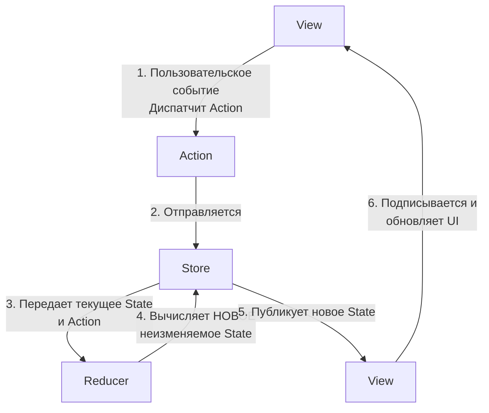
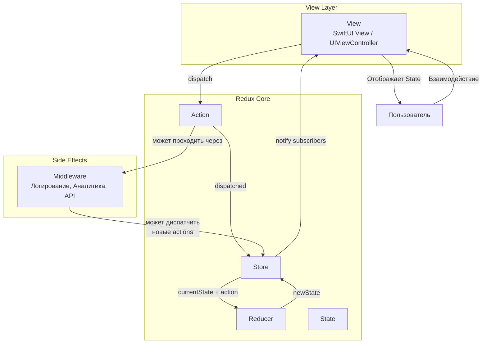

**Паттерн, который управляет состоянием всего приложения в едином централизованном хранилище (Store).** Изменение состояния происходит строго через отправку **действий (Actions)** и **редьюсеры (Reducers)**, которые вычисляют новое состояние на основе предыдущего. Идеально подходит для сложных приложений с большим количеством совместно используемого состояния.

---

### **1. Взаимодействие компонентов (Unidirectional Data Flow)**

Поток данных в Redux строго однонаправлен и следует четкому циклу. Это делает все изменения состояния предсказуемыми и легко отслеживаемыми.



**Последовательность шагов:**

1.  **Пользовательское событие (User Interaction):** Пользователь взаимодействует с интерфейсом (тап, ввод текста). View не меняет состояние напрямую, а **диспатчит (отправляет)** **Action**.
    *   *Пример:* `store.dispatch(IncrementCounterAction())`
    *   *Пример:* `store.dispatch(LoadUserProfileAction(userId: "123"))`

2.  **Action (Действие):** Простой объект (обычно [[struct]] или [[enum]]), который описывает *что произошло*. Action не содержит логики, это просто контейнер с данными о событии.
    *   *Пример:*
    ```swift
    struct IncrementCounterAction: Action {}
    struct SetLoadingAction: Action {
        let isLoading: Bool
    }
    ```

3.  **Store (Хранилище):** Единый центр управления состоянием. Его responsibilities:
    *   Хранить **текущее состояние (State)** всего приложения.
    *   Принимать Actions через метод `dispatch(_ action: Action)`.
    *   Передавать текущее State и Action в **Reducer** для вычисления нового состояния.
    *   Уведомлять всех **подписчиков (Views)** о том, что состояние изменилось.

4.  **Reducer (Редьюсер):** Чистая функция, которая принимает текущее состояние и действие, а возвращает **новое, неизменяемое состояние**. Редьюсер — это единственное место, где вычисляется состояние.
    *   *Важно:* Редьюсер не должен изменять текущее состояние! Он должен создать копию с необходимыми изменениями.
    *   *Пример:*
    ```swift
    func appReducer(state: AppState, action: Action) -> AppState {
        var newState = state
        switch action {
            case _ as IncrementCounterAction:
                newState.counter += 1
            case let action as SetLoadingAction:
                newState.isLoading = action.isLoading
            default:
                break
        }
        return newState
    }
    ```

5.  **State (Состояние):** Единый источник истины. Это одна неизменяемая структура (struct), которая описывает все состояние приложения в данный момент времени.
    *   *Пример:*
    ```swift
    struct AppState {
        var counter: Int = 0
        var isLoading: Bool = false
        var user: User?
        var items: [Item] = []
    }
    ```

6.  **View (Представление):** Подписывается на изменения Store. Когда State меняется, View получает уведомление и **полностью перестраивает UI** на основе нового состояния. Во View практически нет логики, только отображение.

---

### **2. Схема архитектуры**



---

### **3. Термины и ключевые моменты**

#### **Ключевые компоненты:**
*   **State:** Единая immutable-структура, описывающая всё состояние приложения. Является единственным источником истины.
*   **Action:** Событие, которое описывает факт происшествия чего-либо. Не содержит логики.
*   **Store:** Центральный хаб:
    *   `dispatch(action)` — метод для отправки действий.
    *   `state` — текущее состояние.
    *   `subscribe(_ listener: @escaping (State) -> Void)` — метод для подписки на изменения.
*   **Reducer:** Чистая функция `(State, Action) -> State`. Принимает текущее состояние и действие, возвращает новое состояние. Должна быть свободна от side-эффектов.
*   **Middleware:** Прослойка между диспатчем Action и его обработкой в Store. Может перехватывать Actions для выполнения side-эффектов (например, логирования, сетевых запросов) и даже диспатчить новые Actions.

#### **Важные принципы:**
*   **Единый источник истины (Single Source of Truth):** Всё состояние хранится в одном объекте — Store. Это упрощает синхронизацию между различными частями UI.
*   **State доступен только для чтения (Read-only State):** Единственный способ изменить State — отправить Action. Никто не может напрямую изменить State.
*   **Изменения делаются чистыми функциями (Changes are made with pure functions):** Редьюсеры — это чистые функции без side-эффектов. Для одних и тех же `(State, Action)` они всегда возвращают одинаковый новый State. Это делает поведение предсказуемым и легко тестируемым.

#### **Сильные стороны:**
*   **Предсказуемость:** Поведение приложения детерминировано. Легко понять, как и почему состояние изменилось.
    *   **Воспроизводимость:** Легко записать последовательность Actions и воспроизвести её для отладки (Time Travel Debugging).
*   **Централизация:** Упрощается работа с сложными зависимостями в состоянии, так как всё состояние находится в одном месте.
*   **Тестируемость:** Редьюсеры — чистые функции, тестируются элементарно. Actions — простые структуры. Тестировать легко и Store, и Middleware.
*   **Естественная интеграция со SwiftUI:** Концепция единого состояния идеально ложится на `ObservableObject` и `@Published` в [[Combine]].

#### **Слабые стороны:**
*   **Бойлерплейт:** Требуется много кода для простых действий: нужно описать Action, обновить Reducer, подписать View.
*   **Производительность:** Поскольку State описывает всё приложение, любое мелкое изменение приводит к созданию всей копии State и уведомлению всех подписчиков. Требуется аккуратное проектирование и использование техник вроде [[lazy]] свойств или селекторов для предотвращения ненужных перерисовок.
*   **Кривая обучения:** Требует перестройки мышления, особенно для разработчиков, привыкших к императивному стилю.

---

### **4. Пример структуры файлов в [[Xcode]]**

```
ReduxApp/
├── App /
│   ├── AppState.swift              // Root State
│   ├── AppStore.swift              // Store
│   ├── AppReducer.swift            // Root Reducer
│   └── AppAction.swift             // Root Action
├── Modules/
│   └── Counter/
│       ├── CounterAction.swift     // Module-specific Actions
│       ├── CounterState.swift      // Sub-state
│       └── CounterReducer.swift    // Sub-reducer
├── Middlewares/
│   ├── LoggingMiddleware.swift
│   └── APIMiddleware.swift
└── Views/
    └── CounterView.swift
```

**Содержание файла `AppState.swift`:**
```swift
struct AppState {
    var counterState: CounterState
    var userState: UserState
    // ... другие sub-states
}
```

---

### **5. Важное от себя (Практические советы)**

*   **Композиция Редьюсеров:** Не пишите один гигантский редьюсер. Разбивайте его на маленькие, отвечающие за конкретные модули, и комбинируйте с помощью `combineReducers`.
*   **Используйте Middleware для Side-Effects:** Все асинхронные операции (сеть, БД) должны выполняться в Middleware. Например, вы диспатчите `LoadDataAction`, Middleware перехватывает его, выполняет запрос, и при успехе диспатчит `DataLoadedAction(success: data)`, а при ошибке — `DataLoadFailedAction(error: error)`.
*   **Селекторы (Selectors):** Для предотвращения ненужных перерисовок View используйте селекторы — функции, которые вычисляют производные данные из State и могут мемоизировать результат.
    *   `func selectSortedUsers(_ state: AppState) -> [User] { ... }`
*   **Не обязательно хранить ВСЁ в Redux Store:** Локальное состояние UI (например, isTextFieldFocused) часто лучше хранить локально в самом View (в `@State` в [[SwiftUI]]), чтобы не засорять глобальный State.
*   **Рассмотрите использование библиотек:** Написание всего стека Redux с нуля — нетривиально. Для [[iOS]] есть отличные готовые реализации:
    *   **ReSwift:** Наиболее популярная и близкая к каноническому Redux.
    *   **TCA (The Composable Architecture):** Более мощная и современная эволюция Redux от точки зрения [[Swift]], с встроенной обработкой side-effects и лучшей композицией.

---

