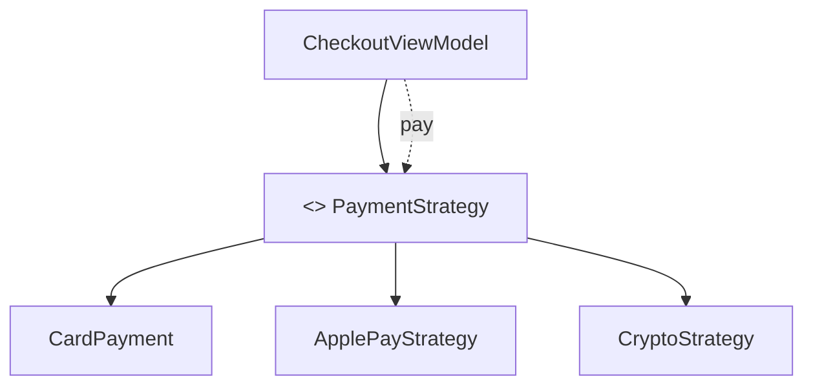

Паттерн Strategy позволяет:

- **выбирать алгоритм динамически** во время выполнения  
- **легко добавлять/заменять поведение** без изменения основного класса  
- **соблюдать OCP** ([[Open-Closed Principle]]) — расширение через новые типы, а не модификация старого кода  
- **упрощать тестирование** — каждая стратегия тестируется отдельно

Самые частые сценарии использования Strategy в [[iOS]]-приложениях 2026 года:

- разные способы оплаты (карта, Apple Pay, крипта, SberPay, Tinkoff Pay)  
- разные форматы сортировки списка (по дате, по имени, по популярности)  
- разные способы валидации формы (email, телефон, пароль)  
- разные политики кэширования (memory, disk, none)  
- разные анимации переходов / эффекты загрузки  
- разные стратегии обработки ошибок (retry, alert, silent fail)  
- A/B-тестирование фич (разные UI/логика)  
- разные транспортные протоколы ([[REST]], [[GraphQL]], [[Swift/gRPC]])

### 2. Классическая структура паттерна Strategy ([[GoF]])

| Компонент            | Роль в классическом паттерне                               | Актуальность в Swift 2026                       |
| -------------------- | ---------------------------------------------------------- | ----------------------------------------------- |
| **Context**          | Класс, который использует стратегию и делегирует ей работу | Обязателен (ViewModel, Service, UseCase)        |
| **Strategy**         | Протокол с основным методом/методами                       | Обязателен (протокол)                           |
| **ConcreteStrategy** | Конкретные реализации алгоритма                            | Основная часть — [[struct]]/[[class]]/[[actor]] |

**Важно**: в современном Swift **Context** часто — это **ViewModel**, **UseCase**, **Service** или **Reducer** в TCA.

### 3. Самые популярные и рекомендуемые реализации Strategy в Swift 2026

#### Вариант 1 — Классический Strategy (всё ещё очень живой)

```swift
// Протокол стратегии
protocol SortingStrategy {
    func sort<T: Comparable>(_ array: [T]) -> [T]
}

// Конкретные стратегии
struct AscendingSort: SortingStrategy {
    func sort<T: Comparable>(_ array: [T]) -> [T] {
        array.sorted()
    }
}

struct DescendingSort: SortingStrategy {
    func sort<T: Comparable>(_ array: [T]) -> [T] {
        array.sorted(by: >)
    }
}

struct RandomSort: SortingStrategy {
    func sort<T: Comparable>(_ array: [T]) -> [T] {
        array.shuffled()
    }
}

// Контекст — использует стратегию
@MainActor
class ListViewModel: ObservableObject {
    @Published var items: [String] = ["Banana", "Apple", "Cherry"]
    
    private var sortingStrategy: any SortingStrategy
    
    init(sortingStrategy: any SortingStrategy = AscendingSort()) {
        self.sortingStrategy = sortingStrategy
    }
    
    func setSortingStrategy(_ strategy: any SortingStrategy) {
        self.sortingStrategy = strategy
    }
    
    func sortItems() {
        items = sortingStrategy.sort(items)
    }
}

// Использование
let vm = ListViewModel()
vm.sortItems()                    // → ["Apple", "Banana", "Cherry"]
vm.setSortingStrategy(DescendingSort())
vm.sortItems()                    // → ["Cherry", "Banana", "Apple"]
vm.setSortingStrategy(RandomSort())
vm.sortItems()                    // → случайный порядок
```

#### Вариант 2 — Самый популярный в 2026 — **[[enum]] + associated values** (очень idiomatic)

```swift
enum SortOption {
    case ascending
    case descending
    case byLength
    case custom((String, String) -> Bool)
}

extension Array where Element == String {
    func sorted(by option: SortOption) -> [String] {
        switch option {
        case .ascending:
            return sorted()
        case .descending:
            return sorted(by: >)
        case .byLength:
            return sorted { $0.count < $1.count }
        case .custom(let comparator):
            return sorted(by: comparator)
        }
    }
}

// Использование
let fruits = ["Banana", "Apple", "Cherry", "Date"]
let sorted = fruits.sorted(by: .byLength)          // ["Date", "Apple", "Banana", "Cherry"]
let custom = fruits.sorted(by: .custom { $0.hasPrefix("B") && !$1.hasPrefix("B") })
```

**Преимущества**:
- нет лишних классов/протоколов  
- всё в одном месте  
- легко добавлять новые варианты через `case`  
- полностью типобезопасно

#### Вариант 3 — Strategy + Dependency Injection (самый профессиональный)

```swift
protocol PaymentStrategy {
    func process(amount: Decimal) async throws -> PaymentResult
}

struct CardPayment: PaymentStrategy {
    func process(amount: Decimal) async throws -> PaymentResult { ... }
}

struct ApplePayStrategy: PaymentStrategy {
    func process(amount: Decimal) async throws -> PaymentResult { ... }
}

struct CryptoStrategy: PaymentStrategy {
    func process(amount: Decimal) async throws -> PaymentResult { ... }
}

@MainActor
class CheckoutViewModel: ObservableObject {
    @Published var amount: Decimal = 99.99
    @Published var result: PaymentResult?
    
    private let strategy: any PaymentStrategy
    
    init(strategy: any PaymentStrategy) {
        self.strategy = strategy
    }
    
    func pay() async {
        do {
            result = try await strategy.process(amount: amount)
        } catch {
            // обработка
        }
    }
}

// Внедрение разных стратегий
let vm1 = CheckoutViewModel(strategy: CardPayment())
let vm2 = CheckoutViewModel(strategy: ApplePayStrategy())
let vm3 = CheckoutViewModel(strategy: CryptoStrategy())
```

### 4. Визуальная схема Strategy (2026 стиль)



- ViewModel зависит **только** от абстракции  
- Новые способы оплаты → **новый тип**, старый код **не меняется**

### 5. Лучшие практики Strategy в Swift 2026

- **enum + associated values** — для простых случаев с фиксированным набором вариантов  
- **[[Protocol]] + разные реализации** — когда нужна DI, тестируемость, A/B-тесты  
- **[[@MainActor]] / [[actor]]** — если стратегия работает с UI или состоянием  
- **[[Sendable]]** — протоколы и реализации должны быть `Sendable` при передаче между задачами  
- **Тестирование** — моки через протоколы — очень просто и чисто  
- **Не делай** «жирные» стратегии — каждая стратегия должна быть маленькой и сфокусированной  
- **Документируйте** — пишите в документации протокола «стратегия для X»

**Короткий девиз 2026**:
> «Strategy в 2026 году — это когда ты говоришь: «я хочу менять поведение объекта на лету, без изменения его кода».  
> Самые популярные стили: enum + switch или протокол + DI.  
> Классический GoF с отдельным классом Context почти не используется — его заменили более простые и мощные конструкции.»
