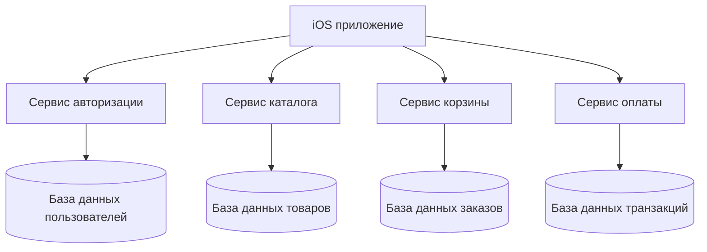

#system_design
## Что такое микросервисы?

**Микросервисы** — это архитектурный подход, при котором приложение делится на множество небольших независимых сервисов.  
Каждый сервис выполняет **свою отдельную задачу** и общается с другими через сеть (обычно через API).

Если говорить простыми словами:  
Микросервисы = **много маленьких программ**, каждая из которых отвечает за свою часть логики (например: авторизация, корзина, оплата, каталог товаров).

---

## Основные признаки микросервисов

1. **Разделение на модули** — каждая функция приложения вынесена в отдельный сервис.
    
2. **Независимость** — сервисы можно запускать, обновлять и масштабировать отдельно.
    
3. **Общение через [[API]]** — сервисы взаимодействуют через [[REST]], [[GraphQL]], [[Swift/System Design/2. Клиент-серверная архитектура/API для мобильных приложений/gRPC]], очереди сообщений.
    
4. **Разные технологии** — каждый сервис может быть написан на своём языке и использовать свою базу данных.
    

---

## Пример в iOS

Для [[iOS]]-приложения микросервисы видны так:

- Мобильное приложение обращается не к одному монолитному серверу, а к разным сервисам:
    
    - сервис авторизации,
        
    - сервис каталога товаров,
        
    - сервис корзины,
        
    - сервис оплаты.
        
- Каждый сервис независим, и если, например, "каталог" упадёт, то "авторизация" и "оплата" будут продолжать работать.
    

---

## Плюсы микросервисов

|Преимущество|Объяснение|
|---|---|
|Масштабируемость|Можно масштабировать только нужный сервис (например, оплату при Чёрной Пятнице).|
|Независимость|Один сервис можно обновить без остановки всей системы.|
|Устойчивость к сбоям|Сбой в одном сервисе не ломает всю систему.|
|Гибкость технологий|Разные сервисы могут быть на разных языках и с разными базами данных.|
|Удобство командной работы|Команды могут работать над разными сервисами параллельно.|

---

## Минусы микросервисов

|Недостаток|Объяснение|
|---|---|
|Сложность инфраструктуры|Нужно продумывать взаимодействие сервисов, мониторинг, логирование.|
|Сложность отладки|Труднее искать баги, т.к. проблема может быть на стыке сервисов.|
|Сеть = слабое место|Так как сервисы общаются по сети, возможны задержки и ошибки передачи данных.|
|Консистентность|Сложнее обеспечить единое состояние данных.|
|Больше DevOps-нагрузки|Нужны CI/CD, контейнеризация (Docker, Kubernetes).|

---

## Сравнение с монолитом

|Характеристика|Монолит|Микросервисы|
|---|---|---|
|Масштабирование|Масштабируется целиком|Масштабируется по частям|
|Сложность старта|Просто|Сложнее (инфраструктура)|
|Изоляция ошибок|Ошибка может сломать всё|Ошибка ломает только один сервис|
|Гибкость технологий|Единый стек|Можно использовать разные технологии|
|Размер команды|Подходит для маленьких команд|Удобно для больших команд|
|Производительность|Быстрее внутри процесса|Медленнее из-за сетевых вызовов|

---

## Где уместны микросервисы?

- Крупные проекты, которые постоянно растут.
    
- Приложения с высокой нагрузкой (миллионы пользователей).
    
- Когда разные команды работают над разными частями системы.
    
- Когда нужно часто выпускать обновления отдельных функций.
    

---

## Визуальная схема

---

## Пример из практики iOS

Представь приложение доставки еды:

- **Сервис авторизации**: отвечает только за вход и регистрацию.
    
- **Сервис каталога**: отдаёт список блюд.
    
- **Сервис корзины**: хранит текущий заказ.
    
- **Сервис оплаты**: работает с платёжными системами.
    

Если один сервис нужно обновить (например, добавить Apple Pay в оплату) — мы обновляем только этот сервис, не трогая остальные.

---

> 💡 **Итог**:  
> Микросервисная архитектура отлично подходит для больших проектов и команд. Она сложнее на старте, но даёт масштабируемость, устойчивость и гибкость в долгосрочной перспективе.

---