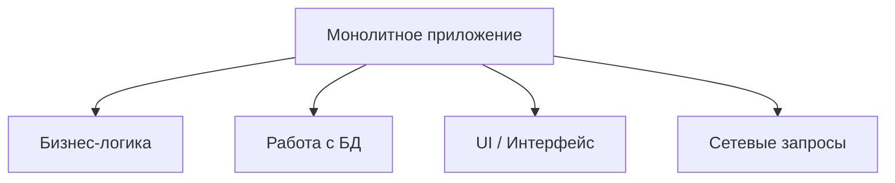

#system_design
## Что такое монолит?

**Монолит** — это архитектурный подход, при котором всё приложение (как серверное, так и клиентское) собирается и работает как единое целое.  
В монолите **весь код находится внутри одной структуры**, и все модули напрямую связаны между собой.

Если говорить простыми словами:  
Монолит = **одна большая программа**, внутри которой есть всё: бизнес-логика, работа с базой данных, интерфейс, сетевые запросы и т.д.

---

## Основные признаки монолита

1. **Единый код** — весь функционал внутри одной кодовой базы.
    
2. **Единый процесс** — приложение или сервер запускается как один процесс.
    
3. **Общая база данных** — чаще всего всё хранение данных сконцентрировано в одной базе.
    
4. **Тесная связанность** — разные части приложения напрямую зависят друг от друга.
    

---

## Пример в iOS

В [[iOS]]-приложении **монолит** выглядит так:

- У тебя есть одно приложение, в котором все экраны, логика и модули (например: авторизация, каталог товаров, корзина, оплата) собраны в одном проекте без чёткого разделения.
    
- Если нужно внести изменение, то оно затронет весь проект, и пересобирать придётся всё приложение.
    

---

## Плюсы монолита

|Преимущество|Объяснение|
|---|---|
|Простота разработки|Не нужно думать о разбиении на сервисы, всё в одном месте.|
|Лёгкий старт|Для маленьких команд и стартапов — быстрое начало.|
|Простота деплоя|Деплой — это просто загрузка одной программы (или одной сборки приложения).|
|Единая база кода|Всё хранится в одном проекте, легко искать и изменять.|

---

## Минусы монолита

|Недостаток|Объяснение|
|---|---|
|Сложность масштабирования|Нельзя масштабировать отдельные части. Масштабируется только всё приложение.|
|Долгая сборка и тестирование|Чем больше код, тем больше времени занимает сборка и тесты.|
|Хрупкость изменений|Маленькое изменение в одной части может "сломать" другую часть.|
|Ограниченная гибкость|Нельзя легко заменить одну часть (например, перейти на другой сервис авторизации).|
|Ограничения по команде|Большая команда сложнее работает в одном проекте: возникает много конфликтов при разработке.|

---

## Сравнение с микросервисами

|Характеристика|Монолит|Микросервисы|
|---|---|---|
|Масштабирование|Всё приложение сразу|Каждая часть отдельно|
|Разработка|Быстро на старте|Требует инфраструктуры|
|Тестирование|Единый тестовый контур|Сложнее, много сервисов|
|Гибкость|Заменить модуль трудно|Каждый сервис можно переписать отдельно|
|Подходит для|Малых и средних приложений|Больших систем, где нужна гибкость и масштабируемость|

---

## Где уместен монолит?

- Небольшие приложения и стартапы.
    
- [[MVP (Model-View-Presenter) Architecture]] (минимально жизнеспособный продукт), где главное — быстро выпустить продукт.
    
- Когда команда маленькая (1–5 разработчиков).
    
- Когда требования к масштабируемости низкие.
    

---

## Визуальная схема

---

## Пример из практики iOS

Представь, что ты делаешь приложение доставки еды:

- Все экраны (авторизация, каталог, корзина, заказ, оплата) находятся в одном проекте.
    
- Логика работы с сетью ([[API]]) тоже встроена в проект.
    
- Если ты хочешь поменять экран оплаты — тебе придётся пересобирать всё приложение и заново прогонять тесты.
    

---

> 💡 **Итог**:  
> Монолит — это простая и понятная архитектура, хорошая для старта. Но с ростом проекта она начинает мешать развитию: сложнее масштабировать, тестировать и поддерживать. Поэтому в больших продуктах чаще переходят на модульность или микросервисы.

---