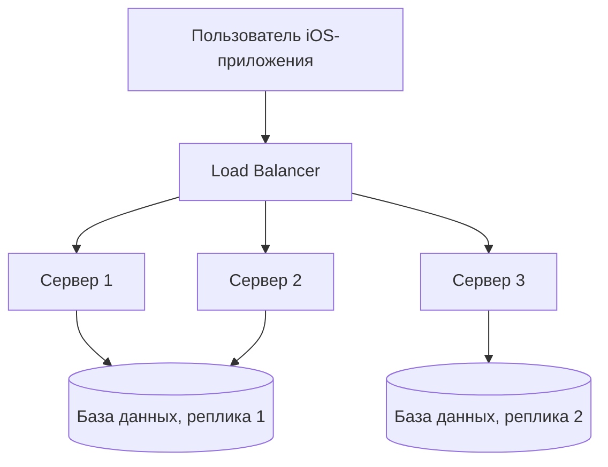

#system_design
## Что такое доступность?

**Доступность (Availability)** — это показатель того, насколько часто система (или приложение) доступна для использования.  
Иными словами: **может ли пользователь в данный момент воспользоваться приложением/сервисом?**

Если сервис "лежит" или приложение не может получить данные от сервера, то доступность считается нарушенной.

---

## Формула доступности

Доступность часто выражается в **процентах времени работы** за определённый период (например, за месяц или год).

```text
Доступность = (Время работы системы) / (Общее время) × 100%
```

Пример:

- За месяц 30 дней = 43 200 минут.
    
- Система была недоступна 43 минуты.
    
- Доступность = (43200 – 43) / 43200 ≈ **99.9%**.
    

---

## Уровни доступности ("девятки")

|Доступность|Время простоя в год|Время простоя в месяц|
|---|---|---|
|99% (два девятки)|~3.65 дня|~7.3 часа|
|99.9% (три девятки)|~8.7 часов|~43 минуты|
|99.99% (четыре девятки)|~52 минут|~4.3 минуты|
|99.999% (пять девяток)|~5 минут|~26 секунд|

> Чем больше "девяток", тем сложнее и дороже поддерживать такую доступность.

---

## Доступность в iOS-приложениях

Для мобильного приложения доступность важна **как на клиенте, так и на сервере**.

### На стороне клиента ([[iOS]]):

- Приложение должно запускаться и работать без крашей.
    
- Даже если сервер недоступен, приложение должно:
    
    - показывать офлайн-данные (кэш),
        
    - информировать пользователя об ошибке,
        
    - пытаться повторить запросы позже.
        

### На стороне сервера:

- [[API]] должны быть доступны с минимальным временем простоя.
    
- Не должно быть "узких мест" (single point of failure).
    
- Используются балансировщики нагрузки, репликация БД, CDN.
    

---

## Как повышают доступность?

1. **Резервирование (Redundancy)**
    
    - Несколько серверов вместо одного.
        
    - Репликация баз данных.
        
    - Несколько дата-центров.
        
2. **Балансировка нагрузки (Load Balancing)**
    
    - Трафик распределяется между несколькими серверами.
        
3. **Failover и автоматическое восстановление**
    
    - Если один сервер "упал", система автоматически переключается на другой.
        
4. **Мониторинг и алертинг**
    
    - Постоянная проверка доступности сервисов (например, Pingdom, Datadog).
        
    - Уведомления при сбоях.
        
5. **Офлайн-режим и кэширование в iOS**
    
    - Сохранять данные локально ([[Core Data]], [[Swift/Теория/Сторонние библиотеки и расширения/Realm]]).
        
    - Подгружать кэшированные результаты при отсутствии интернета.
        

---

## Пример для iOS-приложения

Представь приложение доставки еды:

- Если сервер недоступен — пользователь не может сделать заказ.
    
- Чтобы повысить доступность:
    
    - приложение должно показывать историю заказов из кэша,
        
    - позволять составить корзину офлайн,
        
    - отправить заказ, когда соединение восстановится.
        

Таким образом **приложение остаётся доступным** даже при сбое на стороне сервера или отсутствии интернета.

---

## Визуальная схема



---

## Итог

- **Доступность** — это способность системы работать без сбоев и быть доступной пользователям.
    
- Она измеряется в **процентах времени работы** (SLA).
    
- В мобильных приложениях доступность зависит как от **работы сервера**, так и от **правильного проектирования клиента**.
    
- Чем выше уровень доступности ("больше девяток"), тем сложнее и дороже поддерживать систему.
    

---
