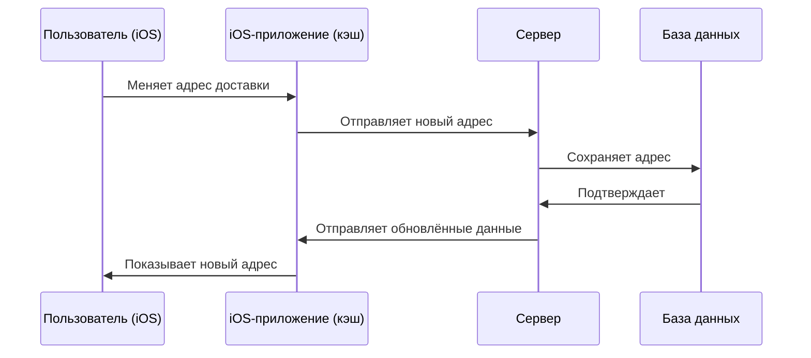

#system_design
## Что такое консистентность?

**Консистентность данных (Data Consistency)** — это свойство системы, при котором данные остаются **правильными, согласованными и непротиворечивыми** во всех её частях.

Простыми словами:  
Если пользователь сделал действие (например, заказал еду), то во всех местах системы (сервер, мобильное приложение, база данных) должно быть видно одно и то же состояние (корзина = заказана, а не "заказана на сервере, но пустая в приложении").

---

## Пример в [[iOS]]

- Пользователь в приложении изменил адрес доставки.
    
- Сервер сохранил новый адрес.
    
- Но приложение показывает старый адрес, так как данные не обновились.
    

👉 Это нарушение консистентности: на сервере данные одни, в приложении — другие.

---

## Виды консистентности

В системах (особенно распределённых) обычно используют два основных подхода:

### 1. **Строгая консистентность (Strong Consistency)**

- После изменения данных все клиенты **сразу видят одно и то же**.
    
- Система гарантирует синхронное обновление.
    
- Пример: банковские переводы (баланс должен обновляться мгновенно и одинаково для всех).
    

**Минусы:** медленнее, сложнее реализовать в распределённых системах.

---

### 2. **Согласованность в конечном счёте (Eventual Consistency)**

- После изменения данных могут быть временные расхождения.
    
- Через некоторое время данные "сойдутся" и будут одинаковыми у всех клиентов.
    
- Пример: соцсети (лайки или комментарии могут отображаться с задержкой).
    

**Плюсы:** быстрее, подходит для систем с высокой нагрузкой.  
**Минусы:** пользователь может временно видеть устаревшие данные.

---

## Примеры стратегий консистентности

|Стратегия|Описание|Пример|
|---|---|---|
|Strong Consistency|Всегда одинаковые данные для всех|Банковские операции|
|Eventual Consistency|Данные выравниваются со временем|Лайки в Instagram|
|Causal Consistency|Сохраняется причинно-следственный порядок операций|Чат: сообщение "Привет" должно быть до "Как дела?"|
|Read-your-writes Consistency|Пользователь всегда видит свои изменения|Редактирование профиля в приложении|
|Session Consistency|Пока длится сессия, клиент видит согласованные данные|Интернет-магазин: изменения корзины в рамках одной сессии|

---

## Консистентность в iOS-приложениях

### Проблемы:

- Слабый или прерывающийся интернет.
    
- Несколько устройств у одного пользователя (например, iPhone + iPad).
    
- Кэшированные данные (устаревшие данные могут показываться).
    

### Решения:

1. **Синхронизация данных**
    
    - При изменении данных на клиенте — сразу отправлять их на сервер.
        
    - При открытии экрана — обновлять данные с сервера.
        
2. **Конфликт изменений**
    
    - Если пользователь поменял данные офлайн, а кто-то изменил их на сервере — нужно решить, какая версия главная.
        
    - Стратегии: _последняя запись побеждает_ (Last Write Wins), _merge_, _приоритет сервера_.
        
3. **Локальное хранилище**
    
    - [[Core Data]], [[Swift/Realm]], [[SQLite]].
        
    - Использовать временное сохранение и последующую синхронизацию с сервером.
        

---

## Визуальная схема

---

## Пример из практики

Приложение заказа такси:

- Пользователь изменил точку назначения.
    
- Сервер сохранил новое значение.
    
- Если приложение не обновит экран и будет показывать старую точку — это **несогласованность**.
    

Чтобы этого избежать:

- приложение должно получать обновления от сервера,
    
- использовать [[WebSocket]] или push-уведомления для синхронизации,
    
- хранить данные в локальной базе с механизмом обновления.
    

---

## Итог

- **Консистентность данных** — это гарантия, что данные одинаковы во всей системе.
    
- Существует несколько моделей: строгая и eventual (и другие).
    
- В iOS-приложениях консистентность достигается за счёт кэширования, синхронизации и стратегий разрешения конфликтов.
    
- Нужно находить баланс: где-то важна мгновенная консистентность (банковские операции), а где-то допустима eventual consistency (лайки, комментарии).
    

---
