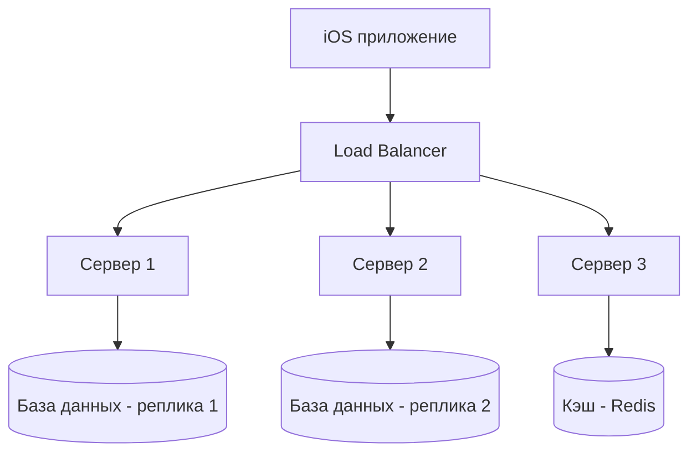

#system_design
## Что такое масштабируемость?

**Масштабируемость (Scalability)** — это свойство системы справляться с ростом нагрузки **без потери производительности и доступности**.

Простыми словами:  
Если пользователей становится больше, запросов к серверу — больше, или данных хранится — больше, система должна продолжать работать стабильно.

---

## Пример в [[iOS]]

- Сегодня твоё приложение используют 100 человек в день.
    
- Через год — 1 000 000 человек в день.
    
- Если приложение и сервер работают одинаково быстро при росте нагрузки — это **масштабируемая система**.
    

---

## Виды масштабируемости

### 1. **Вертикальная (Vertical Scaling)**

- Увеличение мощности одного сервера/устройства.
    
- Пример: добавить больше оперативной памяти, более быстрый процессор, SSD.
    
- Применимо в iOS: оптимизация устройства не влияет (Apple контролирует железо), но сервер можно "усилить".
    

**Плюсы:** просто и быстро.  
**Минусы:** предел ограничен "железом".

---

### 2. **Горизонтальная (Horizontal Scaling)**

- Добавление новых серверов или сервисов.
    
- Пример: вместо одного сервера ставим 10 серверов, балансируем нагрузку.
    
- В iOS это значит, что твой серверный бэкенд может обслуживать больше пользователей.
    

**Плюсы:** гибкость, почти бесконечный рост.  
**Минусы:** сложнее инфраструктура (балансировка, синхронизация).

---

## Масштабирование в iOS-приложениях

### На клиенте:

- Оптимизация UI и работы с памятью → чтобы приложение стабильно работало на разных устройствах.
    
- Эффективная работа с данными (ленивая загрузка, пагинация).
    
- Кэширование изображений и запросов.
    

### На сервере:

- Балансировка нагрузки (Load Balancer).
    
- Использование CDN для картинок, видео, статических ресурсов.
    
- Микросервисная архитектура (разделение задач).
    
- Репликация и шардирование базы данных.
    

---

## Пример

Приложение доставки еды:

- Сегодня 100 заказов в день — сервер справляется легко.
    
- Завтра 100 000 заказов — сервер падает.
    
- Решение:
    
    - горизонтальное масштабирование серверов,
        
    - вынос обработки изображений и медиа на CDN,
        
    - отдельный сервис для расчёта доставки.
        

---

## Методы масштабирования

| Метод                          | Описание                                                 | Пример                                    |
| ------------------------------ | -------------------------------------------------------- | ----------------------------------------- |
| Кэширование                    | Сохраняем часто используемые данные ближе к пользователю | [[URLCache]] в iOS, Redis на сервере      |
| CDN (Content Delivery Network) | Доставка картинок/видео с ближайших серверов             | Cloudflare, Akamai                        |
| Балансировка нагрузки          | Распределение запросов между несколькими серверами       | Nginx, AWS ELB                            |
| Репликация БД                  | Несколько копий базы данных                              | Master-Slave репликация                   |
| Шардирование БД                | Разделение данных по частям                              | Разные сегменты пользователей в разных БД |
| Асинхронная обработка          | Очереди для тяжёлых задач                                | Kafka, RabbitMQ                           |
| Микросервисы                   | Деление системы на независимые сервисы                   | Сервис корзины, сервис оплаты             |

---

## Визуальная схема

---

## Масштабируемость и стоимость

- Чем выше нагрузку система способна выдержать, тем дороже её поддержка.
    
- Нужно искать баланс:
    
    - для стартапа достаточно простой архитектуры (монолит),
        
    - для крупных сервисов нужна серьёзная инфраструктура.
        

---

## Итог

- **Масштабируемость** — это способность системы расти без деградации качества.
    
- Существует **вертикальное** (увеличение мощности одного узла) и **горизонтальное** (добавление новых узлов) масштабирование.
    
- В iOS-приложениях важно масштабировать не только сервер, но и клиентскую часть (кэширование, оптимизация работы с сетью).
    
- Чем больше пользователей — тем сложнее и дороже поддерживать масштабируемость.
    

---
