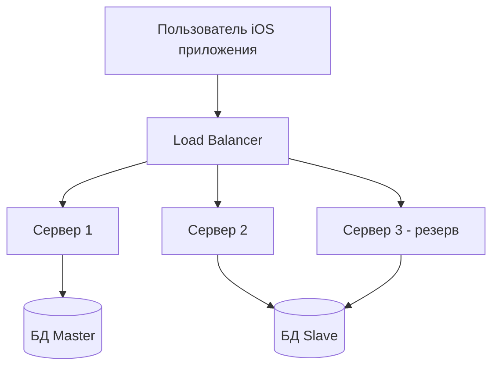

#system_design
## Определение

**Отказоустойчивость** — это способность системы продолжать работу даже при сбоях её отдельных компонентов.

Простыми словами:  
Если часть системы "сломалась" — приложение или сервис всё равно должны работать (пусть и с ограниченным функционалом), а пользователь этого почти не заметит.

---

## Почему это важно?

- Пользователи не любят, когда приложение "падает".
    
- В бизнесе сбои = прямые убытки (например, если магазин не работает 1 час → теряются деньги).
    
- Чем больше система, тем выше вероятность сбоев (серверы, сеть, база данных, сторонние сервисы).
    

---

## Примеры в [[iOS]]

1. Приложение не может достучаться до сервера:
    
    - Показываем закэшированные данные вместо ошибки.
        
2. Сбой при оплате:
    
    - Сохраняем заказ в очередь и пробуем позже.
        
3. Пропало соединение:
    
    - Работаем в оффлайн-режиме, синхронизируем данные при восстановлении сети.
        

---

## Основные методы обеспечения отказоустойчивости

### 1. **Резервирование (Redundancy)**

- Дублирование компонентов, чтобы при сбое один заменял другой.
    
- Пример: два сервера вместо одного.
    

### 2. **Репликация (Replication)**

- Данные хранятся в нескольких копиях.
    
- Пример: база данных Master-Slave, где одна копия используется для записи, другие — для чтения.
    

### 3. **Балансировка нагрузки (Load Balancing)**

- Если один сервер "падает", нагрузка автоматически уходит на другие.
    

### 4. **Graceful Degradation** ("Плавная деградация")

- Если часть функционала недоступна, приложение продолжает работать частично.
    
- Пример: не работает чат, но корзина и заказы доступны.
    

### 5. **Failover**

- Автоматическое переключение на резервный сервер или сервис.
    
- Пример: если база №1 упала → переключаемся на базу №2.
    

### 6. **Кэширование**

- Если сервер недоступен, приложение использует кэшированные данные.
    

---

## Методы отказоустойчивости в iOS-приложениях

| Метод                  | Как работает                                   | Пример                     |
| ---------------------- | ---------------------------------------------- | -------------------------- |
| Локальный кэш          | Хранение данных на устройстве                  | [[Swift/Realm]], [[Core Data]]    |
| Retry (повтор запроса) | Повторяем запрос через 1-2-5 секунд            | Повторная загрузка данных  |
| Offline-режим          | Работа без сети, синхронизация позже           | Telegram, Notion           |
| Очереди                | Запросы отправляются, когда сеть восстановится | Firebase Firestore offline |
| Fallback               | Использование резервного сервиса               | Другой [[API]] или кэш     |

---

## Пример: сервис доставки

- Пользователь оформляет заказ.
    
- Сервер оплаты не отвечает.
    
- Решения:
    
    - сохранить заказ в "очередь ожидания";
        
    - показать пользователю уведомление "Мы подтвердим заказ чуть позже";
        
    - повторить попытку через 10 секунд или при восстановлении связи.
        

---

## Визуальная схема

---

## Отказоустойчивость ≠ 100% доступность

- Даже самая отказоустойчивая система может упасть (например, из-за глобальной аварии).
    
- Цель — **снизить вероятность отказа и минимизировать последствия**.
    

---

## Метрики отказоустойчивости

|Метрика|Что означает|
|---|---|
|**MTBF (Mean Time Between Failures)**|Среднее время между сбоями|
|**MTTR (Mean Time To Recovery)**|Среднее время восстановления после сбоя|
|**SLA (Service Level Agreement)**|Гарантия доступности (например, 99.9%)|

---

## Итог

- **Отказоустойчивость** — это способность системы работать даже при сбоях.
    
- Достигается с помощью резервирования, репликации, балансировки и кэширования.
    
- В iOS это выражается в кэшировании данных, оффлайн-режиме, повторных запросах и fallback-механизмах.
    
- Цель — минимизировать влияние сбоев на пользователя и бизнес.
    

---
