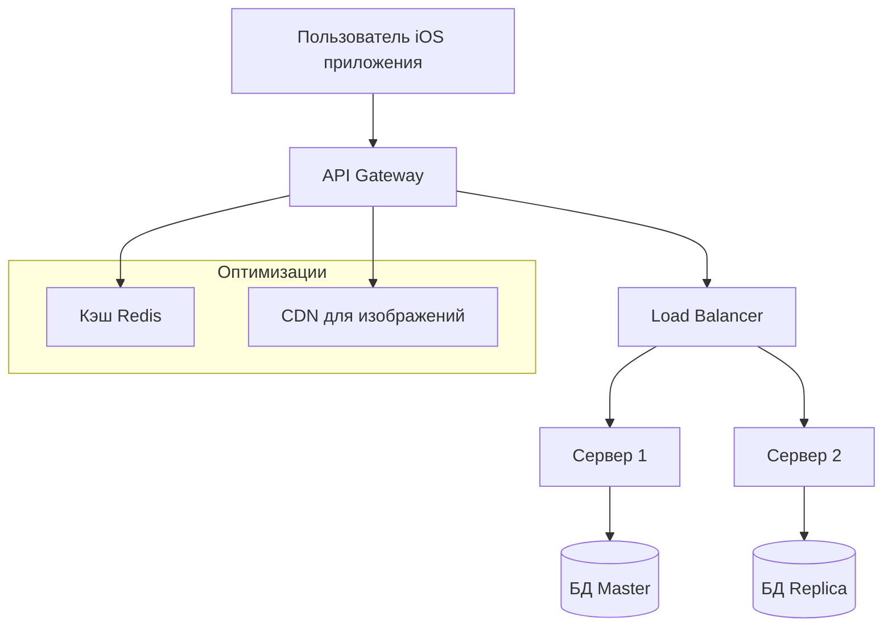

#system_design
## Определение

**Производительность** — это способность системы обрабатывать определённый объём работы за единицу времени.

Простыми словами:

> Насколько быстро и эффективно система выполняет запросы пользователей и операции внутри себя.

---

## Ключевые параметры производительности

| Параметр                                          | Определение                                                  | Пример                                          |
| ------------------------------------------------- | ------------------------------------------------------------ | ----------------------------------------------- |
| **Latency (Задержка)**                            | Время ответа на один запрос                                  | Запрос на сервер выполняется за 200 мс          |
| **Throughput (Пропускная способность)**           | Количество запросов, которые система обрабатывает за секунду | [[API]] обрабатывает 1000 запросов/сек          |
| **Response Time (Время отклика)**                 | Время от запроса до ответа, включая задержки в сети          | Открытие экрана с заказами за 1.2 сек           |
| **Concurrency (Параллельность)**                  | Количество операций, выполняемых одновременно                | Приложение обрабатывает 20 запросов параллельно |
| **Resource Utilization (Использование ресурсов)** | Насколько загружены CPU, память, сеть                        | 70% CPU при 10 000 пользователей                |

---

## Производительность ≠ Быстродействие

- **Быстродействие** — как быстро выполняется одна операция.
    
- **Производительность** — как система справляется с нагрузкой в целом.
    

---

## Почему производительность важна?

- Пользователи не любят ждать → UX ухудшается.
    
- Высокая производительность снижает издержки (меньше серверов → дешевле).
    
- В мобильных приложениях низкая производительность = высокий расход батареи.
    

---

## Методы повышения производительности

### 1. **Кэширование**

- Сохраняем часто используемые данные → меньше обращений к серверу/БД.
    
- Пример: список категорий товаров хранится локально.
    

### 2. **Асинхронность**

- Выполнение задач в фоновом режиме, чтобы UI не "замерзал".
    
- В [[iOS]]: [[async]]/[[await]], [[DispatchQueue]], [[Combine]].
    

### 3. **Балансировка нагрузки**

- Распределяем запросы между несколькими серверами.
    

### 4. **Оптимизация запросов к БД**

- Использование индексов, шардирование, денормализация.
    

### 5. **Сжатие данных**

- Меньший объём данных → быстрее передаётся по сети.
    

### 6. **Параллельная обработка**

- Разбиваем задачу на несколько потоков/процессов.
    

### 7. **Lazy Loading (Отложенная загрузка)**

- Загружаем данные по мере необходимости, а не все сразу.
    

---

## Производительность в iOS-приложениях

| Техника                     | Описание                                  | Пример                           |
| --------------------------- | ----------------------------------------- | -------------------------------- |
| **Локальный кэш**           | Данные хранятся в [[Core Data]]/[[Realm]] | Новости доступны даже без сети   |
| **Prefetching**             | Подгружаем данные заранее                 | [[UITableView]] prefetch [[API]] |
| **Batch updates**           | Обновляем данные пачками                  | Core Data batch update           |
| **Background tasks**        | Выполнение в фоне                         | Синхронизация заказов            |
| **Оптимизация изображений** | Сжатие и lazy loading                     | Использование [[SDWebImage]]     |
| **Pagination**              | Загружаем данные частями                  | Подгрузка товаров при скролле    |

---

## Метрики для оценки производительности

|Метрика|Что измеряет|
|---|---|
|P95 / P99 Latency|Время ответа для 95% / 99% запросов|
|QPS (Queries per Second)|Количество запросов в секунду|
|TPS (Transactions per Second)|Количество транзакций в секунду|
|RPS (Requests per Second)|Запросы в секунду|
|CPU & Memory usage|Загруженность системы|

---

## Визуальная схема

---

## Пример: интернет-магазин

1. Пользователь открывает каталог товаров.
    
2. Приложение загружает данные:
    
    - проверяет локальный кэш ([[Core Data]]/[[Realm]]),
        
    - если кэша нет → идёт на [[API]],
        
    - API отдаёт данные из Redis/БД,
        
    - изображения приходят через CDN.
        
3. При повторном открытии экрана данные грузятся мгновенно из кэша.
    

---

## Итог

- **Производительность** — это способность системы быстро и эффективно обрабатывать запросы.
    
- Основные показатели: задержка (latency), пропускная способность (throughput), время отклика.
    
- Методы повышения: кэширование, асинхронность, балансировка нагрузки, оптимизация БД, lazy loading.
    
- В iOS — это кэш, оффлайн-режим, оптимизация изображений и фоновые задачи.
    

---
