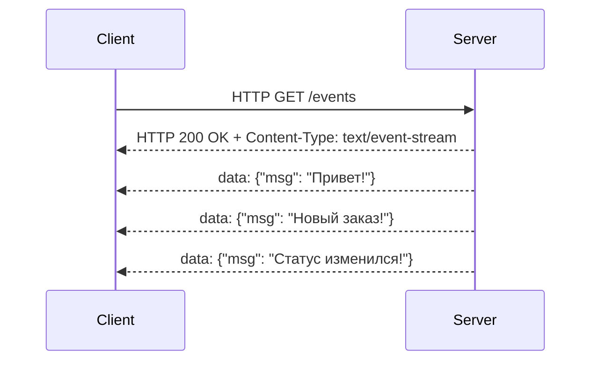

#system_design
## Определение

**SSE (Server-Sent Events)** — это технология, при которой сервер **отправляет данные клиенту в режиме реального времени** по **одностороннему соединению** (только сервер → клиент).

> Клиент открывает соединение с сервером, и сервер начинает "стримить" (передавать поток) данных, пока соединение не будет закрыто.

---

## Как это работает

1. Клиент (например, [[iOS]]-приложение) делает обычный [[HTTP]]-запрос ([[GET-HTTP]] `/events`).
    
2. Сервер отвечает заголовком `Content-Type: text/event-stream`.
    
3. После этого сервер **не закрывает соединение**, а "толкает" события (event) в поток.
    
4. Клиент обрабатывает приходящие данные как события в реальном времени.
    

---

## Отличие SSE от других технологий

|Технология|Направление|Особенности|
|---|---|---|
|**HTTP Polling**|Клиент → Сервер|Клиент постоянно спрашивает: "есть ли что-то новое?"|
|**WebSocket**|Двустороннее|Сервер и клиент могут обмениваться сообщениями в обе стороны|
|**SSE**|Сервер → Клиент|Простая, односторонняя передача данных от сервера к клиенту|

---

## Формат сообщения в SSE

Сообщения передаются в **текстовом виде** и могут содержать несколько полей:

```txt
id: 1
event: message
data: {"user":"Alex", "text":"Привет!"}

id: 2
event: notification
data: {"title":"Новый заказ", "id":1234}
```

- **id** — идентификатор события (для восстановления после разрыва).
    
- **event** — название типа события.
    
- **data** — полезная нагрузка (обычно JSON).
    

---

## Преимущества SSE

- Простота реализации (это обычный HTTP).
    
- Автоматическая поддержка **reconnect** (браузеры и клиенты могут переподключаться).
    
- Сервер может задавать **retry** (через сколько мс клиент переподключится).
    
- Подходит для **push-уведомлений, стриминга логов, обновлений в реальном времени**.
    

---

## Ограничения SSE

- Только **односторонняя связь** (сервер → клиент).
    
- Работает поверх **HTTP/1.1** (не оптимально для миллионов соединений).
    
- Не поддерживает бинарные данные (только текст, обычно [[JSON]]).
    
- Ограничена поддержка в старых браузерах/клиентах (в iOS решается через библиотеки).
    

---

## Использование в iOS

### Пример через [[URLSession]]

```swift
import Foundation

class SSEClient {
    private var task: URLSessionDataTask?
    
    func connect() {
        guard let url = URL(string: "https://example.com/events") else { return }
        let session = URLSession(configuration: .default)
        
        task = session.dataTask(with: url) { data, _, _ in
            if let data = data, let text = String(data: data, encoding: .utf8) {
                print("Получено событие: \(text)")
            }
        }
        task?.resume()
    }
    
    func disconnect() {
        task?.cancel()
    }
}
```

---

## Примеры применения

- Онлайн-чаты (новые сообщения появляются мгновенно).
    
- Трекеры заказов (обновление статуса заказа без перезагрузки).
    
- Финансовые системы (котировки акций в реальном времени).
    
- Push-уведомления в вебе и мобильных клиентах.
    
- Панели мониторинга (обновление логов, графиков).
    

---

## Сравнение SSE и WebSockets

|Критерий|SSE|WebSockets|
|---|---|---|
|Направление|Сервер → Клиент|Двустороннее|
|Протокол|HTTP|Специальный WS-протокол|
|Передача|Только текст|Текст и бинарные данные|
|Масштабируемость|Хорошо подходит для "много клиентов, мало данных"|Подходит для real-time чатов, игр|
|Простота|Очень простая реализация|Требует WS-сервера и клиента|

---

## Визуальная схема



---

## Итог

- **SSE** — это простой способ отправлять **обновления в реальном времени** от сервера к клиенту.
    
- Подходит для push-уведомлений, чатов, стриминга данных.
    
- Легче в использовании, чем [[WebSocket]], но ограничен односторонней передачей.
    
- В iOS можно реализовать через `URLSession` или готовые библиотеки.
    

---
