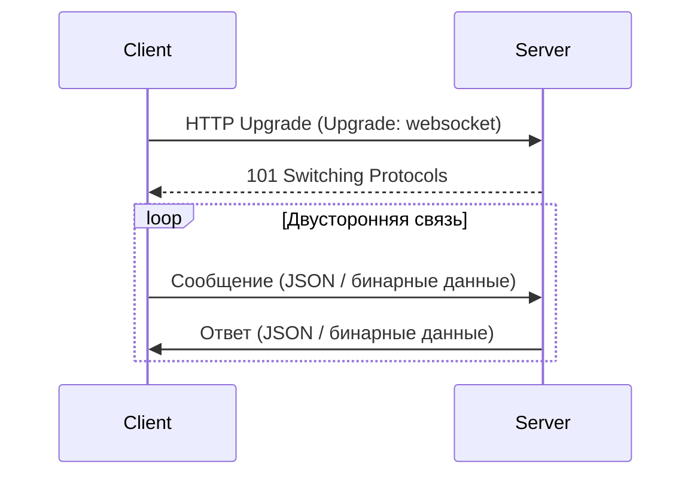

## Определение

**WebSocket** — это протокол для **двусторонней связи** между клиентом и сервером в режиме реального времени.

> Клиент и сервер могут отправлять данные друг другу в любой момент, без необходимости повторного [[HTTP]]-запроса.

---

## Как это работает

1. Клиент делает **HTTP-запрос с апгрейдом** на [[WebSocket]] (`Upgrade: websocket`).
    
2. Сервер подтверждает переход, и устанавливается постоянное соединение.
    
3. После этого клиент и сервер могут **отправлять сообщения в обе стороны** до закрытия соединения.
    

---

## Отличие от SSE

|Критерий|SSE|WebSockets|
|---|---|---|
|Направление|Сервер → Клиент|Двустороннее|
|Протокол|HTTP|WS / WSS|
|Передача|Только текст|Текст и бинарные данные|
|Масштабируемость|Много клиентов, мало данных|Высокая нагрузка, чаты, игры|
|Поддержка|Легко на HTTP|Требуется WebSocket-сервер|
|Использование|Push-уведомления|Онлайн-чаты, игры, стриминг|

---

## Применение WebSockets

- Онлайн-чаты (Telegram, WhatsApp).
    
- Игровые приложения (реальное время между игроками).
    
- Финансовые приложения (обновление котировок акций).
    
- Совместное редактирование документов (Google Docs style).
    
- Панели мониторинга и логи.
    

---

## Пример формата сообщений

Сообщения могут быть **JSON или бинарные данные**:

```json
{
    "type": "message",
    "user": "Alex",
    "text": "Привет!"
}
```

---

## WebSockets в [[iOS]]

### Использование [[URLSessionWebSocketTask]]

```swift
import Foundation

class WebSocketClient {
    private var task: URLSessionWebSocketTask?
    
    func connect() {
        guard let url = URL(string: "wss://example.com/socket") else { return }
        task = URLSession.shared.webSocketTask(with: url)
        task?.resume()
        receive()
    }
    
    func send(message: String) {
        let wsMessage = URLSessionWebSocketTask.Message.string(message)
        task?.send(wsMessage) { error in
            if let error = error {
                print("Ошибка отправки: \(error)")
            }
        }
    }
    
    private func receive() {
        task?.receive { [weak self] result in
            switch result {
            case .success(let message):
                switch message {
                case .string(let text):
                    print("Получено: \(text)")
                case .data(let data):
                    print("Получено бинарное: \(data)")
                @unknown default:
                    break
                }
            case .failure(let error):
                print("Ошибка при приёме: \(error)")
            }
            
            // рекурсивно продолжаем слушать
            self?.receive()
        }
    }
    
    func disconnect() {
        task?.cancel(with: .goingAway, reason: nil)
    }
}
```

---

## Преимущества WebSockets

- **Двусторонняя связь** (сервер и клиент могут посылать данные в любое время).
    
- **Маленькая задержка** → почти реальное время.
    
- **Передача текста и бинарных данных**.
    
- **Меньше нагрузки на сеть**, чем частые HTTP-запросы.
    

---

## Ограничения и риски

- Требуется поддержка WebSocket-сервера.
    
- Постоянное соединение → больше ресурсов сервера.
    
- Необходимо обрабатывать переподключения при разрыве сети.
    
- Масштабирование требует балансировки и кластеризации.
    

---

## Визуальная схема



---

## Пример применения в iOS

Приложение доставки еды:

- Сервер отправляет **обновления статуса заказа** (приготовлен, в пути, доставлен) мгновенно.
    
- Клиент может отправить сообщение (например, "Отменить заказ") через тот же канал WebSocket.
    
- Всё это происходит без повторных HTTP-запросов и с минимальной задержкой.
    

---

## Итог

- **WebSocket** — лучший выбор для приложений, где важна **двусторонняя связь в реальном времени**.
    
- В iOS реализуется через `URLSessionWebSocketTask` или сторонние библиотеки.
    
- SSE проще, но только сервер → клиент; WebSocket мощнее, но требует больше инфраструктуры.
    

---