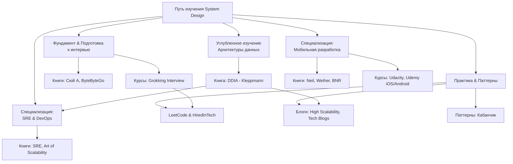

#system_design
### Визуальная схема пути изучения System Design

Эта схема представляет собой дорожную карту от основ к продвинутым темам. Рекомендую двигаться последовательно.

---

### Обработанный список ресурсов (отсортировано по сложности и полезности)

#### Уровень 1: Фундамент и подготовка к интервью (Начальный/Средний уровень)

Здесь есть четкие руководства и шаблоны ответов.

1.  **Книга: "System Design Interview" by Alex Xu (Сюй А)**
    *   **Описание:** *Лучшая первая книга*. Конкретные примеры, пошаговый разбор популярных вопросов (Twitter, YouTube), отличные диаграммы. Русский перевод хорошего качества.
    *   **Сложность:** Низкая (для входа в тему)
    *   **Полезность:** Очень высокая
    *   **Ссылки:**
        *   [Купить на Ozon.ru (бумажная версия)](https://www.ozon.ru/product/sistemnyy-dizayn-samoe-polnoe-rukovodstvo-po-prohozhdeniyu-intervyu-alek-syu-385832077/)
        *   [PDF (англ., 1-й том)](https://github.com/charlesLupus/system-design-interview/blob/main/Book/System%20Design%20Interview%20-%20An%20Insider's%20Guide.pdf)
        *   [PDF (англ., 2-й том)](https://github.com/charlesLupus/system-design-interview/blob/main/Book/System%20Design%20Interview%20-%20An%20Insider's%20Guide%20Volume%202.pdf)

2.  **Курс: "Grokking the System Design Interview" (Educative.io)**
    *   **Описание:** *Классика жанра*. Интерактивный курс, который проходят почти все перед собеседованием. Структурированный подход, паттерны.
    *   **Сложность:** Низкая (для входа в тему)
    *   **Полезность:** Очень высокая
    *   **Ссылки:**
        *   [Официальный сайт (платный, но того стоит)](https://www.educative.io/courses/grokking-the-system-design-interview)
        *   [Бесплатная копия курса на GitHub (просмотр)](https://github.com/Jeevan-kumar-Raj/Grokking-System-Design)

3.  **Ресурс: "System Design" от ByteByteGo**
    *   **Описание:** *Невероятно полезный блог и рассылка*. Авторы — экс-инженеры Twitter, AWS. Современные концепции, прекрасные визуализации сложных тем.
    *   **Сложность:** Средняя
    *   **Полезность:** Очень высокая
    *   **Ссылки:**
        *   [Официальный сайт (бесплатные статьи и платный курс)](https://bytebytego.com/)
        *   [Их канал на YouTube (с анимациями!)](https://www.youtube.com/c/ByteByteGo)

#### Уровень 2: Углубленное понимание (Средний/Высокий уровень)

Для тех, кто хочет понять не "что говорить на собесе", а "как строить системы по-настоящему".

4.  **Книга: "Designing Data-Intensive Applications" (DDIA) by Martin Kleppmann**
    *   **Описание:** *Библия системного дизайна*. Глубокое погружение в основы: базы данных, распределенные системы, потоковая обработка. Must-read для любого серьезного инженера.
    *   **Сложность:** Высокая
    *   **Полезность:** Чрезвычайно высокая
    *   **Ссылки:**
        *   [Официальный сайт автора (англ.)](https://dataintensive.net/)
        *   [Купить на ЛитРес (русский перевод)](https://www.litres.ru/book/martin-kleppman/ispolzuem-dannye-intensivno-118299990/)
        *   [PDF (англ., бесплатно от автора)](https://github.com/ept/ddia-references/blob/master/ddia.pdf)

5.  **Книга: "Site Reliability Engineering" (SRE)**
    *   **Описание:** *Классика от Google*. Как проектировать, строить и поддерживать надежные и масштабируемые системы. Много overlap с system design.
    *   **Сложность:** Средняя
    *   **Полезность:** Высокая
    *   **Ссылки:**
        *   [Официальный сайт Google (бесплатно, англ.)](https://sre.google/sre-book/table-of-contents/)
        *   [Купить на Ozon.ru (бумажная версия, рус.)](https://www.ozon.ru/product/nadezhnost-i-obsluzhivanie-saytov-teoriya-i-praktika-295073699/)

6.  **Книга: "A Philosophy of Software Design" by John Ousterhout**
    *   **Описание:** Не про масштабирование, а про *сложность кода и модульность*. Учит проектировать компоненты системы так, чтобы их было легко поддерживать и изменять.
    *   **Сложность:** Средняя
    *   **Полезность:** Высокая (на уровне архитектуры компонентов)
    *   **Ссылки:**
        *   [Купить на Amazon (англ.)](https://www.amazon.com/Philosophy-Software-Design-John-Ousterhout/dp/1732102201)
        *   [PDF (англ.)](https://github.com/charlesLupus/system-design-interview/blob/main/Book/A%20Philosophy%20of%20Software%20Design.pdf)

#### Уровень 3: Специализация — Мобильная разработка

7.  **Книга: "Mobile Design Pattern Gallery" by Theresa Neil**
    *   **Описание:** *Справочник UI/UX паттернов* для мобильных приложений. Полезно для дизайна интерфейсов и понимания ожидаемого поведения.
    *   **Сложность:** Низкая
    *   **Полезность:** Средняя/Высокая (для мобильных разработчиков)
    *   **Ссылки:**
        *   [Купить на Ozon.ru (бумажная версия)](https://www.ozon.ru/product/mobilnyy-dizayn-polnoe-rukovodstvo-po-sozdaniyu-idealnogo-interfeysa-428053570/)

8.  **Книга: "[[iOS]] and macOS Performance Tuning" by Marcel Weiher**
    *   **Описание:** Глубокое погружение в производительность под Apple ecosystem. Много низкоуровневых деталей (CPU, Memory, GPU).
    *   **Сложность:** Высокая
    *   **Полезность:** Высокая (для iOS/macOS инженеров)
    *   **Ссылки:**
        *   [Купить на Amazon (англ.)](https://www.amazon.com/iOS-macOS-Performance-Tuning-Objective-C/dp/0321842847)

9.  **Курс: "iOS & Swift - The Complete iOS App Development Bootcamp" (Udemy)**
    *   **Описание:** *Практический курс* по созданию приложений. Аспекты системного дизайна здесь рассматриваются на уровне архитектуры приложения ([[MVC (Model-View-Controller) Architecture]], [[MVVM (Model-View-ViewModel) Architecture]]).
    *   **Сложность:** Низкая
    *   **Полезность:** Средняя (для начинающих iOS-разработчиков)
    *   **Ссылки:**
        *   [Курс на Udemy (часто бывают скидки)](https://www.udemy.com/course/ios-13-app-development-bootcamp/)

#### Уровень 4: Практика и актуальные паттерны

10. **Практика: LeetCode System Design**
    *   **Описание:** *Тренировочная площадка*. Задачи и симуляция интервью.
    *   **Сложность:** Разная
    *   **Полезность:** Высокая
    *   **Ссылки:**
        *   [Раздел System Design на LeetCode](https://leetcode.com/discuss/interview-question/system-design?currentPage=1&orderBy=hot&query=)

11. **Ресурс: "Кабанчик" (Kanbanchi) / Паттерны**
    *   **Описание:** Скорее всего, имеется в виду не сервис, а *паттерн "Канбан"* или *доска (кабанчик)* для визуализации workflow. В контексте system design может быть отсылкой к статьям про организацию работы или к использованию паттернов.
    *   **Полезность:** Средняя (как метафора)
    *   **Ссылки:**
        *   [Статья о принципах Канбан на Habr](https://habr.com/ru/companies/kanbanchi/articles/500014/)
        *   [Паттерн "Circuit Breaker" (как пример полезного паттерна)](https://martinfowler.com/bliki/CircuitBreaker.html)

12. **Блоги: High Scalability & Tech Blogs**
    *   **Описание:** *Реальные кейсы* из индустрии. Как компании решали конкретные проблемы масштабирования.
    *   **Сложность:** Высокая
    *   **Полезность:** Очень высокая (для расширения кругозора)
    *   **Ссылки:**
        *   [High Scalability](http://highscalability.com/)
        *   [Netflix Tech Blog](https://netflixtechblog.com/)
        *   [Uber Engineering Blog](https://www.uber.com/en-RU/blog/engineering/)
        *   [Google Developers Blog](https://developers.googleblog.com/)

---
