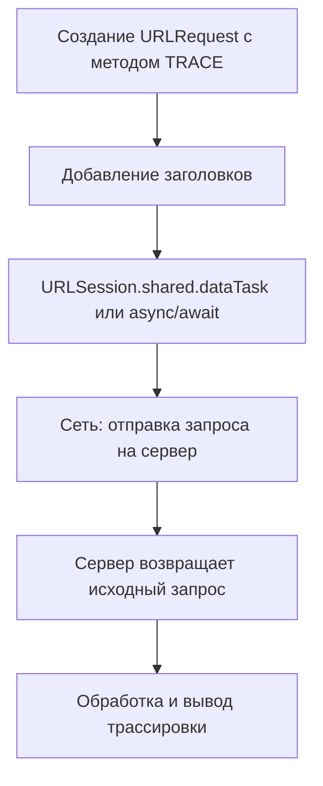

**HTTP TRACE** — это метод протокола [[HTTP]], который используется для **диагностики маршрута запроса до сервера**.

Особенности:

- TRACE **возвращает запрос, как он был получен сервером**, включая заголовки.
    
- Применяется для **отладки, тестирования и диагностики**.
    
- TRACE редко используется в современных приложениях, так как может представлять **опасность для безопасности** (иногда отключается на серверах).
    
- В [[iOS]] TRACE-запросы можно выполнить через [[URLSession]], но важно понимать, что **не все серверы поддерживают этот метод**.
    

---

## 🔹 Примеры кода

### 1. Простейший TRACE-запрос

```swift
import Foundation

let url = URL(string: "https://example.com/trace-endpoint")!
var request = URLRequest(url: url)
request.httpMethod = "TRACE"

let task = URLSession.shared.dataTask(with: request) { data, response, error in
    if let httpResponse = response as? HTTPURLResponse {
        print("Status code: \(httpResponse.statusCode)")
    }
    if let data = data,
       let body = String(data: data, encoding: .utf8) {
        print("Response body:\n\(body)")
    }
}
task.resume()
```

---

### 2. TRACE-запрос с кастомными заголовками

```swift
request.addValue("Bearer TOKEN_HERE", forHTTPHeaderField: "Authorization")
request.addValue("application/http", forHTTPHeaderField: "Content-Type")
```

---

### 3. Асинхронный TRACE-запрос с [[async]]/[[await]] ([[Swift]] 5.5+)

```swift
import Foundation

var request = URLRequest(url: URL(string: "https://example.com/trace-endpoint")!)
request.httpMethod = "TRACE"

Task {
    do {
        let (data, response) = try await URLSession.shared.data(for: request)
        if let httpResponse = response as? HTTPURLResponse {
            print("Status code: \(httpResponse.statusCode)")
        }
        if let body = String(data: data, encoding: .utf8) {
            print("Response body:\n\(body)")
        }
    } catch {
        print(error)
    }
}
```

---

### 4. Проверка маршрута запроса

```swift
URLSession.shared.dataTask(with: request) { data, response, _ in
    if let body = data.flatMap({ String(data: $0, encoding: .utf8) }) {
        print("TRACE output:\n\(body)")
    }
}.resume()
```

---

### 5. TRACE для диагностики CORS или промежуточных прокси

```swift
request.addValue("Origin", forHTTPHeaderField: "https://example-client.com")

URLSession.shared.dataTask(with: request) { data, response, _ in
    if let body = data.flatMap({ String(data: $0, encoding: .utf8) }) {
        print("TRACE with CORS headers:\n\(body)")
    }
}.resume()
```

---

## 🖼 Схема работы TRACE-запроса



---

## 💡 Замечания

- TRACE используется **для отладки и диагностики**, но редко в реальных приложениях.
    
- Многие серверы **отключают TRACE** по соображениям безопасности.
    
- Асинхронное выполнение через [[async]]/[[await]] упрощает обработку ответа.
    

---

## 📖 Дополнительно

- [RFC 7231 — HTTP TRACE Method](https://datatracker.ietf.org/doc/html/rfc7231#section-4.3.8)
    
- [Apple Docs — URLSession](https://developer.apple.com/documentation/foundation/urlsession)
    

---
