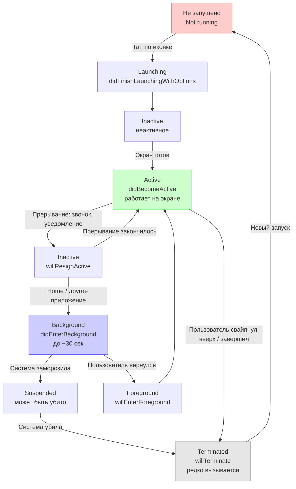

**UIApplication** — это **центральный singleton-объект** всего приложения в [[UIKit]].  
Он существует в **единственном экземпляре** на всё приложение и координирует взаимодействие между вашим кодом и операционной системой [[iOS]] (или iPadOS, tvOS, visionOS).

Доступ к нему всегда через:

```swift
UIApplication.shared
```

`UIApplication` наследуется от `UIResponder`, поэтому может участвовать в цепочке респондентов (responder chain) и обрабатывать события, которые никто ниже не обработал (shake для undo, клавиатурные команды, глобальные действия).

### 1. Основные роли UIApplication (2026 актуально)

| Роль / Задача                                 | Что делает UIApplication                            | Современный подход (iOS 13+)                       | Пример кода (коротко)                                       |
| --------------------------------------------- | --------------------------------------------------- | -------------------------------------------------- | ----------------------------------------------------------- |
| Управление жизненным циклом приложения        | Запуск, переход в фон, возврат на экран, завершение | Частично в [[SceneDelegate]]                       | `didFinishLaunchingWithOptions`                             |
| Доступ к глобальному состоянию                | `applicationState`, `isProtectedDataAvailable`      | —                                                  | `UIApplication.shared.applicationState`                     |
| Открытие [[URL]] (Safari, Настройки, Телефон) | `open(_:options:completionHandler:)`                | —                                                  | `open(URL(string: "https://apple.com")!)`                   |
| Управление иконкой badge (кол-во уведомлений) | `applicationIconBadgeNumber`                        | —                                                  | `applicationIconBadgeNumber = 3`                            |
| Регистрация на push-уведомления               | `registerForRemoteNotifications()`                  | —                                                  | `registerForRemoteNotifications()`                          |
| Запуск фоновых задач (legacy)                 | `beginBackgroundTask`, `endBackgroundTask`          | Лучше BGTaskScheduler                              | `beginBackgroundTask { ... }`                               |
| Отправка действий по Responder Chain          | `sendAction(_:to:from:for:)`                        | —                                                  | `sendAction(#selector(save), to: nil, from: nil, for: nil)` |
| Получение списка окон / сцен                  | `windows`, `connectedScenes`                        | Предпочтительно через `UIScene`                    | `UIApplication.shared.connectedScenes`                      |
| Управление статус-баром (в старых версиях)    | `setStatusBarHidden`, `statusBarStyle`              | Устарело → `preferredStatusBarStyle` в контроллере | —                                                           |
| Проверка multitasking / multiple scenes       | `supportsMultipleScenes`                            | —                                                  | `supportsMultipleScenes`                                    |

### 2. Жизненный цикл приложения через UIApplication (схема)



### 3. Самый важный метод: `application(_:didFinishLaunchingWithOptions:)`

Это **первое место**, где ваш код получает контроль после запуска приложения.

```swift
class AppDelegate: UIResponder, UIApplicationDelegate {
    
    func application(_ application: UIApplication,
                     didFinishLaunchingWithOptions launchOptions: [UIApplication.LaunchOptionsKey: Any]?) -> Bool {
        
        // 1. Инициализация глобальных сервисов
        FirebaseApp.configure()
        Amplitude.instance().initialize(apiKey: "...")
        Crashlytics.crashlytics().setCrashlyticsCollectionEnabled(true)
        
        // 2. Регистрация на push-уведомления
        UNUserNotificationCenter.current().delegate = self
        application.registerForRemoteNotifications()
        
        // 3. Обработка launch options (push, URL, shortcut и т.д.)
        if let shortcut = launchOptions?[.shortcutItem] as? UIApplicationShortcutItem {
            handleShortcut(shortcut)
        }
        
        if let url = launchOptions?[.url] as? URL {
            handleURL(url)
        }
        
        print("🚀 Приложение запущено")
        return true
    }
}
```

### 4. Полный список ключевых методов UIApplicationDelegate (2026)

| Метод                                              | Когда вызывается                           | Что обычно делают здесь     |
| -------------------------------------------------- | ------------------------------------------ | --------------------------- |
| `didFinishLaunchingWithOptions`                    | Первый запуск приложения                   | Инициализация всего         |
| `didBecomeActive`                                  | Приложение стало видимым и активным        | Запуск анимаций, обновление |
| `willResignActive`                                 | Скоро потеряет фокус (уведомление, звонок) | Пауза игр, видео            |
| `didEnterBackground`                               | Ушло в фон                                 | Сохранение состояния        |
| `willEnterForeground`                              | Возвращается на экран                      | Обновление данных           |
| `willTerminate`                                    | Приложение завершается (редко вызывается)  | Финальное сохранение        |
| `didRegisterForRemoteNotificationsWithDeviceToken` | Успешная регистрация на push               | Отправить токен на сервер   |
| `open(_:options:completionHandler:)`               | Открытие URL (Safari, Настройки, Телефон)  | Обработка [[deep link]]     |

### 5. Лучшие практики UIApplication в Swift 2026

- **Не подклассите UIApplication** — почти никогда не нужно  
- **Используйте Scene-based lifecycle** (iOS 13+) — большинство методов жизненного цикла теперь в SceneDelegate  
- **Для push** — регистрируйтесь в `didFinishLaunching`, получайте токен в `didRegisterForRemoteNotificationsWithDeviceToken`  
- **Для background tasks** — предпочтительнее **BGTaskScheduler**, а не старые `beginBackgroundTask`  
- **Для открытия URL** — всегда проверяйте `canOpenURL` перед `open`  
- **[[@MainActor]]** — все вызовы UIApplication — на главном потоке  
- **[[Swift]] 6 strict concurrency** — UIApplication.shared полностью безопасен  
- **Документируйте** — пиши комментарий «UIApplication.shared — открытие настроек приложения»

**Короткий девиз 2026**:
> UIApplication.shared — это **мозг всего приложения**: оно знает, активно ли приложение, может открыть URL, управлять badge, регистрировать push и быть последним в responder chain.  
> В 2026 году его роль уменьшилась (многое ушло в SceneDelegate и SwiftUI), но оно всё ещё **обязательно** для глобальной инициализации, push и некоторых legacy-действий.
