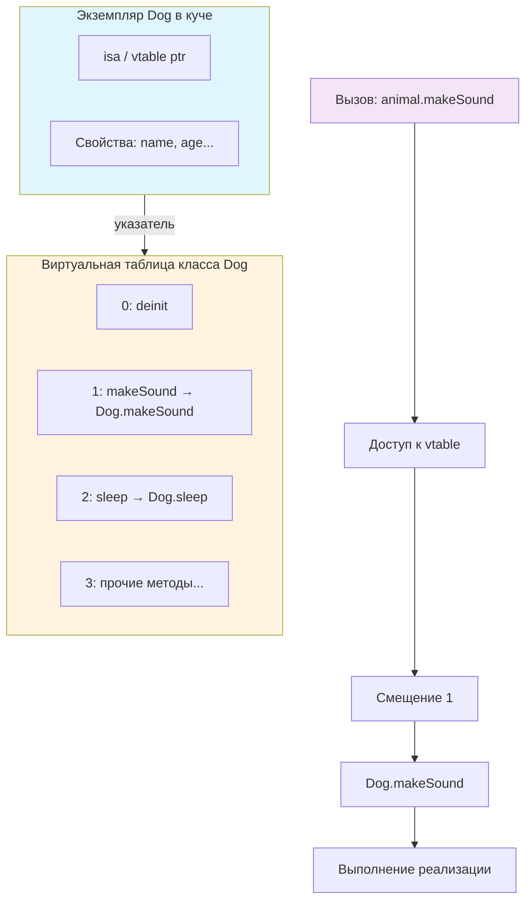

**Virtual Dispatch** (также называется **Table Dispatch** или **vtable dispatch**) — это механизм **динамической диспетчеризации**, при котором конкретная реализация метода определяется **во время выполнения программы** ([[Runtime]]) на основе **реального типа объекта**, а не статического типа переменной.

Это основной способ реализации **полиморфизма** в объектно-ориентированных языках, включая [[Swift]] (для классов).

**Ключевой момент**:
> У нас есть ссылка/переменная типа `Animal`, но объект — `Dog`.  
> При вызове `makeSound()` должен быть вызван метод именно `Dog`, а не `Animal`.

### 2. Как это работает под капотом (vtable)

1. При компиляции для каждого класса, имеющего **виртуальные методы** (не `final`), создаётся **таблица виртуальных методов** (vtable) — массив указателей на функции.
2. Каждый объект класса содержит **скрытый указатель** на свою vtable (обычно первый байт в памяти объекта).
3. При вызове виртуального метода компилятор знает **смещение** (offset) этого метода в таблице.
4. Во время выполнения:
   - берётся указатель на объект  
   - из него достаётся указатель на vtable  
   - по смещению метода берётся адрес функции  
   - функция вызывается

Схема (Mermaid):



### 3. Примеры кода

#### Базовый пример (классический полиморфизм)

```swift
class Animal {
    func makeSound() {                  // виртуальный метод → попадёт в vtable
        print("Some generic sound")
    }
}

class Dog: Animal {
    override func makeSound() {
        print("Woof!")
    }
}

class Cat: Animal {
    override func makeSound() {
        print("Meow!")
    }
}

let pets: [Animal] = [Dog(), Cat(), Animal()]
pets.forEach { $0.makeSound() }
// Woof!
// Meow!
// Some generic sound
```

#### Пример с final (отключает Virtual Dispatch)

```swift
class FastAnimal {
    final func makeSound() {            // final → прямой вызов (Direct Dispatch)
        print("Fast generic sound")
    }
}

class FastDog: FastAnimal {
    // override func makeSound() {}     // Ошибка компиляции
}

let fast: FastAnimal = FastDog()
fast.makeSound()  // прямой вызов, компилятор знает адрес
```

#### Пример с протоколами ([[Witness Table Dispatch]])

```swift
protocol SoundMaker {
    func makeSound()
}

class DogClass: SoundMaker {
    func makeSound() { print("Woof!") }
}

struct CatStruct: SoundMaker {
    func makeSound() { print("Meow!") }
}

let makers: [any SoundMaker] = [DogClass(), CatStruct()]
makers.forEach { $0.makeSound() }
// Woof!
// Meow!
```

**Witness table** создаётся для каждой пары (конкретный тип + протокол).

### 4. Сравнение всех видов диспетчеризации в Swift 2026

| Механизм                    | Скорость | Размер кода | Полиморфизм | Переопределение | Примеры                                |
| --------------------------- | -------- | ----------- | ----------- | --------------- | -------------------------------------- |
| [[Direct Dispatch]]         | ★★★★★    | Минимальный | Нет         | Нет             | `final func`, `static func`, `private` |
| [[Table Dispatch]] (vtable) | ★★★★☆    | Средний     | Да          | Да              | Обычные методы классов                 |
| [[Witness Table Dispatch]]  | ★★★★☆    | Средний     | Да          | Да              | Протоколы без [[@objc]]                |
| [[Message Dispatch]]        | ★★☆☆☆    | Большой     | Да          | Да              | `@objc`, `dynamic`, NSObject           |

### 5. Производительность (примерные цифры 2026)

| Тип диспетчеризации       | Вызов метода (нс) | Разница с direct | Где критично |
|----------------------------|-------------------|-------------------|--------------|
| Direct                     | ~1–2 нс           | 1×                | Горячие циклы, рендеринг |
| Table (vtable/witness)     | ~3–5 нс           | 2–3× медленнее    | Большинство кода |
| Message (objc_msgSend)     | ~10–20 нс         | 5–10× медленнее   | Редко, только @objc |

### 6. Реальные сценарии в iOS-разработке 2026

#### Сценарий 1 — [[UIKit]] и vtable

```swift
class CustomViewController: UIViewController {
    override func viewDidLoad() {
        super.viewDidLoad()
        // вызов viewDidLoad идёт через vtable
    }
}
```

#### Сценарий 2 — SwiftUI (чаще some → static/witness)

```swift
protocol ViewModel {
    var title: String { get }
}

func makeViewModel() -> some ViewModel {
    UserViewModel()
}
```

#### Сценарий 3 — Массив разных реализаций

```swift
let renderers: [any Renderer] = [MetalRenderer(), OpenGLRenderer()]
renderers.forEach { $0.renderFrame() }  // witness table
```

### 7. Лучшие практики и оптимизации 2026

- Используйте **final** везде, где полиморфизм не нужен  
- Для протоколов — **[[some]]** при возврате из функций  
- [[any Protocol]] — только для коллекций, свойств, делегатов  
- `@objc dynamic` — только для [[KVO]], [[Delegate]], старый [[UIKit]]  
- В [[SwiftUI]] — `some View`, `some ViewModel` — стандарт  
- В горячих путях (UI, рендеринг, циклы) — избегайте `any` и `@objc`  
- Для максимальной скорости — generics `<T: Protocol>` вместо any

**Короткий девиз**:
> «Table Dispatch — это баланс между полиморфизмом и скоростью.  
> final, static, some — для максимальной производительности.  
> any и @objc — только когда без них действительно нельзя.»
