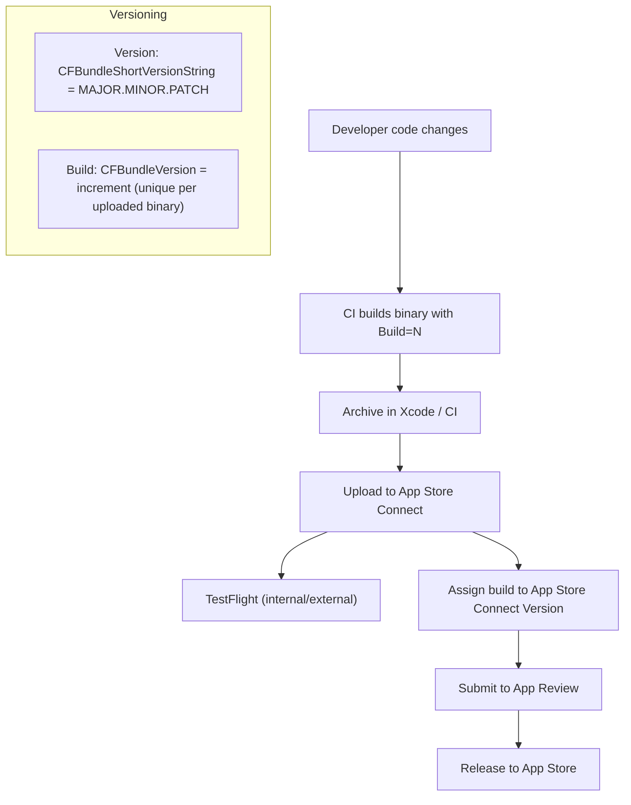

> Документ рассчитан на [[iOS]]-разработчика. Даю понятные определения, правила App Store, практические рекомендации и рабочие примеры — где и что менять в [[Xcode]]/[[CI]], а также визуальную схему.

---

## Краткие определения (руководство по терминам)

- **Версия (Version / Marketing Version)** — пользовательская, видимая версия приложения. В Xcode это `Version` (CFBundleShortVersionString). Обычно оформляют в формате `MAJOR.MINOR.PATCH` (например, `2.1.3`). Это то, что видят пользователи в App Store.
    
- **Билд (Build / CFBundleVersion)** — внутренняя, машинно-читаемая строка, которая идентифицирует конкретный бинарник. Применяется для различения отдельных сборок внутри одной версии. По практике — это целое число (например `190`) или набор цифр с точками (одна-до-трёх точек), но чаще делают простой инкрементный целочисленный номер.
    
- **Глобальная/публичная сборка** — релиз, который выкладывается в App Store и доступен всем пользователям (public release).
    
- **Тестовая сборка (TestFlight build)** — сборка, загруженная в App Store Connect и распространённая через TestFlight (внутренним или внешним тестерам). Может отличаться от публичного релиза по набору фич и багфиксов.
    
- **MAJOR / MINOR / PATCH (или мажорная/минорная/патч)** — семантическое версионирование (semver):
    
    - **MAJOR** — несовместимые изменения, крупные переработки (breaking changes). Пример: `1.x.x → 2.0.0`.
        
    - **MINOR** — новые возможности и фичи, совместимые с предыдущей версией. Пример: `1.2.0 → 1.3.0`.
        
    - **PATCH** — исправления багов, мелкие правки, не влияющие на API. Пример: `1.2.2 → 1.2.3`.
        

---

## Официальные ограничения и как Apple видит версии/билды (важно)

- `CFBundleShortVersionString` (Version) — это маркетинговая версия. Формат: **три числа, разделённые точками** (например `10.14.1`). Это поле показывается пользователю.
    
- `CFBundleVersion` (Build) — строка, машиначитабельная, **1–3 точки** разрешены (`10.14.1`), только цифры и точки; используется для внутренней идентификации билда.
    
- Пара `(Version, Build)` **уникально идентифицирует** сборку в системе — App Store Connect/Xcode ожидает, что при загрузке вы не отправляете ту же самую пару повторно.
    

> ИТОГ: для каждой новой выгрузки в App Store Connect вы должны обеспечить уникальность пары Version+Build.

---

## Практические правила и сценарии: когда что увеличивать

### Общие правила

1. **Если меняется только внутренняя сборка (фикс багов для тестеров),** — НЕ обязательно менять `Version` (CFBundleShortVersionString). Достаточно **увеличить `Build`** (CFBundleVersion) и загрузить новый билд в TestFlight.
    
2. **Если вы выпускаете пользовательский апдейт (хочется показать новую версию в App Store)** — увеличьте `Version` (семантически: MAJOR/MINOR/PATCH в зависимости от масштаба изменений). Также убедитесь, что `Build` уникален (как правило, тоже увеличьте).
    
3. **TestFlight (internal only)** — можно загружать сборки с той же `Version`, но с увеличенным `Build`. Для внутреннего тестирования (team) Xcode может пометить сборки как "internal only".
    
4. **TestFlight (external)** — первое добавление билда в группу внешних тестеров отправляет билд на лёгкую проверку App Review. После одобрения внешние тестеры смогут установить.
    
5. **App Store (публичный релиз)** — создаёте в App Store Connect новую запись версии (если нужно), выбираете билд (Version+Build) и отправляете на рецензию.
    
6. **macOS nuance:** у macOS — иногда требуют, чтобы `CFBundleVersion` был **всегда больше предыдущего**, даже если вы повышаете версию; поведение у iOS и macOS иногда отличается — проверяйте историю билдов в App Store Connect.
    

---

## Где и как менять Version/Build (практика)

### В Xcode (ручной способ)

- Target → **General** → Identity: `Version` (маркетинговая, CFBundleShortVersionString) и `Build` (CFBundleVersion).
    
- Или в Info.plist: прямо правим `CFBundleShortVersionString` и `CFBundleVersion`.
    

### Через командную строку / CI (автоматизация)

- `agvtool` — встроенный инструмент Apple для автоматического инкремента: `xcrun agvtool next-version -all` или `agvtool bump`.
    
- `fastlane` — `increment_build_number` / `increment_version_number` — удобно в CI.
    
- Паттерн: брать номер билда из CI (номер билда билд-сервера), из счётчика коммитов (`git rev-list --count HEAD`) или из номера сборки CI pipeline.
    

### Где ещё смотреть / изменять

- App Store Connect — когда создаёте новую версию приложения (App Store → My Apps → App → + Version) вы указываете маркетинговую версию; затем выбираете билд (он должен уже быть загружен и иметь соответствующую пару Version+Build).
    

---

## Чек-листы: что менять при разных сценариях

### Сценарий A — загружаете только в [[TestFlight]] (только тестеры)

1. Оставляете ту же `Version` (если изменения не видны пользователю).
    
2. Инкрементируете `Build` (обязательно — чтобы App Store Connect принял новый бинарник).
    
3. Архивируете → Upload to App Store Connect (выбирайте опцию TestFlight или TestFlight Internal Only, если хотите ограничить только своей командой).
    
4. Добавляете билд в группу тестеров (external → потребуется TestFlight review для первого билда в группе).
    

### Сценарий B — выкладываете в App Store (публичный релиз)

1. Устанавливаете новую `Version` (повышаете MAJOR/MINOR/PATCH согласно семантике).
    
2. Увеличиваете `Build` (инкремент; уникальность пары важна).
    
3. Archive → Upload to App Store Connect.
    
4. В App Store Connect создаёте/открываете нужную версию и выбираете загруженный билд.
    
5. Заполняете метаданные и отправляете на Review.
    

---

## Резюме рекомендаций (традиционный, надёжный подход)

1. **CFBundleShortVersionString = `MAJOR.MINOR.PATCH` (семантика).** Меняйте MAJOR/ MINOR/ PATCH в зависимости от характера изменений.
    
2. **CFBundleVersion = целое число (build counter),** инкрементируйте при каждой CI сборке, по одному для каждого загруженного бинарника. Это удобно и прозрачно.
    
3. **На тестирование (TestFlight)** — не нужно повышать маркетинговую версию, если изменения чисто внутренние; достаточно `Build`.
    
4. **На релиз в App Store** — увеличьте `Version` согласно семантике и убедитесь, что `Build` уникален.
    
5. Автоматизируйте — `agvtool` или `fastlane` + CI (git commit count / pipeline build number).
    

---

## Примеры последовательностей (пояснения)

- Допустим, текущая публичная версия `2.0.0 (билд 190)`
    
    _Тестовый цикл:_
    
    - Отправили фиксы в TestFlight: `2.0.0 (191)`, `2.0.0 (192)`, `2.0.0 (193)` — внутренние сборки.
        
    
    _Потом решаете выпустить патч в App Store:_
    
    - Создаёте App Store версию `2.0.1` и отправляете билд `2.0.1 (1)` или `2.0.1 (194)` — оба варианта рабочие, но удобнее поддерживать общий счётчик `Build`.
        
- _Важно:_ если вы используете паттерн `2.0.0.190` (четырёхкомпонентная строка в одном поле) — **Apple ожидает, что CFBundleShortVersionString будет в формате `X.Y.Z`**, а `CFBundleVersion` должен держать внутренний номер (например просто `190`). Разделяйте маркетинговую и билд-часть.
    

---

## Визуальная схема (упрощённая)



---

## Примеры команд (быстрая автоматизация)

- agvtool (локально / CI):
    

```bash
# увеличить билd на 1 для всех таргетов
xcrun agvtool next-version -all

# поставить конкретный build
xcrun agvtool new-version -all 194
```

- fastlane (пример):
    

```ruby
increment_build_number(
  build_number: ENV['CI_BUILD_NUMBER'] || Time.now.to_i
)
increment_version_number(
  version_number: '2.0.1'
)

build_app
upload_to_app_store
```

---

## Частые ошибки и как их избежать

- **Залили тот же (Version, Build)** — App Store Connect отклонит/не примет архив. Всегда проверяйте уникальность.
    
- **Храните маркетинговую версию в одном поле, а build-номер в другом.** Не лепите внутри `CFBundleShortVersionString` дополнительную "метку билда" в виде `2.0.0.190` — это неправильное использование поля.
    
- **Не забывайте об external test review** — первый билд для внешних тестеров проверяется.
    

---
