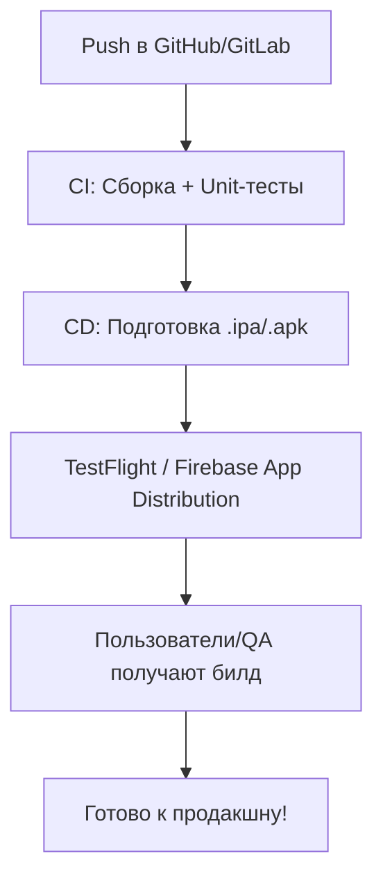

**Continuous Delivery (CD)** — это практика разработки ПО, при которой код автоматически проходит через этапы сборки, тестирования и подготовки к релизу.

Главная цель — **каждая новая версия приложения может быть в любой момент развернута в продакшн нажатием одной кнопки**.

CD является продолжением **Continuous Integration ([[CI]])** и часто используется вместе с **Continuous Deployment** (когда релиз происходит полностью автоматически).

---

## 🔹 Ключевые особенности CD

- Автоматизация сборки и тестирования.
    
- Возможность быстрой поставки изменений пользователям.
    
- Минимизация ручных ошибок при деплое.
    
- Поддержка разных окружений (dev, stage, prod).
    
- Интеграция с инструментами: **[[GitHub]] Actions, [[GitLab]] [[CI]]/CD, Jenkins, Bitrise, CircleCI, Xcode Cloud**.
    

---

## 🔹 Примеры (от простого к сложному)

### 1. Простейший pipeline CD (GitHub Actions для [[iOS]])

```yaml
name: iOS CD Pipeline

on:
  push:
    branches:
      - main

jobs:
  build:
    runs-on: macos-latest
    steps:
      - uses: actions/checkout@v3
      - name: Build App
        run: xcodebuild -scheme MyApp -sdk iphonesimulator
```

---

### 2. Добавление тестов в CD

```yaml
jobs:
  build-test:
    runs-on: macos-latest
    steps:
      - uses: actions/checkout@v3
      - name: Build and Test
        run: xcodebuild -scheme MyApp -sdk iphonesimulator -destination 'platform=iOS Simulator,name=iPhone 14' test
```

---

### 3. Автоматическая сборка `.ipa` для дистрибуции

```yaml
- name: Archive App
  run: xcodebuild -scheme MyApp -sdk iphoneos -configuration AppStoreDistribution archive -archivePath build/MyApp.xcarchive

- name: Export IPA
  run: xcodebuild -exportArchive -archivePath build/MyApp.xcarchive -exportPath build -exportOptionsPlist ExportOptions.plist
```

---

### 4. Загрузка билда в [[TestFlight]] (через [[Fastlane]])

```yaml
- name: Upload to TestFlight
  run: |
    bundle exec fastlane pilot upload \
      --username "apple_id@example.com" \
      --app_identifier "com.mycompany.myapp" \
      --ipa "build/MyApp.ipa"
```

---

### 5. Полный CD Pipeline (сборка + тесты + загрузка в TestFlight)

```yaml
name: iOS Continuous Delivery

on:
  push:
    branches: [ "main" ]

jobs:
  cd-pipeline:
    runs-on: macos-latest
    steps:
      - uses: actions/checkout@v3

      - name: Install Dependencies
        run: bundle install

      - name: Run Tests
        run: xcodebuild -scheme MyApp -destination 'platform=iOS Simulator,name=iPhone 14' test

      - name: Build IPA
        run: fastlane gym --scheme "MyApp"

      - name: Upload to TestFlight
        run: fastlane pilot upload
```

---

## 🖼 Визуальная схема



---

## 💡 Замечания

- В iOS чаще всего используют **Fastlane** для автоматизации доставки в TestFlight/App Store.
    
- Для сложных проектов CD может включать разные окружения: **Dev → Staging → Prod**.
    
- Хорошая практика — всегда запускать тесты перед деплоем.
    
- CD экономит время и снижает риск человеческих ошибок при публикации приложения.
    

---

## 📖 Дополнительно

- [Apple — Xcode Cloud (CD)](https://developer.apple.com/xcode-cloud/)
    
- [Fastlane Docs](https://docs.fastlane.tools/)
    
- [GitHub Actions for iOS](https://docs.github.com/en/actions)
    

---
