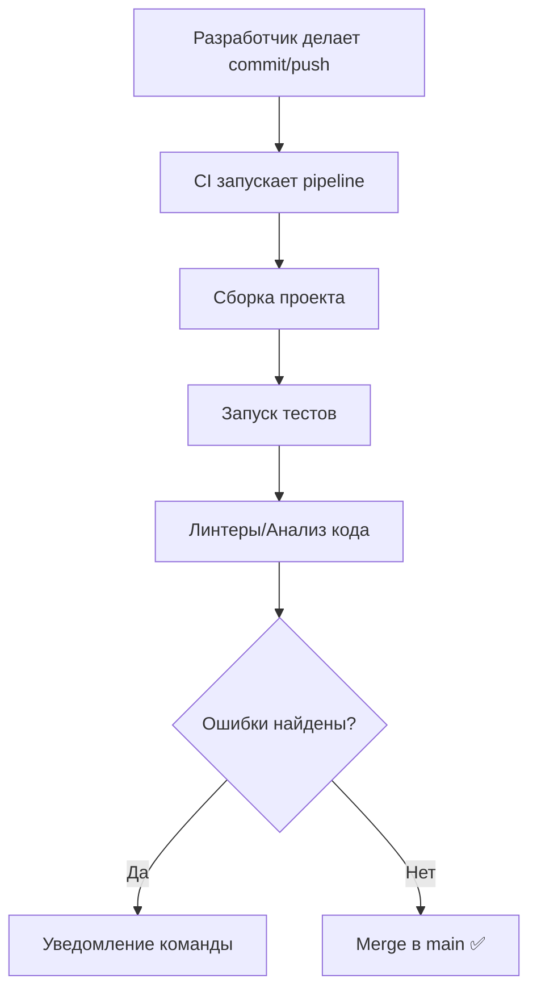

#automation 
## 📘 Определение

**Continuous Integration (CI)** — это практика разработки ПО, при которой изменения в коде **часто интегрируются в общую ветку** (например, `main`), а затем автоматически проходят:

- **сборку проекта**
    
- **запуск тестов**
    
- **проверку качества кода (линтеры, статический анализ)**
    

Главная цель CI — **раннее выявление ошибок** и **быстрая обратная связь** команде о состоянии проекта.

---

## 🔹 Ключевые особенности CI

- Каждый push/merge в репозиторий запускает сборку и тесты.
    
- Поддержка «зелёной» ветки `main` (всегда готова к интеграции).
    
- Автоматическое уведомление разработчиков при ошибках.
    
- Экономия времени за счёт раннего обнаружения багов.
    
- Инструменты: **[[GitHub]] Actions, [[GitLab]] CI/CD, Jenkins, Bitrise, CircleCI, [[Xcode]] Cloud**.
    

---

## 🔹 Примеры (от простого к сложному)

### 1. Простейший CI pipeline (GitHub Actions для [[iOS]])

```yaml
name: iOS CI Pipeline

on:
  push:
    branches:
      - main

jobs:
  build:
    runs-on: macos-latest
    steps:
      - uses: actions/checkout@v3
      - name: Build App
        run: xcodebuild -scheme MyApp -sdk iphonesimulator
```

---

### 2. Добавление unit-тестов

```yaml
jobs:
  build-test:
    runs-on: macos-latest
    steps:
      - uses: actions/checkout@v3
      - name: Run Tests
        run: xcodebuild -scheme MyApp \
             -destination 'platform=iOS Simulator,name=iPhone 14' test
```

---

### 3. Линтер + тесты (например, [[SwiftLint]] + [[XCTest]])

```yaml
steps:
  - uses: actions/checkout@v3
  - name: SwiftLint
    run: brew install swiftlint && swiftlint
  - name: Run Unit Tests
    run: xcodebuild -scheme MyApp test
```

---

### 4. Артефакты CI (сохранение отчётов о тестах)

```yaml
- name: Run Tests
  run: xcodebuild test -scheme MyApp \
       -destination 'platform=iOS Simulator,name=iPhone 14' \
       | xcpretty --report junit --output result.xml

- name: Upload Test Report
  uses: actions/upload-artifact@v3
  with:
    name: test-report
    path: result.xml
```

---

### 5. Полный CI Pipeline (линтер + тесты + анализ кода)

```yaml
name: iOS Continuous Integration

on:
  pull_request:
    branches: [ "main" ]

jobs:
  ci-pipeline:
    runs-on: macos-latest
    steps:
      - uses: actions/checkout@v3

      - name: SwiftLint
        run: swiftlint

      - name: Run Unit Tests
        run: xcodebuild -scheme MyApp -destination 'platform=iOS Simulator,name=iPhone 14' test

      - name: Static Analyzer
        run: xcodebuild analyze -scheme MyApp
```

---

## 🖼 Визуальная схема



---

## 💡 Замечания

- CI запускается **чаще всего на каждый PR или push**.
    
- Цель — **убедиться, что проект рабочий и протестированный**.
    
- В отличие от [[CD]], CI не отвечает за деплой, а только за стабильность кода.
    
- Хорошая практика — делать CI быстрым (10–15 мин максимум).
    

---

## 📖 Дополнительно

- [GitHub Actions for iOS](https://docs.github.com/en/actions)
    
- [GitLab CI/CD](https://docs.gitlab.com/ee/ci/)
    
- [Bitrise (CI для мобильных приложений)](https://www.bitrise.io/)
    
- [Xcode Cloud](https://developer.apple.com/xcode-cloud/)
    

---
