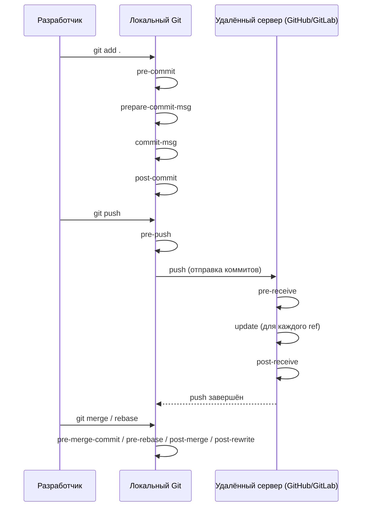

### 1. Что такое Git hooks и как они работают

**Git hooks** — это скрипты, которые [[Git]] автоматически запускает в определённые моменты жизненного цикла репозитория (commit, push, [[merge and rebase#Вариант 2 — git rebase (рекомендуется только для личных веток)|rebase]], receive и т.д.).

Они делятся на две большие группы:

| Группа               | Где хранятся                     | Кто запускает              | Примеры хуков                     | Можно ли отключить |
|----------------------|----------------------------------|----------------------------|------------------------------------|--------------------|
| **Client-side**      | `.git/hooks/` (локально)         | Каждый разработчик         | pre-commit, prepare-commit-msg, pre-push, post-merge | Да (удалить/переименовать) |
| **Server-side**      | На сервере (GitHub/GitLab/Bitbucket) | Только на сервере          | pre-receive, update, post-receive  | Нет (админ-сервер) |

**Важно в 2026 году**:  
Client-side хуки **не передаются** в репозиторий (они в `.git/`, а не в `.gitignore`).  
Чтобы все разработчики использовали одинаковые хуки → применяются менеджеры: **husky**, **lefthook**, **pre-commit**, **githooks**, **swift-hooks**.

### 2. Полная схема всех основных хуков (Mermaid)



### 3. Самые полезные хуки в 2026 году (iOS/Swift разработка)

| Хук                    | Когда запускается                       | Типичный сценарий в [[iOS]]/[[Swift]]                      | Какой менеджер рекомендуем  |
| ---------------------- | --------------------------------------- | ---------------------------------------------------------- | --------------------------- |
| **pre-commit**         | Перед `git commit`                      | swift-format, [[swiftlint]], запуск unit-тестов, danger    | lefthook / pre-commit       |
| **prepare-commit-msg** | Перед редактированием сообщения коммита | Автодополнение Conventional Commits                        | husky / lefthook            |
| **commit-msg**         | После ввода сообщения коммита           | Проверка Conventional Commits, длина сообщения             | lefthook / husky            |
| **pre-push**           | Перед `git push`                        | Запуск полного тестового сьюта, swift-format --strict      | lefthook / pre-commit       |
| **post-merge**         | После `git merge` / `git pull --rebase` | Подтянуть Podfile.lock, обновить [[SPM]] зависимости       | lefthook                    |
| **pre-receive**        | На сервере, перед принятием push        | Защита main/develop, запуск [[CI]]/[[CD]] (GitHub Actions) | GitLab CI / GitHub Rulesets |

### 4. Полные примеры конфигураций и скриптов

#### 4.1 lefthook — самый популярный в [[Swift]]-сообществе 2026

**Установка**:

```bash
brew install lefthook
# или через mint / mint install lefthook
```

**lefthook.yml** (в корне проекта)

```yaml
pre-commit:
  commands:
    swiftformat:
      glob: "*.swift"
      run: swiftformat --config .swiftformat {staged_files}
      stage_fixed: true

    swiftlint:
      glob: "*.swift"
      run: swiftlint --fix --config .swiftlint.yml {staged_files}
      stage_fixed: true

    tests:
      tags: ci
      run: xcodebuild test -scheme MyApp -destination 'platform=iOS Simulator,name=iPhone 16' | xcpretty
      interactive: true

pre-push:
  commands:
    full-tests:
      tags: ci
      run: xcodebuild test -scheme MyApp -destination 'platform=iOS Simulator,name=iPhone 16' | xcpretty
```

Запуск:

```bash
lefthook install
```

#### 4.2 pre-commit (альтернатива, популярна в Python-сообществе, но используется и в Swift)

**Установка**:

```bash
brew install pre-commit
pre-commit install
```

**.pre-commit-config.yaml**

```yaml
repos:
- repo: https://github.com/nicklockwood/SwiftFormat
  rev: 0.54.5
  hooks:
  - id: swiftformat
    args: [--config, .swiftformat]

- repo: https://github.com/realm/SwiftLint
  rev: 0.58.0
  hooks:
  - id: swiftlint
    args: [--fix, --config, .swiftlint.yml]
```

#### 4.3 Husky + lint-staged (альтернатива от JavaScript-разработчиков)

**package.json** (если проект смешанный или используется Node.js)

```json
{
  "husky": {
    "hooks": {
      "pre-commit": "lint-staged"
    }
  },
  "lint-staged": {
    "*.swift": [
      "swiftformat",
      "swiftlint --fix",
      "git add"
    ]
  }
}
```

### 5. Реальные сценарии в [[iOS]]-разработке 2026

#### Сценарий 1 — Автоматический форматирование + линтинг перед коммитом

```yaml
# lefthook.yml
pre-commit:
  parallel: true
  commands:
    format:
      glob: "*.swift"
      run: swiftformat --config .swiftformat {staged_files}
      stage_fixed: true
    lint:
      glob: "*.swift"
      run: swiftlint --fix --config .swiftlint.yml {staged_files}
      stage_fixed: true
```

#### Сценарий 2 — Запуск unit-тестов только на изменённых файлах

```yaml
pre-commit:
  commands:
    unit-tests:
      tags: ci
      run: |
        CHANGED_SWIFT_FILES=$(git diff --name-only --diff-filter=ACM -- '*.swift' | tr '\n' ' ')
        if [ -n "$CHANGED_SWIFT_FILES" ]; then
          xcodebuild test -scheme MyApp -destination 'platform=iOS Simulator,name=iPhone 16' -only-testing:"MyAppTests/$CHANGED_SWIFT_FILES"
        fi
```

#### Сценарий 3 — Проверка Conventional Commits в commit-msg

```yaml
commit-msg:
  commands:
    conventional-commit:
      run: |
        echo "$1" | grep -E '^(feat|fix|docs|style|refactor|perf|test|chore)(\([a-z0-9-]+\))?: .+' || {
          echo "Commit message must follow Conventional Commits format"
          exit 1
        }
```

### 6. Лучшие практики Git hooks в 2026

- Используйте **lefthook** (самый быстрый и простой для Swift)
- Всегда добавляйте `stage_fixed: true` — чтобы исправленные файлы автоматически попадали в staging
- Запускайте **только на изменённых файлах** — ускоряет pre-commit в 5–10 раз
- Для тестов — используйте **--only-testing** с путями к изменённым файлам
- В CI/CD — дублируйте проверки (pre-commit + GitHub Actions)
- Для больших проектов — добавьте **--parallel** в lefthook
- Не перегружайте pre-commit — тяжёлые проверки (full test suite) → pre-push
- Документируйте хуки в README и добавляйте `make install-hooks`

**Короткий девиз 2026**:
> «Git hooks — это автоматический страж качества кода.  
> С lefthook + swiftformat + swiftlint + быстрые тесты на изменённых файлах — твой проект всегда будет чистым и зелёным.»
