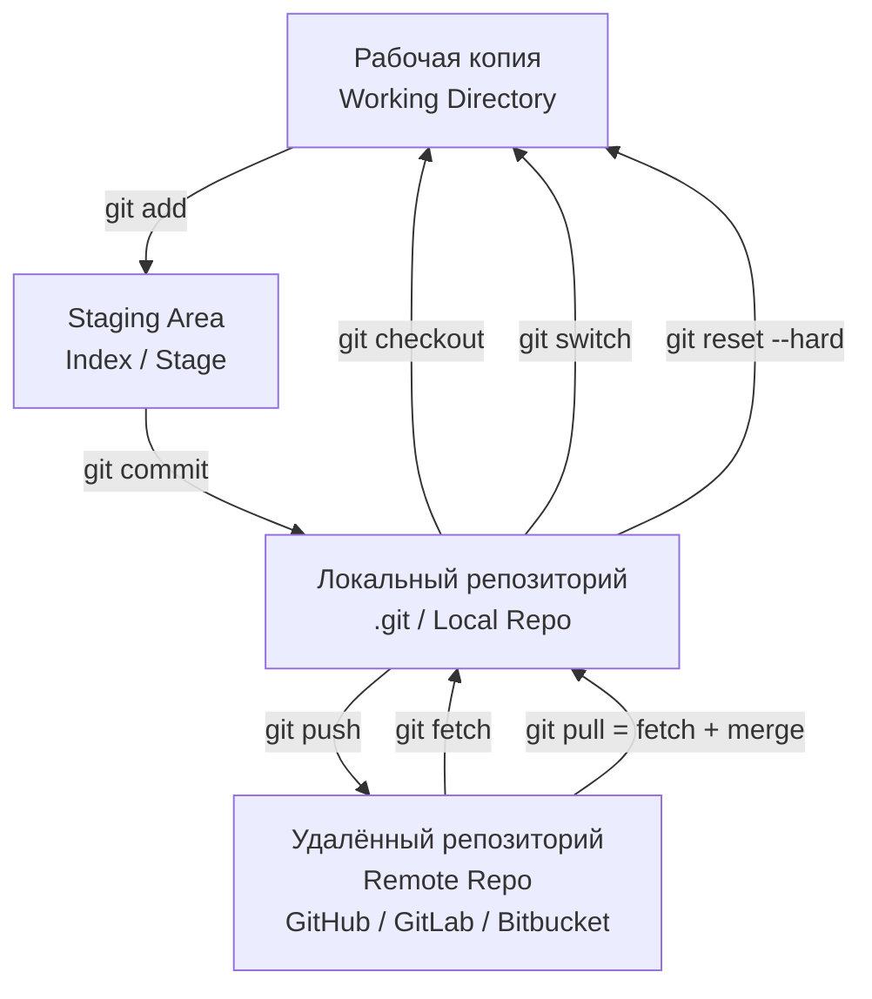
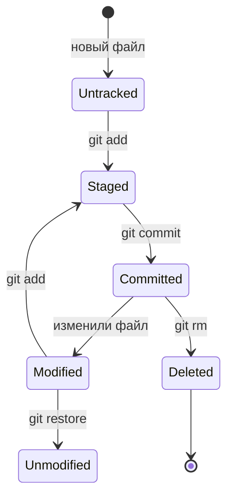
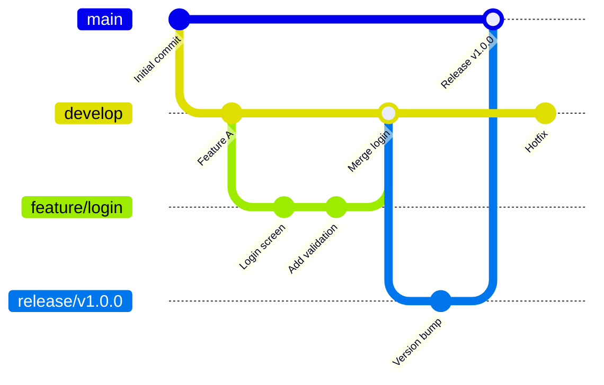
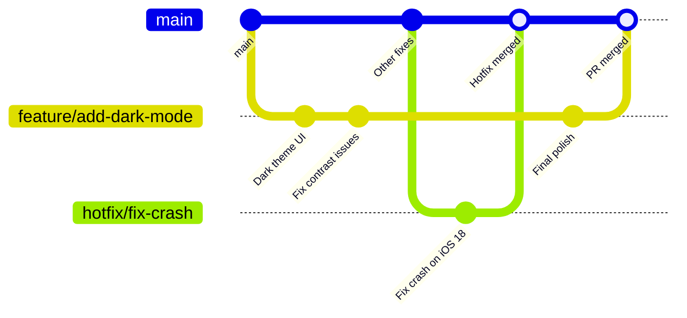
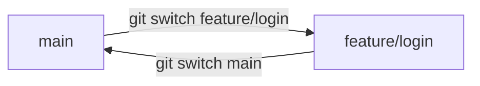
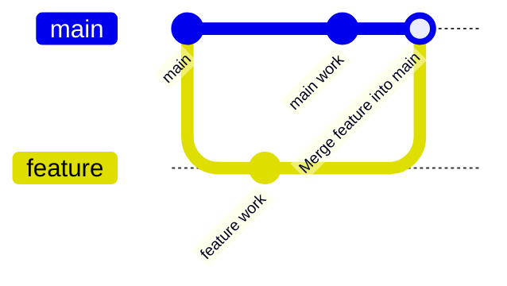

### 1. Что такое Git (коротко и по делу)

Git — это **распределённая** система контроля версий (Distributed Version Control System, DVCS).

Ключевые отличия от централизованных систем (SVN, Perforce):

| Характеристика          | Git (распределённый)                     | SVN (централизованный)                  |
|-------------------------|------------------------------------------|------------------------------------------|
| Где хранится история    | У каждого разработчика полностью         | Только на сервере                        |
| Работа без интернета    | Полноценная (commit, branch, merge)      | Ограниченная (только локальные изменения)|
| Скорость                | Очень высокая (локальные операции)       | Зависит от сервера                       |
| Ветвление               | Дешёвое и быстрое                        | Дорогое и медленное                      |
| Резервная копия         | Каждый клон — полноценный бэкап          | Только сервер — точка отказа             |

### 2. Основная схема работы Git (локальный и удалённый репозиторий)



### 3. Основные области Git и команды

| Область               | Что хранит                              | Основные команды                              | Схема перехода |
|-----------------------|-----------------------------------------|-----------------------------------------------|----------------|
| **Working Directory** | Текущие файлы на диске                  | `git status`, `git add`, `git rm`, `git mv`   | → Staging      |
| **Staging Area**      | Файлы, подготовленные к коммиту         | `git add`, `git rm --cached`, `git restore --staged` | → Commit       |
| **Local Repository**  | История коммитов, ветки, теги           | `git commit`, `git branch`, `git tag`, `git log` | → Remote       |
| **Remote Repository** | Общая история (GitHub/GitLab/etc.)      | `git push`, `git pull`, `git fetch`, `git clone` | ← Local        |

### 4. Жизненный цикл файла в Git (схема состояний)



### 5. Ветвление в Git — самая мощная фича

#### Классическая модель веток (Git Flow / GitHub Flow)



#### Современный GitHub Flow (2026 — самый популярный)



### 6. Основные команды Git с примерами и схемами

#### Работа с ветками

```bash
git branch feature/login          # создать ветку
git checkout feature/login        # переключиться
# или одной командой:
git switch -c feature/login

git branch -d feature/login       # удалить ветку (локально)
git push origin --delete feature/login  # удалить на удалённом
```

Схема переключения веток:



#### Слияние (merge)

```bash
git checkout main
git merge feature/login           # fast-forward или 3-way merge
```



#### Rebase вместо merge (линейная история)

```bash
git checkout feature/login
git rebase main                   # перенести коммиты feature поверх main
git checkout main
git merge feature/login           # fast-forward
```


### 7. Работа с удалёнными репозиториями

```bash
git clone https://github.com/user/repo.git
git remote add origin https://github.com/user/repo.git
git push -u origin main
git fetch origin
git pull origin main
```

### 8. Полезные команды для повседневной работы (2026)

| Задача                                  | Команда                                      | Альтернатива (современная) |
|-----------------------------------------|----------------------------------------------|-----------------------------|
| Статус репозитория                      | `git status`                                 | —                           |
| История коммитов (красиво)              | `git log --oneline --graph --decorate`       | `git log --pretty=graph`    |
| Последние изменения                     | `git diff` / `git diff --staged`             | —                           |
| Отменить git add                        | `git restore --staged file.txt`              | `git reset HEAD file.txt`   |
| Отменить изменения в файле              | `git restore file.txt`                       | `git checkout -- file.txt`  |
| Создать и сразу переключиться на ветку  | `git switch -c feature/login`                | `git checkout -b ...`       |
| Удалить ветку локально и удалённо       | `git branch -d branch` + `git push --delete` | —                           |
| Переименовать ветку                     | `git branch -m old-name new-name`            | —                           |
| Отменить последний коммит (оставить изменения) | `git reset --soft HEAD~1`             | —                           |
| Отменить последний коммит полностью     | `git reset --hard HEAD~1`                    | Опасно!                     |

### 9. Лучшие практики Git 2026

- Одна ветка = одна задача (feature/..., bugfix/..., hotfix/...)
- Именование коммитов: Conventional Commits  
  `feat: добавить тёмную тему`  
  `fix: исправить краш при пустом списке`  
  `chore: обновить зависимости`
- Rebase для feature-веток перед merge (линейная история)
- Squash & [[merge and rebase#Вариант 1 — git merge (рекомендуется для общей ветки)|merge]] или [[merge and rebase#Вариант 2 — git rebase (рекомендуется только для личных веток)|rebase]] & Merge в [[GitHub]]/[[GitLab]]
- Protected branches (main, develop) — требовать PR и ревью
- Git hooks + Husky / lefthook — форматирование, линтинг
- .gitignore — обязательно для [[Xcode]], SwiftPM, Pods, DerivedData
- Git LFS — для больших бинарных файлов (изображения, модели ML)

**Короткий девиз 2026**:
> «Git — это не просто инструмент, это история твоего кода.  
> Делай маленькие коммиты, понятные ветки, линейную историю и пиши хорошие сообщения — и работать будет приятно даже через 5 лет.»
